# はじめに

## 本書の構成
本書では、GridDBの蓄積データに対するETLツールを用いた自動集計について説明します。
各章の内容は次のとおりです。

* はじめに  
  本書の構成及び用語について説明します。

* ETLツールを用いた自動集計について  
  ETLツールを用いた自動集計について説明します。

* Talend Open Studioについて  
  Talend Open Studioについて説明します。

* Talend Open Studioを用いたGridDBの集計手順  
  Talend Open StudioでGridDBのデータを集計して、集計結果をGridDBに出力する例を紹介します。

* GridDBとTalend Open Studioのデータ型のマッピング  
  GridDBとTalend Open Studioのデータ型のマッピングを表に示します。

## 用語の説明
本書で用いられる用語の説明です。

| 用語 | 意味 |
|-----|-----|
| ETL | Extract(抽出)、Transform(変換)、Load(格納)の頭文字を取った用語で、一般的にデータ統合・加工を行うプロセスの総称です。 |
| Talend Open Studio | Talend株式会社が提供しているETLツールです。詳細は[Talend株式会社の公式ページ](https://www.talend.com/products/talend-open-studio/)を参照してください。|
| 自動集計 | データの最大や最小、平均などの集計処理を自動で行うことを表します。 |
| バッチ更新 | INSERTやUPDATE、DELETEなどデータ更新を行うSQL文を一度に複数、データベースに送って処理する機能です。 |

# ETLツールを用いた自動集計について

## 利用シーン  
IoTの活用が広がる中で、時間とともに時系列データは大量に発生し、データベースに蓄積されます。  
時系列データを参照、利用する際には、軽く扱いやすくするために、一定時間間隔での最大、最小、平均などの集計を行う場合が多くあります。
しかし、大量の時系列データに対する集計演算は重く、結果取得までの待ち時間が長くなる傾向になります。  
そこで、収集された大量の時系列データから、あらかじめバックグラウンドで自動的に集計演算を行い集計結果を蓄積する、自動集計が一般的に用いられます。
これにより、ユーザは計算済みの集計結果にアクセスできるため、処理時間を短くできます。  
本ガイドでは、この自動集計をGridDBとETLツールを用いて、実現する方法を説明します。

## 処理概要  

本ガイドでは、あらかじめ集計対象のコンテナと出力先のコンテナを作成し、作成した集計対象のコンテナに対して、
時系列データを登録します。登録した時系列データに対して集計を行い、出力先のコンテナに登録を行います。

* 事前準備  
事前準備としてGridDBのインストールとGridDBのJDBCドライバの入手を行います。  


処理の流れについて説明します。

<a href="./img/process_summary.png" data-lightbox="group">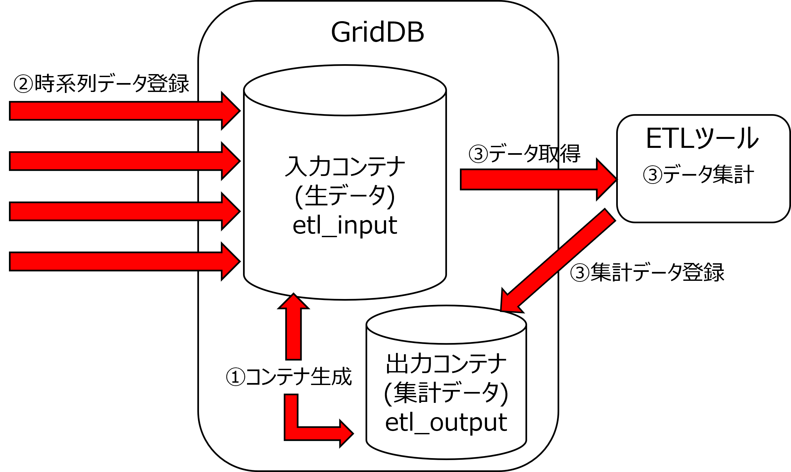</a>

生データの登録先である入力コンテナをetl_input、集計データの登録先である出力コンテナをetl_outputとします。

①コンテナ生成  
入力コンテナを作成します。

``` example
CREATE TABLE etl_input (
  ts TIMESTAMP PRIMARY KEY,
  value DOUBLE
) PARTITION BY RANGE (ts) EVERY (30, DAY);
```

一定期間でデータを自動削除する場合はGridDBの期限解放を設定します。
入力コンテナに期限解放を設定します。

``` example
CREATE TABLE etl_input (
  ts TIMESTAMP PRIMARY KEY,
  value DOUBLE
) USING TIMESERIES WITH (
  expiration_type='PARTITION',
  expiration_time=90,
  expiration_time_unit='DAY'
) PARTITION BY RANGE (ts) EVERY (30, DAY);
```

出力コンテナを作成します。

``` example
CREATE TABLE etl_output (
  ts TIMESTAMP PRIMARY KEY,
  value DOUBLE
) PARTITION BY RANGE (ts) EVERY (30, DAY);
```

②時系列データ登録  
集計対象のコンテナに時系列データを登録します。

<a href="./img/process_summary1.png" data-lightbox="group">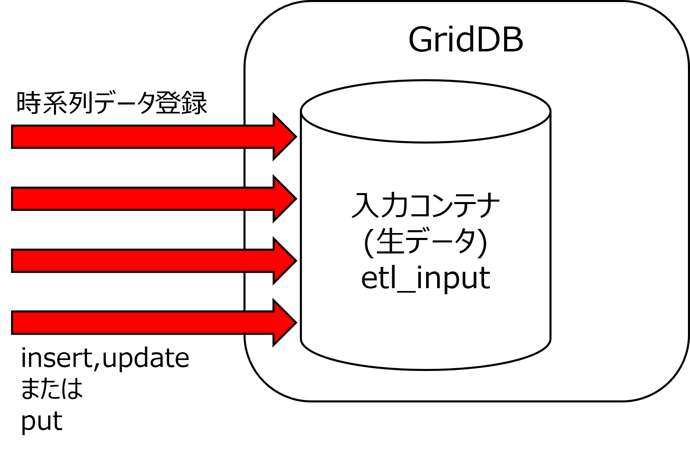</a>

③データ取得と集計、集計結果の登録  
登録した時系列データを取得して集計を行います。

<a href="./img/process_summary2.png" data-lightbox="group">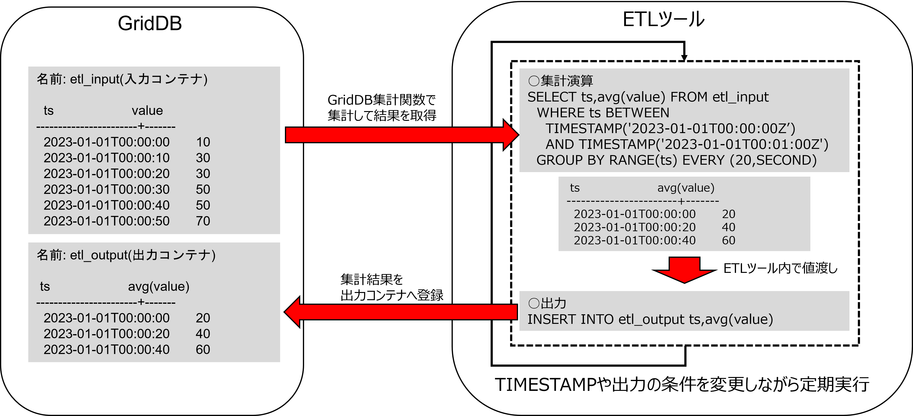</a>

一定期間に対する集計を行う際は、GROUP BY RANGEと集計演算を組み合わせて、集計を行います。

例を以下に示します。

(1) 一定時間間隔の最大値を取得する例

``` example
名前: etl_input

  ts                     value
-----------------------+-------
  2023-01-01T00:00:00       10
  2023-01-01T00:00:10       30
  2023-01-01T00:00:20       30
  2023-01-01T00:00:30       50
  2023-01-01T00:00:40       50
  2023-01-01T00:00:50       70


○集計演算
SELECT ts,max(value) FROM etl_input
  WHERE ts BETWEEN TIMESTAMP('2023-01-01T00:00:00Z') AND TIMESTAMP('2023-01-01T00:01:00Z')
  GROUP BY RANGE(ts) EVERY (20,SECOND)

  ts                     value
-----------------------+-------
  2023-01-01T00:00:00       30
  2023-01-01T00:00:20       50
  2023-01-01T00:00:40       70
```

(2) 一定時間間隔の最小値を取得する例

``` example
名前: etl_input

  ts                     value
-----------------------+-------
  2023-01-01T00:00:00       10
  2023-01-01T00:00:10       30
  2023-01-01T00:00:20       30
  2023-01-01T00:00:30       50
  2023-01-01T00:00:40       50
  2023-01-01T00:00:50       70


○集計演算
SELECT ts,min(value) FROM etl_input
  WHERE ts BETWEEN TIMESTAMP('2023-01-01T00:00:00Z') AND TIMESTAMP('2023-01-01T00:01:00Z')
  GROUP BY RANGE(ts) EVERY (20,SECOND)

  ts                     value
-----------------------+-------
  2023-01-01T00:00:00       10
  2023-01-01T00:00:20       30
  2023-01-01T00:00:40       50
```

(3) 一定時間間隔の平均値を取得する例

``` example
名前: etl_input

  ts                     value
-----------------------+-------
  2023-01-01T00:00:00       10
  2023-01-01T00:00:10       30
  2023-01-01T00:00:20       30
  2023-01-01T00:00:30       50
  2023-01-01T00:00:40       50
  2023-01-01T00:00:50       70


○集計演算
SELECT ts,avg(value) FROM etl_input
  WHERE ts BETWEEN TIMESTAMP('2023-01-01T00:00:00Z') AND TIMESTAMP('2023-01-01T00:01:00Z')
  GROUP BY RANGE(ts) EVERY (20,SECOND)

  ts                     value
-----------------------+-------
  2023-01-01T00:00:00       20
  2023-01-01T00:00:20       40
  2023-01-01T00:00:40       60
```

その他の集計関数は『[GridDB SQLリファレンス](../md_reference_sql/md_reference_sql.md)』を参照してください。

集計した結果を出力コンテナに登録します。

``` example
INSERT INTO myTable1 ts,value;
```

上記のデータ取得と集計、集計結果の登録を定期的に実行することで、自動集計を実現します。  
定期実行については、各ETLツール(Talend)で提供されている機能を利用します。

# Talend Open Studioについて

本項では、Talend Open StudioのTalend Open Studio for Data Integration 8.0.1(以降、Talend Open Studio)での集計方法について説明します。

Talend Open Studioとは、Talend株式会社が提供しているETLツールです。  
指定したデータソースからデータウェアハウスを構築して、データの分析を行うツールです。  
詳細は[Talend株式会社の公式ページ](https://www.talend.com/products/talend-open-studio/)を参照してください。

# Talend Open Studioを用いたGridDBの集計手順

Talend Open Studioを用いたGridDBの集計手順について説明します。

Talendはジョブと呼ばれる処理の流れを作成して、集計処理を実現します。

ジョブの中でコンポーネントと呼ばれる機能を配置します。

<a href="./img/talend_open_studio.png" data-lightbox="group">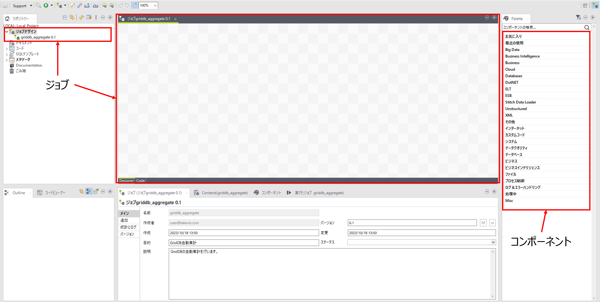</a>

Talend Open Studioを用いたGridDBの集計手順では、GridDBのコンテナ、JDBCドライバとTalend Open Studioの各コンポーネントを用います。

Talend Open StudioとGridDBをそれぞれ準備します。

以下の流れで自動集計を行います。

1. 環境構築
2. ジョブ作成
3. データベース作成
4. スキーマ取得
5. コンポーネント作成と配置
6. デプロイ
7. 定期実行

<a id="regular-export"></a>
## 環境構築

Talendのインストール方法は、[Talend Open Studioのインストール手順](https://help.talend.com/r/ja-JP/8.0/studio-getting-started-guide-open-studio-for-data-integration/introduction)を参照してください。

<a id="regular-export"></a>
## Talend ジョブ作成

ジョブデザインで右クリックをして「ジョブの作成」を選択して、「新規ジョブ」画面を開きます。

<a href="./img/talend_createJob.png" data-lightbox="group">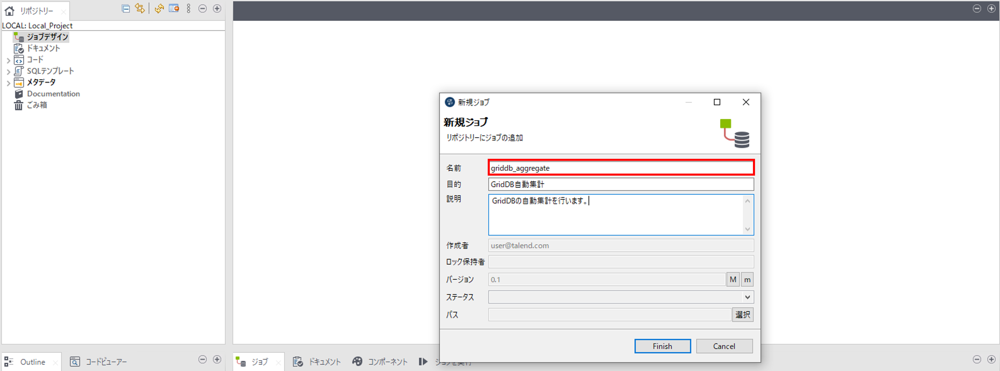</a>

ジョブの「名前(必須)」、「目的(任意)」、「説明(任意)」を入力して、ジョブを作成します。

## Talend データベース接続作成

メタデータのDB接続で右クリックをして「接続を作成」を選択して、「データベース接続」画面を開きます。

<a href="./img/talend_createConnection1.png" data-lightbox="group">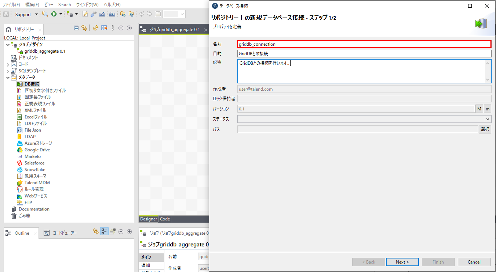</a>

データベースの「名前(必須)」、「目的(任意)」、「説明(任意)」を入力します。

<a href="./img/talend_createConnection2.png" data-lightbox="group">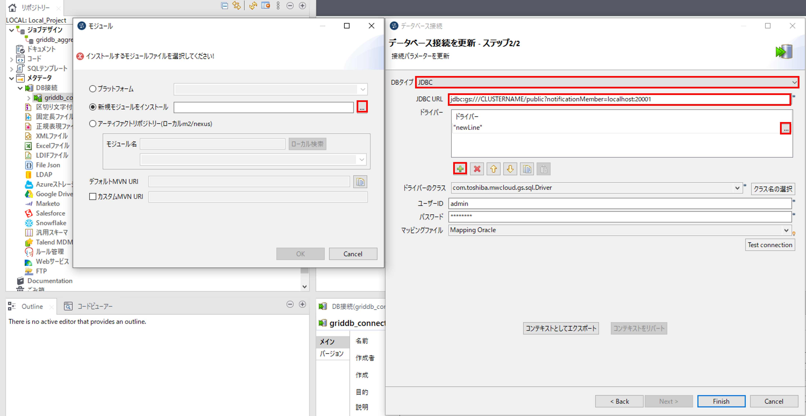</a>

「DBタイプ」からJDBCを選択して、「JDBC URL」に接続対象のGridDBのJDBCのURLを入力します。  
GridDBのJDBC URLの設定は『[GridDB JDBCドライバ説明書](../md_reference_jdbc/md_reference_jdbc.md)』
を参照してください。  

ドライバ入力欄から「＋」を押して、ドライバを追加します。追加したドライバの「...」を押して
「モジュール」画面を開きます。「新規モジュールをインストール」を選択して、「...」からTalendの動作環境から
「gridstore-jdbc.jar」を選んで、ドライバに追加します。

<a href="./img/talend_createConnection3.png" data-lightbox="group">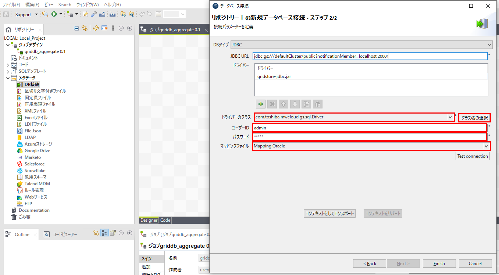</a>

「ドライバのクラス」で「クラス名の選択」を押して、「com.toshiba.mwcloud.gs.sql.Driver」を追加します。
「ユーザID」と「パスワード」にそれぞれGridDBの接続ユーザIDとパスワードを入力します。
「マッピングファイル」で「Mapping Oracle」を選択して、データベースを作成します。

## Talend スキーマ取得

Talend データベース接続作成で作成したデータベース接続で右クリックをして「スキーマを取得」を選択して、「スキーマ」画面を開きます。

<a href="./img/talend_getSchema.png" data-lightbox="group">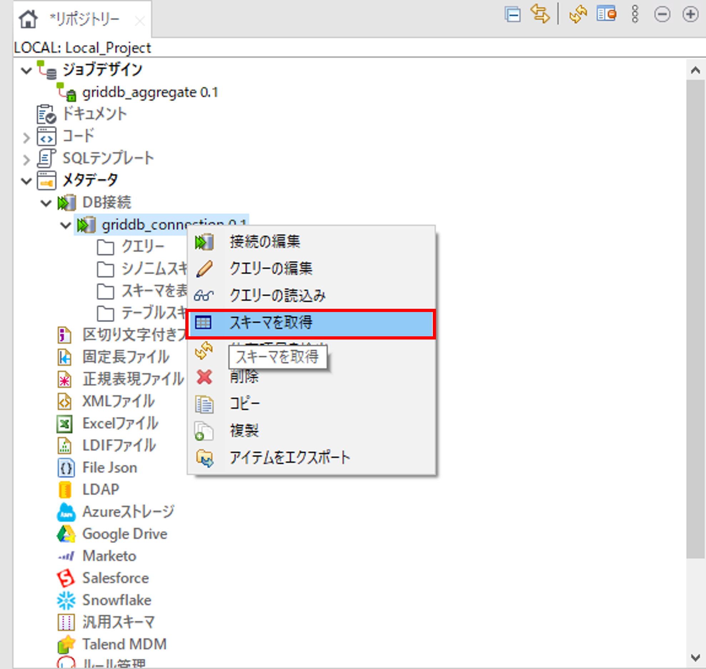</a>

<a href="./img/talend_getSchema2.png" data-lightbox="group">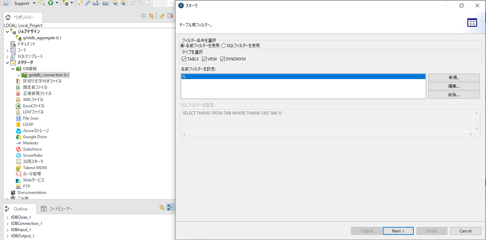</a>

フィルターの条件を指定して、「Next」ボタンを押します。

<a href="./img/talend_getSchema3.png" data-lightbox="group">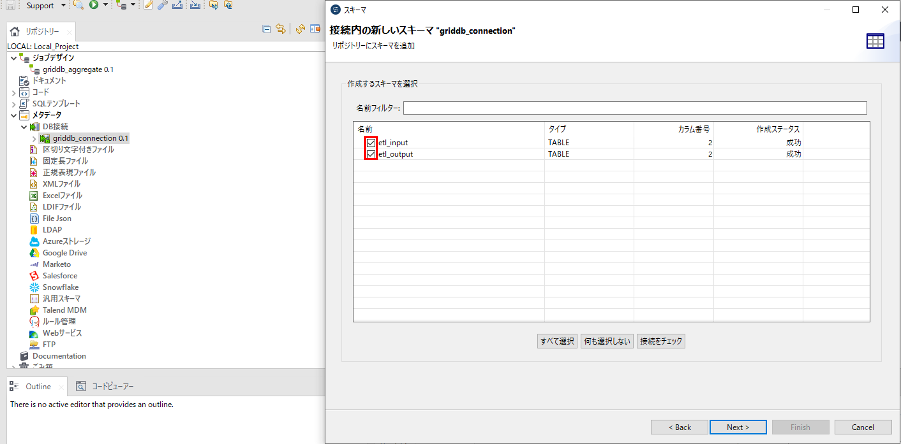</a>

スキーマを取得するコンテナにチェックを入れて、「Next」ボタンを押します。

<a href="./img/talend_getSchema4.png" data-lightbox="group">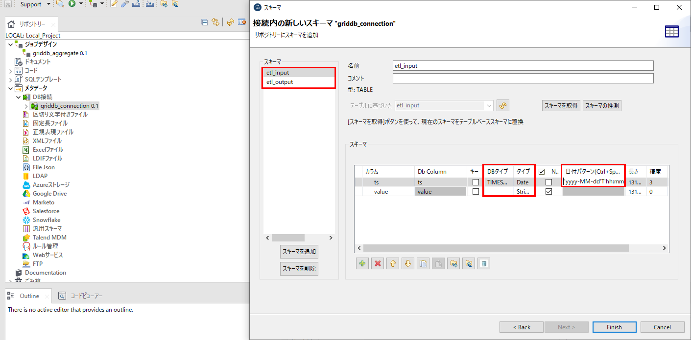</a>

「スキーマ」でコンテナを選択して、「スキーマ」の「DBタイプ」がTIMESTAMPのカラムの「日付パターン」に"yyyy-MM-dd'T'hh:mm:ssZ"を記載して、
スキーマを取得します。「タイプ」に記載されているデータ型とGridDBのコンテナのデータ型が一致していない場合は、データ型を一致させてください。
データのマッピングについては<a href="#talend-data-mapping">GridDBとTalendのデータ型のマッピング</a>を参照してください。

## Talend コンポーネント作成と配置

各コンポーネントを配置して、ジョブを作成します。

| コンポーネント名 | コンポーネントの説明 | コンポーネントのイメージ |
|----|----|----|
| tDBConnection | 外部のデータソースとの接続を確立するコンポーネント | 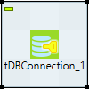 |
| tDBInput | 外部のデータソースからデータを取得するコンポーネント | 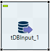 |
| tLogRow | データを標準出力するコンポーネント | 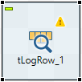 |
| tDBOutput | データを外部のデータソースに出力するコンポーネント | 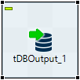 |
| tDBClose | 外部のデータソースとの接続を閉じるコンポーネント | 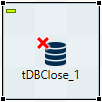 |

<a href="./img/talend_job.png" data-lightbox="group">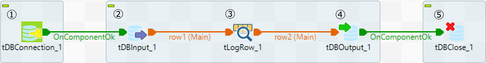</a>

①GridDBとのコネクション作成  
tDBConnectionコンポーネントでGridDBとのコネクションを作成します。

<a href="./img/talend_tDBConnection2.png" data-lightbox="group">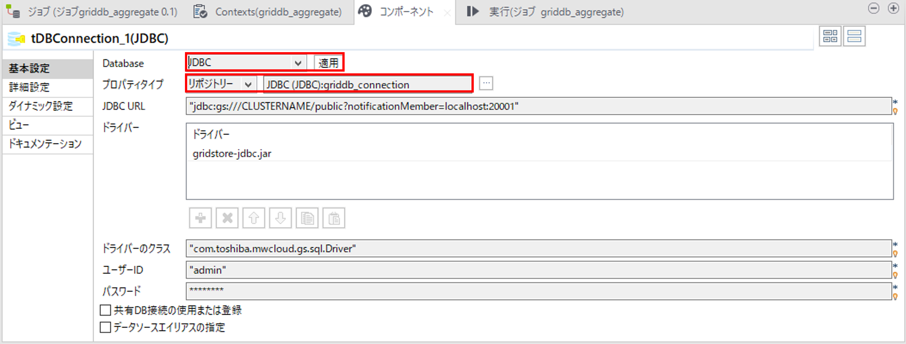</a>

「Database」で「JDBC」を選択して、「適用」を押します。  
「プロパティタイプ」で「リポジトリ」を選択し、Talend データベース接続作成で作成したデータベース接続を選択します。

②GridDBから集計結果取得  
tDBInputコンポーネントでGridDBからクエリ条件を指定してデータを取得します。

<a href="./img/talend_tDBInput2.png" data-lightbox="group">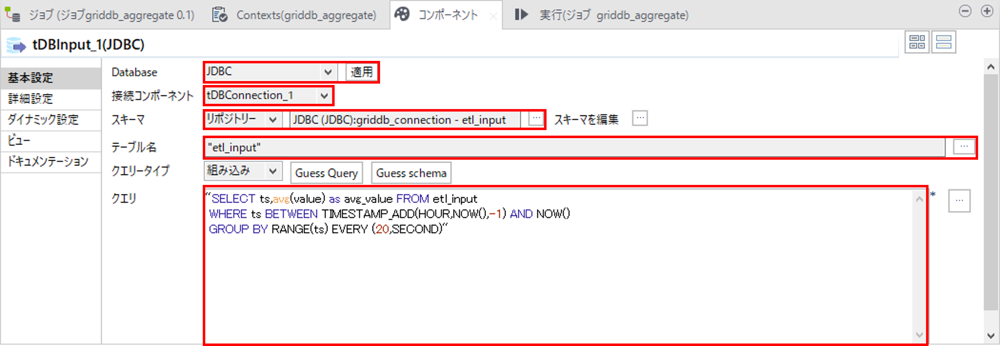</a>

「Database」で「JDBC」を選択して、「適用」を押します。  
「接続コンポーネント」で①GridDBとのコネクションで作成したtDBConnectionコンポーネントを選択します。  
「スキーマ」で「リポジトリー」を選択して、Talend スキーマ取得で取得したスキーマを選択します。  
「テーブル名」で、Talend スキーマ取得で取得したスキーマを選択します。  
「クエリ」に以下のSQL文を記載します。  

```example
直近1時間のデータを20秒ごとに集計して平均値を取得します。

SELECT ts,avg(value) as avg_value FROM etl_input
	WHERE ts BETWEEN TIMESTAMP_ADD(HOUR,NOW(),-1) AND NOW()
		GROUP BY RANGE(ts) EVERY (20,SECOND)

```

③データの標準出力  
tLogRowコンポーネントで取得したデータを標準出力します。

<a href="./img/talend_tLogRow2.png" data-lightbox="group"></a>

「スキーマ」で「リポジトリー」を選択して、Talend スキーマ取得で取得したスキーマを選択します。  

④集計結果をGridDBに登録  
tDBOutputコンポーネントでGridDBにデータを登録します。

<a href="./img/talend_tDBOutput2.png" data-lightbox="group">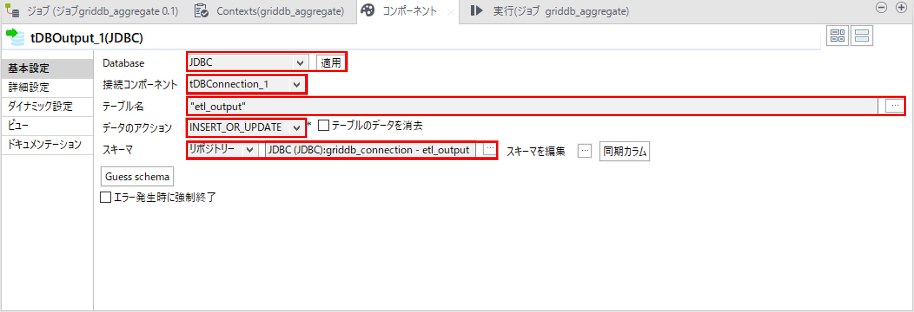</a>

「Database」で「JDBC」を選択して、「適用」を押します。  
「接続コンポーネント」で①GridDBとのコネクションで作成したtDBConnectionコンポーネントを選択します。  
「テーブル名」で、Talend スキーマ取得で取得したスキーマを選択します。  
「データのアクション」で、「INSERT」を選択します。  
「スキーマ」で「リポジトリー」を選択して、Talend スキーマ取得で取得したスキーマを選択します。  

更新や削除を行う場合は「詳細設定」でフィールドオプションを指定します。  
バッチ更新を使用する場合は「バッチの使用」にチェックを入れて、「バッチサイズ」を指定します。

<a href="./img/talend_tDBOutput3.png" data-lightbox="group">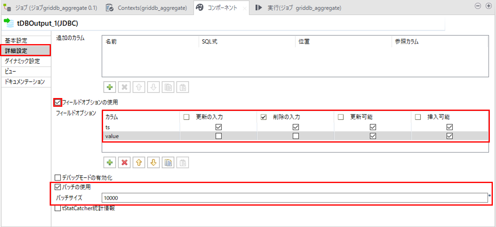</a>

⑤GridDBとのコネクションをクローズ  
tDBCloseコンポーネントでGridDBとのコネクションを閉じます。

<a href="./img/talend_tDBClose2.png" data-lightbox="group">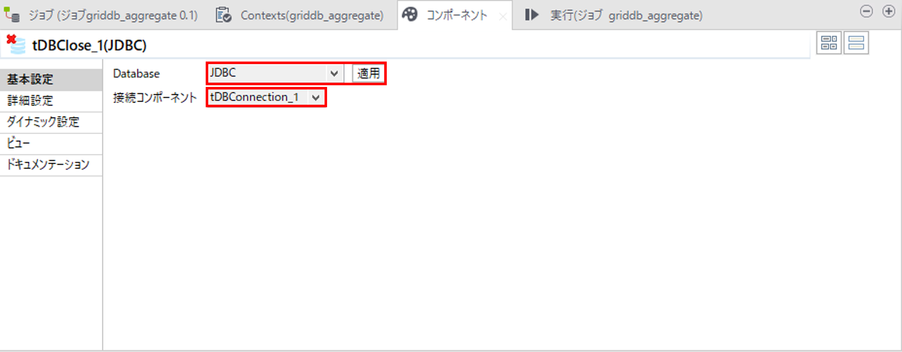</a>

「Database」で「JDBC」を選択して、「適用」を押します。  
「接続コンポーネント」で①GridDBとのコネクションで作成したtDBConnectionコンポーネントを選択します。  

必要に応じて、一度実行して動作確認を行います。

<a href="./img/talend_job_execute.png" data-lightbox="group">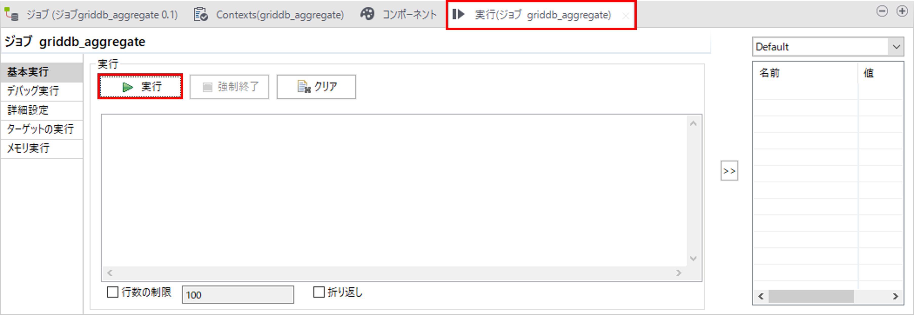</a>

「実行」タブを選択して、「実行」ボタンを押して、実行を行います。


## Talend デプロイ

ジョブデザインの作成したジョブで右クリックをして「ジョブをエクスポート」を選択して、
「ジョブをエクスポート」画面を開きます。

<a href="./img/talend_jobDeploy.png" data-lightbox="group">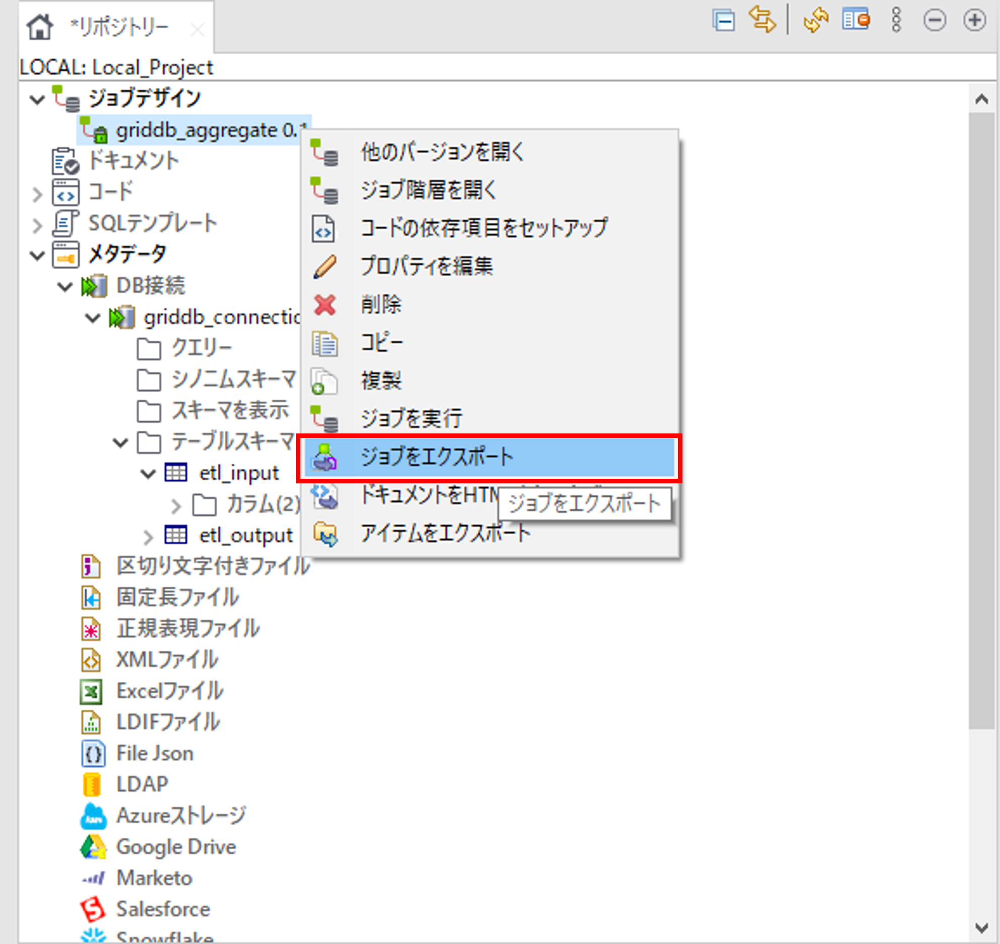</a>

<a href="./img/talend_jobDeploy2.png" data-lightbox="group">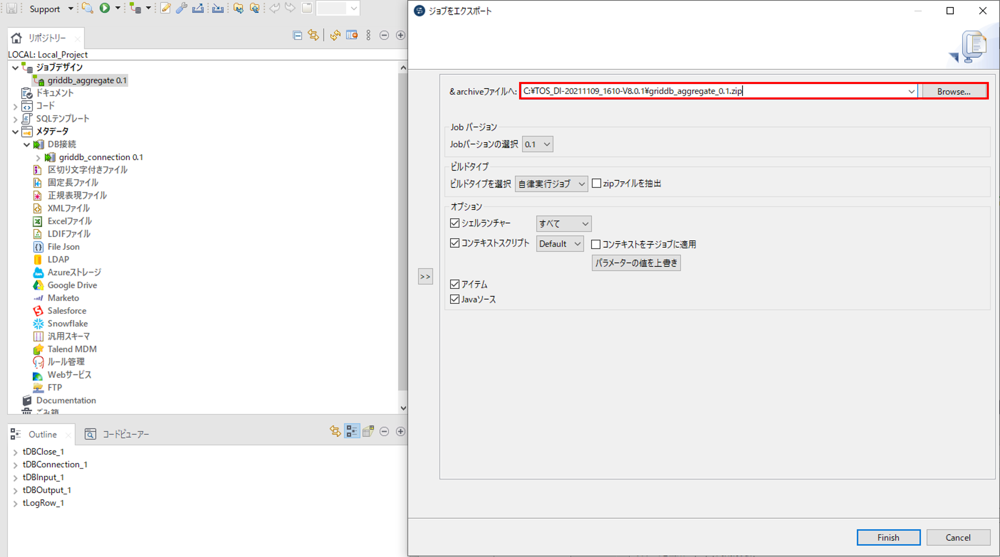</a>

指定した場所にジョブの圧縮ファイルをエクスポートします。  
圧縮ファイルを解凍するとフォルダに実行ファイルのバッチファイルとシェルスクリプトファイルが作成されます。

<a href="./img/talend_jobDeploy3.png" data-lightbox="group">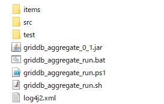</a>

解凍したフォルダを動作させる環境にデプロイします。デプロイした実行ファイルを実行します。

```example

$ cd griddb_aggregate_0.1/griddb_aggregate
$ sh griddb_aggregate_run.sh
2023-01-01T09:00:00+0900|20.0
2023-01-01T09:00:20+0900|40.0
2023-01-01T09:00:40+0900|60.0
2023-01-01T09:01:00+0900|

```

## 定期実行

cronを用いて、定期実行を行います。
1時間ごとに実行する場合は以下のようなcronを作成します。

```example
$ crontab -e

* */1 * * * /griddb_aggregate_0.1/griddb_aggregate/griddb_aggregate_run.sh
```

上記のようにcrontabとシェルスクリプトを組み合わせて定期実行を実現します。

<a id="talend-data-mapping"></a>
# GridDBとTalendのデータ型のマッピング

GridDBとTalendのデータ型のマッピングを下記の表に示します。

| GridDB データ型 | Talendデータ型 |
|------|--------|
| BOOL | BOOLEAN |
| STRING | STRING |
| BYTE | INTEGER |
| SHORT | INTEGER |
| INTEGER | INTEGER |
| LONG | INTEGER |
| FLOAT | FLOAT |
| DOUBLE | FLOAT |
| TIMESTAMP | TIMESTAMP |

上記以外のデータ型については動作対象外となります。
