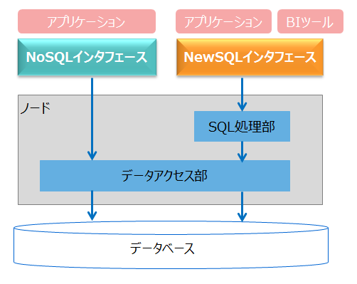
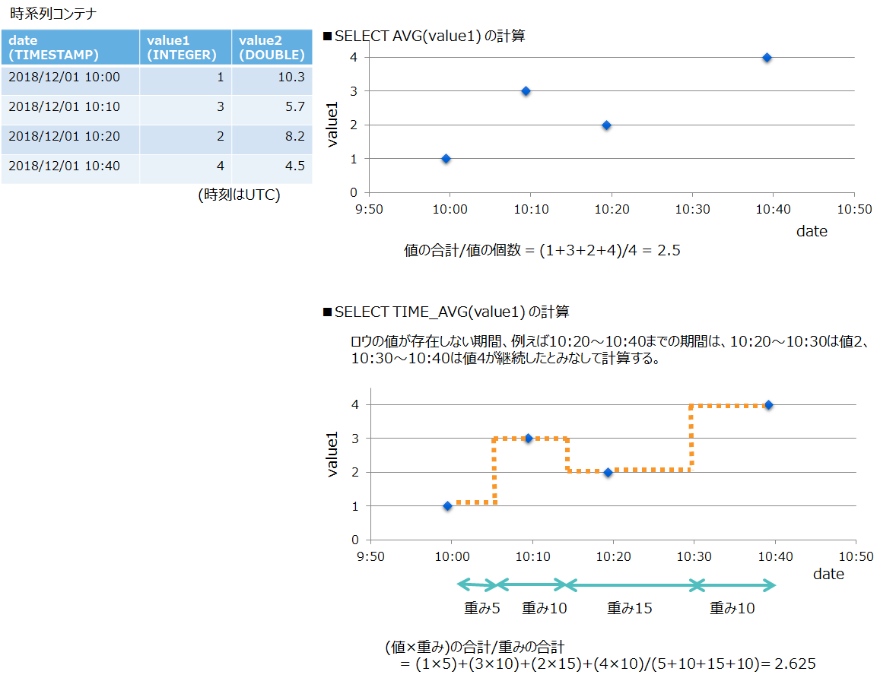
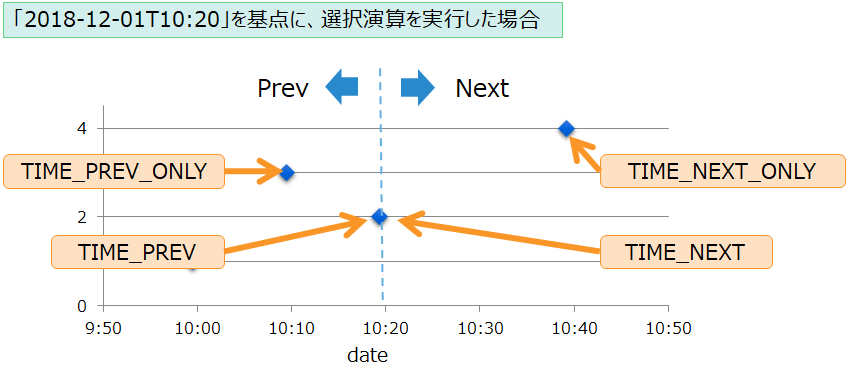
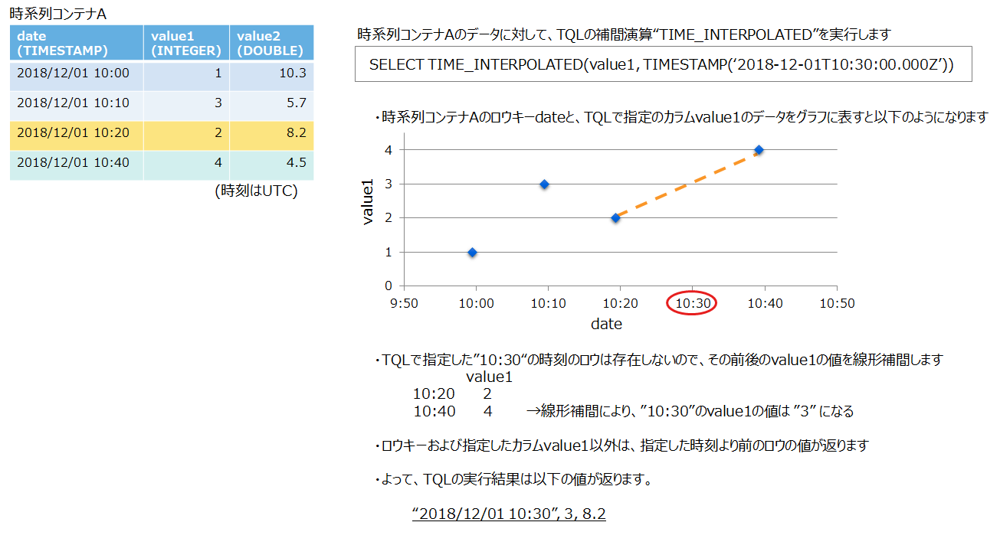
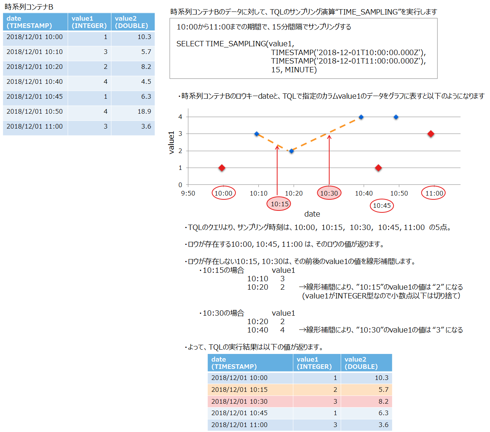

# はじめに

**本書では、GridDBのアプリケーションプログラミングについて説明します。**

本書は、GridDBを用いたシステム設計・開発を行う設計・開発者の方を対象としています。

本書は、以下のような構成となっています。

- 概要

  - 開発言語やNoSQL/NewSQLインタフェース、サポート範囲について説明します。

- Java API (NoSQLインタフェース)

  - NoSQLインタフェースのJavaのプログラミングについて説明します。

- C API (NoSQLインタフェース)

	- NoSQLインタフェースのCのプログラミングについて説明します。

- JDBC (NewSQLインタフェース)

	- NewSQLインタフェースのJavaのプログラミングについて説明します。


# 概要

## 開発言語

GridDBのアプリケーションプログラミングインタフェースには、
基本的なデータアクセスとTQLの実行ができるNoSQLインタフェースと、
SQL92に準拠したSQLを実行できるNewSQLインタフェースの2種類があります。

NoSQLインタフェースは、NewSQLインタフェースに比べてSQLの処理部を介さないためデータ登録や検索の処理が高速に行えます。
一方、NewSQLインタフェースは、
SQLを用いたデータ分析やBI(Business Intelligence)やETL(Extract Transfer Load)ツールからのアクセスなどができます。

<figure>
  
  <figcaption>NoSQLインタフェースとNewSQLインタフェース</figcaption>
</figure>

| I/F               | 特長         | 開発言語 | API名称   |
|-------------------|--------------|----------|-----------|
| NoSQLインタフェース | - 基本的なデータアクセスとTQLの実行<br>- 独自のAPI<br>- データ登録や検索の処理が高速 | Java<br>C<br>Python<br>Node.js<br>Go | Java API<br>C API<br>Python API<br>Node.js API<br>Go API |
| NewSQLインタフェース | - SQL92に準拠したSQLの実行<br>- 標準仕様に準拠したAPI<br>- SQLの並列分散処理 | Java<br>C | JDBC<br>ODBC(\*1) |

(\*1) ODBCはEE限定です。


[メモ]
- NoSQLインタフェースで作成したコンテナと、NewSQLインタフェースで作成したコンテナに違いはありません。
どちらのインタフェースで作成したコンテナでも、両方のインタフェースからアクセスできます。
- NewSQLインタフェースで作成したコンテナに対して「テーブル」という名称を使う場合がありますが、コンテナとテーブルは同じ意味を表します。


## サポート範囲

NoSQLインタフェースとNewSQLインタフェースでは、サポートしている機能やデータ型の範囲が異なります。
本節では、各インタフェースのサポート範囲について説明します。
サポート範囲の詳細は、「付録」をご参照ください。


### データ型
GridDBのデータ型には、基本型と複合型の2種類のデータ型があります。それぞれのサポート範囲を以下に示します。

**基本型のサポート**

| GridDBのデータ型   | NoSQLインタフェース | NewSQLインタフェース |
|-------------------|---|---|
| BOOL型            | ○ | ○ |
| STRING型          | ○ | ○ |
| BYTE型            | ○ | ○ |
| SHORT型           | ○ | ○ |
| INTEGER型         | ○ | ○ |
| LONG型            | ○ | ○ |
| FLOAT型           | ○ | ○ |
| DOUBLE型          | ○ | ○ |
| TIMESTAMP型       | ○ | ○ |
| GEOMETRY型        | ○ | × |
| BLOB型            | ○ | △ |

(※ ○：サポート、△：一部サポート、×：未サポート)


**複合型のサポート**

| GridDBのデータ型 | NoSQLインタフェース | NewSQLインタフェース |
|----------------|---|---|
| BOOL配列型      | ○ | × |
| STRING配列型    | ○ | × |
| BYTE配列型      | ○ | × |
| SHORT配列型     | ○ | × |
| INTEGER配列型    | ○ | × |
| LONG配列型      | ○ | × |
| FLOAT配列型     | ○ | × |
| DOUBLE配列型    | ○ | × |
| TIMESTAMP配列型 | ○ | × |

(※ ○：サポート、×：未サポート)


### 機能

GridDBの主な機能についてのサポート範囲を以下に示します。

**基本機能のサポート**

| GridDBの機能              | NoSQLインタフェース | NewSQLインタフェース |
|---------------------------|----|-----|
| クラスタへの接続           | ○ | ○ |
|---------------------------|--------------------------|--------------------------|
| コンテナ作成/削除          | ○ | ○(SQL) |
| ロウ登録/削除              | ○ | ○(SQL) |
| TQL実行                   | ○ | × |
| SQL実行                   | × | ○ |
| コミット/ロールバック       | ○ | × 自動コミットのみ |
|---------------------------|--------------------------|--------------------------|
| 索引作成/削除              | ○ | ○(SQL) |
|---------------------------|--------------------------|--------------------------|
| コンテナ名一覧の取得        | ○ | ○ |
| カラム情報の取得            | ○ | ○ |

※ ○：サポート、○(SQL)：SQLによるサポート、×：未サポート


**拡張機能のサポート**

| GridDBの機能                      | NoSQLインタフェース | NewSQLインタフェース |
|----------------------------------|----|--------|
| アフィニティ設定                   | ○ | ○(SQL) |
| パーティションコンテナ作成          | × | ○(SQL) |

※ ○：サポート、△：一部サポート、×：未サポート


# Java API (NoSQLインタフェース)

## Java APIを利用したアプリケーションの開発

### サンプルプログラムの実行

サンプルプログラムのコンパイルと実行方法を説明します。

コンパイルと実行の際には、クラスパスにライブラリgridstore.jarを設定します。必要に応じてロギングなどのライブラリも設定してください。

- 例) Sample.javaのコンパイルと実行の例

  ```
  $ javac -classpath "/usr/share/java/gridstore.jar:." Sample.java
  $ java -classpath "/usr/share/java/gridstore.jar:." Sample
  ```


サンプルプログラム一覧

| 分類 | プログラム名 | 内容 | 作成するコンテナ名 |
|------|------------|------|-------------------|
| [クラスタに接続する](#java_connect)  | Connect.java                   | マルチキャスト方式でクラスタに接続して切断します。 | - |
| [コレクションを作成する(メソッド)](#java_create_collection_by_method)  | CreateCollectionByMethod.java  | メソッドでスキーマを指定する方法を用いて、コレクションを作成します。 | SampleJava_collection1 |
| [コレクションを作成する(クラス定義)](#java_create_collection_by_class) | CreateCollectionByClass.java   | クラス定義でスキーマを指定する方法を用いて、コレクションを作成します。 | SampleJava_collection2 |
| [時系列コンテナを作成する(メソッド)](#java_create_container_by_method) | CreateTimeSeriesByMethod.java  | メソッドでスキーマを指定する方法を用いて、時系列コンテナを作成します。 | SampleJava_timeseries1 |
| [ロウを登録する](#java_put_row)                  | PutRow.java                | ひとつのコンテナにひとつのロウを登録します。         | SampleJava_PutRow |
| [複数のロウを登録する](#java_put_rows)            | PutRows.java              | ひとつのコンテナに複数のロウを登録します。           | SampleJava_PutRows |
| [ロウを取得する](#java_get_row)                  | GetRow.java                | ロウキーを指定してコンテナからロウを取得します。     | SampleJava_GetRow |
| [TQLでロウを検索する](#java_tql_select)          | TQLSelect.java             | TQLのSELECT文でロウを取得します。                  | SampleJava_TQLSelect |
| [TQLの集計関数を実行する](#java_tql_aggregation)  | TQLAggregation.java        | TQLのSELECT文で集計演算を実行します。              | SampleJava_TQLAggregation |
| [複数コンテナにロウを登録する](#java_multiput)     | MultiPut.java             | 複数のコンテナにロウを一括で登録します。             | SampleJava_MultiPut1, SampleJava_MultiPut2 |
| [複数コンテナからロウを取得する](#java_multiget)   | MultiGet.java             | 複数のコンテナからロウを一括で取得します。  | SampleJava_MultiGet1, SampleJava_MultiGet2 |
| [複数コンテナにTQLを実行する](#java_fetchall)     | FetchAll.java              | 複数のコンテナにTQLを一括で実行します。    | SampleJava_FetchAll1, SampleJava_FetchAll2 |
| [バイナリデータを登録・検索する](#java_binary)     | BlobData.java             | バイナリデータをコンテナに登録して、コンテナから取得します。 | SampleJava_BlobData |
| [ロウを更新する](#java_update)                   | UpdateRowByTQL.java         | TQLで取得したRowSetを用いて、ロウを更新します。            | SampleJava_UpdateRowByTQL |
| [ロウを削除する(ロウキー)](#java_remove_row)      | RemoveRowByRowkey.java    | ロウキーを指定してロウを削除します。        | SampleJava_RemoveRowByRowkey |
| [ロウを削除する(TQL)](#java_remove_rowset)       | RemoveRowByTQL.java       | TQLで検索したロウを削除します。            | SampleJava_RemoveRowByTQL |
| [索引を作成する](#java_create_index)             | CreateIndex.java          | 索引を作成します。                       | SampleJava_Index |
| [時系列の演算を行う](#java_timeseries_function)   | TQLTimeseries.java        | 時系列データに対して様々な演算を行います。 | SampleJava_TQLTimeseries |
| [配列型のデータを扱う](#java_arraydata)           | ArrayData.java            | 配列型のデータの登録と検索を行います。               | SampleJava_ArrayData |
| [空間型のデータを扱う](#java_geometry_data)           | GeometryData.java         | 空間型のデータの登録と検索を行います。               | SampleJava_GeometryData |
| [コンテナ名一覧を取得する](#java_containernames)   | ContainerNames.java       | コンテナ名の一覧を取得します。                      | － |
| [コンテナのスキーマ情報を取得する](#java_containerinfo) | ContainerInformation.java | コンテナのスキーマ情報を取得します。    | SampleJava_Info |
| [複合ロウキーを使って複数コンテナからロウを取得する](#java_compositekey)   | CompositeKeyMultiGet.java             | 複合ロウキーを使って複数のコンテナからロウを一括で取得します。  | SampleJava_CompositeKeyMultiGet1, SampleJava_CompositeKeyMultiGet2 |


## プログラミングの基礎

Java APIを用いた基礎的なプログラミングを説明します。


<a id="java_connect"></a>
### クラスタに接続する

データの登録や検索などの操作を行うためには、クラスタに接続する必要があります。接続処理では以下のメソッドを用います。

| 分類  |  メソッド |
|-------|---------|
| GridStoreFactoryインスタンス取得 | GridStoreFactory GridStoreFactory.getInstance()  |
| GridStoreインスタンス取得        | GridStore GridStoreFactory.getGridStore(java.util.Properties properties) |


クラスタへの接続を行うプログラムの例を以下に示します。

<!-- Connect.java -->
```java
import java.util.Properties;

import com.toshiba.mwcloud.gs.GridStore;
import com.toshiba.mwcloud.gs.GridStoreFactory;

public class Connect {

	public static void main(String[] args){
		try {
			//===============================================
			// クラスタに接続する
			//===============================================
			//(1)接続情報を指定する (マルチキャスト方式)
			Properties prop = new Properties();
			prop.setProperty("notificationAddress", "239.0.0.1");
			prop.setProperty("notificationPort", "31999");
			prop.setProperty("clusterName", "myCluster");
			prop.setProperty("database", "public");
			prop.setProperty("user", "admin");
			prop.setProperty("password", "admin");
			prop.setProperty("applicationName", "SampleJava");

			//(2)GridStoreオブジェクトを生成する
			GridStore store = GridStoreFactory.getInstance().getGridStore(prop);

			//(3)コンテナ作成や取得などの操作を行うと、クラスタに接続される
			store.getContainer("dummyContainer");

			System.out.println("Connect to cluster");

			//===============================================
			// 終了処理
			//===============================================
			// (4)接続をクローズする
			store.close();
			System.out.println("success!");

		} catch ( Exception e ){
			e.printStackTrace();
		}
	}
}
```

接続処理の部分を説明します。

(1)クラスタのアドレスやユーザ、パスワードなどの接続情報をJavaのプロパティクラスに指定します。

(2)接続情報のプロパティを基に、GridStoreオブジェクトを生成します。

(3)GridStoreオブジェクトを用いてコンテナ作成や取得などの操作を行うと、GridDBクラスタへの接続処理が行われます。

(4)クローズで切断します。


#### 接続方式

クラスタには、マルチキャスト方式、固定リスト方式、プロバイダ方式【EE限定】の3種類の接続方式があります。

| 接続方式 | 内容 |
| --------|------|
| マルチキャスト方式 | マルチキャスト通信を用いた方式 |
| 固定リスト方式 | クラスタを構成する全ノードのアドレスを直接指定する方式 |
| プロバイダ方式 | クラスタを構成する全ノードのアドレスをプロバイダを用いて提供する方式 |

アプリケーションからクラスタに接続する際には、クラスタ定義ファイルgs_cluster.jsonで定義されている接続方式に合わせて、アプリケーション側の設定を行う必要があります。

まずはクラスタ定義ファイルgs_cluster.jsonを参照し、使用されている接続方式を確認してください。次に接続方式に基づいて、対応する値をPropertiesオブジェクトに設定してください。


| 接続方式 | アプリケーションで指定する<br>プロパティのキー | 内容 | 指定する値 |
| --------|----------------------------------------|------|-----------|
| マルチキャスト方式 | notificationAddress<br><br>notificationPort | マルチキャストのアドレス<br><br>マルチキャストのポート番号 | /transaction/notificationAddressの値<br><br>/transaction/notificationPortの値 |
| 固定リスト方式 | notificationMember | クラスタを構成するノードのアドレスとポート番号のリスト | /cluster/notificationMemberの/transaction/addressと/transaction/portをリスト形式にした値  |
| プロバイダ方式 | notificationProvider | プロバイダのURL | /cluster/notificationProvider/urlの値 |


3つの接続方式について、クラスタ定義ファイルgs_cluster.jsonの記述内容と対応する接続プログラムの例を示します。

**マルチキャスト方式の例**

- gs_cluster.jsonの記述(一部抜粋)

  ```json
  {
    "transaction":{
        "notificationAddress":"239.0.0.1",
        "notificationInterval":"1s",
        "notificationPort":31999,
    }
  }
  ```

- 接続プログラムのGridStoreプロパティキーnotificationAddressとnotificationPortには、マルチキャストアドレスとポート番号を記述します。

  ```Java
  Properties prop = new Properties();
  prop.setProperty("notificationAddress", "239.0.0.1");
  prop.setProperty("notificationPort", "31999");
  prop.setProperty("clusterName", "myCluster");
  prop.setProperty("database", "public");
  prop.setProperty("user", "admin");
  prop.setProperty("password", "admin");
  prop.setProperty("applicationName", "SampleJava");
  ```


**固定リスト方式の例**

- gs_cluster.jsonの記述(一部抜粋)

  ```json
  {
      "cluster":{
          "clusterName":"myCluster",
          "replicationNum":2,
          "notificationMember":[
              {
                  "cluster": {"address":"192.168.1.10", "port":10010},
                  "sync":    {"address":"192.168.1.10", "port":10020},
                  "system":  {"address":"192.168.1.10", "port":10040},
                  "transaction": {"address":"192.168.1.10", "port":10001}
              },
              {
                  "cluster": {"address":"192.168.1.11", "port":10010},
                  "sync":    {"address":"192.168.1.11", "port":10020},
                  "system":  {"address":"192.168.1.11", "port":10040},
                  "transaction": {"address":"192.168.1.11", "port":10001}
              },
              {
                  "cluster": {"address":"192.168.1.12", "port":10010},
                  "sync":    {"address":"192.168.1.12", "port":10020},
                  "system":  {"address":"192.168.1.12", "port":10040},
                  "transaction": {"address":"192.168.1.12", "port":10001}
              }
          ]
      }
  }
  ```

- 接続プログラムのGridStoreプロパティキーnotificationMemberには、アドレスとポート番号を:で連結してカンマで区切った値を記述します。

  ```Java
  Properties prop = new Properties();
  prop.setProperty("notificationMember", "192.168.1.10:10001,192.168.1.11:10001,192.168.1.12:10001");
  prop.setProperty("clusterName", "myCluster");
  prop.setProperty("database", "public");
  prop.setProperty("user", "admin");
  prop.setProperty("password", "admin");
  prop.setProperty("applicationName", "SampleJava");
  ```


**プロバイダ方式の例**

- gs_cluster.jsonの記述(一部抜粋)

  ```json
  {
      "cluster":{
          "clusterName":"myCluster",
          "replicationNum":2,
          "notificationProvider":{
              "url":"http://example.com/notification/provider",
              "updateInterval":"30s"
          }
      }
  }
  ```

- 接続プログラムのGridStoreプロパティキーnotificationProviderにはurlの値を記述します。

  ```Java
  Properties prop = new Properties();
  prop.setProperty("notificationProvider", "http://example.com/notification/provider");
  prop.setProperty("clusterName", "myCluster");
  prop.setProperty("database", "public");
  prop.setProperty("user", "admin");
  prop.setProperty("password", "admin");
  prop.setProperty("applicationName", "SampleJava");
  ```

#### プロパティ

接続方式以外の主なプロパティは以下の項目です。
その他のプロパティの詳細は、『[GridDB Java APIリファレンス](../md_reference_java_api/md_reference_java_api.html)』の「GridStoreFactory.getGridStore(java.util.Properties properties)」をご参照ください。


| 項目             | プロパティのキー  | 必須    | 指定する値 |
| -----------------|-----------------|---------|----------------|
| クラスタ名	       | clusterName     | 必須    | gs_cluster.jsonの/cluster/clusterNameに記載している値 |
| データベース名    | database        | publicデータベースに接続する場合は省略可<br>それ以外は必須 | 接続するデータベース名 |
| ユーザ名          | user            | 必須    | 接続するユーザ名(管理ユーザ・一般ユーザどちらも可)  |
| パスワード	       | password        | 必須    | 接続するユーザのパスワード |
| アプリケーション名 | applicationName | 省略可  | アプリケーションを識別するための名前<br>(運用ツールgs_shでコネクション情報や実行中イベントを確認する時に表示されます) |
| タイムゾーン	     | timeZone       | 省略可  | 時分で指定：±hh:mm または ±hhmm <br> タイムゾーンID：「Z」のみサポート<br>上位(JavaVM)の環境引継ぎ：auto<br>※省略時は「Z」相当|
| マルチキャストパケットを受信するインターフェースアドレス	     | notificationInterfaceAddress       | 省略可  | 複数のネットワークインターフェースがあるときにクラスタのネットワーク構成をマルチキャスト方式にする場合は、マルチキャストパケットを受信するインターフェースのIPアドレスを指定|
| フェイルオーバタイムアウト	     | failoverTimeout       | 省略可  | クライアントフェイルオーバのタイムアウト時間（秒）<br>※省略時はGridStoreFactoryの設定値に従う|
| トランザクションタイムアウト	     | transactionTimeout    | 省略可  | トランザクションのタイムアウト時間（秒）<br>※省略時は300(秒)|


[メモ]

- 上記以外に、GridStoreFactoryに設定可能な以下のプロパティがあります。詳細は、『[GridDB Java APIリファレンス](../md_reference_java_api/md_reference_java_api.html)』の「GridStoreFactory.setProperties(java.util.Properties properties)」をご参照ください。

	| 項目             | プロパティのキー  | 必須    | 指定する値 |
	| -----------------|-----------------|---------|----------------|
	| フェイルオーバタイムアウト | failoverTimeout | 省略可 | クライアントフェイルオーバのタイムアウト時間（秒）<br>※省略時は120(秒)|
	| 最大接続プールサイズ | maxConnectionPoolSize | 省略可 | 接続プールで保持する最大接続数<br>※省略時は16|


- 接続時にデータベースを指定します。その接続では、指定したデータベース上のデータにしかアクセスできません。別のデータベースに対して操作を行う場合には改めて接続処理を行ってください。
	- 例) データベースpublicの操作と、データベースuserDB1の操作を行う場合のプログラム

  	```Java
  	// データベース以外のプロパティ指定は省略

  	// データベースpublicに接続
  	prop.setProperty("database", "public");
  	GridStore store1 = GridStoreFactory.getInstance().getGridStore(prop);
  	store1.getContainer("container1");  // データベースpublic上のコンテナcontainer1を取得
  	store1.close();

  	// データベースuserDB1に接続
  	prop.setProperty("database", "userDB1");
  	GridStore store2 = GridStoreFactory.getInstance().getGridStore(prop);
  	store2.getContainer("container1");  // データベースuserDB1上のコンテナcontainer1を取得
  	store2.close();
  	```


- コンテナの取得getContainerを高速化するために、コンテナ情報をキャッシュする機能があります。
アクセスするコンテナ数が多い場合にはキャッシュのサイズを増やすことを推奨します。
キャッシュのサイズは、接続時のプロパティキーで指定します。
	- デフォルトではキャッシュ機能は無効です
	- プロパティキーcontainerCacheSizeに指定する値は、キャッシュに情報を格納するContainerオブジェクトの数です

  	```java
  	prop.setProperty("containerCacheSize", "10000");
  	```


- クラスタに実際に接続するのは、GridStoreオブジェクトを生成してから、最初にコンテナ作成や検索などのデータ操作を実施した時です。
接続先の誤りなどで接続が失敗する場合、GridStoreオブジェクトの生成GridStoreFactory.getGridStoreではエラーは発生せず、
次のデータ操作のメソッドで接続エラーが発生します。


- プロパティは、外部ファイルに記載して指定することもできます。詳細は付録をご参照ください。

- タイムゾーンでサポートされている範囲は以下になります。
	- オフセット範囲: -23:59～+23:59
	- 夏時間: 非サポート
	- タイムゾーンID (JSTなど): 「Z」を除き非サポート

- 日付時刻機能の中でタイムゾーンを扱う場合には付録の[日付時刻機能を利用する上でのアプリ向けの推奨事項](#date_function)をご参照ください。

### コンテナを作成する

コンテナを作成します。コンテナには、コレクションと時系列コンテナの2つの種類があります。
コンテナ作成では、カラム名やデータ型などのスキーマを指定する必要があります。
スキーマを指定する方法として、次の2つの方法があります。

- メソッドでスキーマを指定する方法
	- Java APIのメソッドを使用して、スキーマを指定します。


- クラス定義でスキーマを指定する方法
  - ユーザが定義したJavaのクラスを使用して、スキーマを指定します。


[メモ]
- コンテナ名で使える文字は、『[GridDB 機能リファレンス](../md_reference_feature/md_reference_feature.md)』の「名前の制限」を参照してください。


<a id="java_create_collection_by_method"></a>
#### メソッドでスキーマを指定する方法

コンテナのスキーマは、Java APIのメソッドを使用して動的に指定します。
スキーマを表すコンテナ情報クラスContainerInfoやカラム情報クラスColumnInfoを用います。
これらのクラスを用いてコンテナを作成するメソッドは以下の通りです。

| 分類           | メソッド |
|----------------|---------|
| コレクション作成 | putCollection(String name, ContainerInfo info, boolean modifiable) |
| 時系列コンテナ作成 | putTimeSeries(String name, ContainerInfo info, boolean modifiable) |
| コンテナ(コレクション、または時系列コンテナ)作成 | GridStore.putContainer(String name, ContainerInfo info, boolean modifiable) |

[メモ]
- コンテナ作成のメソッドputContainerは、コレクションと時系列コンテナのどちらの種類も作成できます。
- 既に存在するコンテナと同じ名前を指定した場合、指定したスキーマ定義と既存コンテナのスキーマ定義が
同じであればエラーにはなりません。コンテナ取得getContainerを実行した時と同じ動作になります。
- スキーマ定義が異なる場合、引数modifiableにtrueが指定されていると既存のスキーマ定義を変更します。
引数modifiableにfalseが指定されているとエラーになります。modifiableは、既存コンテナのスキーマ変更を許可するかどうかを指定する変数です。
コンテナの新規作成の場合はfalseを指定してください。


##### コレクションを作成する putCollection

コレクション作成putCollectionを用いて、コレクションを作成するプログラムの全体を以下に示します。

<!-- CreateCollectionByMethod.java -->
```Java
import java.util.ArrayList;
import java.util.List;
import java.util.Properties;

import com.toshiba.mwcloud.gs.Collection;
import com.toshiba.mwcloud.gs.ColumnInfo;
import com.toshiba.mwcloud.gs.ContainerInfo;
import com.toshiba.mwcloud.gs.GSType;
import com.toshiba.mwcloud.gs.GridStore;
import com.toshiba.mwcloud.gs.GridStoreFactory;
import com.toshiba.mwcloud.gs.Row;

public class CreateCollectionByMethod {

	public static void main(String[] args){
		try {
			//===============================================
			// クラスタに接続する
			//===============================================
			// 接続情報を指定する (マルチキャスト方式)
			Properties prop = new Properties();
			prop.setProperty("notificationAddress", "239.0.0.1");
			prop.setProperty("notificationPort", "31999");
			prop.setProperty("clusterName", "myCluster");
			prop.setProperty("database", "public");
			prop.setProperty("user", "admin");
			prop.setProperty("password", "admin");
			prop.setProperty("applicationName", "SampleJava");

			// GridStoreオブジェクトを生成する
			GridStore store = GridStoreFactory.getInstance().getGridStore(prop);
			// コンテナ作成や取得などの操作を行うと、クラスタに接続される
			store.getContainer("dummyContainer");

			//===============================================
			// コレクションを作成する
			//===============================================
			// (1)コンテナ情報オブジェクトを生成
			ContainerInfo containerInfo = new ContainerInfo();

			// (2)カラムの名前やデータ型をカラム情報オブジェクトにセット
			List<ColumnInfo> columnList = new ArrayList<ColumnInfo>();
			columnList.add(new ColumnInfo("id", GSType.INTEGER));
			columnList.add(new ColumnInfo("productName", GSType.STRING));
			columnList.add(new ColumnInfo("count", GSType.INTEGER));

			// (3)カラム情報をコンテナ情報オブジェクトに設定
			containerInfo.setColumnInfoList(columnList);

			// (4)ロウキーありの場合は設定する
			containerInfo.setRowKeyAssigned(true);

			// (5)コレクション作成
			Collection<Void, Row> collection = store.putCollection("SampleJava_collection1", containerInfo, false);

			System.out.println("Create Collection name=SampleJava_collection1");

			//===============================================
			// 終了処理
			//===============================================
			collection.close();
			store.close();
			System.out.println("success!");

		} catch ( Exception e ){
			e.printStackTrace();
		}
	}
}
```

コレクションを作成する箇所を説明します。
(2)カラム名やデータ型は、カラム情報ColumnInfoに指定します。
複数のカラムがある場合は、ColumnInfoを複数生成します。
(3)ColumnInfoはリストオブジェクトに格納して、コンテナ情報ContainerInfoにセットします。
(5)この情報を用いて、putCollectionでコレクションを作成します。

[メモ]

- setRowKeyAssignedでロウキーを設定すると、一番目のカラムがロウキーになります。
- putCollectionの戻り値はCollection<K, R>です。
総称型<K, R>は、<ロウキーのデータ型, Row型>として返されます。
ロウキーのデータ型は、ロウキーが無いコレクションの場合はVoid型、またはワイルドカード型”?"を指定します。

  ```java
  Collection<?, Row> collection = store.putCollection("collectionNotRowkey", containerInfo, false);
  ```


<a id="java_create_container_by_method"></a>
##### 時系列コンテナを作成する putTimeSeries

時系列コンテナ作成putTimeseries用いて、時系列コンテナを作成します。
プログラム全体の流れはコレクションの作成と同様ですので、異なる部分のプログラムのみを示します。

<!-- CreateTimeSeriesByMethod.java -->
```Java
//===============================================
// 時系列コンテナ作成する
//===============================================
// (1)コンテナ情報オブジェクトを生成
ContainerInfo containerInfo = new ContainerInfo();

// (2)カラムの名前やデータ型をカラム情報オブジェクトにセット
List<ColumnInfo> columnList = new ArrayList<ColumnInfo>();
columnList.add(new ColumnInfo("date", GSType.TIMESTAMP));
columnList.add(new ColumnInfo("value", GSType.DOUBLE));
containerInfo.setColumnInfoList(columnList);

// (3)ロウキーを設定 (時系列コンテナはロウキーの設定が必須)
containerInfo.setRowKeyAssigned(true);

// (4)時系列コンテナ作成
TimeSeries<Row> timeseries = store.putTimeSeries("SampleJava_timeseries1", containerInfo, false);

System.out.println("Create TimeSeries name=SampleJava_timeseries1");
```

[メモ]

- 時系列コンテナの場合は、第一カラムはTIMESTAMP型のデータ型で、かつ、ロウキーの設定が必要です。
- putTimeseriesの戻り値はTimeseries<R>です。総称型<R>は、<Row型>として返されます。
- 時系列コンテナ特有の設定は、TimeseriesPropertiesオブジェクトを用います。


##### コンテナを作成する putContainer

コンテナ作成putContainerメソッドは、コレクションと時系列コンテナのどちらでも作成することができます。
コレクションと時系列コンテナの種別は、ContainerInfo.setTypeで指定します。

- コレクションの作成方法

	```Java
	// カラム情報の指定は省略

	// コンテナ種別を指定
	containerInfo.setType(ContainerType.COLLECTION);

	// コレクション作成
	Container<?, Row> collection = store.putContainer("collection3", containerInfo, false);
	```

- 時系列コンテナの作成方法

	```Java
	// カラム情報の指定は省略

	// コンテナ種別を指定
	containerInfo.setType(ContainerType.TIME_SERIES);

	// 時系列コンテナ作成
	Container<?, Row> timeseries = store.putContainer("timeseries3", containerInfo, false);
	```


<a id="java_create_collection_by_class"></a>
#### クラス定義でスキーマを指定する方法
Javaのクラス定義を用いて、コンテナのスキーマを指定します。
Javaのクラス変数が、GridDBのコンテナのカラムに対応付けされます。

例) 以下のようにJavaのクラスを定義した場合の対応付け

- クラス変数とカラムの対応付け
  - 変数 int id　　　→ カラム 名前id、データ型Integer型
  - 変数 String productName → カラム 名前productName、データ型String型
  - 変数 int count　　　　　→ カラム 名前count、データ型Integer型


  <!-- CreateCollectionClass.java -->
  ```java
  class Products{
  	@RowKey int id;	// ロウキーを設定
  	String productName;
  	int count;
  }
  ```


クラス変数の並びと同じ順番で、カラムは作成されます。
データ型の対応付けの詳細は、『[GridDB Java APIリファレンス](../md_reference_java_api/md_reference_java_api.html)』の「Interface Container<K,R>」をご参照ください。


Javaのクラス定義を用いた方法では以下のメソッドを使用します。

| 分類               | メソッド |
|-------------------|----------|
| コレクション作成   | putCollection(String name, java.lang.Class<R> rowType)<br>putCollection(String name, java.lang.Class<R> rowType, boolean modifiable) |
| 時系列コンテナ作成 | putTimeSeries(String name, java.lang.Class<R> rowType)<br>putTimeSeries(String name, java.lang.Class<R> rowType, TimeSeriesProperties props, boolean modifiable)  |
| コンテナ(コレクション、または時系列コンテナ)作成 | putContainer(String name, java.lang.Class<R> rowType, ContainerInfo info, boolean modifiable)  |


コレクション作成putCollectionを用いて、ロウキーありのコレクションを作成するプログラムの全体を以下に示します。(接続と終了処理はこれまでのプログラムと同様です。)

時系列コンテナの作成putTimeseriesとコンテナ作成putContainerの場合も、プログラムの流れは同様です。


<!-- CreateCollectionByClass.java -->
```Java
import java.util.Properties;

import com.toshiba.mwcloud.gs.Collection;
import com.toshiba.mwcloud.gs.GridStore;
import com.toshiba.mwcloud.gs.GridStoreFactory;
import com.toshiba.mwcloud.gs.RowKey;

public class CreateCollectionByClass {

	// コレクションのスキーマ定義用のクラス
	static class Product{
		@RowKey int id;	// ロウキーを設定
		String productName;
		int count;
	}

	public static void main(String[] args){
		try {
			//===============================================
			// クラスタに接続する
			//===============================================
			// 接続情報を指定する (マルチキャスト方式)
			Properties prop = new Properties();
			prop.setProperty("notificationAddress", "239.0.0.1");
			prop.setProperty("notificationPort", "31999");
			prop.setProperty("clusterName", "myCluster");
			prop.setProperty("database", "public");
			prop.setProperty("user", "admin");
			prop.setProperty("password", "admin");
			prop.setProperty("applicationName", "SampleJava");

			// GridStoreオブジェクトを生成する
			GridStore store = GridStoreFactory.getInstance().getGridStore(prop);
			// コンテナ作成や取得などの操作を行うと、クラスタに接続される
			store.getContainer("dummyContainer");

			//===============================================
			// コレクションを作成する
			//===============================================
			// (1)コレクション作成
			Collection<Integer, Product> collection = store.putCollection("SampleJava_collection2", Product.class, false);

			System.out.println("Create Collection name=SampleJava_collection2");

			//===============================================
			// 終了処理
			//===============================================
			collection.close();
			store.close();
			System.out.println("success!");

		} catch ( Exception e ){
			e.printStackTrace();
		}
	}
}
```

- コレクション作成putCollectionでは、Javaのクラスを引数に指定します。
- putCollectionの戻り値はCollection<K, R>です。
	総称型<K, R>は、<ロウキーのデータ型, Row型>として返されます。
	ロウキーのデータ型は、ロウキーが無いコレクションの場合はVoid型、またはワイルドカード型”?"を指定します。
- Javaのクラス定義では、以下のアノテーションが指定できます。
  - ロウキーは、アノテーション@RowKeyで指定します。
  - コンテナのカラムとして作成しないクラス変数には、@TransientRowFieldを指定します
  - クラス変数の名前とは異なるカラム名を指定する場合には、@RowField(name="カラム名")を指定します
	- カラムの順番を明示的に指定する場合には、@RowField(columnNumber=カラム番号)を指定します（カラム番号は0以上カラム数未満の値）
	- 例) クラス定義とアノテーションの例
		- クラス変数commentは、コンテナのカラムには作らない
		- クラス変数tmpは、変数名をそのままコンテナ名にはしない。別名"value"をつける。
		- カラムの順番は、id, value, status

		```java
		class Data{
			@TransientRowField
			String comment;

			@RowField(columnNumber=2)
			boolean status;

			@RowKey
			@RowField(columnNumber=0)
			int id;

			@RowField(name="value",columnNumber=1)
			long tmp;
		}
		```

[メモ]
- 既に存在するコンテナと同じ名前を指定した場合、指定したスキーマ定義と既存コンテナのスキーマ定義が
同じであればエラーにはなりません。コンテナの取得getContainerを実行した時と同じ動作になります。
- スキーマ定義が異なる場合、引数modifiableにtrueが指定されていると既存のスキーマ定義を変更します。
引数modifiableにfalseが指定されているとエラーになります。modifiableは、既存コンテナのスキーマ変更を許可するかどうかを指定する変数です。
コンテナの新規作成の場合はfalseを指定してください。


### コンテナを取得する

コンテナの名前を指定して、コンテナを取得します。
データの登録やTQLなどのロウ操作を行うためには、まずコンテナを取得する必要があります。

コンテナ取得には以下のメソッドがあります。ロウ操作する際のロウのタイプの違いによって2種類に分けられます。

**Rowインタフェース**

- コンテナオブジェクトを取得します。取得したコンテナオブジェクトに対しては、com.toshiba.mwcloud.gs.Rowを使ってロウ操作できます。

	| 分類  |  メソッド |
	|-------|---------|
	| コレクション取得   | \<K\> Collection\<K,Row\> getCollection(java.lang.String name) |
	| 時系列コンテナ取得 | TimeSeries\<Row\> getTimeSeries(java.lang.String name)  |
	| コンテナ取得       | \<K\> Container\<K,Row\> getContainer(java.lang.String name)  |


**ユーザ定義のクラス**

- コンテナオブジェクトを取得します。取得したコンテナオブジェクトに対しては、ユーザがスキーマとして定義したクラスを使ってロウ操作できます。

	| 分類  |  メソッド |
	|-------|---------|
	| コレクション取得     | \<K,R\> Collection\<K,R\> getCollection(java.lang.String name, java.lang.Class\<R\> rowType)  |
	| 時系列コンテナ取得  | \<R\> TimeSeries\<R\> getTimeSeries(java.lang.String name, java.lang.Class\<R\> rowType)   |


例) コンテナ取得(Rowインタフェースでロウ操作を行う)
```java
// コレクション取得
Collection<Integer, Row> collection = store.getCollection("collection1");

// ロウ(Rowオブジェクト)を取得する
Row row = collection.get(0);
```

例) コンテナ取得(ユーザ定義のクラスでロウ操作を行う)
```java
static class Product{
	int id;
	String productName;
	int count;
}
// 省略

// コレクション取得
Collection<Integer, Product> collection = store.getCollection("collection1", Product.class);

// ロウ(Productオブジェクト)を取得する
Product product = collection.get(0);
```


<a id="java_put_row"></a>
### データを登録する

コンテナにロウを登録する場合は、以下のメソッドを使用します。

| 分類  |  メソッド |
|-------|---------|
| ロウ登録 | Container.put(R row)  |


コレクションを作成し、ロウをひとつ登録するプログラムの全体を以下に示します。
(接続と終了処理はこれまでのプログラムと同様です。)

<!-- PutRow.java -->
```Java
import java.util.ArrayList;
import java.util.List;
import java.util.Properties;

import com.toshiba.mwcloud.gs.ColumnInfo;
import com.toshiba.mwcloud.gs.Container;
import com.toshiba.mwcloud.gs.ContainerInfo;
import com.toshiba.mwcloud.gs.GSType;
import com.toshiba.mwcloud.gs.GridStore;
import com.toshiba.mwcloud.gs.GridStoreFactory;
import com.toshiba.mwcloud.gs.Row;

public class PutRow {

	public static void main(String[] args){
		try {
			//===============================================
			// クラスタに接続する
			//===============================================
			// 接続情報を指定する (マルチキャスト方式)
			Properties prop = new Properties();
			prop.setProperty("notificationAddress", "239.0.0.1");
			prop.setProperty("notificationPort", "31999");
			prop.setProperty("clusterName", "myCluster");
			prop.setProperty("database", "public");
			prop.setProperty("user", "admin");
			prop.setProperty("password", "admin");
			prop.setProperty("applicationName", "SampleJava");

			// GridStoreオブジェクトを生成する
			GridStore store = GridStoreFactory.getInstance().getGridStore(prop);
			// コンテナ作成や取得などの操作を行うと、クラスタに接続される
			store.getContainer("dummyContainer");

			//===============================================
			// コレクションを作成する
			//===============================================
			ContainerInfo containerInfo = new ContainerInfo();
			List<ColumnInfo> columnList = new ArrayList<ColumnInfo>();
			columnList.add(new ColumnInfo("id", GSType.INTEGER));
			columnList.add(new ColumnInfo("productName", GSType.STRING));
			columnList.add(new ColumnInfo("count", GSType.INTEGER));
			containerInfo.setColumnInfoList(columnList);
			containerInfo.setRowKeyAssigned(true);

			String containerName = "SampleJava_PutRow";
			store.putCollection(containerName, containerInfo, false);
			System.out.println("Create Collection name="+containerName);


			//===============================================
			// ロウを登録する
			//===============================================
			//(1) Containerオブジェクトの取得
			Container<?, Row> container = store.getContainer(containerName);
			if ( container == null ){
				throw new Exception("Container not found.");
			}

			//(2) 空のロウオブジェクトの作成
			Row row = container.createRow();

			//(3) ロウオブジェクトにカラム値をセット
			row.setInteger(0, 0);
			row.setString(1, "display");
			row.setInteger(2, 150);

			//(4) ロウの登録
			container.put(row);

			System.out.println("Put Row num=1");

			//===============================================
			// 終了処理
			//===============================================
			container.close();
			store.close();
			System.out.println("success!");

		} catch ( Exception e ){
			e.printStackTrace();
		}
	}
}
```

ロウを登録する部分を説明します。
(1)ロウを登録するコンテナを取得します。指定した名前のコンテナが存在しない場合はnullが返ります。
(2)コンテナオブジェクトから、空のロウオブジェクトを生成します。
(3)空のロウオブジェクトに、登録するデータをセットします。
(4)コンテナにロウを登録します。

GridDBのデータ型とJavaのデータ型の対応付けは[データ型の対応付け](#java_data_type)を参照ください。

[メモ]
- ロウキーありのコンテナに対してputする場合、既に存在するロウキーと同じ値のロウを指定すると、既存のロウを更新します。

- コミットには、自動コミットモードと手動コミットモードの2つの動作モードがあります。
	- 自動コミットモードの場合、putを実行すると自動的にロウがコミットされます。commit()は不要です。
	- 手動コミットモードの場合には、明示的にcommit()が必要です。コミットはコンテナ単位です。コンテナをまたがったトランザクション処理はできません。
	- デフォルトは自動コミットモードです。
	- 例) 手動コミットモードの場合

		```Java
		// 手動コミットモードの場合
		// (ロウオブジェクトの作成は省略)

		// 手動コミットモードを指定
		container.setAutoCommit(false);

		// ロウ登録
		container.put(row);

		// コミット
		container.commit();
		```

- ロウオブジェクトにカラム値をセットしなかった場合、カラムの初期値が登録されます。
初期値は、カラムのデータ型によって定義されています。
詳細はの「Interface Container<K,R>」をご参照くださ『[GridDB Java APIリファレンス](../md_reference_java_api/md_reference_java_api.html)』い。


<a id="java_put_rows"></a>
**ひとつのコンテナに複数のロウを登録**

複数のロウを一度に登録することもできます。以下のメソッドを使用します。

| 分類  |  メソッド |
|-------|---------|
| ロウ登録 | Container.put(java.util.Collection<R> rowCollection) |

putを用いて複数のロウを登録するプログラムを示します。

<!-- PutRows.java -->
```Java
//===============================================
// ロウを登録する
//===============================================
// (1)Containerオブジェクトの取得
Container<?, Row> container = store.getContainer(containerName);
if ( container == null ){
	throw new Exception("Container not found.");
}

// (2)複数のロウオブジェクトの作成
String[] nameList = {"notebook PC", "desktop PC", "keyboard", "mouse", "printer"};
int[] numberList = {108, 72, 25, 45, 62};

List<Row> rowList = new ArrayList<Row>();
for ( int i = 0; i < nameList.length; i++ ){
	Row row = container.createRow();
	row.setInteger(0, (i+1));
	row.setString(1, nameList[i]);
	row.setInteger(2, numberList[i]);
	rowList.add(row);
}

// (3)複数のロウの登録
container.put(rowList);

System.out.println("Put Rows num=" + nameList.length);
```

複数のロウオブジェクトを作成してリストにセットします。リストを引数としてputを実行します。


[メモ]
- ロウキーありのコンテナに対してputする場合、既に存在するロウキーと同じ値のロウを指定すると、既存のロウを更新します。


<a id="java_get_row"></a>
### データを取得する

コンテナからロウを取得します。

ロウキーが設定されているコンテナの場合、ロウキーの値を指定してロウを取得できます。
ロウキーが設定されていない場合は、後述のTQLを利用してロウを取得します。

| 分類  |  メソッド |
|-------|---------|
| ロウ取得 | Container.get(K key) |


ロウキーありのコレクションから、ロウキーの値が"0"のロウを取得するプログラムを以下に示します。

<!-- GetRow.java -->
```java
//===============================================
// ロウを取得する
//===============================================
// (1)Containerオブジェクトの取得
Container<Integer, Row> container = store.getContainer(containerName);
if ( container == null ){
	throw new Exception("Container not found.");
}

// (2)ロウキーを指定してロウを取得する
Row row = container.get(0);
if ( row == null ){
	throw new Exception("Row not found");
}

// (3)ロウからカラムの値を取り出す
int id = row.getInteger(0);
String name = row.getString(1);
int count = row.getInteger(2);

System.out.println("Get Row id="+ id + ", name=" + name + ", count=" + count);
```

ロウを取得する処理の部分を説明します。
(2)getにロウキーを指定して、コンテナからロウを取得します。
(3)取得したロウからカラム値を取り出すには、カラムのデータ型に合わせたgetメソッドを使用します。


### TQLを実行する

TQLを実行します。

TQLの実行では、SELECTの選択式の種類によって、実行結果のクラスや処理方法が異なります。

| SELECTの選択式の種類 | 内容                  | 実行結果のクラス型   |
|---------------------|-----------------------|--------------------|
| ロウ(\*) | コンテナに格納されているロウを取得します <br>例) SELECT * FROM container1 | コンテナのロウオブジェクトの型<br>(Container\<K,R\>のRの型) |
| 集計演算(MAX, MIN, COUNTなど) | 集計演算の結果を取得します <br>例) SELECT COUNT(\*) FROM container1 | AggregationResult型 |


[メモ]
- TQLでコンテナやカラムを指定する場合、名前に記号を含む名前はダブルクォーテーションで囲む必要があります。

  ```
  select * from "test.container";
  ```


<a id="java_tql_select"></a>
#### ロウを検索する

ロウの値を検索するTQLを実行する場合は、以下のメソッドを使用します。

| 分類  |  メソッド |
|-------|---------|
| クエリ生成 | Query\<R\> Container\<K,R\>.query(java.lang.String tql)  |
| クエリ実行 | RowSet\<R\> Query\<R\>.fetch()  |


コレクションに対してカラムcountが50以上のロウを検索し、結果をidの昇順でソートして返すTQLのプログラムを示します。

<!-- TQLSelect.java -->
```Java
//===============================================
// TQLで検索する
//===============================================
// (1)Containerオブジェクトの取得
Container<?, Row> container = store.getContainer(containerName);
if ( container == null ){
	throw new Exception("Container not found.");
}

// (2)TQLで検索実行
Query<Row> query = container.query("SELECT * WHERE count >= 50 ORDER BY id");
RowSet<Row> rs = query.fetch();

// (3)結果をロウで取得
while ( rs.hasNext() ) {
	Row row = rs.next();
	int id = row.getInteger(0);
	String name = row.getString(1);
	int count = row.getInteger(2);
	System.out.println("row id=" + id + ", name=" + name + ", count=" + count);
}
```

検索処理の部分を説明します。(2)実行するTQLでクエリオブジェクトを生成し、fetchで検索を実行します。
(3)検索結果を取得します。コンテナのカラムのデータ型に合わせて、getメソッドでロウの値を取得します。


<a id="java_tql_aggregation"></a>
#### 集計演算を行う

集計演算のTQLを実行する場合は、以下のメソッドを使用します。

| 分類  |  メソッド |
|-------|---------|
| クエリ生成 | Query\<S\> Container\<K,R\>.query(java.lang.String tql, java.lang.Class\<S\> rowType)  |
| クエリ実行 | RowSet\<S\> Query\<S\>.fetch()  |

コレクションに対して、カラムvalueの最大値を取得するプログラムを示します。

<!-- TQLAggregate.java -->
```Java
// (オブジェクトの取得は省略)

// (1)TQLで集計演算の実行
Query<AggregationResult> query = container.query("SELECT MAX(value)", AggregationResult.class);
RowSet<AggregationResult> rs = query.fetch();

// (2)結果を取得
if ( rs.hasNext() ){
	AggregationResult result = rs.next();
	long value = result.getLong();
	System.out.println("max = "+ value);
}
```

(1)クエリの生成時に、第2引数で集計演算結果の型であるAggregationResultを指定します。
クエリを実行した結果はAggregationResultオブジェクトで返ります。
(2)実行した集計演算の種類によってAggregationResultオブジェクトの値のデータ型は異なります。データ型に合わせてgetLong、getDoubleまたはgetTimestampで値を取得します。


TQLの集計演算の一覧を以下に示します。

| TQLの集計演算 | 内容 | 演算の引数 | 演算結果(AggregationResult)の値の型 |
|---------|------|-----------|-------------|
| MAX(column) | 指定カラムの最大値 | 数値型またはTIMESTAMP型のカラム | 指定カラムと同一の型 |
| MIN(column) | 指定カラムの最小値 | 数値型またはTIMESTAMP型のカラム | 指定カラムと同一の型 |
| COUNT(*)    | 集計対象のロウの個数   | "*"のみ         | LONG型 |
| SUM(column) | 指定のカラムの合計値 | 数値型のカラム | 指定カラムが整数型の場合LONG型<br>浮動小数点型の場合DOUBLE型 |
| AVG(column) | 指定のカラムの平均値 | 数値型のカラム | DOUBLE型 |
| VARIANCE(column) | 指定のカラムの分散値 | 数値型のカラム | DOUBLE型 |
| STDDEV(column) | 指定のカラムの標準偏差 | 数値型のカラム | DOUBLE型 |


[メモ]

- 集計演算は、ひとつのクエリでひとつしか指定できません。
	- 例) 次のTQLはエラーになります。　SELECT MAX(value), MIN(value)


<a id="java_batch_functions"></a>
### 複数のコンテナに対して一括で操作を行う

データの登録や検索の処理では、複数のコンテナに対して一度に操作を行うことができます。複数コンテナ用のメソッドは以下の通りです。

| 分類  |  メソッド |
|-------|---------|
| 複数コンテナのロウ登録 | GridStore.multiPut(java.util.Map<java.lang.String,java.util.List<Row>> containerRowsMap)  |
| 複数コンテナのロウ取得 | GridStore.multiGet(java.util.Map<java.lang.String,? extends RowKeyPredicate<?>> containerPredicateMap)   |
| 複数コンテナのTQL実行 | GridStore.fetchAll(java.util.List<? extends Query<?>> queryList) |


ひとつのコンテナに対する操作と複数のコンテナに対する操作では、メソッドや取得条件などが異なりますので、
用途に合わせて適切な方法をご利用ください。相違点を以下の表に示します。
それぞれの方法の説明は、「本書での参照先」の部分をご参照ください。

| 分類 | 処理対象のコンテナ | メソッド | 取得条件の指定 | 本書での参照先 |
|------|--------------|----------|---------------|----------------------|
| ロウ登録 | ひとつ | Container.put(R row)<br>Container.put(java.util.Collection<R> rowCollection) | － | [データを登録する](#java_put_row) |
|         | 複数 | GridStore.multiPut(java.util.Map<java.lang.String, java.util.List<Row>> containerRowsMap) | － | [複数コンテナのロウ登録](#java_multiput) |
| ロウ取得<br>(ロウキー指定) | ひとつ | Container.get(K key) | ロウキー指定 | [データを取得する](#java_get_row) |
|                      | 複数 | GridStore.multiGet(java.util.Map<java.lang.String, ? extends RowKeyPredicate<?>> containerPredicateMap) | RowKeyPredicateクラスによるロウキー指定、または、ロウキー範囲指定 | [複数コンテナのロウ取得](#java_multiget) |
| ロウ取得<br>(TQL実行) | ひとつ | GridStore.query(java.lang.String tql)<br>Query.fetch() | TQLのクエリ | [TQLを実行する](#java_tql_select) |
|                  | 複数 | GridStore.fetchAll(java.util.List<? extends Query<?>> queryList) | TQLのクエリ | [複数コンテナのTQL実行](#java_fetchall) |


<a id="java_multiput"></a>
#### 複数コンテナのロウ登録

複数のコンテナに対して、複数のロウを登録します。
コンテナ名と登録するロウのリストの組合せを作り、multiPutでロウを登録できます。

| 分類  |  メソッド |
|-------|---------|
| 複数コンテナのロウ登録 | GridStore.multiPut(java.util.Map<java.lang.String,java.util.List<Row>> containerRowsMap)  |

コレクションと時系列コンテナに、それぞれロウを2個ずつ登録するプログラムを以下に示します。

<!-- MultiPut.java -->
```Java
//===============================================
// 複数のコンテナにロウを登録する
//===============================================
Map<String, List<Row>> paramMap = new HashMap<String, List<Row>>();

// (1)コレクション"SampleJava_MultiPut1"に対して登録するロウを生成する
{
	String containerName = "SampleJava_MultiPut1";
	Container<Integer, Row> container = store.getContainer(containerName);
	if ( container == null ){
		throw new Exception("Container not found.");
	}

	// 登録するデータ
	String[] nameList = {"notebook PC", "desktop PC", "keyboard", "mouse", "printer"};
	int[] numberList = {55, 81, 39, 72, 14};

	// ロウにデータをセットする
	List<Row> rowList = new ArrayList<Row>();
	for ( int i = 0; i < nameList.length; i++ ){
		Row row = container.createRow();
		row.setInteger(0, (i+1));
		row.setString(1, nameList[i]);
		row.setInteger(2, numberList[i]);
		rowList.add(row);
	}
	paramMap.put(containerName, rowList);
}

// (2)時系列コンテナ"SampleJava_MultiPut2"に対して登録するロウを生成する
{
	String containerName = "SampleJava_MultiPut2";
	Container<Integer, Row> container = store.getContainer(containerName);
	if ( container == null ){
		throw new Exception("Container not found.");
	}

	// 登録するデータ
	String[] dateList = {"2018/12/01 10:20:19.111+0900", "2018/12/02 03:25:45.023+0900",
					"2018/12/03 08:29:21.932+0900", "2018/12/04 21:55:48.153+0900"};
	double[] valueList = { 129.9, 13.2, 832.7, 52.9 };

	// 日付の変換フォーマット
	SimpleDateFormat format = new SimpleDateFormat("yyyy/MM/dd hh:mm:ss.SSSZ");

	// ロウにデータをセットする
	List<Row> rowList = new ArrayList<Row>();
	for ( int i = 0; i < dateList.length; i++ ){
		Row row = container.createRow();
		row.setTimestamp(0, format.parse(dateList[i]));
		row.setDouble(1, valueList[i]);
		rowList.add(row);
	}
	paramMap.put(containerName, rowList);
}

// (3)複数のコンテナに対してロウを登録する
store.multiPut(paramMap);

System.out.println("MultiPut");
```

ひとつのコンテナにロウを登録する時と同様に、コンテナオブジェクトから空のロウを作成して登録するロウを作ります。
コンテナとロウのリストの組合せをMapに格納し、まとめてmultiPutで登録を行います。

[メモ]

- 指定するコンテナは、既に存在している必要があります。
- ひとつのコンテナへのロウ登録と同様に、コンテナ単位でコミットされます。指定した複数のコンテナがまとめてコミットされるわけではありません。


<a id="java_multiget"></a>
#### 複数コンテナのロウ取得

複数のコンテナから、指定した条件に当てはまるロウを取得します。

| 分類  |  メソッド |
|-------|---------|
| 複数コンテナのロウ取得 | GridStore.multiGet(java.util.Map<java.lang.String,? extends RowKeyPredicate<?>> containerPredicateMap)   |

ロウキーの条件はコンテナごとに指定できます。条件には、特定の値を指定する個別条件と、値の範囲を指定する範囲条件の2種類があります。条件はRowKeyPredicateクラスのメソッドで指定します。

| 条件 | メソッド |
|-----|------|
| ロウキーの個別条件 | RowKeyPredicate.add(K key) |
| ロウキーの範囲条件 | RowKeyPredicate.setStart(K startKey)<br>RowKeyPredicate.setFinish(K finishKey) |

[メモ]

- 個別条件と範囲条件の2つの条件を混在して使用することはできません。
- 条件をどちらも指定しなかった場合は、すべてのロウが取得されます。
- RowKeyPredicateクラスは、複数コンテナのロウ取得multiGetメソッドでのみ使用できます。他のロウ取得getメソッドでは使用できません。


個別条件指定で、コレクションからINTEGER型のロウキーの値が"0"に合致するロウ、
別のコレクションからINTEGER型のロウキーの値が"2"または"4"に合致するロウをそれぞれ取得するプログラムを以下に示します。

<!-- MultiGet.java -->
```Java
//===============================================
// 複数のコンテナから一括でロウを取得する
//===============================================
// (1)取得条件を構築する
Map<String, RowKeyPredicate<Integer>> predMap = new HashMap<String, RowKeyPredicate<Integer>>();
{
  RowKeyPredicate<Integer> predicate = RowKeyPredicate.create(Integer.class);
  predicate.add(0);
  predMap.put("SampleJava_MultiGet1", predicate);
}
{
  RowKeyPredicate<Integer> predicate = RowKeyPredicate.create(Integer.class);
  predicate.add(2);
  predicate.add(4);
  predMap.put("SampleJava_MultiGet2", predicate);
}

// (2)複数コンテナからロウを取得する
Map<String, List<Row>> outMap = store.multiGet(predMap);

System.out.println("MultiGet");

// (3)ロウの値を取得する
for (Map.Entry<String, List<Row>> entry : outMap.entrySet()) {
  System.out.println("containerName="+entry.getKey());

  for (Row row : entry.getValue()) {
    int id = row.getInteger(0);
    String name = row.getString(1);
    int count = row.getInteger(2);

    System.out.println("    id=" + id + " name=" + name +" count=" + count);
  }
}
```
(1)RowKeyPredicateクラスを使って取得するロウの条件を生成し、コンテナ名とRowKeyPredicateの組合せをMAPに格納します。
(2)multiGetを用いて検索を実行します。
(3)コンテナ名とロウのリストの組合せで結果が返ります。


<a id="java_fetchall"></a>
#### 複数コンテナのTQL実行

複数のコンテナに対して、TQLを実行します。TQLはコンテナごとに指定できます。

| 分類  |  メソッド |
|-------|---------|
| 複数コンテナのTQL実行 | GridStore.fetchAll(java.util.List<? extends Query<?>> queryList) |

2つのコレクションに対応するそれぞれのTQLをまとめて実行し、ロウを取得するプログラムを以下に示します。

<!-- FetchAll.java -->
```Java
//===============================================
// 複数のコンテナにTQLを実行する
//===============================================
List<Query<Row>> queryList = new ArrayList<Query<Row>>();

// (1)コレクション"SampleJava_FetchAll1"に対するTQLのクエリを生成する
{
  Container<Integer, Row> container = store.getContainer("SampleJava_FetchAll1");
  if ( container == null ){
    throw new Exception("Container not found.");
  }
  queryList.add(container.query("select * where count > 60"));
}
// (2)コレクション"SampleJava_FetchAll2"に対するTQLのクエリを生成する
{
  Container<Integer, Row> container = store.getContainer("SampleJava_FetchAll2");
  if ( container == null ){
    throw new Exception("Container not found.");
  }
  queryList.add(container.query("select * where count > 100"));
}

// (3)複数コンテナを一括検索する
store.fetchAll(queryList);

// (4)結果を取得する
for (int i = 0; i < queryList.size(); i++) {
  System.out.println("SampleJava_FetchAll"+(i+1));
  Query<Row> query = queryList.get(i);
  RowSet<Row> rs = query.getRowSet();

  while (rs.hasNext()) {
    Row row = rs.next();
    int id = row.getInteger(0);
    String name = row.getString(1);
    int count = row.getInteger(2);
    System.out.println("    row id=" + id + ", name=" + name + ", count=" + count);
  }
}
```

(1)(2)コンテナオブジェクトからTQLのクエリを生成して、リストに格納します。
(3)クエリのリストを指定して、TQL一括実行fetchAllを実行します。
(4)検索結果は、(3)で指定したクエリのリストに格納されます。クエリから結果を取得する処理は、通常のTQL検索の場合と同様です。


<a id="java_binary"></a>
### バイナリデータを扱う

バイナリデータを登録、取得します。バイナリのデータ型はBlob型です。他のデータ型と同様に操作することができます。

**バイナリデータの登録**

バイナリデータをファイルから読み込み、ロウを登録するプログラムを以下に示します。

<!-- BlobData.java -->
```Java
import java.sql.Blob;

// 省略

// (1)バイナリデータをファイルから読み込み、Blobを作成する
FileInputStream blobFile = new FileInputStream(new File("BlobData.java"));
Blob blob = container.createBlob();
OutputStream blobBuffer = blob.setBinaryStream(1);
int len = -1;
while ((len = blobFile.read()) > -1) {
  blobBuffer.write(len);
}
blobBuffer.flush();

// (2)ロウにバイナリをセットする
Row row = container.createRow();
row.setInteger(0, 0);
row.setBlob(1, blob);

// (3)ロウを登録する
container.put(row);

System.out.println("Put Row (Binary)");

blobFile.close();
```

(1)バイナリデータをファイルから読み込みます。バイナリデータを格納するBlobは、ContainerクラスのcreateBlobメソッドで作成できます。
SerialBlobなど、Blobを実装した他のクラスのインスタンスを使用することも可能です。
(2)ロウにsetBlobでバイナリデータをセットして、(3)ロウを登録します。


**バイナリデータの取得**

getBlobでバイナリデータを取得します。

<!-- BlobData.java -->
```Java
// (1)ロウを取得
Row row = container.get(0);

// (2)ロウからバイナリを取得
Blob blob = row.getBlob(1);
```

　

<a id="java_update"></a>
### データを更新する

ロウを更新します。ロウの更新には、ロウキーを指定して更新する方法と、TQLの実行結果から更新する方法の2種類があります。

| 分類  |  メソッド |
|-------|---------|
| ロウキーを指定してロウ更新 | put(R row)<br>put(K key, R row)<br>put(java.util.Collection<R> rowCollection) |
| TQLの実行結果からロウ更新 | RowSet.update(R rowObj) |


ロウキーを指定してロウ更新する方法では、putで指定したロウのロウキーと合致するデータが既に存在していたら、そのデータを更新します。
ロウキーのデータが存在しなかった場合、または、ロウキーが設定されていないコレクションの場合は、putは常にロウの新規登録になります。


TQLの実行結果からロウを更新するプログラムを示します。

<!-- UpdateRowByTQL.java -->
```Java
//===============================================
// TQLの検索結果からロウを更新する
//===============================================
// Containerオブジェクトの取得
Container<Integer, Row> container = store.getContainer(containerName);
if ( container == null ){
  throw new Exception("Container not found.");
}

// (1)手動コミットモードを指定する
container.setAutoCommit(false);

// (2)TQLで検索実行
Query<Row> query = container.query("SELECT * WHERE id = 3");
RowSet<Row> rs = query.fetch(true);	// 削除するのでtrueを指定

// (3)検索でヒットしたロウを更新する
while( rs.hasNext() ){
  Row row = rs.next();

  // ロウの値をセットする
  row.setInteger(2, 77);

  // ロウを更新する
  rs.update(row);
}

// (4)コミットする
container.commit();

System.out.println("Update Row");
```

[メモ]

- TQLの検索結果RowSetからロウの更新を行う場合は、手動コミットモードに設定して、fetchメソッドの引数にtrueを指定してロックする必要があります。


### データを削除する

ロウを削除します。ロウの削除には、ロウキーを指定して削除する方法と、TQLの検索結果から削除する方法の2種類があります。

| 分類  |  メソッド |
|-------|---------|
| ロウキーを指定してロウ削除 | Container.remove(K key)<br>TimeSeries.remove(java.util.Date key) |
| TQLの検索結果からロウ削除 | RowSet.remove() |

<a id="java_remove_row"></a>
ロウキーを指定してロウ削除の方法を用いて、ロウキーの値"3"のロウを削除するプログラムを示します。

<!-- RemoveRowByRowkey.java -->
```Java
// (1) ロウキーを指定してロウを削除する
container.remove(3);
```

<a id="java_remove_rowset"></a>
TQLの検索結果からロウ削除する方法を用いて、ロウを削除するプログラムを示します。

<!-- RemoveRowByTQL.java -->
```Java
//===============================================
// TQLの検索結果からロウを削除する
//===============================================
// Containerオブジェクトの取得
Container<Integer, Row> container = store.getContainer(containerName);
if ( container == null ){
  throw new Exception("Container not found.");
}

// (1)手動コミットモードを指定する
container.setAutoCommit(false);

// (2)TQLで検索実行
Query<Row> query = container.query("SELECT * WHERE count < 50");
RowSet<Row> rs = query.fetch(true);	// 削除するのでtrueを指定

// (3)検索でヒットしたロウを削除する
while( rs.hasNext() ){
  rs.next();
  rs.remove();
}

// (4)コミットする
container.commit();

System.out.println("Remove Row");
```

[メモ]

- TQLの検索結果RowSetからロウの削除を行う場合は、手動コミットモードに設定して、fetchメソッドの引数にtrueを指定してロックする必要があります。


### コンテナを削除する

コンテナ名を指定してコンテナを削除します。以下のメソッドで削除できます。

| 分類  |  メソッド |
|-------|---------|
| コレクション削除 | GridStore.dropCollection(java.lang.String name)  |
| 時系列コンテナ削除 | GridStore.dropTimeSeries(java.lang.String name) |
| コンテナ削除 | GridStore.dropContainer(java.lang.String name) |

[メモ]

- コレクション削除dropCollectionと時系列コンテナ削除dropTimeSeriesの場合は、
	引数で指定したコンテナの種別とメソッドの種別が異なっているとエラーになります。
	- 例) コレクション"collection1"を、dropTimeSeriesで削除しようとするとエラーになる
- コンテナ削除dropContainerは、コレクションと時系列コンテナのどちらの種別でも削除できます。


コレクション"collection1"を削除するプログラムを以下に示します。

```Java
// コレクション"collection1"を削除する
store.dropCollection("collection1");
```


<a id="java_create_index"></a>
### 索引を作成する

コンテナのカラムに索引を作成します。


索引種別には次の2種類があります。コンテナ種別やカラムのデータ型によって、指定できる索引種別が異なります。

| 索引種別 | 内容 |
|-------|---------|
| ツリー索引 | - Bツリーを用いた索引です。<br>- 等価条件(=)の検索や範囲検索(>や<=など)に適しています。<br>- カラムのデータ型が空間型、BLOB型、配列型の場合には使用できません。また、時系列コンテナのロウキーには使用できません。<br>- 複合索引を作成することができます。|
| 空間索引 | - 空間型用の索引です。<br>- 空間検索を高速に行う場合に適しています。<br>- コレクションでカラムのデータ型が空間型の場合のみ使用できます。|

索引作成は、索引種別やカラムを指定する方法の違いで以下の3種類のメソッドがあります。

| 分類 |  メソッド |
|---------|------|
| 索引作成(カラム名、番号、索引種別、索引名を指定)| Container.createIndex(IndexInfo info) |
| 索引作成(カラム名を指定) | Container.createIndex(java.lang.String columnName)  |
| 索引作成(カラム名と索引種別を指定) | Container.createIndex(java.lang.String columnName, IndexType type)  |

[メモ]

- 索引種別を指定しない場合は、カラムのデータ型で定義されているデフォルトの索引種別が作成されます。
デフォルトの索引種別は、『[GridDB Java APIリファレンス](../md_reference_java_api/md_reference_java_api.html)』の「createIndex(IndexInfo info)」をご参照ください。
- 索引名の指定は任意です。指定しても指定しなくてもどちらでも作成できます。
- 複合索引を作成する場合には、「createIndex(IndexInfo info)」のみ利用可能です。


索引作成createIndex(IndexInfo info)を使用して、コレクションのカラムcountにツリー索引を作成するプログラムを以下に示します。

<!-- CreateIndex.java -->
```Java
// (コンテナオブジェクトの取得は省略)

// (1)索引情報を設定する
IndexInfo indexInfo = new IndexInfo();
indexInfo.setColumnName("count");
indexInfo.setType(IndexType.TREE);
indexInfo.setName("tree_index");

// (2)索引を作成する
container.createIndex(indexInfo);

// (3)複合索引の索引情報を設定する
IndexInfo compositeInfo = new IndexInfo();
compositeInfo.setColumnNameList(Arrays.asList("count","productName"));
compositeInfo.setType(IndexType.TREE);
compositeInfo.setName("composite_index");
			
// (4)複合索引を作成する
container.createIndex(compositeInfo);
```

(1)索引情報IndexInfoには、索引種別、作成対象のカラム（カラム番号またはカラム名）、索引名を指定します。  
(2)IndexInfoを引数として、createIndexを実行します。  
(3)複合索引の場合、索引情報IndexInfoに指定する作成対象のカラム（カラム番号またはカラム名）はList形式で指定します。  
(4)IndexInfoを引数として、createIndexを実行します。

### その他

<a id="java_data_type"></a>
#### データ型の対応付け

Java APIにおいて、GridDBのデータ型とJavaのデータ型の対応付けは以下の通りです。ロウからの値取得や設定の際には、以下のデータ型を指定してください。

| GridDBのデータ型 | Javaのデータ型|
|-------------------|------|
| BOOL型            | boolean |
| STRING型          | java.lang.String  |
| BYTE型            | byte |
| SHORT型           | short |
| INTEGER型         | int |
| LONG型            | long |
| FLOAT型           | float |
| DOUBLE型          | double |
| TIMESTAMP型       | java.util.Date |
| GEOMETRY型        | Geometry |
| BLOB型            | java.sql.Blob |


#### エラー処理

Java APIのメソッドでエラーが発生すると、GSExceptionがスローされます。

エラーコード取得getErrorCode()、スタックトレース表示printStackTrace()などを用いてエラー処理を行います。


#### TIMESTAMP型のユーティリティ機能

TIMESTAMP型のデータは、Java APIではjava.util.Date型として扱います。
TIMESTAMP型に対するユーティリティ機能として以下のメソッドがあります。

| 分類                          | メソッド         |
|-------------------------------|-----------------|
| 現在時刻の取得                 | TimestampUtils.current()<br>TimestampUtils.currentCalendar()   |
| 時刻の加算                     | TimestampUtils.add(java.util.Date timestamp, int amount, TimeUnit timeUnit)<br>TimestampUtils.add(java.util.Date timestamp, int amount, TimeUnit timeUnit, java.util.TimeZone zone)  |
| GSTimestamp型を文字列表記に変換 | TimestampUtils.format(java.util.Date timestamp)<br>TimestampUtils.format(java.util.Date timestamp, java.util.TimeZone zone)  |
| 文字列表記をGSTimestamp型に変換 | TimestampUtils.parse(java.lang.String source)  |
| TIMESTAMP値表記のフォーマットの取得 | TimestampUtils.getFormat()<br>TimestampUtils.getFormat(java.util.TimeZone zone) |


ロウから取得したTIMESTAMP型の値を文字列表記に変換する例を示します。

```
// ロウからTIMESTAMP型の値を取得する
Date date = row.getTimestamp(0);

// GSTimestampを文字列に変換する
String dateStr = TimestampUtils.format(date)
```


## プログラミングの応用


<a id="java_timeseries_function"></a>
### 時系列データを扱う

時系列コンテナに対して、時系列データ特有の演算を実行することができます。
この節では、これらの時系列データ特有の演算について説明します。

演算は、TQLまたはメソッドで実行することができます。

| 種類     | 名称          | TQL演算        | メソッド         |
|---------|---------------|----------------|------------------|
| 集計演算 | 重み付き平均値 | TIME_AVG       | TimeSeries.aggregate <br>(Aggregation.WEIGHTED_AVERAGEを指定) |
| 選択演算 | 直後の時刻     | TIME_NEXT      | TimeSeries.get <br>(TimeOperator.NEXTを指定) |
|         | 直後の時刻     | TIME_NEXT_ONLY | TimeSeries.get <br>(TimeOperator.NEXT_ONLYを指定) |
|         | 直前の時刻     | TIME_PREV      | TimeSeries.get <br>(TimeOperator.PREVIOUSを指定) |
|         | 直前の時刻     | TIME_PREV_ONLY | TimeSeries.get <br>(TimeOperator.PREVIOUS_ONLYを指定) |
| 補間演算 | 線形補間       | TIME_INTERPOLATED | TimeSeries.interpolate |
|         | サンプリング   | TIME_SAMPLING | TimeSeries.query <br>(InterpolationModeを指定) |


- 単純な検索/集約演算をする場合であれば、メソッドを用いた方が少し性能が良くなる場合があります。大量のヒット件数の場合や、検索後の集約などの複雑な操作が必要であれば、TQL演算を用いて実行してください。

以下では、TQL演算を用いたプログラミングの例で説明します。

#### 集計演算

<a id="java_timeseries_time_avg"></a>
##### TIME_AVG 時刻の重み付き平均値

ロウの時間間隔で重みをつけて平均を計算します。時間間隔が長いほど重みが大きくなります。
つまり、値が登録されていない期間の値は、その期間の前後の値が続いていたとみなして計算します。

| TQL演算          | 内容                                             | 演算の引数                  | 演算結果の型 |
|------------------|-------------------------------------------------|-----------------------------|----------|
| TIME_AVG(column) | 指定カラムについての、ロウの時刻に基づく重み付き平均 | 時系列コンテナの数値型のカラム | DOUBLE型 |

- 例) TQLの集計演算TIME_AVGを使用する例

  <figure>
    
    <figcaption>TIME_AVGの例</figcaption>
  </figure>


	<!-- TQLTimeseries.java -->
  ```Java
  // TQLで演算の実行
  Query<AggregationResult> query = container.query("SELECT TIME_AVG(value1)", AggregationResult.class);
  RowSet<AggregationResult> rs = query.fetch();

  // 結果を取得
  if ( rs.hasNext() ){
  	AggregationResult result = rs.next();
  	double value = result.getDouble();
  	System.out.println("TIME_AVG = "+ value);
  }
  ```

[メモ]

- コレクションに対して、TQLでTIME_AVG演算を実行するとエラーになります。
- Java APIのメソッドTimeSeries.aggregate(java.util.Date start, java.util.Date end, java.lang.String column, Aggregation aggregation)を用いて、TQLのTIME_AVG演算と同等の処理を行うこともできます。


<a id="java_timeseries_next_prev"></a>
#### 選択演算

指定された時刻と直前/直後の選択条件に基づいて、時系列コンテナのロウキーの時刻が合致するロウを返します。

| TQL選択演算                   | 内容                                              |
|------------------------------|---------------------------------------------------|
| TIME_NEXT(*, timestamp)      | 指定の時刻timestampの直後の時刻を持つロウを返す。<br>同一時刻のロウが存在した場合は、そのロウを返す。 |
| TIME_NEXT_ONLY(*, timestamp) | 指定の時刻timestampの直後の時刻を持つロウを返す。 |
| TIME_PREV(*, timestamp)      | 指定の時刻timestampの直前の時刻を持つロウを返す。<br>同一時刻のロウが存在した場合は、そのロウを返す。 |
| TIME_PREV_ONLY(*, timestamp) | 指定の時刻timestampの直前の時刻を持つロウを返す。 |

- 例) TQLの選択演算の使用例

  <figure>
    
    <figcaption>TIME_NEXTとTIME_PREVの例</figcaption>
  </figure>

  <!-- TQLTimeseries.java -->
  ```Java
  // TQLで演算の実行
  Query<Row> query = container.query("SELECT TIME_NEXT(*, TIMESTAMP('2018-12-01T10:10:00.000Z'))");
  RowSet<Row> rs = query.fetch();

  // 結果を取得(ロウはひとつしか返らない)
  if ( rs.hasNext() ){
    Row row = rs.next();
    Date date = row.getTimestamp(0);
    int value1 = row.getInteger(1);
    double value2 = row.getDouble(2);
    System.out.println("TIME_NEXT row date=" + TimestampUtils.format(date) + ", value1=" + value1 + ", value2=" + value2);
  }
  ```

[メモ]

- コレクションに対して、TQLでこれらの選択演算を実行するとエラーになります。
- Java APIのメソッドTimeSeries.get(java.util.Date base, TimeOperator timeOp)を用いて、TQLの選択演算と同等の処理を行うこともできます。

<a id="java_timeseries_sampling"></a>
#### 補間演算

時系列データを補間します。

| TQL補間演算         | 内容                   | 演算の引数   |
|------------------|-----------------------|-------------|
| TIME_INTERPOLATED(column, timestamp)   | 指定の時刻timestampのロウが存在しない場合、補間した値を返す | column : 数値型のカラム<br>timestamp : 時刻  |
| TIME_SAMPLING(*&#124;column, timestamp_start, timestamp_end, interval, time_unit)  | 指定の期間において、ロウをサンプリングした結果を返す | timestamp_start : 開始時刻<br>timestamp_end : 終了時刻<br>interval : サンプリング間隔<br>time_unit : サンプリング間隔の単位(DAY&#124;HOUR&#124;MINUTE&#124;SECOND&#124;MILLISECOND) |


**TIME_INTERPOLATED(column, timestamp) ：値の補間**
- 指定の時刻timestampのロウが存在する場合、そのロウをそのまま返します。
- 指定の時刻timestampのロウが存在しない場合、補間した値を格納したロウを返します。カラムcolumnの値は、その前後のロウの値を線形補間した値になります。ロウキーの値はtimestampの値になります。それ以外のカラムの値は、指定の時刻timestampより前のロウの値になります。
- 前後のロウの値を線形補間するとき、どちらかの値がNULLの場合は、補間値はNULLになります。

- 例) TIME_INTERPOLATED演算の実行例

  <figure>
    
    <figcaption>TIME_INTERPOLATED演算の実行例</figcaption>
  </figure>

  <!-- TQLTimeseries.java -->
  ```Java
  // TQLで演算の実行
  Query<Row> query = container.query("SELECT TIME_INTERPOLATED(value1, TIMESTAMP('2018-12-01T10:30:00.000Z'))");
  RowSet<Row> rs = query.fetch();

  // 結果を取得(ロウはひとつしか返らない)
  if ( rs.hasNext() ){
    Row row = rs.next();
    Date date = row.getTimestamp(0);
    int value1 = row.getInteger(1);
    double value2 = row.getDouble(2);
    System.out.println("TIME_INTERPOLATED row date=" + date + ", value1=" + value1 + ", value2=" + value2);
  }
  ```


**TIME_SAMPLING(\*|column, timestamp_start, timestamp_end, interval, time_unit) ：値のサンプリング**
- 開始時刻timestamp_startから終了時刻timestamp_endまでの期間で、サンプリング間隔intervalの時間でサンプリングします。
- サンプリング時刻のロウが存在する場合、そのロウをそのまま返します。
- サンプリング時刻のロウが存在しない場合、補間した値を格納したロウを返します。カラムcolumnの値、または\*の場合全てのカラムの値は、その前後のロウの値を線形補間した値になります。ロウキーの値はtimestampの値になります。それ以外のカラムの値はサンプリング時刻より前のロウの値になります。
- 前後のロウの値を線形補間するとき、どちらかの値がNULLの場合は、補間値はNULLになります。

- 例) TIME_SAMPLING演算の実行例

  <figure>
    
    <figcaption>TIME_SAMPLING演算の実行例</figcaption>
  </figure>

  <!-- TQLTimeseries.java -->
  ```Java
  // TQLで演算の実行
  Query<Row> query = container.query("SELECT TIME_SAMPLING(value1, TIMESTAMP('2018-12-01T10:00:00.000Z'),TIMESTAMP('2018-12-01T11:00:00.000Z'), 15, MINUTE)");
  RowSet<Row> rs = query.fetch();

  // 結果を取得
  while ( rs.hasNext() ){
    Row row = rs.next();
    Date date = row.getTimestamp(0);
    int value1 = row.getInteger(1);
    double value2 = row.getDouble(2);
    System.out.println("TIME_SAMPLING row date=" + date + ", value1=" + value1 + ", value2=" + value2);
  }
  ```

[メモ]

- コレクションに対して、TIME_INTERPOLATED、TIME_SAMPLINGを実行するとエラーになります。
- 集計演算(MAX, MIN, COUNTなど)とTIME_INTERPOLATED、TIME_SAMPLINGを同時に指定することはできません。
- Java APIのメソッドTimeSeries.interpolate(java.util.Date base, java.lang.String column)を用いて、TQLのTIME_INTERPOLATED演算と同等の処理を行うこともできます。
- Java APIのメソッドTimeSeries.query(java.util.Date start, java.util.Date end, java.util.Set<java.lang.String> columnSet, InterpolationMode mode, int interval, TimeUnit intervalUnit) を用いて、TQLのTIME_SAMPLING演算と同等の処理を行うこともできます。


<a id="java_arraydata"></a>
### 配列型のデータを扱う

配列型のデータはJavaの配列にマッピングします。
Rowクラスには、配列型のデータのセットや取得を行うための配列型用のsetter/getterがあります。
配列型のデータ型に合わせたsetter/getterを使用してロウを操作し、データの登録や取得を行います。

| 分類  |  メソッド |
|-------|---------|
| ブール型の配列 | void Row.setBoolArray(int column, boolean[] fieldValue)<br>boolean[] Row.getBoolArray(int column) |
| STRING型の配列 | void Row.setStringArray(int column, java.lang.String[] fieldValue)<br>java.lang.String[] Row.getStringArray(int column) |
| BYTE型の配列 | void Row.setByteArray(int column, byte[] fieldValue)<br>byte[] Row.getByteArray(int column) |
| SHORT型の配列 | void Row.setShortArray(int column, short[] fieldValue)<br>short[] Row.getShortArray(int column) |
| INTEGER型の配列 | void Row.setIntegerArray(int column, int[] fieldValue)<br>int[] Row.getIntegerArray(int column) |
| LONG型の配列 | void Row.setLongArray(int column, long[] fieldValue)<br>long[] Row.getLongArray(int column) |
| FLOAT型の配列 | void Row.setFloatArray(int column, float[] fieldValue)<br>float[] Row.getFloatArray(int column) |
| DOUBLE型の配列 | void Row.setDoubleArray(int column, double[] fieldValue)<br>double[] Row.getDoubleArray(int column) |
| TIMESTAMP型の配列 | void Row.setTimestampArray(int column, java.util.Date[] fieldValue)<br>java.util.Date[] Row.getTimestampArray(int column) |


配列型データを登録するプログラムを示します。

<!-- ArrayData.java -->
```Java
// (1)配列型のデータ
String[] stringArray = {"Sales", "Development", "Marketing", "Research"};
int[] integerArray = {39, 92, 18, 51 };

// (2)ロウに配列型のデータをセットする
Row row = container.createRow();
row.setInteger(0, 0);
row.setStringArray(1, stringArray);
row.setIntegerArray(2, integerArray);

// (3)ロウを登録する
container.put(row);
```


配列型データを取得するプログラムを示します。

<!-- ArrayData.java -->
```Java
// (1)ロウを取得
Row row = container.get(0);

// (2)ロウから配列型データを取得
String[] stringArray = row.getStringArray(1);
int[] integerArray = row.getIntegerArray(2);
```

[メモ]

- 配列型のカラムはロウキーには設定できません。


<a id="java_geometry_data"></a>
### 空間型のデータを扱う

空間型のデータを登録、取得します。

空間型のデータを表すWKT(Well-Known Text)形式の値から、Geometryオブジェクトを生成して操作します。
WKT形式は、ISOで定められている標準的な書式で、空間型のデータをテキスト形式で表現できます。

- 例) 空間型データのWKT形式
	- 2次元空間上の点(2, 3)   →　POINT(2 3)

Rowクラスには、空間型のデータのセットや取得を行うための空間型用のsetter/getterがあります。
これらを用いて、空間型データの登録や取得を行います。

| 分類  |  メソッド |
|-------|---------|
| 空間型データのセット | void Row.setGeometry(int column, Geometry fieldValue)  |
| 空間型データの取り出し | Geometry getGeometry(int column) |


空間型データを登録するプログラムを示します。

<!-- GeometryData.java -->
```Java
import com.toshiba.mwcloud.gs.Geometry;
// (省略)

// (1)空間型のデータ
Geometry geometry = Geometry.valueOf("POINT(2 3)");

// (2)ロウに空間型のデータをセットする
Row row = container.createRow();
row.setInteger(0, 0);
row.setGeometry(1, geometry);

// (3)ロウを登録する
container.put(row);
```


空間型データを取得するプログラムを示します。

<!-- GeometryData.java -->
```Java
import com.toshiba.mwcloud.gs.Geometry;
// (省略)

// (1)ロウを取得
Row row = container.get(0);

// (2)ロウから配列型データを取得
Geometry geometry = row.getGeometry(1);
```

[メモ]

- 空間型のカラムはロウキーには設定できません。


### コンテナ情報を取得する

コンテナの情報を取得する操作を説明します。

- コンテナ名の一覧を取得する
- コンテナのスキーマ情報を取得する


<a id="java_containernames"></a>
#### コンテナ名の一覧を取得する

作成されているコンテナの名前の一覧を取得します。

コンテナ名の一覧取得は、パーティションの情報を取得するためのコントローラPartitionControllerインスタンスを用いて行います。

| 分類  |  メソッド |
|-------|---------|
| パーティションコントローラの取得 | GridStore.getPartitionController() |
| パーティション数の取得 | PartitionController.getPartitionCount() |
| コンテナ名の一覧取得 | PartitionController.getContainerNames(int partitionIndex, long start, java.lang.Long limit) |

パーティションコントローラを介して、パーティションごとにコンテナ名の一覧を取得します。
コンテナ名一覧のプログラムを示します。

<!-- ContainerNames.java -->
```Java
// (1)パーティションコントローラと、パーティション数を取得する
PartitionController partitionController = store.getPartitionController();
int partitionCount = partitionController.getPartitionCount();

// (2)パーティション数でループして、コンテナ名一覧を取得する
for (int i = 0; i < partitionCount; i++) {
	List<String> containerNames = partitionController.getContainerNames(i, 0, null);
	if ( containerNames.size() > 0 ){
		System.out.println(containerNames);
	}
}
```
(2)getContainerNamesメソッドで第2引数0, 第3引数NULLを指定すると、指定したパーティション上の全コンテナ名を取得します。
取得するコンテナ名の数を制限する場合は、第3引数に制限する数を指定してください。

[メモ]

- クラスタ接続時に指定したデータベース上のコンテナ名一覧しか取得できません。
	他のデータベースのコンテナ名の一覧を取得する場合は、そのデータベースに接続する必要があります。

- 取得するコンテナ名に正規表現のような条件は指定できません。


<a id="java_containerinfo"></a>
#### コンテナのスキーマ情報を取得する

コンテナに関する情報は、コンテナ情報ContainerInfoから取得します。

| 分類  |  メソッド |
|-------|---------|
| コンテナ情報の取得 | GridStore.getContainerInfo(java.lang.String name) |

ContainerInfoには、様々な情報を取得するsetterメソッドがあります。必要な情報を取得するメソッドを使用してください。
メソッドの詳細は、『[GridDB Java APIリファレンス](../md_reference_java_api/md_reference_java_api.html)』をご参照ください。


コンテナのカラムや索引情報などを取得するプログラムを示します。

<!-- ContainerInformation.java -->
```Java
// (1)コンテナ情報の取得
ContainerInfo containerInfo = store.getContainerInfo(containerName);

// (2)名前とタイプの取得
String name = containerInfo.getName();
ContainerType type = containerInfo.getType();
System.out.println("name=" + name +", type="+type);

// (3)カラム情報の取得
for (int i = 0; i < containerInfo.getColumnCount(); i++){
  ColumnInfo info = containerInfo.getColumnInfo(i);
  // カラム名
  String columnName = info.getName();

  // カラムのデータ型
  GSType columnType = info.getType();

  // NotNull制約 (true=Not Null制約なし, false=Not Null制約あり)
  boolean columnNullable = info.getNullable();

  // 索引情報
  Set<IndexType> indexTypes = info.getIndexTypes();

  System.out.println("column name="+columnName+", type="+columnType+", nullable="+columnNullable);
  if ( indexTypes.size() > 0 ) System.out.println("       indexTypes="+indexTypes);
}
```

<a id="java_compositekey"></a>
### 複合ロウキーを扱う

データの登録や検索の処理では、複合ロウキーを指定して操作を行うことができます。

複合ロウキーを設定したデータを登録するプログラムを示します。複合ロウキーとして１つ目のINTEGER型と２つ目のSTRING型を指定します。

<!-- CompositeKeyMultiGet.java -->
```Java
// (1)コンテナ情報の作成
ContainerInfo containerInfo = new ContainerInfo();
containerInfo.setType(ContainerType.COLLECTION);
List<ColumnInfo> columnList = new ArrayList<ColumnInfo>();
columnList.add(new ColumnInfo("id", GSType.INTEGER));
columnList.add(new ColumnInfo("productName", GSType.STRING));
columnList.add(new ColumnInfo("count", GSType.INTEGER));
containerInfo.setColumnInfoList(columnList);

// (2)複合ロウキーを指定
containerInfo.setRowKeyColumnList(Arrays.asList(0, 1));

// (3)コンテナを作成
Container<?, Row> container = store.putContainer("SampleJava_CompositeKeyMultiGet1", containerInfo, false);

// (4)ロウを登録する
String[] nameList = {"notebook PC", "desktop PC", "keyboard", "mouse", "printer"};
int[] numberList = {108, 72, 25, 45, 62};
List<Row> rowList = new ArrayList<Row>();
for ( int i = 0; i < nameList.length; i++ ){
	Row row = container.createRow();
	row.setInteger(0, i);
	row.setString(1, nameList[i]);
	row.setInteger(2, numberList[i]);
	rowList.add(row);
}
container.put(rowList);
```

複数のコンテナから、複合ロウキーで指定した条件に当てはまるデータを取得するプログラムを示します。指定する条件は、個別条件指定を用い、１つ目のコンテナからはINTEGER型のロウキーの値が"0"、STRING型のロウキー値が"notebook PC"に合致するロウを、２つ目のコンテナからはINTEGER型のロウキーの値が"2"、STRING型のロウキー値が"keyboard"に合致するロウと、INTEGER型のロウキーの値が"4"、STRING型のロウキー値が"printer"に合致するロウを取得します。


<!-- CompositeKeyMultiGet.java -->
```Java
// (1)取得条件を構築する
Map<String, RowKeyPredicate<Key>> predMap = new HashMap<String, RowKeyPredicate<Key>>();
{
	RowKeyPredicate<Key> predicate = RowKeyPredicate.create(containerInfo);
	Key rowKey = store.createRowKey(containerInfo);
	rowKey.setInteger(0,  0);
	rowKey.setString(1,  "notebook PC");
	predicate.add(rowKey);
	predMap.put("SampleJava_CompositeKeyMultiGet1", predicate);
}
{
	RowKeyPredicate<Key> predicate = RowKeyPredicate.create(containerInfo);

	Key rowKey = store.createRowKey(containerInfo);
	rowKey.setInteger(0,  2);
	rowKey.setString(1,  "keyboard");
	predicate.add(rowKey);
	rowKey.setInteger(0,  4);
	rowKey.setString(1,  "printer");
	predicate.add(rowKey);

	predMap.put("SampleJava_CompositeKeyMultiGet2", predicate);
}

// (2)複数コンテナからロウを取得する
Map<String, List<Row>> outMap = store.multiGet(predMap);
System.out.println("CompositeKeyMultiGet");

// (3)ロウの値を取得する
for (Map.Entry<String, List<Row>> entry : outMap.entrySet()) {
	System.out.println("containerName="+entry.getKey());

	for (Row row : entry.getValue()) {
		int id = row.getInteger(0);
		String name = row.getString(1);
		int count = row.getInteger(2);

		System.out.println("    id=" + id + " name=" + name +" count=" + count);
	}
}
```

[メモ]

- 個別条件と範囲条件の2つの条件を混在して使用することはできません。
- 条件をどちらも指定しなかった場合は、すべてのロウが取得されます。
- RowKeyPredicateクラスは、複数コンテナのロウ取得multiGetメソッドでのみ使用できます。他のロウ取得getメソッドでは使用できません。


# C API (NoSQLインタフェース)

## C APIを利用したアプリケーションの開発(Linux)

### 開発実行環境の構築

C APIのアプリケーションを開発するには、C APIのパッケージをインストールする必要があります。

[メモ]
- RHEL, CentOSのヘッダとライブラリパスは以下です。
  - /usr/include/gridstore.h
  - /usr/lib64/libgridstore.so
- Ubuntu Serverのヘッダとライブラリパスは以下です。
  - /usr/include/gridstore.h
  - /usr/lib/x86_64-linux-gnu/libgridstore.so


アプリケーションの開発や実行を行う際には、LD_LIBRARY_PATHに指定してください。

RHEL, CentOS設定例)
```
$ export LD_LIBRARY_PATH=${LD_LIBRARY_PATH}:/usr/lib64
```

Ubuntu Server設定例)
```
$ export LD_LIBRARY_PATH=${LD_LIBRARY_PATH}:/usr/lib/x86_64-linux-gnu
```


### プログラムのビルド方法

サンプルプログラムのコンパイルと実行方法を説明します。

コンパイル時にはライブラリ"gridstore"を-lオプションに指定してください。生成された実行ファイルを実行してください。

- 例) Sample1.cのコンパイルと実行の例

  ```
  $ gcc sapmle1.c -lgridstore -o sample1
  $ ./sample1
  ```


## C APIを利用したアプリケーションの開発(Windows)

### 開発実行環境の構築

C APIのWindows用ライブラリは、C:/Program Files/GridDB/GridDB C Client/X.X.Xに含まれています。(gridstore_c.lib、gridstore.h、gridstore_c.dll、msvcp140.dll、vcruntime140.dll)

ライブラリは64ビット用dllです。
Visual Studio 2017のランタイムライブラリがインストール済みでない場合は、msvcp140.dllとvcruntime140.dllをコピーしてください。
(Visual Studio 2017のランタイムライブラリ「Visual Studio 2017 の Microsoft Visual C++ 再頒布可能パッケージ」は、マイクロソフトの公式ページからもダウンロード可能です)


### プログラムのビルド方法

以下は、VS2017の場合の手順です。
* x64のプロジェクトを作成。[構成マネージャ] - [アクティブソリューションプラットフォーム] - [新規作成]で "x64"を選択します。
* プロジェクトのソース ファイルにサンプルファイルを追加します。
* Includeディレクトリの設定。[構成プロパティ] - [C/C++] - [全般] - [追加のインクルードディレクトリ]に gridstore.h が存在するディレクトリを指定します。
* インポートライブラリ(gridstore_c.lib)の設定。[リンカー] - [入力] - [追加の依存ファイル] に追加します。
* プロジェクトをビルドします。

　

サンプルプログラム一覧

| 分類 | プログラム名 | 内容 | 作成するコンテナ名 |
|------|------------|------|-------------------|
| [クラスタに接続する](#c_connect)  | Connect.c                   | マルチキャスト方式でクラスタに接続して切断します。 | - |
| [コレクションを作成する(メソッド)](#c_create_collection_by_method)  | CreateCollectionByMethod.c  | メソッドでスキーマを指定する方法を用いて、コレクションを作成します。 | SampleC_collection1 |
| [コレクションを作成する(クラス定義)](#c_create_collection_by_class) | CreateCollectionByClass.c   | クラス定義でスキーマを指定する方法を用いて、コレクションを作成します。 | SampleC_collection2 |
| [時系列コンテナを作成する(メソッド)](#c_create_container_by_method) | CreateTimeSeriesByMethod.c  | メソッドでスキーマを指定する方法を用いて、時系列コンテナを作成します。 | SampleC_timeseries1 |
| [ロウを登録する](#c_put_row)                  | PutRow.c                | ひとつのコンテナにひとつのロウを登録します。         | SampleC_PutRow |
| [複数のロウを登録する](#c_put_rows)            | PutRows.c              | ひとつのコンテナに複数のロウを登録します。           | SampleC_PutRows |
| [ロウを取得する](#c_get_row)                  | GetRow.c                | ロウキーを指定してコンテナからロウを取得します。     | SampleC_GetRow |
| [TQLでロウを検索する](#c_tql_select)                | TQLSelect.c             | TQLのSELECT文でロウを取得します。                  | SampleC_TQLSelect |
| [TQLの集計関数を実行する](#c_tql_aggregation)  | TQLAggregation.c        | TQLのSELECT文で集計演算を実行します。              | SampleC_TQLAggregation |
| [複数コンテナにロウを登録する](#c_multiput)     | MultiPut.c             | 複数のコンテナにロウを一括で登録します。             | SampleC_MultiPut1, SampleC_MultiPut2 |
| [複数コンテナからロウを取得する](#c_multiget)   | MultiGet.c             | 複数のコンテナからロウを一括で取得します。  | SampleC_MultiGet1, SampleC_MultiGet2 |
| [複数コンテナにTQLを実行する](#c_fetchall)     | FetchAll.c              | 複数のコンテナにTQLを一括で実行します。    | SampleC_FetchAll1, SampleC_FetchAll2 |
| [バイナリデータを登録・検索する](#c_binary)     | BlobData.c             | バイナリデータをコンテナに登録して、コンテナから取得します。 | SampleC_BlobData |
| [ロウを更新する](#c_update)                   | UpdateRowByTQL.c         | TQLで取得したRowSetを用いて、ロウを更新します。            | SampleC_UpdateRowByTQL |
| [ロウを削除する(ロウキー)](#c_remove_row)      | RemoveRowByRowkey.c    | ロウキーを指定してロウを削除します。        | SampleC_RemoveRowByRowkey |
| [ロウを削除する(TQL)](#c_remove_rowset)       | RemoveRowByTQL.c       | TQLで検索したロウを削除します。            | SampleC_RemoveRowByTQL |
| [索引を作成する](#c_create_index)             | CreateIndex.c          | 索引を作成します。                                       | SampleC_Index |
| [時系列の演算を行う](#c_timeseries_function)   | TQLTimeseries.c        | 時系列データに対して様々な演算を行います。 | SampleC_TQLTimeseries |
| [配列型のデータを扱う](#c_array_data)           | ArrayData.c            | 配列型のデータの登録と検索を行います。               | SampleC_ArrayData |
| [空間型のデータを扱う](#c_geometry_data)           | GeometryData.c         | 空間型のデータの登録と検索を行います。               | SampleC_GeometryData |
| [コンテナ名一覧を取得する](#c_containernames)   | ContainerNames.c       | コンテナ名の一覧を取得します。                      | － |
| [コンテナのスキーマ情報を取得する](#c_containerinfo) | ContainerInformation.c | コンテナのスキーマ情報を取得します。    | SampleC_Info |
| [複合ロウキーを使って複数コンテナからロウを取得する](#c_compositekey)   | CompositeKeyMultiGet.c             | 複合ロウキーを使って複数のコンテナからロウを一括で取得します。  | SampleC_CompositeKeyMultiGet1, SampleC_CompositeKeyMultiGet2 |


## プログラミングの基礎

C APIを用いた基礎的なプログラミングを説明します。

<a id="c_connect"></a>
### クラスタに接続する

データの登録や検索などの操作を行うためには、クラスタに接続する必要があります。
接続処理では以下のメソッドを用います。

| 分類 | メソッド |
|-----|------------|
| GridStoreFactoryインスタンス取得 | gsGetDefaultFactory() |
| GridStoreインスタンス取得 | gsGetGridStore(GSGridStoreFactory *factory, const GSPropertyEntry *properties, size_t propertyCount, GSGridStore **store) |
| リソース解放 | gsCloseGridStore(GSGridStore **store, GSBool allRelated) |

クラスタへの接続を行うプログラムの例を以下に示します。

<!-- Connect.c -->
```C
#include "gridstore.h"
#include <stdlib.h>
#include <stdio.h>

void main(int argc, char *argv[]){

	GSGridStore *store;
	GSContainer *container;
	GSResult ret;
	size_t stackSize;
	GSResult errorCode;
	GSChar errMsgBuf1[1024], errMsgBuf2[1024];	// エラーメッセージを格納するバッファ
	int i;

	//===============================================
	// クラスタに接続する
	//===============================================
	// (1)接続情報を指定する (マルチキャスト方式)
	const GSPropertyEntry props[] = {
		{ "notificationAddress", "239.0.0.1" },
		{ "notificationPort", "31999" },
		{ "clusterName", "myCluster" },
		{ "database", "public" },
		{ "user", "admin" },
		{ "password", "admin" },
		{ "applicationName", "SampleC" }
	};

	const size_t propCount = sizeof(props) / sizeof(*props);


	// (2)GridStoreインスタンスを取得する
	ret = gsGetGridStore(gsGetDefaultFactory(), props, propCount, &store);
	if ( !GS_SUCCEEDED(ret) ){
		fprintf(stderr, "gsGetGridStore error\n");
		goto LABEL_ERROR;
	}

	// (3)コンテナ作成や取得などの操作を行うと、クラスタに接続される
	ret = gsGetContainerGeneral(store, "containerName", &container);
	if ( !GS_SUCCEEDED(ret) ){
		fprintf(stderr, "gsGetContainerGeneral error\n");
		goto LABEL_ERROR;
	}
	gsCloseContainer(&container, GS_TRUE);
	printf("Connect to Cluster\n");


	//===============================================
	// 終了処理
	//===============================================
	// (4)リソースを解放する
	gsCloseGridStore(&store, GS_TRUE);

	printf("success!\n");

	return;


LABEL_ERROR:
	//===============================================
	// エラー処理
	//===============================================
	// エラーコードとエラーメッセージを出力する
	stackSize = gsGetErrorStackSize(store);
	for ( i = 0; i < stackSize; i++ ){
		errorCode = gsGetErrorCode(store, i);
		gsFormatErrorMessage(store, i, errMsgBuf1, sizeof(errMsgBuf1));
		gsFormatErrorLocation(store, i, errMsgBuf2, sizeof(errMsgBuf2));
		fprintf(stderr, "[%d] %s (%s)\n", errorCode, errMsgBuf1, errMsgBuf2);
	}

	// リソースを解放する
	gsCloseGridStore(&store, GS_TRUE);
	return;
}
```

接続処理の部分を説明します。

(1)クラスタのアドレスやユーザ、パスワードなどの接続情報をGSPropertyEntryに指定します。
GSPropertyEntryは、プロパティのキーと値の組合せの配列です。
指定したプロパティの数は、次のインスタンス取得処理で必要になるのでsizeofを用いて計算しておきます。

(2)接続情報のプロパティを基に、GridStoreインスタンスを取得します。

(3)GridStoreオブジェクトを用いてコンテナ作成や取得などの操作を行うと、GridDBクラスタへの接続処理が行われます。

(4)切断しリソースを解放します。第二引数は、GSGridStoreインスタンスで取得したすべてのリソースを解放するかどうかを指定します。GS_TRUEを指定するとすべてのリソースが解放されます。GS_FALSEを指定した場合は、別途個別にリソースを解放する必要があります。


エラー処理については、[エラー処理](#c_error_handling)を参照ください。


#### 接続方式

クラスタには、マルチキャスト方式、固定リスト方式、プロバイダ方式【EE限定】の3種類の接続方式があります。

| 接続方式 | 内容 |
| --------|------|
| マルチキャスト方式 | マルチキャスト通信を用いた方式 |
| 固定リスト方式 | クラスタを構成する全ノードのアドレスを直接指定する方式 |
| プロバイダ方式 | クラスタを構成する全ノードのアドレスをプロバイダを用いて提供する方式 |

アプリケーションからクラスタに接続する際には、クラスタ定義ファイルgs_cluster.jsonで定義されている接続方式に合わせて、アプリケーション側の設定を行う必要があります。

まずはクラスタ定義ファイルgs_cluster.jsonを参照し、使用されている接続方式を確認してください。次に接続方式に基づいて、対応する値をPropertiesオブジェクトに設定してください。


| 接続方式 | アプリケーションで指定するプロパティのキー | 内容 | 指定する値 |
| --------|----------------------------------------|------|-----------|
| マルチキャスト方式 | notificationAddress<br><br>notificationPort | マルチキャストのアドレス<br><br>マルチキャストのポート番号 | /transaction/notificationAddressの値<br><br>/transaction/notificationPortの値 |
| 固定リスト方式 | notificationMember | クラスタを構成するノードのアドレスとポート番号のリスト | /cluster/notificationMemberの/transaction/addressと/transaction/portをリスト形式にした値  |
| プロバイダ方式 | notificationProvider | プロバイダのURL | /cluster/notificationProvider/urlの値 |

[メモ]
- コネクションプーリングがデフォルトで有効です。最大接続数はGridStoreFactoryのmaxConnectionPoolSizeプロパティで指定できます。デフォルトは16です。詳細は、『[GridDB C APIリファレンス](../md_reference_c_api/md_reference_c_api.html)』をご参照ください。

3つの接続方式について、クラスタ定義ファイルgs_cluster.jsonの記述内容と対応する接続プログラムの例を示します。

**マルチキャスト方式の例**

- gs_cluster.jsonの記述が以下の場合(一部抜粋)

  ```json
  {
      "transaction":{
          "notificationAddress":"239.0.0.1",
          "notificationInterval":"1s",
          "notificationPort":31999,
      }
  }
  ```

- 接続プログラムのプロパティキーnotificationAddressとnotificationPortには、マルチキャストアドレスとポート番号を記述します。

  ```C
  const GSPropertyEntry props[] = {
  	{ "notificationAddress", "239.0.0.1" },
  	{ "notificationPort", "31999" },
  	{ "clusterName", "myCluster" },
  	{ "user", "admin" },
  	{ "password", "admin" }
  	{ "applicationName", "SampleC" }
  };
  ```

**固定リスト方式の例**

- gs_cluster.jsonに記述されている値(一部抜粋)

  ```json
  {
      "cluster":{
          "clusterName":"myCluster",
          "replicationNum":2,
          "notificationMember":[
              {
                  "cluster": {"address":"192.168.1.10", "port":10010},
                  "sync":    {"address":"192.168.1.10", "port":10020},
                  "system":  {"address":"192.168.1.10", "port":10040},
                  "transaction": {"address":"192.168.1.10", "port":10001}
              },
              {
                  "cluster": {"address":"192.168.1.11", "port":10010},
                  "sync":    {"address":"192.168.1.11", "port":10020},
                  "system":  {"address":"192.168.1.11", "port":10040},
                  "transaction": {"address":"192.168.1.11", "port":10001}
              },
              {
                  "cluster": {"address":"192.168.1.12", "port":10010},
                  "sync":    {"address":"192.168.1.12", "port":10020},
                  "system":  {"address":"192.168.1.12", "port":10040},
                  "transaction": {"address":"192.168.1.12", "port":10001}
              }
          ]
      }
  }
  ```

- 接続プログラムのプロパティキーnotificationMemberには、アドレスとポート番号を:で連結してカンマで区切った値を記述します。

  ```C
  const GSPropertyEntry props[] = {
  	{ "notificationMember", "192.168.1.10:10001,192.168.1.11:10001,192.168.1.12:10001" },
  	{ "clusterName", "myCluster" },
  	{ "user", "admin" },
  	{ "password", "admin" }
  	{ "applicationName", "SampleC" }
  };
  ```


**プロバイダ方式の例**

- 例) gs_cluster.jsonの記述が以下の場合(一部抜粋)

  ```json
  {
      "cluster":{
          "clusterName":"myCluster",
          "replicationNum":2,
          "notificationProvider":{
              "url":"http://example.com/notification/provider",
              "updateInterval":"30s"
          }
      }
  }
  ```

- 接続プログラムのプロパティキーnotificationProviderにはurlの値を記述します。

  ```C
  const GSPropertyEntry props[] = {
  	{ "notificationProvider", "http://example.com/notification/provider" },
  	{ "clusterName", "myCluster" },
  	{ "user", "admin" },
  	{ "password", "admin" }
  	{ "applicationName", "SampleC" }
  };
  ```

#### プロパティ

接続方式以外の主なプロパティは以下です。
その他のプロパティの詳細は、『[GridDB C APIリファレンス](../md_reference_c_api/md_reference_c_api.html)』の「gsGetGridStore」をご参照ください。


| 項目             | プロパティのキー  | 必須    | 指定する値 |
| -----------------|-----------------|---------|----------------|
| クラスタ名	       | clusterName     | 必須    | gs_cluster.jsonの/cluster/clusterNameに記載している値 |
| データベース名    | database        | publicデータベースに接続する場合は省略可<br>それ以外は必須 | 接続するデータベース名 |
| ユーザ名          | user            | 必須    | 接続するユーザ名(管理ユーザ・一般ユーザどちらも可)  |
| パスワード	       | password        | 必須    | 接続するユーザのパスワード |
| アプリケーション名 | applicationName | 省略可  | アプリケーションを識別するための名前<br>(運用ツールgs_shでコネクション情報や実行中イベントを確認する時に表示されます) |
| タイムゾーン	     | timeZone       | 省略可  | 時分で指定：±hh:mm または ±hhmm <br> タイムゾーンID：「Z」のみサポート<br>上位(JavaVM)の環境引継ぎ：auto<br>※省略時は「Z」相当|
| マルチキャストパケットを受信するインターフェースアドレス	     | notificationInterfaceAddress       | 省略可  | 複数のネットワークインターフェースがあるときにクラスタのネットワーク構成をマルチキャスト方式にする場合は、マルチキャストパケットを受信するインターフェースのIPアドレスを指定|
| フェイルオーバタイムアウト	     | failoverTimeout       | 省略可  | クライアントフェイルオーバのタイムアウト時間（秒）<br>※省略時はGridStoreFactoryの設定値に従う|
| トランザクションタイムアウト	     | transactionTimeout    | 省略可  | トランザクションのタイムアウト時間（秒）<br>※省略時は300(秒)|


[メモ]

- 上記以外に、GridStoreFactoryに設定可能な以下のプロパティがあります。詳細は、『[GridDB C APIリファレンス](../md_reference_c_api/md_reference_c_api.html)』をご参照ください。

	| 項目             | プロパティのキー  | 必須    | 指定する値 |
	| -----------------|-----------------|---------|----------------|
	| フェイルオーバタイムアウト | failoverTimeout | 省略可 | クライアントフェイルオーバのタイムアウト時間（秒）<br>※省略時は120(秒)|
	| 最大接続プールサイズ | maxConnectionPoolSize | 省略可 | 接続プールで保持する最大接続数<br>※省略時は16|


- 接続時にデータベースを指定します。その接続では、指定したデータベース上のデータにしかアクセスできません。別のデータベースに対して操作を行う場合には改めて接続処理を行ってください。
	- 例) データベースpublicの操作と、データベースuserDB1の操作を行う場合のプログラム

    ```C
    // データベース以外のプロパティ指定は省略

    // データベースpublicに接続
    const GSPropertyEntry props[] = {
    	{ "database", "public" },
    	・・・
    }
    ret = gsGetGridStore(gsGetDefaultFactory(), props, propCount, &store1);
    gsGetContainerGeneral(store1, "container1", &container);  // データベースpublic上のコンテナcontainer1を取得
    gsCloseGridStore(&store1, GS_TRUE);

    // データベースuserDB1に接続
    const GSPropertyEntry props[] = {
    	{ "database", "userDB1" },
    	・・・
    }
    ret = gsGetGridStore(gsGetDefaultFactory(), props, propCount, &store2);
    gsGetContainerGeneral(store1, "container2", &container);  // データベースuserDB1上のコンテナcontainer1を取得
    gsCloseGridStore(&store2, GS_TRUE);
    ```


- コンテナの取得getContainerを高速化するために、コンテナ情報をキャッシュする機能があります。
アクセスするコンテナ数が多い場合にはキャッシュのサイズを増やすことを推奨します。
キャッシュのサイズは、接続時のプロパティキーで指定します。
	- デフォルトではキャッシュ機能は無効です
	- プロパティキーcontainerCacheSizeに指定する値は、キャッシュに情報を格納するContainerオブジェクトの数です

  ```C
  const GSPropertyEntry props[] = {
  	{ "containerCacheSize", "10000" },
  	・・・
  }
  ```


- クラスタに実際に接続するのは、GridStoreオブジェクトを生成してから、最初にコンテナ作成や検索などのデータ操作を実施した時です。
接続先の誤りなどで接続が失敗する場合、GridStoreオブジェクトの生成ではエラーは発生せず、
次のデータ操作のメソッドで接続エラーが発生します。

- タイムゾーンでサポートされている範囲は以下になります。
	- オフセット範囲: -23:59～+23:59
	- 夏時間: 非サポート
	- タイムゾーンID (JSTなど): 「Z」を除き非サポート

- 日付時刻機能の中でタイムゾーンを扱う場合には付録の[日付時刻機能を利用する上でのアプリ向けの推奨事項](#date_function)をご参照ください。

### コンテナを作成する

コンテナを作成します。コンテナには、コレクションと時系列コンテナの2つの種類があります。
コンテナ作成では、カラム名やデータ型などのスキーマを指定する必要があります。
スキーマを指定する方法として、次の2つの方法があります。

- メソッドでスキーマを指定する方法
  -  C APIのメソッドを使用して、スキーマを指定します。


- 構造体でスキーマを指定する方法
  - Cの構造体を使用して、スキーマを指定します。


それぞれの方法について説明します。


<a id="c_create_collection_by_method"></a>
#### メソッドでスキーマを指定する方法

コンテナのスキーマはメソッドを使用して動的に指定します。
スキーマを表すコンテナ情報クラスGSContainerInfoやカラム情報クラスGSColumnInfoを用います。
これらを用いてコンテナを作成するメソッドは以下の通りです。

| 分類  |  メソッド |
|-------|---------|
| コレクション作成 | gsPutCollectionGeneral(GSGridStore *store, const GSChar *name, const GSContainerInfo *info, GSBool modifiable, GSCollection **collection) |
| 時系列コンテナ作成 | gsPutTimeSeriesGeneral (GSGridStore *store, const GSChar *name, const GSContainerInfo *info, GSBool modifiable, GSTimeSeries **timeSeries) |
| コンテナ(コレクション、または時系列コンテナ)作成 | gsPutContainerGeneral(GSGridStore *store, const GSChar *name, const GSContainerInfo *info, GSBool modifiable, GSContainer **container) |

コンテナ作成のメソッドgsPutContainerGeneralは、コレクションと時系列コンテナのどちらの種類も作成できます。


##### コレクションの作成 gsPutCollectionGeneral

コレクション作成gsPutCollectionGeneralを用いて、コレクションを作成するプログラムの全体を以下に示します。

<!-- CreateCollectionByMethod.c -->
```C
#include "gridstore.h"
#include <stdlib.h>
#include <stdio.h>

void main(int argc, char *argv[]){

	GSGridStore *store;
	GSContainer *container;
	GSCollection *collection;
	GSContainerInfo info = GS_CONTAINER_INFO_INITIALIZER;
	GSColumnInfo columnInfo = GS_COLUMN_INFO_INITIALIZER;
	GSColumnInfo columnInfoList[3];
	GSResult ret;
	size_t stackSize;
	GSResult errorCode;
	GSChar errMsgBuf1[1024], errMsgBuf2[1024];	// エラーメッセージを格納するバッファ
	int i;

	//===============================================
	// クラスタに接続する
	//===============================================
	// 接続情報を指定する (マルチキャスト方式)
	const GSPropertyEntry props[] = {
		{ "notificationAddress", "239.0.0.1" },
		{ "notificationPort", "31999" },
		{ "clusterName", "myCluster" },
		{ "database", "public" },
		{ "user", "admin" },
		{ "password", "admin" },
		{ "applicationName", "SampleC" }
	};

	const size_t propCount = sizeof(props) / sizeof(*props);


	// GridStoreインスタンスを取得する
	ret = gsGetGridStore(gsGetDefaultFactory(), props, propCount, &store);
	if ( !GS_SUCCEEDED(ret) ){
		fprintf(stderr, "ERROR gsGetGridStore\n");
		goto LABEL_ERROR;
	}
	// コンテナ作成や取得などの操作を行うと、クラスタに接続される
	ret = gsGetContainerGeneral(store, "containerName", &container);
	if ( !GS_SUCCEEDED(ret) ){
		fprintf(stderr, "ERROR gsGetContainerGeneral\n");
		goto LABEL_ERROR;
	}
	gsCloseContainer(&container, GS_TRUE);
	printf("Connect to Cluster\n");


	//===============================================
	// コレクションを作成する
	//===============================================
	// (1)コンテナ種別を設定する
	info.type = GS_CONTAINER_COLLECTION;

	// (2)ロウキーありの場合は設定する
	info.rowKeyAssigned = GS_TRUE;

	// (3)カラム情報を定義する
	columnInfo.name = "id";
	columnInfo.type = GS_TYPE_INTEGER;
	columnInfoList[0] = columnInfo;

	columnInfo.name = "productName";
	columnInfo.type = GS_TYPE_STRING;
	columnInfoList[1] = columnInfo;

	columnInfo.name = "count";
	columnInfo.type = GS_TYPE_INTEGER;
	columnInfoList[2] = columnInfo;

	// (4)カラム情報をコンテナ情報オブジェクトに設定する
	info.columnCount = sizeof(columnInfoList) / sizeof(*columnInfoList);
	info.columnInfoList = columnInfoList;

	// (5)コレクションを作成する
	ret = gsPutCollectionGeneral(store, "SampleC_collection1", &info, GS_FALSE, &collection);
	if ( !GS_SUCCEEDED(ret) ){
		fprintf(stderr, "ERROR gsPutCollectionGeneral\n");
		goto LABEL_ERROR;
	}

	printf("Create Collection name=SampleC_collection1\n");

	//===============================================
	// 終了処理
	//===============================================
	// リソースを解放する
	gsCloseGridStore(&store, GS_TRUE);

	printf("success!\n");

	return;


LABEL_ERROR:
	//===============================================
	// エラー処理
	//===============================================
	// エラーコードとエラーメッセージを出力する
	stackSize = gsGetErrorStackSize(store);
	for ( i = 0; i < stackSize; i++ ){
		errorCode = gsGetErrorCode(store, i);
		gsFormatErrorMessage(store, i, errMsgBuf1, sizeof(errMsgBuf1));
		gsFormatErrorLocation(store, i, errMsgBuf2, sizeof(errMsgBuf2));
		fprintf(stderr, "[%d] %s (%s)\n", errorCode, errMsgBuf1, errMsgBuf2);
	}

	// リソースを解放する
	gsCloseGridStore(&store, GS_TRUE);
	return;

}
```

コレクションを作成する箇所を説明します。
(3)カラム名やデータ型は、カラム情報GSColumnInfoに指定します。
複数のカラムがある場合は、GSColumnInfoを複数生成します。
(4)GSColumnInfoはコンテナ情報GSContainerInfoにセットします。
(5)この情報を用いて、putCollectionでコレクションを作成します。

[メモ]

- 既に存在するコンテナと同じ名前を指定した場合、指定したスキーマ定義と既存コンテナのスキーマ定義が
同じであればエラーにはなりません。コンテナの取得(GSGetContainerGeneralなど)を実行した時と同じ動作になります。

	スキーマ定義が異なる場合、引数modifiableにtrueが指定されていると既存のスキーマ定義を変更します。
引数modifiableにfalseが指定されているとエラーになります。modifiableは、既存コンテナのスキーマ変更を許可するかどうかを指定する変数です。
コンテナの新規作成の場合はfalseを指定してください。
- ロウキーを設定すると、一番目のカラムがロウキーになります。


<a id="c_create_container_by_method"></a>
##### 時系列コンテナを作成する gsPutTimeSeriesGeneral

時系列コンテナ作成gsPutTimeSeriesGeneralを用いて、時系列コンテナを作成します。
プログラム全体の流れはコレクションの作成と同様ですので、異なる部分のプログラムのみを示します。

<!-- CreateTimeseries.c -->
```C
//===============================================
// 時系列コンテナを作成する
//===============================================
// (1)コンテナ種別を設定する
info.type = GS_CONTAINER_TIME_SERIES;

// (2)ロウキーを設定する (時系列コンテナはロウキーの設定が必須)
info.rowKeyAssigned = GS_TRUE;

// (3)カラム情報を定義する
columnInfo.name = "date";
columnInfo.type = GS_TYPE_TIMESTAMP;
columnInfoList[0] = columnInfo;

columnInfo.name = "value";
columnInfo.type = GS_TYPE_DOUBLE;
columnInfoList[1] = columnInfo;

// (4)カラム情報をコンテナ情報オブジェクトに設定する
info.columnCount = sizeof(columnInfoList) / sizeof(*columnInfoList);
info.columnInfoList = columnInfoList;

// (5)時系列コンテナを作成する
ret = gsPutTimeSeriesGeneral(store, "SampleC_timeseries1", &info, GS_FALSE, &timeseries);
if ( !GS_SUCCEEDED(ret) ){
  fprintf(stderr, "ERROR gsPutTimeSeriesGeneral\n");
  goto LABEL_ERROR;
}

printf("Create TimeSeries name=SampleC_timeseries1\n");
```

[メモ]

- 時系列コンテナの場合は、第一カラムはTIMESTAMP型のデータ型で、かつ、ロウキーの設定が必要です。
- 時系列コンテナ特有の設定は、GSTimeSeriesPropertiesオブジェクトを用います。


##### コンテナを作成する gsPutContainerGeneral

コンテナ作成gsPutContainerGeneralメソッドは、コレクションと時系列コンテナのどちらでも作成することができます。
コレクションと時系列コンテナの種別は、GSContainerInfo.typeで指定します。

- コレクションの作成方法

  ```C
  // カラム情報の指定は省略

  // コンテナ種別を指定
  info.type = GS_CONTAINER_COLLECTION;

  // コレクション作成
  ret = gsPutContainerGeneral(store, "collection3", &info, GS_FALSE, &collection);
  ```

- 時系列コンテナの作成方法

  ```C
  // カラム情報の指定は省略

  // コンテナ種別を指定
  info.type = GS_CONTAINER_TIME_SERIES;

  // 時系列コンテナ作成
  ret = gsPutContainerGeneral(store, "timeseries3", &info, GS_FALSE, &timeseries);
  ```


<a id="c_create_collection_by_class"></a>
#### 構造体でスキーマを指定する方法
Cの構造体を用いて、コンテナのスキーマを定義します。メンバ変数が、GridDBのコンテナのカラムに対応付けされます。
構造体を用いた方法では以下のメソッドを使用します。

| 分類  |  メソッド |
|-------|---------|
| コレクション作成 | gsPutCollection(GSGridStore *store, const GSChar *name, const GSBinding *binding, const GSCollectionProperties *properties, GSBool modifiable, GSCollection **collection) |
| 時系列コンテナ作成 | gsPutTimeSeries(GSGridStore *store, const GSChar *name, const GSBinding *binding, const GSTimeSeriesProperties *properties, GSBool modifiable, GSTimeSeries **timeSeries) |
| コンテナ(コレクション、または時系列コンテナ)作成 | gsPutContainer(GSGridStore *store, const GSChar *name, const GSBinding *binding, const GSContainerInfo *info, GSBool modifiable, GSContainer **container)  |

コンテナ作成のメソッドgsPutContainerは、コレクションと時系列コンテナのどちらの種類も作成できます。


コレクション作成gsPutCollectionを用いて、ロウキーありのコレクションを作成するプログラムを以下に示します。

時系列コンテナの作成gsPutTimeseriesとコンテナ作成gsPutContainerの場合も、プログラムの流れは同様です。


<!-- CreateCollectionByClass.c -->
```C
// (1)コレクションの構造体を定義する
typedef struct {
	int id;
	const GSChar *productName;
	uint64_t count;
} Product;

// (2)構造体とスキーマの対応関係を定義する
GS_STRUCT_BINDING(Product,
	GS_STRUCT_BINDING_KEY(id, GS_TYPE_INTEGER)
	GS_STRUCT_BINDING_ELEMENT(productName, GS_TYPE_STRING)
	GS_STRUCT_BINDING_ELEMENT(count, GS_TYPE_INTEGER)
);

void main(int argc, char *argv[]){
	// 省略

	//===============================================
	// コレクションを作成する
	//===============================================
  ret = gsPutCollection(store, "SampleC_collection2", GS_GET_STRUCT_BINDING(Product), NULL, GS_FALSE, &collection);
	if ( !GS_SUCCEEDED(ret) ){
		fprintf(stderr, "ERROR gsPutCollection\n");
		goto LABEL_ERROR;
	}

	fprintf(stdout, "Create Collection name=SampleC_collection2\n");
```

(1)コレクションをCの構造体で定義します。

(2)GS_STRUCT_BINDINGを用いて、構造体とコレクションのスキーマの対応関係を定義します。

| 分類                   | マクロ                         |
|------------------------|-------------------------------|
| 構造体とスキーマの対応を取得 | GS_GET_STRUCT_BINDING(type) |
| 構造体とスキーマの対応を定義 | GS_STRUCT_BINDING(type, entries)     |
| 構造体メンバとロウキーの対応を定義 | GS_STRUCT_BINDING_KEY(member, memberType) |
| 構造体メンバとカラム(基本型)の対応を定義 | GS_STRUCT_BINDING_ELEMENT(member, memberType) |
| 構造体メンバとカラム(配列型)の対応を定義 | GS_STRUCT_BINDING_ARRAY(member, sizeMember, elementType)  |
| 構造体メンバとロウキーの対応を定義 (カラム名指定) | GS_STRUCT_BINDING_NAMED_KEY(name, member, memberType) |
| 構造体メンバとカラム(基本型)の対応を定義 (カラム名指定) | GS_STRUCT_BINDING_NAMED_ELEMENT(name, member, memberType) |
| 構造体メンバとカラム(配列型)の対応を定義 (カラム名指定) | GS_STRUCT_BINDING_NAMED_ARRAY(name, member, sizeMember, elementType) |

- カラムの順番は、GS_STRUCT_BINDINGのentriesに指定した順番になります。
- 配列型の場合、構造体は配列のサイズを格納する変数を持つ必要があります。

例)
```C
// 構造体を定義する
typedef struct {
	int id;
	const int8_t *lob;
	size_t lobSize;	// lobのサイズ
} Product;

// 構造体とコンテナスキーマの対応関係を定義する
GS_STRUCT_BINDING(Product,
	GS_STRUCT_BINDING_KEY(id, GS_TYPE_INTEGER)
		GS_STRUCT_BINDING_ARRAY(lob, lobSize, GS_TYPE_BYTE)
);
```

[メモ]
- 既に存在するコンテナと同じ名前を指定した場合、指定したスキーマ定義と既存コンテナのスキーマ定義が
同じであればエラーにはなりません。コンテナの取得(GSGetContainerGeneralなど)を実行した時と同じ動作になります。


### コンテナを取得する

コンテナの名前を指定して、コンテナを取得します。
データの登録やTQLなどのロウ操作を行うためには、まずコンテナを取得する必要があります。

コンテナ取得には以下のメソッドがあります。ロウ操作する際のロウのタイプの違い(GSRowとユーザ定義の構造体)によって2種類に分けられます。

**GSRow**

- コンテナオブジェクトを取得します。取得したコンテナオブジェクトに対しては、GSRowを使ってロウ操作できます。

	| 分類  |  メソッド |
	|-------|---------|
	| コレクション取得   | gsGetCollectionGeneral(GSGridStore *store, const GSChar *name, GSCollection **collection) |
	| 時系列コンテナ取得 | gsGetTimeSeriesGeneral(GSGridStore *store, const GSChar *name, GSTimeSeries **timeSeries)  |
	| コンテナ取得       | gsGetContainerGeneral(GSGridStore *store, const GSChar *name, GSContainer **container)  |


**ユーザ定義の構造体**

- コンテナオブジェクトを取得します。取得したコンテナオブジェクトに対しては、ユーザがスキーマとして定義した構造体を使ってロウ操作できます。

	| 分類  |  メソッド |
	|-------|---------|
	| コレクション取得     | gsGetCollection(GSGridStore *store, const GSChar *name, const GSBinding *binding, GSCollection **collection) |
	| 時系列コンテナ取得  | gsGetTimeSeries(GSGridStore *store, const GSChar *name, const GSBinding *binding, GSTimeSeries **timeSeries)   |


例) コンテナ取得(GSRowでロウ操作を行う)
```C
Row * row;

// (1)コレクション取得
gsGetCollectionGeneral(store, "collection1", &collection);

// (2)空のロウオブジェクトの作成
gsCreateRowByContainer(collection, &row);

// (3)ロウキーを指定してロウ(GSRow)取得
gsGetRowByInteger(container, 0, row, GS_FALSE, NULL);

// (4)ロウから値を取得
gsGetRowFieldAsInteger(row, 0, &id);
gsGetRowFieldAsString(row, 1, &productName);
```

例) コンテナ取得(ユーザ定義のクラスでロウ操作を行う)
```C
typedef struct {
	int id;
	const GSChar *productName;
	uint64_t count;
} Product;
GS_STRUCT_BINDING(Product,
	GS_STRUCT_BINDING_KEY(id, GS_TYPE_INTEGER)
	GS_STRUCT_BINDING_ELEMENT(productName, GS_TYPE_STRING)
	GS_STRUCT_BINDING_ELEMENT(count, GS_TYPE_INTEGER)
);

void main(int argc, char *argv[]){
	Product product;
	// 省略

	// (1)コレクション取得
	gsGetCollection(store, "collection1", GS_GET_STRUCT_BINDING(Product), &collection);

	// (2)ロウキーを指定してロウ(Product)取得
	gsGetRowByInteger(collection, 0, &product, GS_FALSE, NULL);

	// (3)ロウから値を取得
	int id = product.id;

	// 省略
```


<a id="c_put_row"></a>
### データを登録する

コンテナにロウを登録する場合は、以下のメソッドを使用します。

| 分類  |  メソッド |
|-------|---------|
| ロウオブジェクトの作成(コンテナ指定) | gsCreateRowByContainer(GSContainer *container, GSRow **row) |
| ロウオブジェクトの作成(コンテナ情報指定) | gsCreateRowByStore(GSGridStore *store, const GSContainerInfo *info, GSRow **row) |
| ロウオブジェクトに値を格納 | gsSetRowFieldByXXXXX    (※XXXXXはデータ型) |
| ロウ登録 | gsPutRow(GSContainer *container, const void *key, const void *rowObj, GSBool *exists)  |

コンテナに対してロウをひとつ登録するプログラムを以下に示します。

<!-- PutRow.c -->
```C
//===============================================
// ロウを登録する
//===============================================
// (1)コンテナを取得する
ret = gsGetContainerGeneral(store, "SampleC_PutRow", &container);
if ( !GS_SUCCEEDED(ret) ){
  fprintf(stderr, "ERROR gsGetContainerGeneral\n");
  goto LABEL_ERROR;
}
if ( container == NULL ){
  fprintf(stderr, "ERROR Container not found. name=SampleC_PutRow\n");
  goto LABEL_ERROR;
}

// (2)空のロウオブジェクトの作成
ret = gsCreateRowByContainer(container, &row);
if ( !GS_SUCCEEDED(ret) ){
  fprintf(stderr, "ERROR gsCreateRowByContainer\n");
  goto LABEL_ERROR;
}

// (3)カラム値をセット
gsSetRowFieldByInteger(row, 0, 0);
gsSetRowFieldByString(row, 1, "display");
gsSetRowFieldByInteger(row, 2, 150);

// (4)ロウを登録する
ret = gsPutRow(container, NULL, row, NULL);
if ( !GS_SUCCEEDED(ret) ){
  fprintf(stderr, "ERROR gsPutRow\n");
  goto LABEL_ERROR;
}
```

ロウを登録する部分を説明します。
(1)ロウを登録するコンテナを取得します。
(2)コンテナオブジェクトから、空のロウオブジェクトを生成します。
(3)空のロウオブジェクトに、登録するデータをセットします。
(4)コンテナにロウを登録します。

GridDBのデータ型とCのデータ型の対応付けは[データ型の対応付け](#c_data_type)を参照ください。

[メモ]

- コミットには、自動コミットモードと手動コミットモードの2つの動作モードがあります。
	- 自動コミットモードの場合、gsPutRowを実行すると自動的にロウがコミットされます。
	- 手動コミットモードの場合には、明示的にコミットの実行が必要です。コミットはコンテナ単位です。コンテナをまたがったトランザクション処理はできません。
	- デフォルトは自動コミットモードです。

    | 分類  |  メソッド |
    |-------|---------|
    | コミットモードの設定 | gsSetAutoCommit(GSContainer *container, GSBool enabled) |
    | コミット            | gsCommit(GSContainer *container) |
    | アボート            | gsAbort(GSContainer *container) |


  - 例) 手動コミットモードの場合

    ```C
    // (ロウオブジェクトの作成は省略)

    // 手動コミットモードを指定
    gsSetAutoCommit(container, GS_FALSE);

    // ロウ登録
    gsPutRow(container, NULL, row, NULL);

    // コミット
    gsCommit(container);
    ```

- ロウオブジェクトにカラム値をセットしなかった場合、カラムの初期値が登録されます。
初期値は、カラムのデータ型によって定義されています。
詳細は『[GridDB C APIリファレンス](../md_reference_c_api/md_reference_c_api.html)』の「gsCreateRowByStore」をご参照ください。


<a id="c_put_rows"></a>
**ひとつのコンテナに複数のロウを登録**

複数のロウを一度に登録することもできます。以下のメソッドを使用します。

| 分類  |  メソッド |
|-------|---------|
| ロウ登録 | gsPutMultipleRows(GSContainer *container, const void *const *rowObjs, size_t rowCount, GSBool *exists) |

gsPutMultipleRowsを用いて、ひとつのコンテナに複数のロウを登録するプログラムを示します。

<!-- PutRows.c -->
```C
GSRow *row;
const void * const * rowObj;
GSRow * rowList[5];
// 省略

//===============================================
// ロウを登録する
//===============================================
// (1)コンテナを取得する
ret = gsGetContainerGeneral(store, "SampleC_PutRows", &container);
if ( !GS_SUCCEEDED(ret) ){
  fprintf(stderr, "ERROR gsGetContainerGeneral\n");
  goto LABEL_ERROR;
}
if ( container == NULL ){
  fprintf(stderr, "ERROR Container not found. name=SampleC_PutRows\n");
  goto LABEL_ERROR;
}

// (2)複数のロウオブジェクトを作成
for ( i = 0; i < 5; i++ ){
  // 空のロウオブジェクトを生成
  gsCreateRowByContainer(container, &row);

  // ロウオブジェクトに値をセット
  gsSetRowFieldByInteger(row, 0, i);
  gsSetRowFieldByString(row, 1, "dvd");
  gsSetRowFieldByInteger(row, 2, 10*i);

  rowList[i] = row;
}
  rowObj = (void *)rowList;

// (3)複数のロウを登録する
ret = gsPutMultipleRows(container, rowObj, 5, NULL);
if ( !GS_SUCCEEDED(ret) ){
  fprintf(stderr, "ERROR gsPutMultipleRows\n");
  goto LABEL_ERROR;
}
```

複数のロウオブジェクトを作成してgsPutMultipleRowsを実行します。


[メモ]
- ロウキーありのコンテナに対してputする場合、既に存在するロウキーと同じ値のロウを指定すると、既存のロウを更新します。

- 自動コミットモード(デフォルト)の場合、putを実行すると自動的にロウがコミットされます。


<a id="c_get_row"></a>
### データを取得する

コンテナからロウを取得します。

ロウキーが設定されているコンテナの場合、ロウキーの値を指定してロウを取得できます。
ロウキーが設定されていない場合は、後述のTQLを利用してロウを取得します。

| 分類  |  メソッド |
|-------|---------|
| ロウ取得 | gsGetRow(GSContainer *container, const void *key, void *rowObj, GSBool *exists) |
| ロウ取得 | gsGetRowByXXXXX  (※XXXXXはロウキーのデータ型) |
| ロウオブジェクトからカラム値の取得 | gsGetRowFieldByXXXXX  (※XXXXXはカラムのデータ型) |

ロウキーありのコレクションから、ロウキーの値が"0"のロウを取得するプログラムを以下に示します。

<!-- GetRow.c -->
```C
//===============================================
// ロウを取得する
//===============================================
// (1)コンテナを取得する
ret = gsGetContainerGeneral(store, containerName, &container);
if ( !GS_SUCCEEDED(ret) ){
  fprintf(stderr, "ERROR gsGetContainerGeneral\n");
  goto LABEL_ERROR;
}
if ( container == NULL ){
  fprintf(stderr, "ERROR Container not found. name=%s\n", containerName);
  goto LABEL_ERROR;
}

// (2)空のロウオブジェクトの作成
gsCreateRowByContainer(container, &row);

// (3)ロウキーを指定してロウ取得
ret = gsGetRowByInteger(container, 0, row, GS_FALSE, NULL);
if ( !GS_SUCCEEDED(ret) ){
  fprintf(stderr, "ERROR gsGetRowByInteger\n");
  goto LABEL_ERROR;
}

// (4)ロウから値を取得
gsGetRowFieldAsInteger(row, 0, &id);
gsGetRowFieldAsString(row, 1, &productName);
gsGetRowFieldAsInteger(row, 2, &count);

printf("Get Row (id=%d, productName=%s, count=%d)\n", id, productName, count);
```

ロウを取得する処理の部分を説明します。
(2)空のロウオブジェクトを作成します。
(3)コンテナに対してロウキーを指定して、ロウを取得します。
(4)取得したロウは、カラムのデータ型に合わせてgetメソッドで値を取り出します。


### TQLを実行する

TQLを実行します。

TQLの実行では、SELECTの選択式の種類によって、実行結果のクラスや処理方法が異なります。

| SELECTの選択式の種類 | 内容                  | 実行結果のクラス型   |
|---------------------|-----------------------|--------------------|
| ロウ(\*) | コンテナに格納されているロウを取得します <br>例) SELECT * FROM container1 | コンテナのロウオブジェクトの型<br>(Container\<K,R\>のRの型) |
| 集計演算(MAX, MIN, COUNTなど) | 集計演算の結果を取得します <br>例) SELECT COUNT(\*) FROM container1 | AggregationResult型 |


[メモ]
- TQLでコンテナやカラムを指定する場合、名前に記号を含む名前はダブルクォーテーションで囲む必要があります。

  ```
  select * from "test.container";
  ```


<a id="c_tql_select"></a>
#### ロウを検索する

ロウの値を検索するTQLを実行する場合は、以下のメソッドを使用します。

| 分類  |  メソッド |
|-------|---------|
| クエリ生成 | gsQuery(GSContainer *container, const GSChar *queryString, GSQuery **query)  |
| クエリ実行 | gsFetch(GSQuery *query, GSBool forUpdate, GSRowSet **rowSet)  |
| 結果セットにロウが存在するか | gsHasNextRow (GSRowSet *rowSet) |
| 結果セットからロウオブジェクト取得 | gsGetNextRow(GSRowSet *rowSet, void *rowObj) |

コレクションに対してカラムcountが50以上のロウを検索し、結果をidの昇順でソートして返すTQLのプログラムを示します。

<!-- TQLSelect.c -->
```C
//===============================================
// TQLで検索する
//===============================================
// (1)コンテナを取得する
ret = gsGetContainerGeneral(store, containerName, &container);
if ( !GS_SUCCEEDED(ret) ){
  fprintf(stderr, "ERROR gsGetContainerGeneral\n");
  goto LABEL_ERROR;
}
if ( container == NULL ){
  fprintf(stderr, "ERROR Container not found. name=%s\n", containerName);
  goto LABEL_ERROR;
}

// (2)TQLで検索実行
const GSChar * queryStr = "SELECT * WHERE count >= 50 ORDER BY id";
printf("TQL query : %s\n", queryStr);
ret = gsQuery(container, queryStr, &query);
if ( !GS_SUCCEEDED(ret) ){
  fprintf(stderr, "ERROR gsQuery\n");
  goto LABEL_ERROR;
}
ret = gsFetch(query, GS_FALSE, &rs);
if ( !GS_SUCCEEDED(ret) ){
  fprintf(stderr, "ERROR gsFetch\n");
  goto LABEL_ERROR;
}

// (3)空のロウを作成
gsCreateRowByContainer(container, &row);

// (4)結果を取得する
while (gsHasNextRow(rs)) {
  int id;
  const GSChar *productName;
  int count;


  // (5)ロウを取得する
  ret = gsGetNextRow(rs, row);
  if ( !GS_SUCCEEDED(ret) ){
    fprintf(stderr, "ERROR gsGetNextRow\n");
    goto LABEL_ERROR;
  }

  gsGetRowFieldAsInteger(row, 0, &id);
  gsGetRowFieldAsString(row, 1, &productName);
  gsGetRowFieldAsInteger(row, 2, &count);

  printf("TQL result: id=%d, productName=%s, count=%d\n", id, productName, count);
}
```

検索処理の部分を説明します。(2)実行するTQLでクエリオブジェクトを生成し、gsFetchで検索を実行します。
(3)結果を取得するための空のロウオブジェクトを作成します。
(4)検索結果を取得します。コンテナのカラムのデータ型に合わせて、getメソッドでロウの値を取得します。


<a id="c_tql_aggregation"></a>
#### 集計演算を行う

集計演算のTQLを実行する場合は、以下のメソッドを使用します。

| 分類  |  メソッド |
|-------|---------|
| クエリ生成 | gsQuery(GSContainer *container, const GSChar *queryString, GSQuery **query)  |
| クエリ実行 | gsFetch(GSQuery *query, GSBool forUpdate, GSRowSet **rowSet)  |
| 結果セットにロウが存在するか | gsHasNextRow (GSRowSet *rowSet) |
| 結果セットからGSAggregationResultを取得 | gsGetNextAggregation (GSRowSet *rowSet, GSAggregationResult **aggregationResult) |
| GSAggregationResultから値を取得 | gsGetAggregationValueAsXXXXX (※XXXXXはデータ型) |

コレクションに対して、カラムcountの最大値を取得するプログラムを示します。

<!-- TQLAggregation.c -->
```C
// (1)TQLで集計演算の実行
ret = gsQuery(container, "SELECT MAX(count)", &query);
if ( !GS_SUCCEEDED(ret) ){
	fprintf(stderr, "ERROR gsQuery\n");
	goto LABEL_ERROR;
}
ret = gsFetch(query, GS_FALSE, &rs);
if ( !GS_SUCCEEDED(ret) ){
	fprintf(stderr, "ERROR gsFetch\n");
	goto LABEL_ERROR;
}

// (2)結果を取得する
while (gsHasNextRow(rs)) {
	int64_t max;

	// (3)集計演算の結果を取得する
  ret = gsGetNextAggregation(rs, &aggregationResult);
	if ( !GS_SUCCEEDED(ret) ){
		fprintf(stderr, "ERROR gsGetNextRow\n");
		goto LABEL_ERROR;
	}

	// (4)値を取得する
  gsGetAggregationValueAsLong(aggregationResult, &max, NULL);

  printf("TQL result: max=%d\n", max);
}
```
(3)GSRowSetから値を取り出す時に、集計演算用のgsGetNextAggregationを使用します。
(4)実行した集計演算の種類によってGSAggregationResultオブジェクトの値のデータ型は異なります。データ型に合わせて値を取得します。


TQLの集計演算の一覧は、[集計演算を行う](#c_tql_aggregation)を参照ください。

[メモ]

- 集計演算は、ひとつのクエリでひとつしか指定できません。
	- 例) 次のTQLはエラーになります。　SELECT MAX(value), MIN(value)


<a id="c_batch_functions"></a>
### 複数のコンテナに対して一括で操作を行う

データの登録や検索の処理では、複数のコンテナに対して一度に操作を行うことができます。複数コンテナ用のメソッドは以下の通りです。

| 分類  |  メソッド |
|-------|---------|
| 複数コンテナのロウ登録 | gsPutMultipleContainerRows(GSGridStore *store, const GSContainerRowEntry *entryList, size_t entryCount)  |
| 複数コンテナのロウ取得 | gsGetMultipleContainerRows(GSGridStore *store, const GSRowKeyPredicateEntry *const *predicateList, size_t predicateCount, const GSContainerRowEntry **entryList, size_t *entryCount)   |
| 複数コンテナのTQL実行 | gsFetchAll(GSGridStore *store, GSQuery *const *queryList, size_t queryCount) |


ひとつのコンテナに対する操作と複数のコンテナに対する操作では、メソッドや取得条件などが異なりますので、
用途に合わせて適切な方法をご利用ください。相違点を以下の表に示します。

それぞれの方法の説明は、「本書での参照先」の部分をご参照ください。

| 分類 | 処理対象のコンテナ | メソッド | 取得条件の指定 | 本書での参照先 |
|------|--------------|----------|---------------|----------------------|
| ロウ登録 | ひとつ | gsPutRow<br>gsPutMultipleRows | ー | [データを登録する](#c_put_row) |
|         | 複数 | gsPutMultipleContainerRows | ー | [複数コンテナのロウ登録](#c_put_rows) |
| ロウ取得<br>(ロウキー指定) | ひとつ | gsGetRow | ロウキー指定 | [データを取得する](#c_get_row) |
|                      | 複数 | gsGetMultipleContainerRows | GSRowKeyPredicateEntryクラスによるロウキー指定、または、ロウキー範囲指定 | [複数コンテナのロウ取得](#c_multiget) |
| ロウ取得<br>(TQL実行) | ひとつ | gsQuery<br>gsFetch | TQLのクエリ | [TQLを実行する](#c_tql_select) |
|                  | 複数 | gsFetchAll | TQLのクエリ | [複数コンテナのTQL実行](#c_fetchall) |


<a id="c_multiput"></a>
#### 複数コンテナのロウ登録

複数のコンテナに対して、複数のロウを登録します。
コンテナ名と登録するロウのリストの組合せを作り、multiPutでロウを登録できます。

| 分類  |  メソッド |
|-------|---------|
| 複数コンテナのロウ登録 | gsPutMultipleContainerRows(GSGridStore *store, const GSContainerRowEntry *entryList, size_t entryCount)  |

2つのコレクションにそれぞれロウを2個ずつ登録するプログラムを以下に示します。

<!-- MultiPut.c -->
```C
// コンテナ名
const GSChar *const containerNameList[2] = { "SampleC_MultiPut1", "SampleC_MultiPut2" };
const size_t containerCount = 2;

// 登録するロウデータ(各コンテナに5つのロウ)
const size_t rowCount = 5;
const GSChar * nameList[5] = { "notebook PC", "desktop PC", "keyboard", "mouse", "printer" };
const int numberList[2][5] = { { 108, 72, 25, 45, 62 }, { 50, 11, 208, 23, 153 } };

// 省略

//===============================================
// 複数コンテナにロウを一括登録する
//===============================================
for ( i = 0; i < containerCount; i++ ){
  // (1)コンテナ取得
  ret = gsGetContainerGeneral(store, containerNameList[i], &container);
  if ( !GS_SUCCEEDED(ret) ){
    fprintf(stderr, "ERROR gsGetContainerGeneral\n");
    return;
  }
  if ( container == NULL ){
    fprintf(stderr, "ERROR Container not found. name=%s\n", containerNameList[i]);
    goto LABEL_ERROR;
  }

  // (2)複数のロウを生成
  for ( j = 0; j < rowCount; j++ ){
    // 空のロウオブジェクト生成
    gsCreateRowByContainer(container, &row);

    // ロウオブジェクトに値をセット
    gsSetRowFieldByInteger(row, 0, j);
    gsSetRowFieldByString(row, 1, nameList[j]);
    gsSetRowFieldByInteger(row, 2, numberList[i][j]);
    allRowList[i][j] = row;
  }

  // (3)GSContainerRowEntryにコンテナ情報とロウをセット
  inEntry.containerName = containerNameList[i];
  inEntry.rowList = allRowList[i];
  inEntry.rowCount = rowCount;
  inEntryList[i] = inEntry;
}

// (4)複数コンテナにロウを一括登録
ret = gsPutMultipleContainerRows(store, inEntryList, containerCount);
if ( !GS_SUCCEEDED(ret) ){
  fprintf(stderr, "ERROR gsPutMultipleContainerRows\n");
  return;
}
```

ひとつのコンテナにロウを登録する時と同様に、コンテナオブジェクトから空のロウを作成して登録するロウを作ります。
GSContainerRowEntryにコンテナ情報とロウをセットし、まとめてgsPutMultipleContainerRowsで登録を行います。

[メモ]

- 指定するコンテナは、既に存在している必要があります。
- ひとつのコンテナへのロウ登録と同様に、コンテナ単位でコミットされます。指定した複数のコンテナがまとめてコミットされるわけではありません。


<a id="c_multiget"></a>
#### 複数コンテナのロウ取得

複数のコンテナから、指定した条件に当てはまるロウを取得します。

| 分類  |  メソッド |
|-------|---------|
| 複数コンテナのロウ取得 | gsGetMultipleContainerRows(GSGridStore *store, const GSRowKeyPredicateEntry *const *predicateList, size_t predicateCount, const GSContainerRowEntry **entryList, size_t *entryCount)   |

ロウキーの条件はコンテナごとに指定できます。条件には、特定の値を指定する個別条件と、値の範囲を指定する範囲条件の2種類があります。条件はGSRowKeyPredicateで指定します。

| 分類 | メソッド |
|-----|------|
| 条件の生成 | gsCreateRowKeyPredicate(GSGridStore *store, GSType keyType, GSRowKeyPredicate **predicate) |
| ロウキーの個別条件を設定 | gsAddPredicateKeyXXXXX  (※ XXXXXはデータ型) |
| ロウキーの範囲条件を設定 | gsSetPredicateStartKeyXXXXX<br>gsSetPredicateFinishKeyXXXXX <br>(※ XXXXXはデータ型) |

[メモ]

- 個別条件と範囲条件の2つの条件を混在して使用することはできません。
- 条件をどちらも指定しなかった場合は、すべてのロウが取得されます。
- GSRowKeyPredicateは、複数コンテナのロウ取得gsGetMultipleContainerRowsメソッドでのみ使用できます。他のロウ取得getメソッドでは使用できません。


個別条件指定で、コレクションからロウを一括で取得するプログラムを以下に示します。

<!-- MultiGet.c -->
```C
// コンテナ名
const GSChar *const containerNameList[2] = { "SampleC_MultiGet1", "SampleC_MultiGet2" };
const size_t containerCount = 2;

// 入力用の変数
GSRowKeyPredicate *predicate;
GSRowKeyPredicateEntry predEntryValueList[2];
const GSRowKeyPredicateEntry *predEntryList[2];

// 出力用の変数
const GSContainerRowEntry *outEntryList;
size_t outEntryCount;
GSContainerRowEntry outEntry = GS_CONTAINER_ROW_ENTRY_INITIALIZER;
int id;
GSChar const *productName;
int count;

// 省略

//===============================================
// 複数のコンテナから一括でロウを取得する
//===============================================
// (1)ロウ取得条件を構築する
for (i = 0; i < containerCount; i++) {

  // GSRowKeyPredicateを生成
  gsCreateRowKeyPredicate(store, GS_TYPE_INTEGER, &predicate);

  // 個別条件を設定 (ロウキーの値が0または2)
  gsAddPredicateKeyByInteger(predicate, 0);
  gsAddPredicateKeyByInteger(predicate, 2);

  // GSRowKeyPredicateEntryに条件を格納する
  predEntryValueList[i].containerName = containerNameList[i];
  predEntryValueList[i].predicate = predicate;

  predEntryList[i] = &predEntryValueList[i];
}

// (2)複数コンテナからロウを一括取得する
ret = gsGetMultipleContainerRows(store, predEntryList, containerCount, &outEntryList, &outEntryCount);
if ( !GS_SUCCEEDED(ret) ){
  fprintf(stderr, "ERROR gsGetMultipleContainerRows\n");
  goto LABEL_ERROR;
}

// (3)取得結果を出力する
for (i = 0; i < outEntryCount; i++) {
  outEntry = outEntryList[i];

  for (j = 0; j < outEntry.rowCount; j++) {
    row = (GSRow *)outEntry.rowList[j];

    gsGetRowFieldAsInteger(row, 0, &id);
    gsGetRowFieldAsString(row, 1, &productName);
    gsGetRowFieldAsInteger(row, 2, &count);

    printf("MultiGet: container=%s, id=%d, productName=%s, count=%d\n", outEntry.containerName, id, productName, count);
  }
}
```
(1)GSRowKeyPredicateを使って取得するロウの条件を生成し、コンテナ名とGSRowKeyPredicateの組合せをGSRowKeyPredicateEntryに格納します。
(2)gsGetMultipleContainerRowsを用いて検索を実行します。
(3)コンテナ名とロウのリストの組合せで結果が返ります。


<a id="c_fetchall"></a>
#### 複数コンテナのTQL実行

複数のコンテナに対して、TQLを実行します。TQLはコンテナごとに指定できます。

| 分類  |  メソッド |
|-------|---------|
| 複数コンテナのTQL実行 | gsFetchAll(GSGridStore *store, GSQuery *const *queryList, size_t queryCount) |

2つのコレクションに対応するそれぞれのTQLをまとめて実行し、ロウを取得するプログラムを以下に示します。


<!-- FetchAll.c -->
```C
// コンテナ名
const GSChar *const containerNameList[2] = { "SampleC_FetchAll1", "SampleC_FetchAll2" };
const size_t containerCount = 2;

// 各コンテナに対するTQL
const GSChar *const tqlList[2] = { "select * where count > 60",
                  "select * where count > 100" };

GSContainer * containerList[2];
GSQuery *queryList[2];
GSRowSet *rs;
int id;
GSChar const *productName;
int count;

// 省略

//===============================================
// 複数のコンテナにTQLを実行する
//===============================================
// (1)各コンテナのTQLクエリを生成する
for ( i = 0; i < containerCount; i++ ){
  ret = gsGetContainerGeneral(store, containerNameList[i], &containerList[i]);
  if ( !GS_SUCCEEDED(ret) ){
    fprintf(stderr, "ERROR gsGetContainerGeneral\n");
    goto LABEL_ERROR;
  }
  if ( containerList[i] == NULL ){
    fprintf(stderr, "ERROR Container not found. name=%s\n", containerNameList[i]);
    goto LABEL_ERROR;
  }

  printf("FetchAll query : container=%s, tql=%s\n", containerNameList[i], tqlList[i]);
  ret = gsQuery(containerList[i], tqlList[i], &queryList[i]);
  if ( !GS_SUCCEEDED(ret) ){
    fprintf(stderr, "ERROR gsQuery\n");
    goto LABEL_ERROR;
  }
}


// (2)複数コンテナにTQLを一括実行する
ret = gsFetchAll(store, queryList, containerCount);
if ( !GS_SUCCEEDED(ret) ){
  fprintf(stderr, "ERROR gsFetchAll\n");
  goto LABEL_ERROR;
}

// (3)結果を取得する
for (i = 0; i < containerCount; i++) {

  // 空のロウオブジェクトを生成
  gsCreateRowByContainer(containerList[i], &row);

  // RowSetを取得
  ret = gsGetRowSet(queryList[i], &rs);
  if ( !GS_SUCCEEDED(ret) ){
    fprintf(stderr, "ERROR gsGetRowSet\n");
    goto LABEL_ERROR;
  }

  // ロウを取得
  while (gsHasNextRow(rs)) {
    ret = gsGetNextRow(rs, row);
    if ( !GS_SUCCEEDED(ret) ){
      fprintf(stderr, "ERROR gsGetNextRow\n");
      goto LABEL_ERROR;
    }

    // 値を取得
    gsGetRowFieldAsInteger(row, 0, &id);
    gsGetRowFieldAsString(row, 1, &productName);
    gsGetRowFieldAsInteger(row, 2, &count);

    printf("FetchAll result: container=%s, row=(%d, \"%s\", %d)\n", containerNameList[i], id, productName, count);
  }

  gsCloseRow(&row);
  gsCloseRowSet(&rs);
  gsCloseQuery(&queryList[i]);
}
```

(1)コンテナオブジェクトからTQLのクエリを生成して、リストに格納します。
(2)TQL一括実行gsFetchAllを実行します。
(3)検索結果は、(2)で指定したクエリのリストに格納されます。


<a id="c_binary"></a>
### バイナリデータを扱う

バイナリデータを登録、取得します。バイナリのデータ型はBlob型です。他のデータ型と同様に操作することができます。

**バイナリデータの登録**

バイナリデータをファイルから読み込み、ロウを登録するプログラムを以下に示します。

<!-- BlobData.c -->
```c
// (1)バイナリファイルを読み込む
file = fopen("BlobData.c", "rb");
// (省略)

// (2)空のロウオブジェクトの作成
ret = gsCreateRowByContainer(collection, &row);
if ( !GS_SUCCEEDED(ret) ){
	fprintf(stderr, "ERROR gsCreateRowByContainer\n");
	goto LABEL_ERROR;
}

// (3)カラム値をセット
gsSetRowFieldByInteger(row, 0, 0);

blob.size = size;	// バイナリサイズ
blob.data = data;	// バイナリデータ
ret = gsSetRowFieldByBlob(row, 1, &blob);
if ( !GS_SUCCEEDED(ret) ){
	fprintf(stderr, "ERROR gsSetRowFieldByBlob\n");
	goto LABEL_ERROR;
}

// (4)ロウを登録する
ret = gsPutRow(collection, NULL, row, NULL);
if ( !GS_SUCCEEDED(ret) ){
	fprintf(stderr, "ERROR gsPutRow\n");
	goto LABEL_ERROR;
}
```

(1)バイナリデータをファイルから読み込みます。(2)(3)ロウオブジェクトにバイナリデータをセットして、(4)ロウを登録します。


**バイナリデータの取得**

getBlobでバイナリデータを取得します。

<!-- BlobData.c -->
```c
// (1)空のロウオブジェクトの作成
gsCreateRowByContainer(collection, &row);

// (2)ロウキーを指定してロウ取得
ret = gsGetRowByInteger(collection, 0, row, GS_FALSE, NULL);
if ( !GS_SUCCEEDED(ret) ){
	fprintf(stderr, "ERROR gsGetRowByInteger\n");
	goto LABEL_ERROR;
}

// (3)ロウからバイナリ型データを取得
GSBlob blob;
gsGetRowFieldAsBlob(row, 1, &blob);
```

<a id="c_update"></a>
### データを更新する

ロウを更新します。ロウの更新には、ロウキーを指定して更新する方法と、TQLの実行結果から更新する方法の2種類があります。

| 分類  |  メソッド |
|-------|---------|
| ロウキーを指定してロウ更新 | gsPutRow(GSContainer *container, const void *key, const void *rowObj, GSBool *exists)<br>gsPutMultipleRows(GSContainer *container, const void *const *rowObjs, size_t rowCount, GSBool *exists) |
| TQLの実行結果からロウ更新 | gsUpdateCurrentRow (GSRowSet *rowSet, const void *rowObj) |

ロウキーを指定してロウ更新する方法では、putで指定したロウのロウキーと合致するデータが既に存在していたら、そのデータを更新します。
ロウキーのデータが存在しなかった場合、または、ロウキーが設定されていないコレクションの場合は、putは常にロウの新規登録になります。


TQLの実行結果からロウを更新するプログラムを示します。

<!-- UpdateRowByTQL.c -->
```C
//===============================================
// ロウを更新する
//===============================================
// (1)コンテナを取得する
ret = gsGetContainerGeneral(store, containerName, &container);
if ( !GS_SUCCEEDED(ret) ){
  fprintf(stderr, "ERROR gsGetContainerGeneral\n");
  goto LABEL_ERROR;
}
if ( container == NULL ){
  fprintf(stderr, "ERROR Container not found. name=%s\n", containerName);
  goto LABEL_ERROR;
}

// (2)手動コミットモードに設定する
gsSetAutoCommit(container, GS_FALSE);

// (3)TQLで検索実行
ret = gsQuery(container, "SELECT * WHERE id = 4", &query);
if ( !GS_SUCCEEDED(ret) ){
  fprintf(stderr, "ERROR gsQuery\n");
  goto LABEL_ERROR;
}
ret = gsFetch(query, GS_TRUE, &rs);	// 更新するのでforUpdateにはtrueを指定する
if ( !GS_SUCCEEDED(ret) ){
  fprintf(stderr, "ERROR gsFetch\n");
  goto LABEL_ERROR;
}

// (4)結果を取得する
while (gsHasNextRow(rs)) {
  int id;
  const GSChar *productName;
  int count;

  // 空のロウオブジェクトを生成
  gsCreateRowByContainer(container, &row);

  // ロウを取得する
  ret = gsGetNextRow(rs, row);
  if ( !GS_SUCCEEDED(ret) ){
    fprintf(stderr, "ERROR gsGetNextRow\n");
    goto LABEL_ERROR;
  }

  // 値を変更する
  gsSetRowFieldByInteger(row, 2, 325);

  // ロウを更新する
  ret = gsUpdateCurrentRow(rs, row);
  if ( !GS_SUCCEEDED(ret) ){
    fprintf(stderr, "ERROR gsUpdateCurrentRow\n");
    goto LABEL_ERROR;
  }
}

// (5)コミットする
ret = gsCommit(container);
if ( !GS_SUCCEEDED(ret) ){
  fprintf(stderr, "ERROR gsCommit\n");
  goto LABEL_ERROR;
}

printf("Update row id=4\n");
```

[メモ]

- TQLの検索結果RowSetからロウの更新を行う場合は、手動コミットモードに設定して、gsFetchメソッドの引数にtrueを指定してロックする必要があります。


### データを削除する

ロウを削除します。ロウの削除には、ロウキーを指定して削除する方法と、TQLの検索結果から削除する方法の2種類があります。

| 分類  |  メソッド |
|-------|---------|
| ロウキーを指定してロウ削除 | gsDeleteRow(GSContainer *container, const void *key, GSBool *exists)<br>gsDeleteRowByXXXXX  (※XXXXXはロウキーのデータ型) |
| TQLの検索結果からロウ削除 | gsDeleteCurrentRow(GSRowSet *rowSet) |

<a id="c_remove_row"></a>
ロウキーを指定してロウを削除する方法を用いて、ロウキーの値"3"のロウを削除するプログラムを示します。

<!-- RemoveRowByRowkey.c -->
```C
// (1) ロウキーを指定してロウを削除する
gsDeleteRowByInteger(container, 3, NULL);
```

<a id="c_remove_rowset"></a>
TQLの検索結果からロウを削除する方法を用いて、カラムcountの値が50未満のロウを削除するプログラムを示します。

<!-- RemoveRowByTQL.c -->
```C
// コンテナを取得する
ret = gsGetContainerGeneral(store, containerName, &container);
if ( !GS_SUCCEEDED(ret) ){
  fprintf(stderr, "ERROR gsGetContainerGeneral\n");
  goto LABEL_ERROR;
}
if ( container == NULL ){
  fprintf(stderr, "ERROR Container not found. name=%s\n", containerName);
  goto LABEL_ERROR;
}

// (1)手動コミットモードに設定する
gsSetAutoCommit(container, GS_FALSE);

// (2)TQLで検索実行
printf("Delete query : %s\n", "SELECT * WHERE count < 50");
ret = gsQuery(container, "SELECT * WHERE count < 50", &query);
if ( !GS_SUCCEEDED(ret) ){
  fprintf(stderr, "ERROR gsQuery\n");
  goto LABEL_ERROR;
}
ret = gsFetch(query, GS_TRUE, &rs);	// 更新するのでforUpdateにはtrueを指定する
if ( !GS_SUCCEEDED(ret) ){
  fprintf(stderr, "ERROR gsFetch\n");
  goto LABEL_ERROR;
}

// (3)検索でヒットしたロウを削除する
while (gsHasNextRow(rs)) {
  // 空のロウオブジェクトを生成
  gsCreateRowByContainer(container, &row);

  // カーソルを移動する
  ret = gsGetNextRow(rs, row);
  if ( !GS_SUCCEEDED(ret) ){
    fprintf(stderr, "ERROR gsGetNextRow\n");
    goto LABEL_ERROR;
  }

  // ロウを削除する
  ret = gsDeleteCurrentRow(rs);
  if ( !GS_SUCCEEDED(ret) ){
    fprintf(stderr, "ERROR gsDeleteCurrentRow\n");
    goto LABEL_ERROR;
  }
}

// (4)コミットする
ret = gsCommit(container);
if ( !GS_SUCCEEDED(ret) ){
  fprintf(stderr, "ERROR gsCommit\n");
  goto LABEL_ERROR;
}

printf("Delete Row\n");
```

[メモ]

- TQLの検索結果GSRowSetからロウの削除を行う場合は、手動コミットモードに設定して、gsFetchメソッドの引数にtrueを指定してロックする必要があります。


### コンテナを削除する

コンテナ名を指定してコンテナを削除します。以下のメソッドで削除できます。

| 分類  |  メソッド |
|-------|---------|
| コレクション削除 | gsDropCollection(GSGridStore *store, const GSChar *name)  |
| 時系列コンテナ削除 | gsDropTimeSeries(GSGridStore *store, const GSChar *name) |
| コンテナ削除 | gsDropContainer(GSGridStore *store, const GSChar *name) |

[メモ]

- コレクション削除gsDropCollectionと時系列コンテナ削除gsDropTimeSeriesの場合は、
	引数で指定したコンテナの種別とメソッドの種別が異なっているとエラーになります。
	- 例) コレクション"collection1"を、gsDropTimeSeriesで削除しようとするとエラーになる
- コンテナ削除gsDropContainerは、コレクションと時系列コンテナのどちらの種別でも削除できます。


コレクション"collection1"を削除するプログラムを以下に示します。

```C
// コレクション"collection1"を削除する
gsDropCollection(store, "collection1");
```


<a id="c_create_index"></a>
### 索引を作成する

コンテナのカラムに索引を作成します。


索引種別には、ツリー索引、空間索引の2種類があります。
コンテナ種別やカラムのデータ型によって、指定できる索引種別が異なります。
索引種別の詳細についてはJava APIの[索引を作成する](#java_create_index)を参照ください。


索引作成は、索引種別やカラムを指定する方法の違いで以下の2種類のメソッドがあります。

| 分類    |  メソッド |
|---------|----------|
| 索引作成(カラム名、番号、索引種別、索引名を指定) | gsCreateIndexDetail(GSContainer *container, const GSIndexInfo *info) |
| 索引作成(カラム名と索引種別を指定) | gsCreateIndex(GSContainer *container, const GSChar *columnName, GSIndexTypeFlags flags) |


[メモ]

- 索引名の指定は任意です。指定しても指定しなくてもどちらでも作成できます。


索引作成gsCreateIndexDetailを使用して、コレクションのカラムcountにツリー索引を作成するプログラムを以下に示します。

<!-- CreateIndex.c -->
```C
// (コンテナオブジェクトの取得は省略)

// (1)索引情報を設定する
GSIndexInfo info;
info.name = "tree_index";
info.type = GS_INDEX_FLAG_TREE;
info.columnName = "count";
info.column = 2;

// (2)索引を作成する
ret = gsCreateIndexDetail(container, &info);
if ( !GS_SUCCEEDED(ret) ){
	fprintf(stderr, "ERROR gsCreateIndexDetail\n");
	goto LABEL_ERROR;
}

// (3)複合索引の索引情報を設定する
compositeInfo.name = "composite_index";
compositeInfo.type = GS_INDEX_FLAG_TREE;
compositeInfo.columnNameList = indexColumnNameList;
compositeInfo.columnNameCount = indexColumnNameCount;

// (4)複合索引を作成する
ret = gsCreateIndexDetail(container, &compositeInfo);
if (!GS_SUCCEEDED(ret)) {
	fprintf(stderr, "ERROR gsCreateIndexDetail\n");
	goto LABEL_ERROR;
}
```

(1)索引情報GSIndexInfoには、索引種別、索引名、作成対象のカラムを指定します。  
(2)GSIndexInfoを引数として、gsCreateIndexDetailを実行します。  
(3)複合索引の場合、索引情報GSIndexInfoに指定する作成対象のカラム（カラム番号またはカラム名）は配列形式で指定します。  
(4)GSIndexInfoを引数として、gsCreateIndexDetailを実行します。

### その他

<a id="c_data_type"></a>
#### データ型の対応付け

C APIにおいて、GridDBのデータ型とCのデータ型の対応付けは以下の通りです。ロウからの値取得や設定の際には、以下のデータ型を指定してください。

| GridDBのデータ型   | Cのデータ型| 補足 |
|-------------------|-------------|-----|
| BOOL型            | GSBool      | 値はGS_TRUEまたはGS_FALSE |
| STRING型          | GSChar      | GSCharはchar型 |
| BYTE型            | int8_t      | ー |
| SHORT型           | int16_t     | ー |
| INTEGER型         | int32_t     | ー |
| LONG型            | int64_t     | ー |
| FLOAT型           | float       | ー |
| DOUBLE型          | double      | ー |
| TIMESTAMP型       | GSTimestamp | GSTimestampはint64_t型。値はミリ秒単位のUNIX時刻を表す。 |
| GEOMETRY型        | GSChar      | 値はWKT表記の文字列を表す |
| BLOB型            | GSBlob      | GSBlobは、データサイズsizeとデータへのポインタdataをメンバに持つ構造体 |

<a id="c_error_handling"></a>
#### エラー処理

C APIの多くのメソッドは、戻り値としてメソッドの成否を表す実行結果コードGSResultを返します。
メソッドの成否は、マクロGS_SUCCEEDEDを用いて以下のようにチェックすることができます。

```c
GSResult ret = gsGetContainerGeneral(store, "containerName", &container);
if ( !GS_SUCCEEDED(ret) ){
	// gsGetContainerGeneralでエラーが発生
}
```


エラーが発生した場合には以下のメソッドを用いてエラー情報を取得することができます。

| 分類    |  メソッド |
|---------|----------|
| エラー情報のスタックサイズの取得 | gsGetErrorStackSize(void *gsResource) |
| エラーコードの取得 | gsGetErrorCode(void *gsResource, size_t stackIndex) |
| エラーメッセージの取得 | gsFormatErrorMessage(void *gsResource, size_t stackIndex, GSChar *strBuf, size_t bufSize) |
| 内部のエラー発生位置情報の取得 | gsFormatErrorLocation(void *gsResource, size_t stackIndex, GSChar *strBuf, size_t bufSize) |
| タイムアウトのエラーコードの判定 | gsIsTimeoutError(GSResult result) |


エラーが発生した時に、エラーコードやエラーメッセージを表示するプログラムの例を以下に示します。

```c
size_t stackSize;
size_t s;
GSResult errorCode;
GSChar errMsgBuf1[1024], errMsgBuf2[1024];	// エラーメッセージを格納するバッファ

// エラーコードとエラーメッセージを出力する
stackSize = gsGetErrorStackSize(store);
for ( s = 0; s < stackSize; s++ ){
	errorCode = gsGetErrorCode(store, s);
	gsFormatErrorMessage(store, s, errMsgBuf1, sizeof(errMsgBuf1));
	gsFormatErrorLocation(store, s, errMsgBuf2, sizeof(errMsgBuf2));
	printf("[%d] %s (%s)\n", errorCode, errMsgBuf1, errMsgBuf2);
}
```

引数gsResourceには、エラーが発生した時の操作対象のオブジェクト、または、そのオブジェクトを生成した上位のオブジェクトを指定します。

例えば、コンテナへのロウ登録処理でエラーが発生した場合には、コンテナオブジェクト、または、コンテナオブジェクトを取得する際に使用したGSGridStoreのどちらでも、エラー情報は取得できます。

プログラムのエラー処理の方法に合わせて、メソッド単位でエラー処理をする場合には処理対象のオブジェクトを指定、複数の処理をまとめて大きな単位でエラー処理をする場合にはGSGridStoreオブジェクトを指定することもできます。

例) メソッド単位でエラー処理をする場合
```c
// ロウを登録する
ret = gsPutRow(container, NULL, row, NULL);
if ( !GS_SUCCEEDED(ret) ){
	fprintf(stderr, "ERROR gsPutRow\n");
	// エラーコードとエラーメッセージを出力する（containerオブジェクトを指定)
	stackSize = gsGetErrorStackSize(container);
	for ( s = 0; s < stackSize; s++ ){
		errorCode = gsGetErrorCode(container, s);
		gsFormatErrorMessage(container, s, errMsgBuf1, sizeof(errMsgBuf1));
		gsFormatErrorLocation(container, s, errMsgBuf2, sizeof(errMsgBuf2));
		printf("[%d] %s (%s)\n", errorCode, errMsgBuf1, errMsgBuf2);
	}
	return;
}
```


#### TIMESTAMP型のユーティリティ機能

TIMESTAMP型のデータは、C APIではGSTimestamp型として扱います。
GSTimestamp型に対するユーティリティ機能として以下のメソッドがあります。

| 分類                          | メソッド         |
|-------------------------------|-----------------|
| 現在時刻の取得                 | gsCurrentTime() |
| 時刻の加算                     | gsAddTime(GSTimestamp timestamp, int32_t amount, GSTimeUnit timeUnit) |
| GSTimestamp型を文字列表記に変換 | gsFormatTime(GSTimestamp timestamp, GSChar *strBuf, size_t bufSize) |
| 文字列表記をGSTimestamp型に変換 | gsParseTime(const GSChar *str, GSTimestamp *timestamp) |


ロウから取得したGSTimestamp型の値を文字列表記に変換する例を示します。

```
GSTimestamp date;
GSChar buf[GS_TIME_STRING_SIZE_MAX];

// ロウからGSTimestampの値を取得する
gsGetRowFieldAsTimestamp(row, 0, &date);

// GSTimestampを文字列に変換する
gsFormatTime(date, buf, GS_TIME_STRING_SIZE_MAX);
```


## プログラミングの応用


<a id="c_timeseries_function"></a>
### 時系列データを扱う

時系列コンテナに対して、時系列データ特有の演算を実行することができます。
この節では、これらの時系列データ特有の演算について説明します。

演算は、TQLまたはメソッドで実行することができます。

| 種類     | 名称          | TQL演算        | メソッド         |
|---------|---------------|----------------|------------------|
| 集計演算 | 重み付き平均値 | TIME_AVG       | gsAggregateTimeSeries <br>(GS_AGGREGATION_WEIGHTED_AVERAGEを指定) |
| 選択演算 | 直後の時刻     | TIME_NEXT      | gsGetRowByBaseTime <br>(GS_TIME_OPERATOR_NEXTを指定) |
|         | 直後の時刻     | TIME_NEXT_ONLY | gsGetRowByBaseTime <br>(GS_TIME_OPERATOR_NEXT_ONLYを指定) |
|         | 直前の時刻     | TIME_PREV      | gsGetRowByBaseTime <br>(GS_TIME_OPERATOR_PREVIOUSを指定) |
|         | 直前の時刻     | TIME_PREV_ONLY | gsGetRowByBaseTime <br>(GS_TIME_OPERATOR_PREVIOUS_ONLYを指定) |
| 補間演算 | 線形補間       | TIME_INTERPOLATED | gsInterpolateTimeSeriesRow |
|         | サンプリング   | TIME_SAMPLING      | gsQueryByTimeSeriesSampling |


- 単純な検索/集約演算をする場合であれば、メソッドを用いた方が少し性能が良くなる場合があります。大量のヒット件数の場合や、検索後の集約などの複雑な操作が必要であれば、TQL演算を用いて実行してください。

以下では、TQL演算を用いたプログラミングの例で説明します。

#### 集計演算

##### TIME_AVG 時刻の重み付き平均値

演算の詳細については、Java APIの[TIME_AVG 時刻の重み付き平均値](#java_timeseries_time_avg)を参照ください。

- 例) TQLの集計演算TIME_AVGを使用する例

	<!-- TQLTimeseries.c -->
  ```C
  // (1)TQLで集計演算の実行
  printf("TQL query : %s\n", "SELECT TIME_AVG(value1)");
  ret = gsQuery(container, "SELECT TIME_AVG(value1)", &query);
  if ( !GS_SUCCEEDED(ret) ){
    fprintf(stderr, "ERROR gsQuery\n");
    goto LABEL_ERROR;
  }
  ret = gsFetch(query, GS_FALSE, &rs);
  if ( !GS_SUCCEEDED(ret) ){
    fprintf(stderr, "ERROR gsFetch\n");
    goto LABEL_ERROR;
  }

  // (2)結果を取得する
  while (gsHasNextRow(rs)) {
    double value;

    // (3)集計演算の結果を取得する
    ret = gsGetNextAggregation(rs, &aggregationResult);
    if ( !GS_SUCCEEDED(ret) ){
      fprintf(stderr, "ERROR gsGetNextRow\n");
      goto LABEL_ERROR;
    }

    gsGetAggregationValueAsDouble(aggregationResult, &value, NULL);

    printf("TQL result: %lf\n", value);
  }
  ```

[メモ]

- コレクションに対して、TQLでTIME_AVG演算を実行するとエラーになります。
- メソッドgsAggregateTimeSeries(GSTimeSeries *timeSeries, GSTimestamp start, GSTimestamp end, const GSChar *column, GSAggregation aggregation, GSAggregationResult **aggregationResult)を用いて、TQLのTIME_AVG演算と同等の処理を行うこともできます。


#### 選択演算

指定された時刻と直前/直後の選択条件に基づいて、時系列コンテナのロウキーの時刻が合致するロウを返します。

演算の詳細については、Java APIの[選択演算](#java_timeseries_next_prev)を参照ください。

- 例) TQLの選択演算の使用例

	<!-- TQLTimeseries.c -->
  ```C
  ret = gsQuery(container, "SELECT TIME_NEXT(*, TIMESTAMP('2018-12-01T10:10:00.000Z'))", &query);
  if ( !GS_SUCCEEDED(ret) ){
    fprintf(stderr, "ERROR gsQuery\n");
    goto LABEL_ERROR;
  }
  ret = gsFetch(query, GS_FALSE, &rs);
  if ( !GS_SUCCEEDED(ret) ){
    fprintf(stderr, "ERROR gsFetch\n");
    goto LABEL_ERROR;
  }

  // (2)結果を取得する
  while (gsHasNextRow(rs)) {

    // 空のロウを作成
    gsCreateRowByContainer(container, &row);

    // ロウを取得する
    ret = gsGetNextRow(rs, row);
    if ( !GS_SUCCEEDED(ret) ){
      fprintf(stderr, "ERROR gsGetNextRow\n");
      goto LABEL_ERROR;
    }

    // 値を取得する
    gsGetRowFieldAsTimestamp(row, 0, &date);
    gsGetRowFieldAsInteger(row, 1, &value1);
    gsGetRowFieldAsDouble(row, 2, &value2);

    // GSTimestampを文字列に変換する
    gsFormatTime(date, buf, GS_TIME_STRING_SIZE_MAX);

    printf("TQL result: row=(%s, %d, %lf)\n", buf, value1, value2);
  }
  ```

[メモ]

- コレクションに対して、TQLで時系列コンテナ用の選択演算を実行するとエラーになります。
- メソッドgsGetRowByBaseTime(GSTimeSeries *timeSeries, GSTimestamp base, GSTimeOperator timeOp, void *rowObj, GSBool *exists)を用いて、TQLの選択演算と同等の処理を行うこともできます。


#### 補間演算

時系列データを補間します。

演算の詳細については、Java APIの[補間演算](#java_timeseries_sampling)を参照ください。

- 例) TIME_INTERPOLATED演算の実行例

  <!-- TQLTimeseries.c -->
  ```C
  ret = gsQuery(container, "SELECT TIME_INTERPOLATED(value1, TIMESTAMP('2018-12-01T10:30:00.000Z'))", &query);
  if ( !GS_SUCCEEDED(ret) ){
    fprintf(stderr, "ERROR gsQuery\n");
    goto LABEL_ERROR;
  }
  ret = gsFetch(query, GS_FALSE, &rs);
  if ( !GS_SUCCEEDED(ret) ){
    fprintf(stderr, "ERROR gsFetch\n");
    goto LABEL_ERROR;
  }

  // (2)結果を取得する
  while (gsHasNextRow(rs)) {

    // 空のロウを作成
    gsCreateRowByContainer(container, &row);

    // ロウを取得する
    ret = gsGetNextRow(rs, row);
    if ( !GS_SUCCEEDED(ret) ){
      fprintf(stderr, "ERROR gsGetNextRow\n");
      goto LABEL_ERROR;
    }

    // 値を取得する
    gsGetRowFieldAsTimestamp(row, 0, &date);
    gsGetRowFieldAsInteger(row, 1, &value1);
    gsGetRowFieldAsDouble(row, 2, &value2);

    // GSTimestampを文字列に変換する
    gsFormatTime(date, buf, GS_TIME_STRING_SIZE_MAX);

    printf("TQL result: row=(%s, %d, %lf)\n", buf, value1, value2);
  }
  ```

[メモ]

- コレクションに対して、TIME_INTERPOLATED、TIME_SAMPLINGを実行するとエラーになります。
- 集計演算(MAX, MIN, COUNTなど)とTIME_INTERPOLATED、TIME_SAMPLINGを同時に指定することはできません。
- メソッドgsInterpolateTimeSeriesRow(GSTimeSeries *timeSeries, GSTimestamp base, const GSChar *column, void *rowObj, GSBool *exists)を用いて、TQLのTIME_INTERPOLATED演算と同等の処理を行うこともできます。
- メソッドgsQueryByTimeSeriesSampling(GSTimeSeries *timeSeries, GSTimestamp start, GSTimestamp end, const GSChar *const *columnSet, size_t columnCount, GSInterpolationMode mode, int32_t interval, GSTimeUnit intervalUnit, GSQuery **query)を用いて、TQLのTIME_SAMPLING演算と同等の処理を行うこともできます。


<a id="c_array_data"></a>
### 配列型のデータを扱う

配列型のデータのセットや取得を行うための配列型用のsetter/getterがあります。
配列型のデータ型に合わせたsetter/getterを使用してロウを操作し、データの登録や取得を行います。

| 分類  |  メソッド |
|-------|---------|
| ブール型の配列 | gsSetRowFieldByBoolArray(GSRow *row, int32_t column, const GSBool *fieldValue, size_t size)<br>gsGetRowFieldAsBoolArray(GSRow *row, int32_t column, const GSBool **fieldValue, size_t *size) |
| STRING型の配列 | gsSetRowFieldByStringArray(GSRow *row, int32_t column, const GSChar *const *fieldValue, size_t size)<br>gsGetRowFieldAsStringArray(GSRow *row, int32_t column, const GSChar *const **fieldValue, size_t *size) |
| BYTE型の配列 | gsSetRowFieldByByteArray(GSRow *row, int32_t column, const int8_t *fieldValue, size_t size)<br>gsGetRowFieldAsByteArray(GSRow *row, int32_t column, const int8_t **fieldValue, size_t *size) |
| SHORT型の配列 | gsSetRowFieldByShortArray(GSRow *row, int32_t column, const int16_t *fieldValue, size_t size)<br>gsGetRowFieldAsShortArray(GSRow *row, int32_t column, const int16_t **fieldValue, size_t *size) |
| INTEGER型の配列 | gsSetRowFieldByIntegerArray(GSRow *row, int32_t column, const int32_t *fieldValue, size_t size)<br>gsGetRowFieldAsIntegerArray(GSRow *row, int32_t column, const int32_t **fieldValue, size_t *size) |
| LONG型の配列 | gsSetRowFieldByLongArray(GSRow *row, int32_t column, const int64_t *fieldValue, size_t size)<br>gsGetRowFieldAsLongArray(GSRow *row, int32_t column, const int64_t **fieldValue, size_t *size) |
| FLOAT型の配列 | gsSetRowFieldByFloatArray(GSRow *row, int32_t column, const float *fieldValue, size_t size)<br>gsGetRowFieldAsFloatArray(GSRow *row, int32_t column, const float **fieldValue, size_t *size) |
| DOUBLE型の配列 | gsSetRowFieldByDoubleArray(GSRow *row, int32_t column, const double *fieldValue, size_t size)<br>gsGetRowFieldAsDoubleArray(GSRow *row, int32_t column, const double **fieldValue, size_t *size) |
| TIMESTAMP型の配列 | gsSetRowFieldByTimestampArray(GSRow *row, int32_t column, const GSTimestamp *fieldValue, size_t size)<br>gsGetRowFieldAsTimestampArray(GSRow *row, int32_t column, const GSTimestamp **fieldValue, size_t *size) |


配列型データを登録するプログラムを示します。

<!-- ArrayData.c -->
```C
// (1)配列型のデータ
const GSChar *stringArray[4] = { "Sales", "Development", "Marketing", "Research" };
const int32_t integerArray[4] = { 39, 92, 18, 51 };


// (2)空のロウオブジェクトの作成
ret = gsCreateRowByContainer(collection, &row);
if ( !GS_SUCCEEDED(ret) ){
  fprintf(stderr, "ERROR gsCreateRowByContainer\n");
  goto LABEL_ERROR;
}

// (3)カラム値をセット
gsSetRowFieldByInteger(row, 0, 0);
gsSetRowFieldByStringArray(row, 1, stringArray, 4);
gsSetRowFieldByIntegerArray(row, 2, integerArray, 4);

// (4)ロウを登録する
ret = gsPutRow(collection, NULL, row, NULL);
if ( !GS_SUCCEEDED(ret) ){
  fprintf(stderr, "ERROR gsPutRow\n");
  goto LABEL_ERROR;
}

gsCloseRow(&row)
```


配列型データを取得するプログラムを示します。

<!-- ArrayData.c -->
```c
int32_t id;
const GSChar * const * stringArray;
const int32_t * integerArray;
size_t stringCount;
size_t integerCount;

// (1)空のロウオブジェクトの作成
gsCreateRowByContainer(collection, &row);

// (2)ロウキーを指定してロウ取得
ret = gsGetRowByInteger(collection, 0, row, GS_FALSE, NULL);
if ( !GS_SUCCEEDED(ret) ){
  fprintf(stderr, "ERROR gsGetRowByInteger\n");
  goto LABEL_ERROR;
}

// (3)ロウから配列型データを取得
gsGetRowFieldAsInteger(row, 0, &id);
gsGetRowFieldAsStringArray(row, 1, &stringArray, &stringCount);
gsGetRowFieldAsIntegerArray(row, 2, &integerArray, &integerCount);

printf("Get Row (id=%d,", id);

printf("[");
for( i = 0; i < stringCount; i++ ){
  if ( i != 0 ) printf(", ");
  printf("%s", *stringArray);
  stringArray++;
}
printf("],[");

for( i = 0; i < integerCount; i++ ){
  if ( i != 0 ) printf(", ");
  printf("%d", *integerArray);
  integerArray++;
}
printf("])\n");

gsCloseRow(&row);
```

[メモ]

- 配列型のカラムはロウキーには設定できません。


<a id="c_geometry_data"></a>
### 空間型のデータを扱う

空間型のデータを登録、取得します。

空間型のデータを表すWKT(Well-Known Text)形式の値で操作します。
WKT形式は、ISOで定められている標準的な書式で、空間型のデータをテキスト形式で表現できます。

- 例) 空間型データのWKT形式
	- 2次元空間上の点(2, 3)   →　POINT(2 3)

空間型のデータのセットや取得を行うための空間型用のsetter/getterがあります。
これらを用いて、空間型データの登録や取得を行います。

| 分類  |  メソッド |
|-------|---------|
| 空間型データのセット | gsSetRowFieldByGeometry(GSRow *row, int32_t column, const GSChar *fieldValue) |
| 空間型データの取り出し | gsGetRowFieldAsGeometry(GSRow *row, int32_t column, const GSChar **fieldValue) |


空間型データを登録するプログラムを示します。

<!-- GeometryData.c -->
```c
// (1)空のロウオブジェクトの作成
ret = gsCreateRowByContainer(collection, &row);
if ( !GS_SUCCEEDED(ret) ){
  fprintf(stderr, "ERROR gsCreateRowByContainer\n");
  goto LABEL_ERROR;
}

// (2)カラム値をセット
gsSetRowFieldByInteger(row, 0, 0);
gsSetRowFieldByGeometry(row, 1, "POINT(2 3)");

// (3)ロウを登録する
ret = gsPutRow(collection, NULL, row, NULL);
if ( !GS_SUCCEEDED(ret) ){
  fprintf(stderr, "ERROR gsPutRow\n");
  goto LABEL_ERROR;
}

printf("Put Row (Geometry)\n");

gsCloseRow(&row);
```


空間型データを取得するプログラムを示します。

<!-- GeometryData.c -->
```c
int32_t id;
const GSChar * geometry;

// (1)空のロウオブジェクトの作成
gsCreateRowByContainer(collection, &row);

// (2)ロウキーを指定してロウ取得
ret = gsGetRowByInteger(collection, 0, row, GS_FALSE, NULL);
if ( !GS_SUCCEEDED(ret) ){
  fprintf(stderr, "ERROR gsGetRowByInteger\n");
  goto LABEL_ERROR;
}

// (3)ロウから配列型データを取得
gsGetRowFieldAsInteger(row, 0, &id);
gsGetRowFieldAsGeometry(row, 1, &geometry);

printf("Get Row (id=%d, geometry=%s)\n", id, geometry);

gsCloseRow(&row);
```

[メモ]

- 空間型のカラムはロウキーには設定できません。


### コンテナ情報を取得する

コンテナの情報を取得する操作を説明します。

- コンテナ名の一覧を取得する
- コンテナのスキーマ情報を取得する


<a id="c_containernames"></a>
#### コンテナ名の一覧を取得する

作成されているコンテナの名前の一覧を取得します。

コンテナ名の一覧取得は、パーティションの情報を取得するためのコントローラGSPartitionControllerインスタンスを用いて行います。

| 分類  |  メソッド |
|-------|---------|
| パーティションコントローラの取得 | gsGetPartitionController(GSGridStore *store, GSPartitionController **partitionController) |
| パーティション数の取得 | gsGetPartitionCount(GSPartitionController *controller, int32_t *partitionCount) |
| コンテナ名の一覧取得 | gsGetPartitionContainerNames(GSPartitionController *controller, int32_t partitionIndex, int64_t start, const int64_t *limit, const GSChar *const **nameList, size_t *size) |

パーティションコントローラを介して、パーティションごとにコンテナ名の一覧を取得します。
コンテナ名一覧を取得するプログラムを示します。

<!-- ContainerNames.c -->
```c
GSPartitionController * pc;
int32_t pcCount;
const GSChar *const * nameList;
size_t nameCount;

// (1)パーティションコントローラと、パーティション数を取得する
ret = gsGetPartitionController(store, &pc);
if ( !GS_SUCCEEDED(ret) ){
  fprintf(stderr, "ERROR gsGetPartitionController\n");
  goto LABEL_ERROR;
}
gsGetPartitionCount(pc, &pcCount);


// (2)パーティション数でループして、コンテナ名一覧を取得する
for( i = 0; i < pcCount; i++) {
  ret = gsGetPartitionContainerNames(pc, i, 0, NULL, &nameList, &nameCount);
  if ( !GS_SUCCEEDED(ret) ){
    fprintf(stderr, "ERROR gsGetPartitionContainerNames\n");
    goto LABEL_ERROR;
  }

  for( j = 0; j < nameCount; j++ ){
    printf("%s\n", *nameList);
    nameList++;
  }
}
```
(2)gsGetPartitionContainerNamesメソッドで、第3引数startに0, 第4引数limitにNULLを指定すると、指定したパーティション上の全コンテナ名を取得します。
取得するコンテナ名の数を制限する場合は、第4引数limitに制限する数を指定してください。

[メモ]

- クラスタ接続時に指定したデータベース上のコンテナ名一覧しか取得できません。
	他のデータベースのコンテナ名の一覧を取得する場合は、そのデータベースに接続する必要があります。

- 取得するコンテナ名に正規表現のような条件は指定できません。


<a id="c_containerinfo"></a>
#### コンテナのスキーマ情報を取得する

コンテナに関する情報は、コンテナ情報ContainerInfoから取得します。

| 分類  |  メソッド |
|-------|---------|
| コンテナ情報の取得 | gsGetContainerInfo(GSGridStore *store, const GSChar *name, GSContainerInfo *info, GSBool *exists) |

ContainerInfoには、様々な情報を取得するsetterメソッドがあります。必要な情報を取得するメソッドを使用してください。
メソッドの詳細は、『[GridDB Java APIリファレンス](../md_reference_java_api/md_reference_java_api.html)』をご参照ください。


コンテナのカラム情報を取得するプログラムを示します。

<!-- ContainerInformation.c -->
```c
GSContainerInfo info = GS_CONTAINER_INFO_INITIALIZER;
GSBool exist;

// (1)コンテナ情報を取得する
ret = gsGetContainerInfo(store, "SampleC_Info", &info, &exist);
if ( !GS_SUCCEEDED(ret) ){
  fprintf(stderr, "ERROR gsGetContainerInfo\n");
  goto LABEL_ERROR;
}
if ( !exist ){
  printf("Container not found\n");
  goto LABEL_ERROR;
}

// (2)コンテナ情報を表示する
printf("Get ContainerInfo: \n    name=%s\n", info.name);
if ( info.type == GS_CONTAINER_COLLECTION ){
  printf("    type=Collection\n");
} else {
  printf("    type=TimeSeries\n");
}
printf("    rowKeyAssigned=%d\n", info.rowKeyAssigned);

printf("    columnCount=%d\n", info.columnCount);
for ( i = 0; i < info.columnCount; i++ ){
  printf("    column (%s, %d)\n", info.columnInfoList[i].name, info.columnInfoList[i].type);
}
```

<a id="c_compositekey"></a>
### 複合ロウキーを扱う

データの登録や検索の処理では、複合ロウキーを指定して操作を行うことができます。

複合ロウキーを設定したデータを登録するプログラムを示します。複合ロウキーとして１つ目のINTEGER型と２つ目のSTRING型を指定します。

<!-- CompositeKeyMultiGet.c -->
```c
	//===============================================
	// クラスタに接続する
	//===============================================
	// 接続情報を指定する (マルチキャスト方式)
	const GSPropertyEntry props[] = {
		{ "notificationAddress", "239.0.0.1" },
		{ "notificationPort", "31999" },
		{ "clusterName", "myCluster" },
		{ "database", "public" },
		{ "user", "admin" },
		{ "password", "admin" },
		{ "applicationName", "SampleC" }
	};
	
	const size_t propCount = sizeof(props) / sizeof(*props);

	// 複合ロウキー設定
	const int32_t rowKeyColumnList[] = { 0, 1 };
	const size_t rowKeyColumnCount = sizeof(rowKeyColumnList) / sizeof(*rowKeyColumnList);

	GSBool exists;

	// GridStoreインスタンスを取得する
	ret = gsGetGridStore(gsGetDefaultFactory(), props, propCount, &store);
	if ( !GS_SUCCEEDED(ret) ){
		fprintf(stderr, "ERROR gsGetGridStore\n");
		goto LABEL_ERROR;
	}
	// コンテナ作成や取得などの操作を行うと、クラスタに接続される
	ret = gsGetContainerGeneral(store, "SampleC_CompositKey", &collection);
	if ( !GS_SUCCEEDED(ret) ){
		fprintf(stderr, "ERROR gsGetContainerGeneral\n");
		goto LABEL_ERROR;
	}
	gsCloseContainer(&container, GS_TRUE);
	printf("Connect to Cluster\n");

	//===============================================
	// データ準備 (コンテナ作成＆ロウ登録)
	//===============================================
	// コンテナ情報を設定する
	info0.type = GS_CONTAINER_COLLECTION;
	info0.rowKeyColumnList = rowKeyColumnList;
	info0.rowKeyColumnCount = rowKeyColumnCount;

	// カラム情報を定義する
	columnInfo.name = "id";
	columnInfo.type = GS_TYPE_INTEGER;
	columnInfoList[0] = columnInfo;

	columnInfo.name = "productName";
	columnInfo.type = GS_TYPE_STRING;
	columnInfoList[1] = columnInfo;

	columnInfo.name = "count";
	columnInfo.type = GS_TYPE_INTEGER;
	columnInfoList[2] = columnInfo;

	// カラム情報をコンテナ情報オブジェクトに設定する
	info.columnCount = sizeof(columnInfoList) / sizeof(*columnInfoList);
	info.columnInfoList = columnInfoList;

	for ( i = 0; i < containerCount; i++ ){
		// コレクションを作成する
		ret = gsPutContainerGeneral(store, containerNameList[i], &info0, GS_FALSE, &container);
		if ( !GS_SUCCEEDED(ret) ){
			fprintf(stderr, "ERROR gsPutCollectionGeneral\n");
			goto LABEL_ERROR;
		}
		printf("Sample data generation: Create Collection name=%s\n", containerNameList[i]);

		// 複数のロウを登録する
		for ( j = 0; j < rowCount; j++ ){
			gsCreateRowByContainer(container, &row);
			gsSetRowFieldByInteger(row, 0, j);
			gsSetRowFieldByString(row, 1, nameList[j]);
			gsSetRowFieldByInteger(row, 2, numberList[i][j]);

			rowList[j] = row;
		}
		rowObj = (void *)rowList;
		ret = gsPutMultipleRows(container, rowObj, rowCount, NULL);
		if ( !GS_SUCCEEDED(ret) ){
			fprintf(stderr, "ERROR gsPutMultipleRows\n");
			goto LABEL_ERROR;
		}
		printf("Sample data generation: Put Rows count=%d\n", rowCount);
		
		gsCloseContainer(&container, GS_TRUE);
	}
```

複数のコンテナから、複合ロウキーで指定した条件に当てはまるデータを取得するプログラムを示します。指定する条件は、個別条件指定を用い、１つ目のコンテナからはINTEGER型のロウキーの値が"0"、STRING型のロウキー値が"notebook PC"に合致するロウを、２つ目のコンテナからも１つ目と同様にINTEGER型のロウキーの値が"0"、STRING型のロウキー値が"notebook PC"に合致するロウを取得します。


<!-- CompositeKeyMultiGet.c -->
```c
//===============================================
// 複数のコンテナから一括でロウを取得する
//===============================================

// (1)ロウ取得条件を構築する
for (i = 0; i < containerCount; i++) {
	ret = gsCreateRowKeyByStore(store, &info0, &rowKey);
	if (!GS_SUCCEEDED(ret)) {
		fprintf(stderr, "ERROR gsCreateRowKeyByStore\n");
		goto LABEL_ERROR;
	}

	ret = gsSetRowFieldByInteger(rowKey, 0, 0);
	if (!GS_SUCCEEDED(ret)) {
		fprintf(stderr, "ERROR gsSetRowFieldByInteger\n");
		goto LABEL_ERROR;
	}

	ret = gsSetRowFieldByString(rowKey, 1, "notebook PC");
	if (!GS_SUCCEEDED(ret)) {
		fprintf(stderr, "ERROR gsSetRowFieldByInteger\n");
		goto LABEL_ERROR;
	}

	ret = gsCreateRowKeyPredicateGeneral(store, &info0, &predicate);
	if (!GS_SUCCEEDED(ret)) {
		fprintf(stderr, "ERROR gsCreateRowKeyPredicateGeneral\n");
		goto LABEL_ERROR;
	}

	ret = gsAddPredicateGeneralKey(predicate, rowKey);
	if (!GS_SUCCEEDED(ret)) {
		fprintf(stderr, "ERROR gsAddPredicateGeneralKey\n");
		goto LABEL_ERROR;
	}

	// GSRowKeyPredicateEntryに条件を格納する
	predEntryValueList[i].containerName = containerNameList[i];
	predEntryValueList[i].predicate = predicate;

	predEntryList[i] = &predEntryValueList[i];
}

// (2)複数コンテナからロウを一括取得する
ret = gsGetMultipleContainerRows(store, predEntryList, containerCount, &outEntryList, &outEntryCount);
if ( !GS_SUCCEEDED(ret) ){
	fprintf(stderr, "ERROR gsGetMultipleContainerRows\n");
	goto LABEL_ERROR;
}

// (3)取得結果をコピーする
// ※gsGetRowFieldAsStringなど、結果を取得する関数は、
//   値の書き換えが行われうる仕様
//   関数呼び出し前に結果はコピーしておく
for (i = 0; i < outEntryCount; i++) {
	outEntry = outEntryList[i];
	for (j = 0; j < outEntry.rowCount; j++) {
		allRowList[i][j] = (GSRow*)outEntry.rowList[j];
	}
}

// (4)取得結果を出力する
for (i = 0; i < outEntryCount; i++) {
	for (j = 0; j < outEntryList[i].rowCount; j++) {
		row = allRowList[i][j];

		gsGetRowFieldAsInteger(row, 0, &id);
		gsGetRowFieldAsString(row, 1, &productName);
		gsGetRowFieldAsInteger(row, 2, &count);

		printf("MultiGet: container=%s, id=%d, productName=%s, count=%d\n", outEntryList[i].containerName, id, productName, count);
	}
}
```

[メモ]

- 個別条件と範囲条件の2つの条件を混在して使用することはできません。
- 条件をどちらも指定しなかった場合は、すべてのロウが取得されます。
- GSRowKeyPredicateクラスは、複数コンテナのロウ取得gsGetMultipleContainerRowsメソッドでのみ使用できます。他のロウ取得gsGetRowメソッドでは使用できません。
- gsGetRowFieldAsStringのようなgsGetRowFieldAsXXXという結果を取得する関数やgsGetPredicateDistinctKeysAsStringのようなgsGetPredicateXXXという条件に関する値を取得する関数では、指定しているGSRowやGSRowKeyPredicateの値を格納している一時的なメモリ領域を書き換えることがあります。詳細は、『[GridDB C APIリファレンス](../md_reference_c_api/md_reference_c_api.html)』の各関数の「一時的なメモリ領域」に関する説明をご参照ください。

# JDBC (NewSQLインタフェース)

## JDBCを利用したアプリケーションの開発

### ログ機能

GridDBのJDBCはメソッドの呼び出しごとにログ出力を行う機能があります。このログにJDBCにてどのような操作が行われたのかが出力されるため、アプリケーションに問題が発生した際に、原因解析の情報として用いることができます。
ログ機能を有効とすることを推奨します。

JDBCのログ機能を有効にするためには、以下のライブラリをクラスパスに指定してください。

- gridstore-jdbc-call-logging.jar

ログ機能はSLF4Jを使うため、SLF4Jのライブラリをクラスパスに指定してください。

- slf4j-api-1.7.7.jar

また、ロギングライブラリをクラスパスに指定してください。
ここではロギングライブラリにLogbackを使用するものとして例を示します。

- 例) 
	- logback-core-1.0.13.jar
	- logback-classic-1.0.13.jar

さらに、Logbackの設定ファイル（logback.xml）をクラスパスに含まれるディレクトリに配置してください。

Logbackの設定ファイルに定義する内容については後述します。

#### ログ出力内容

JDBCのログ出力内容は以下です。

- ログレベル: TRACE
 - メソッドの開始ログ
 - メソッドの引数を示すログ
 - メソッドの戻り値を示すログ
 - メソッドの終了ログ

ログ出力を行う対象は以下です。

- Connectionインターフェース
- DatabaseMetaDataインターフェース
- ParameterMetaDataインターフェース
- PreparedStatementインターフェース
- ResultSetMetaDataインターフェース
- Statementインターフェース

#### Logbackの設定ファイル

JDBCのログはロガー名「com.toshiba.mwcloud.gs.sql.Logger」で始まります。
Logbackの設定ファイルには、このロガーの出力方法を定義します。設定ファイルのサンプルを以下に示します。
``` xml
<configuration scan="true" scanPeriod="10 minutes">

	<property name="logPath" value="/var/lib/gridstore/log" />

	<appender name="FILEJDBCLOG"
		class="ch.qos.logback.core.rolling.RollingFileAppender">
		<rollingPolicy class="ch.qos.logback.core.rolling.TimeBasedRollingPolicy">
			<fileNamePattern>${logPath}/gridstore-jdbc-%d{yyyyMMdd}-%i.log</fileNamePattern>
			<timeBasedFileNamingAndTriggeringPolicy class="ch.qos.logback.core.rolling.SizeAndTimeBasedFNATP">
				<maxFileSize>100MB</maxFileSize>
			</timeBasedFileNamingAndTriggeringPolicy>
			<maxHistory>30</maxHistory>
		</rollingPolicy>

		<encoder>
			<pattern>%d{yyyy-MM-dd HH:mm:ss.SSS} [%t] [%-5p] %m%n</pattern>
		</encoder>
	</appender>

	<logger name="com.toshiba.mwcloud.gs.sql.Logger" level="TRACE" additivity="false">
		<appender-ref ref="FILEJDBCLOG" />
	</logger>

	<root level="info">
	</root>
</configuration>
```
このサンプルはJDBCのログを下記ファイル名のログファイルに出力するものです。

- /var/lib/gridstore/log/griddb-jdbc.yyyymmdd.n.log
  - yyyymmdd: 日付	n: 0, 1, 2 ...

ログ出力内容の例を以下に示します。
``` example
2019-03-08 11:32:13.008 [main] [TRACE] [Trace Start] pid=16112 SQLConnection::prepareStatement()
2019-03-08 11:32:13.011 [main] [TRACE]   [argument]  pid=16112 String=select * from Collection_NoPart_0001 where id = ? and integercol = ?
2019-03-08 11:32:13.049 [main] [TRACE]   [return]    pid=16112 $Proxy3=com.toshiba.mwcloud.gs.sql.internal.SQLPreparedStatement@37b79249
2019-03-08 11:32:13.049 [main] [TRACE] [Trace End]   pid=16112 SQLConnection::prepareStatement()
2019-03-08 11:32:13.049 [main] [TRACE] [Trace Start] pid=16112 SQLPreparedStatement::setString()
2019-03-08 11:32:13.049 [main] [TRACE]   [argument]  pid=16112 Integer=1
2019-03-08 11:32:13.049 [main] [TRACE]   [argument]  pid=16112 String=ID0005
2019-03-08 11:32:13.049 [main] [TRACE] [Trace End]   pid=16112 SQLPreparedStatement::setString()
2019-03-08 11:32:13.050 [main] [TRACE] [Trace Start] pid=16112 SQLPreparedStatement::setInt()
2019-03-08 11:32:13.050 [main] [TRACE]   [argument]  pid=16112 Integer=2
2019-03-08 11:32:13.050 [main] [TRACE]   [argument]  pid=16112 Integer=10006
2019-03-08 11:32:13.050 [main] [TRACE] [Trace End]   pid=16112 SQLPreparedStatement::setInt()
2019-03-08 11:32:13.050 [main] [TRACE] [Trace Start] pid=16112 SQLPreparedStatement::executeQuery()
2019-03-08 11:32:13.060 [main] [TRACE]   [return]    pid=16112 SQLResultSet=com.toshiba.mwcloud.gs.sql.internal.SQLResultSet@52e53663
2019-03-08 11:32:13.060 [main] [TRACE] [Trace End]   pid=16112 SQLPreparedStatement::executeQuery()
2019-03-08 11:32:13.061 [main] [TRACE] [Trace Start] pid=16112 SQLConnection::close()
2019-03-08 11:32:13.062 [main] [TRACE] [Trace End]   pid=16112 SQLConnection::close()
```

### サンプルプログラムの実行

サンプルプログラムのコンパイルと実行方法を説明します。

コンパイルと実行の際には、クラスパスにライブラリgridstore-jdbc.jarを設定します。

- 例) Sample.javaのコンパイルと実行の例

  ```
  $ javac -classpath "/usr/share/java/gridstore-jdbc.jar:." Sample.java
  $ java -classpath "/usr/share/java/gridstore-jdbc.jar:." Sample
  ```


サンプルプログラム一覧

| 分類 | プログラム名 | 内容 | 作成するコンテナ名 |
|------|------------|------|-------------------|
| [クラスタに接続する](#jdbc_connect)  | JDBCConnect.java                   | マルチキャスト方式でクラスタに接続して切断します。 | - |
| [SQLを実行する(コンテナ作成とロウ登録)](#jdbc_sql_create_insert)  | JDBCCreateTableInsert.java  | SQLでコンテナを作成してロウを登録します。 | SampleJDBC_Create |
| [SQLを実行する(検索)](#jdbc_sql_select) | JDBCSelect.java   | SQLでロウを検索します。 | SampleJDBC_Select |
| [プリペアードステートメントを実行する](#jdbc_prepared) | JDBCPreparedStatement.java  | メソッドでスキーマを指定する方法を用いて、時系列コンテナを作成します。 | SampleJDBC_Prepared |
| [バイナリデータを扱う](#jdbc_blob) | JDBCBlobData.java  | バイナリデータを扱います。 | SampleJDBC_BlobData |
| [メタデータを取得する](#jdbc_meta) | JDBCMetaData.java  | メタデータを取得します。 | - |


## プログラミングの基礎

GridDBで提供しているJDBCは、JDBC標準に準拠していますが、一部未サポートのものや相違点があります。
詳細は『[GridDB JDBCドライバ説明書](../md_reference_jdbc/md_reference_jdbc.md)』をご参照ください。

<a id="jdbc_connect"></a>
### クラスタに接続する

JDBCのDriverManagerインタフェースを用いて、クラスタに接続します。

接続する際には以下のいずれかのメソッドを使用します。

|分類               | メソッド              | ユーザとパスワードの指定  |
|------------------|-----------------------|----------------|
| 接続  | DriverManager.getConnection(String url) | ユーザとパスワードはURLで指定します<br>URL書式: http://・・・&user=(ユーザ名)&password=(パスワード) |
| 接続  | DriverManager.getConnection(String url, String user, String password) | ユーザとパスワードは引数で指定します |
| 接続  | DriverManager.getConnection(String url, Properties info)<br>または<br>Connection Driver.connect(String url, Properties info) | ユーザとパスワード、アプリケーション名などはPropertiesで指定します。<br>プロパティキー<br>user:ユーザ名(必須)<br>password:パスワード(必須)<br>applicationName:アプリケーション名(省略可)<br>loginTimeout:ログインタイムアウト(省略可) |


ユーザとパスワードをPropertiesで指定するDriverManager.getConnectionを用いた接続のプログラムを以下に示します。

```java
import java.net.URLEncoder;
import java.sql.Connection;
import java.sql.DriverManager;
import java.util.Properties;

public class JDBCConnect {

	public static void main(String[] args){
		try {
			//===============================================
			// クラスタに接続する
			//===============================================
			// JDBCの接続情報
			String jdbcAddress = "239.0.0.1";
			String jdbcPort = "41999";
			String clusterName = "myCluster";
			String databaseName = "public";
			String username = "admin";
			String password = "admin";
			String applicationName = "SampleJDBC";

			// (1)クラスタ名とデータベース名はエンコードする
			String encodeClusterName = URLEncoder.encode(clusterName, "UTF-8");
			String encodeDatabaseName = URLEncoder.encode(databaseName, "UTF-8");

			// (2)URLを組み立てる (マルチキャスト方式)
			String jdbcUrl = "jdbc:gs://"+jdbcAddress+":"+jdbcPort+"/"+encodeClusterName+"/"+encodeDatabaseName;

			Properties prop = new Properties();
			prop.setProperty("user", username);
			prop.setProperty("password", password);
			prop.setProperty("applicationName", applicationName);

			// (3)接続する
			Connection con = DriverManager.getConnection(jdbcUrl, prop);

			System.out.println("Connect to cluster");

			//===============================================
			// 終了処理
			//===============================================
			// (4)接続をクローズする
			con.close();
			System.out.println("success!");

		} catch ( Exception e ){
			e.printStackTrace();
		}
	}
}
```

#### 接続のURL形式

接続時に指定するURL形式を説明します。URL形式は、クラスタの接続方式によって異なります。
クラスタの接続先アドレスやクラスタ名、データベース名などをURLに指定します。
クラスタ名とデータベース名はURLエンコードが必要です。


**マルチキャスト方式**

- マルチキャスト方式の場合の接続URLは以下の形式になります。

  | 接続方式  | URL形式 |
  |----------|---------|
  | マルチキャスト方式 | jdbc:gs://(multicastAddress):(multicastPort)/(clusterName)/(databaseName) |


  | URL形式の変数    | 内容      | 指定する値 |
  |-----------|-------------|----------------|
  | multicastAddress | マルチキャストのアドレス | gs_cluster.jsonの/sql/notificationAddressに記載している値 |
  | multicastPort | マルチキャストのポート番号 | gs_cluster.jsonの/sql/notificationPortに記載している値 |
  | clusterName | クラスタ名 | gs_cluster.jsonの/cluster/clusterNameに記載している値 |
  | databaseName | データベース名 | 任意(publicデータベースの場合は省略可) |
  | notificationInterfaceAddress | マルチキャストパケットを受信するインターフェースアドレス |  任意(マルチキャストパケットを受信するインターフェースアドレス)) |

- 例)
  - gs_cluster.jsonの表記が以下の場合

    ```
              :
    "cluster":{
        "clusterName":"myCluster",
              :
    },
              :
    "sql":{
        "notificationAddress":"239.0.0.1",
        "notificationPort":41999,
              :
    }
              :
    ```

  - 接続URLの表記

    ```
    jdbc:gs://239.0.0.1:41999/myCluster/public
    ```

  - プログラム

    ``` java
    String jdbcAddress = "239.0.0.1";
    String jdbcPort = "41999";
    String clusterName = "myCluster";
    String databaseName = "public";

    // (1)クラスタ名とデータベース名はエンコードする
    String encodeClusterName = URLEncoder.encode(clusterName, "UTF-8");
    String encodeDatabaseName = URLEncoder.encode(databaseName, "UTF-8");

    // (2)URLを組み立てる (マルチキャスト方式)
    String jdbcUrl = "jdbc:gs://"+jdbcAddress+":"+jdbcPort+"/"+encodeClusterName+"/"+encodeDatabaseName;
    ```


**固定リスト方式**

- 固定リスト方式の場合の接続URLは以下の形式になります。

  | 接続方式  | URL形式 |
  |----------|---------|
  | 固定リスト方式 | jdbc:gs:///(clusterName)/(databaseName)?notificationMember=(notificationMember) |


  | URL形式の変数    | 内容      | 指定する値 |
  |-----------|-------------|----------------|
  | notificationMember | クラスタを構成するノードのアドレスとポート番号のリスト | gs_cluster.jsonの/cluster/notificationMemberの/sql/addressと/sql/portをリスト形式にした値 (URLエンコードが必要) |
  | clusterName | クラスタ名 | gs_cluster.jsonの/cluster/clusterNameに記載している値 |
  | databaseName | データベース名 | 任意(publicデータベースの場合は省略可) |

  [メモ]

  	- URLのクラスタ名の前は、"/"が3個であることにご注意ください。

- 例)
  - gs_cluster.jsonの表記が以下の場合
    ```
    "cluster":{
        "clusterName":"myCluster",
        "replicationNum":2,
        "notificationMember":[
            {
                "cluster": {"address":"192.168.1.10", "port":10010},
                "sync":    {"address":"192.168.1.10", "port":10020},
                "system":  {"address":"192.168.1.10", "port":10040},
                "transaction": {"address":"192.168.1.10", "port":10001},
                "sql": {"address":"192.168.1.10", "port":20001}
            },
            {
                "cluster": {"address":"192.168.1.11", "port":10010},
                "sync":    {"address":"192.168.1.11", "port":10020},
                "system":  {"address":"192.168.1.11", "port":10040},
                "transaction": {"address":"192.168.1.11", "port":10001},
                "sql": {"address":"192.168.1.11", "port":20001}
            },
            {
                "cluster": {"address":"192.168.1.12", "port":10010},
                "sync":    {"address":"192.168.1.12", "port":10020},
                "system":  {"address":"192.168.1.12", "port":10040},
                "transaction": {"address":"192.168.1.12", "port":10001},
                "sql": {"address":"192.168.1.12", "port":20001}
            }
        },
          .....
    ```

  - 接続URLの表記

    - プロパティキーnotificationMemberには、アドレスとポート番号を:で連結してカンマで区切った値を記述します。

    ```
    jdbc:gs:///myCluster/public/?notificationMember=192.168.1.10:20001,192.168.1.11:20001,192.168.1.12:20001
    ```

  - プログラム

    ```java
    String fixedList = "192.168.1.10:20001,192.168.1.11:20001,192.168.1.12:20001";
    String encodeFixedList = URLEncoder.encode(fixedList, "UTF-8");
    // (省略)
    String jdbcUrl = "jdbc:gs:///" + encodeClusterName + "/" + encodeDatabaseName
          + "?notificationMember="+encodeFixedList;
    ```


**プロバイダ方式【EE限定】**

- プロバイダ方式の場合の接続URLは以下の形式になります。

  | 接続方式  | URL形式 |
  |----------|---------|
  | プロバイダ方式 | jdbc:gs:///(clusterName)/(databaseName)?notificationProvider=(notificationProvider) |

  | URL形式の変数    | 内容      | 指定する値 |
  |-----------|-------------|----------------|
  | notificationProvider | プロバイダのURL | gs_cluster.jsonの/cluster/notificationProvider/urlに記載している値 |
  | clusterName | クラスタ名 | gs_cluster.jsonの/cluster/clusterNameに記載している値 |
  | databaseName | データベース名 | 任意(publicデータベースの場合は省略可) |

  [メモ]

  	- URLのクラスタ名の前は、"/"が3個であることにご注意ください。

- 例)
  - gs_cluster.jsonの表記が以下の場合
    ```
    "cluster":{
        "clusterName":"myCluster",
        "replicationNum":2,
        "notificationProvider":{
            "url":"http://example.com/notification/provider",
            "updateInterval":"30s"
        }
        .....
    ```

  - 接続URLの表記

    - プロパティキーnotificationProviderにはurlの値を記述します。

    ```
    jdbc:gs:///myCluster/public/?notificationProvider=http://example.com/notification/provider
    ```

  - プログラム
    ```Java
    String providerUrl = "http://example.com/notification/provider";
    String encodeProviderUrl = URLEncoder.encode(providerUrl, "UTF-8");
    // (省略)
    String jdbcUrl = "jdbc:gs:///" + encodeClusterName + "/" + encodeDatabaseName
          + "?notificationProvider="+encodeProviderUrl;
    ```


#### ログインタイムアウトの設定

接続時のタイムアウトを設定します。設定方法は、ドライバ全体に設定を行う方法と、コネクション取得時に設定を行う方法の2つがあります。
コネクション取得時に設定を行う方法の場合は、その時に取得したコネクションにしかログインタイムアウトの情報は反映されません。

| 分類               | メソッド                                         |
|--------------------|-------------------------------------------------|
| ドライバ全体への設定 | void DriverManager.setLoginTimeout(int seconds) |
| コネクションへの設定 | Connection DriverManager.getConnection(String url, Properties info)<br>Connection Driver.connect(String url, Properties info) |

- プロパティで指定する場合のプロパティキーは、"loginTimeout"です。
- 値の単位は秒で、値の範囲は1からInteger.MAX_VALUEです。それ以外の値を指定した場合は、値は無視されます。
- ドライバ全体とコネクションへの設定の両方を行った場合は、コネクションへの設定の方が優先されます。


### トランザクション制御

JDBCでは、トランザクション制御をサポートしていません。
データの登録INSERTなどの操作は、SQL文を実行した時点で自動的にロウがコミットされます。

- INSERTやUPDATEなどのトランザクション操作は、SQL文を実行した時点で自動的にロウがコミットされます。
- コミットcommit()やロールバックrollback()は、実行しても要求は無視されます。エラーにはなりません。
- INSERTやUPDATEなどで複数のロウを指定した場合は、ロウ単位で自動的に変更内容がコミットされます。


例)
```java
Statement stmt = con.createStatement();
stmt.executeUpdate("CREATE TABLE sqlCollection ( id integer, value string )");
// →実行時点でコミットされる

int ret0 = stmt.executeUpdate("INSERT INTO sqlCollection values (0, 'test0')");
// →実行時点でコミットされる

int ret1 = stmt.executeUpdate("INSERT INTO sqlCollection values "+
							"(1, 'test1'),(2, 'test2'),(3, 'test3'),(4, 'test4')");
// →実行時点でコミットされる(ロウ単位でコミット)

con.commit();
// →コミット要求は無視される（エラーにはならない）
```

[メモ]

- SQLで検索実行時に、トランザクションの隔離レベルがREAD COMMITTEDにならない場合があります。
  検索時のデータ一貫性の詳細は、『[GridDB JDBCドライバ説明書](../md_reference_jdbc/md_reference_jdbc.md)』をご参照ください。


<a id="jdbc_sql_create_insert"></a>
### SQLを実行する（コンテナ作成とロウ登録）

コンテナ作成とロウ登録を行うSQLを実行するプログラムを示します。

```java
import java.net.URLEncoder;
import java.sql.Connection;
import java.sql.DriverManager;
import java.sql.Statement;
import java.util.Properties;

public class JDBCCreateTableInsert {

	public static void main(String[] args){
		try {
			//===============================================
			// クラスタに接続する
			//===============================================
			// JDBCの接続情報
			String jdbcAddress = "239.0.0.1";
			String jdbcPort = "41999";
			String clusterName = "myCluster";
			String databaseName = "public";
			String username = "admin";
			String password = "admin";
			String applicationName = "SampleJDBC";

			// クラスタ名とデータベース名はエンコードする
			String encodeClusterName = URLEncoder.encode(clusterName, "UTF-8");
			String encodeDatabaseName = URLEncoder.encode(databaseName, "UTF-8");

			// URLを組み立てる (マルチキャスト方式)
			String jdbcUrl = "jdbc:gs://"+jdbcAddress+":"+jdbcPort+"/"+encodeClusterName+"/"+encodeDatabaseName;

			Properties prop = new Properties();
			prop.setProperty("user", username);
			prop.setProperty("password", password);
			prop.setProperty("applicationName", applicationName);

			// 接続する
			Connection con = DriverManager.getConnection(jdbcUrl, prop);


			//===============================================
			// コンテナ作成とデータ登録
			//===============================================
			// (1)ステートメント作成
			Statement stmt = con.createStatement();

			// (存在した場合は削除する)
			stmt.executeUpdate("DROP TABLE IF EXISTS SampleJDBC_Create");

			// (2)コンテナ作成のSQL実行
			stmt.executeUpdate("CREATE TABLE SampleJDBC_Create ( id integer PRIMARY KEY, value string )");
			System.out.println("SQL Create Table name=SampleJDBC_Create");

			// (3)ロウ登録のSQL実行
			int ret0 = stmt.executeUpdate("INSERT INTO SampleJDBC_Create values (0, 'test0')");
			System.out.println("SQL Insert count=" + ret0);

			int ret1 = stmt.executeUpdate("INSERT INTO SampleJDBC_Create values "+
										"(1, 'test1'),(2, 'test2'),(3, 'test3'),(4, 'test4')");
			System.out.println("SQL Insert count=" + ret1);


			//===============================================
			// 終了処理
			//===============================================
			stmt.close();
			con.close();
			System.out.println("success!");

		} catch ( Exception e ){
			e.printStackTrace();
		}
	}
}
```

(1)ステートメントを作成し、(2)(3)executeUpdateでコンテナを作成するSQL、ロウを登録するSQLを実行します。
戻り値は、コンテナ作成のSQLの場合は成功したら0、ロウ登録のSQLの場合は、登録したロウ数になります。


<a id="jdbc_sql_select"></a>
### SQLを実行する（検索）

SQLで検索を行います。Statement.executeQueryメソッドを使用します。

<!-- JDBCSelect.java -->
```java
// (1)ステートメント作成
Statement stmt = con.createStatement();

// (2)SQL実行
ResultSet rs = stmt.executeQuery("SELECT * from SampleJDBC_Select where ID > 2");

// (3)結果の取得
while( rs.next() ){
  int id = rs.getInt(1);
  String value = rs.getString(2);
  System.out.println("SQL row(id=" + id + ", value=" + value + ")");
}
```

executeQueryで検索を実行し、検索結果のロウをResultSet.nextで取り出します。
ロウの値は、データ型に対応するgetterを用いて取得します。

取得するロウ数のヒントをJDBCドライバに与える場合は、Statement.setFetchSizeまたはResultSet.setFetchSizeを使用します。

```java
// (2)SQL実行
ResultSet rs = stmt.executeQuery("SELECT * from SampleJDBC_Select where ID > 2");
stmt.setFetchSize(1000);
```

[メモ]

- 検索結果のResultSetからロウの値を取り出す時、カラムの番号は1からの連番になります。

- SQLでコンテナやカラムを指定する場合、名前に記号を含む名前はダブルクォーテーションで囲む必要があります。

  ```
  select * from "test.container";
  ```


<a id="jdbc_prepared"></a>
### プリペアードステートメントを実行する

プリペアードステートメントを用いて検索を行うプログラムを示します。

<!-- JDBCPreparedStatement.java -->
```java
// (1)プリペアードステートメント作成
PreparedStatement pstmt = con.prepareStatement("SELECT * from SampleJDBC_Prepared where ID > ?");

// (2)値を設定する
pstmt.setInt(1, 3);

// (3)SQL実行
ResultSet rs = pstmt.executeQuery();

// (4)結果の取得
while( rs.next() ){
  int id = rs.getInt(1);
  String value = rs.getString(2);
  System.out.println("SQL row(id=" + id + ", value=" + value + ")");
}
```


<a id="jdbc_blob"></a>
### バイナリデータを扱う

#### バイナリデータを登録する

バイナリデータの登録では、PreparedStatementインタフェースを使用します。

ロウを登録するINSERT文でPreparedStatementを作成し、setBlob(int parameterIndex, Blob x)でバイナリデータをセットして登録します。
PreparedStatementインタフェースにはバイナリデータをセットするメソッドが様々ありますが、GridDBのJDBCではsetBlob(int parameterIndex, Blob x)のみをサポートしています。

Blobオブジェクトは、SerialBlobなどのBlobを実装したクラスを使用します。Blobオブジェクトを生成するConnectionインタフェースのcreateBlob()は未サポートです。

```java
// バイナリデータを格納するコンテナを作成する
stmt.executeUpdate("CREATE TABLE SampleJDBC_BlobData ( id integer PRIMARY KEY, data blob )");
stmt.close();

// ファイルからバイナリデータを読み込み登録する
// (1)プリペアードステートメントを作成する
PreparedStatement pstmt = con.prepareStatement("INSERT INTO SampleJDBC_BlobData(id, data) VALUES(?, ?)");

// (2)ファイルからバイナリファイルを読み込む
File file = new File("JDBCBlobData.class");
FileInputStream fis = new FileInputStream(file);
  byte[] b = new byte[1];
  ByteArrayOutputStream baos = new ByteArrayOutputStream();
  while (fis.read(b) > 0) {
      baos.write(b);
  }
  baos.close();
  fis.close();
  b = baos.toByteArray();

  // (3)BLOBをセットする
SerialBlob serialBlob = new SerialBlob(b);
pstmt.setBlob(2,  serialBlob);
pstmt.setInt(1, 0);

// (4)ロウを登録する
pstmt.executeUpdate();
pstmt.close();
```

[メモ]

- PreparedStatementインターフェースでは、バイナリデータをストリームでセットするsetBinaryStreamや、setBytes(int parameterIndex, byte[] x)などはサポートしていません。
	setBlob(int parameterIndex, Blob x)を使用してください。


#### バイナリデータを取得する

バイナリデータはResultSetのgetBinaryStreamやgetBlobなどを用いて取得します。

```java
// (1)検索を実行する
Statement stmt = con.createStatement();
ResultSet rs = stmt.executeQuery("SELECT * FROM SampleJDBC_BlobData WHERE id = 0");

while( rs.next() ){
  // (2)バイナリデータを取得してファイルに保存する
  InputStream input = rs.getBinaryStream(2);
  FileOutputStream output = new FileOutputStream("jdbc_output");
  int c;
  while((c=input.read())!=-1){
    output.write(c);
  }
  input.close();
  output.close();
}
```


<a id="jdbc_meta"></a>
### メタデータを取得する

メタデータを取得するDatabaseMetaDataインタフェースやResultSetMetaDataインタフェースを用いて、
コンテナ名一覧、コンテナのスキーマ情報や索引情報、検索結果のカラム情報などを取得できます。
メソッドの詳細は『[GridDB JDBCドライバ説明書](../md_reference_jdbc/md_reference_jdbc.md)』をご参照ください。

#### コンテナ名一覧を取得する

DatabaseMetaData.getTablesで、コンテナ名一覧を取得します。
コンテナ名に対してワイルドカードを使った絞込み条件を指定することができます。

<!-- JDBCMetaData.java -->
```java
DatabaseMetaData meta = con.getMetaData();

// コンテナ一覧を取得する
System.out.println("DatabaseMetadata.getTables  null");

ResultSet rs = meta.getTables(null, null, null, null);
while( rs.next() ){
  String name = rs.getString("TABLE_NAME");
  String type = rs.getString("TABLE_TYPE");
  System.out.println("  (name=" + name + ", type=" + type +")");
}
rs.close();

// コンテナ名が「SampleJDBC_」で始まるコンテナ一覧を取得する
System.out.println("DatabaseMetadata.getTables SampleJDBC\\_%");

rs = meta.getTables(null, null, "SampleJDBC\\_%", null);
while( rs.next() ){
  String name = rs.getString("TABLE_NAME");
  String type = rs.getString("TABLE_TYPE");
  System.out.println("  (name=" + name + ", type=" + type +")");
}
rs.close();
```

#### コンテナのスキーマ情報を取得する

DatabaseMetadata.getColumnsで、コンテナのスキーマ情報を取得します。
カラム名やデータ型、NOT NULL制約などの情報が取得できます。

<!-- JDBCMetaData.java -->
```java
DatabaseMetaData meta = con.getMetaData();

// コンテナ"SampleJDBC_Meta1"のカラム情報を取得する
System.out.println("DatabaseMetadata.getColumns  SampleJDBC_Meta1");

rs = meta.getColumns(null, null, "SampleJDBC_Meta1", null);
while( rs.next() ){
	String name = rs.getString("TABLE_NAME");
	String columnName = rs.getString("COLUMN_NAME");
	int columnDataType = rs.getInt("DATA_TYPE");
	String columnTypeName = rs.getString("TYPE_NAME");
	int nullable = rs.getInt("NULLABLE");
	String isNullable = rs.getString("IS_NULLABLE");
	System.out.println("  (name=" + name + ", columnName=" + columnName
			+ ", dataType=" + columnDataType + ", typeName=" + columnTypeName
			+ ", nullable="+nullable+", isNullable="+isNullable+")");
}
rs.close();
```


#### 検索結果のメタデータを取得する

SQLの検索結果ResultSetのメタデータを、ResultSetMetaDataインタフェースを用いて取得します。
カラムの名前やデータ型などを取得できます。

```java
// (1)SQL実行
Statement stmt = con.createStatement();
ResultSet rs = stmt.executeQuery("SELECT * from sqlCollection where ID > 2");

// (2)メタデータ取得
ResultSetMetaData rsMeta = rs.getMetaData();

// (3)メタデータの値を取得
for ( int i = 1; i <= rsMeta.getColumnCount(); i++ ){
	String columnName = rsMeta.getColumnName(i);
	String columnLabelName = rsMeta.getColumnLabel(i);
	String columnTypeClassName = rsMeta.getColumnClassName(i);
	int columnType = rsMeta.getColumnType(i);
	String columnTypeName = rsMeta.getColumnTypeName(i);
	System.out.println("columnName="+columnName+", columnLabelName="+columnLabelName
			+ ", columnTypeClassName="+columnTypeClassName+", columnType="+columnType
			+ ", columnTypeName="+columnTypeName);
}
```


### JDBCではサポートしていないデータ型を持つコンテナを扱う

JDBCでは、GridDBのデータ型の中で空間型(Geometry型)と配列型をサポートしていません。
これらのデータ型のカラムを持つコンテナに対して、JDBCでアクセスした時のアプリケーションの動作を説明します。

[メモ]

- 空間型や配列型のカラムを持つコンテナは、NoSQLインタフェースのAPIで作成できます。


#### SQLを実行する（ロウ登録）

空間型と配列型のカラムを持つコンテナに対しては、ロウを登録することはできません。
ロウ登録のINSERT文において、サポート範囲のデータ型のカラムの値だけ指定しても、ロウを登録することはできません。

次のカラムを持つコンテナに対して、カラムidとdoubleだけを指定したINSERT文を実行する
プログラムを示します。このプログラムはエラーになります。

- カラム名：id、データ型：Integer型
- カラム名：double, データ型：Double型
- カラム名：geometry、データ型：Geometry型
- カラム名：string_array、データ型：String型の配列型

```java
Statement stmt = con.createStatement();
stmt.executeUpdate("INSERT INTO collection_type (id, double) VALUES (1, 192.3)");
// →SQLExceptionが発生します。
```


#### SQLを実行する（検索）

空間型と配列型のカラムを持つコンテナを検索した場合、それらのカラムの値を取得した結果は常にNULLです。
ResultSetインタフェースではこれらのデータ型専用のgetterがないため、getObjectで値を取得できます。

次のカラムを持つコンテナに対して、検索を行うプログラムを示します。

- カラム名：id、データ型：Integer型
- カラム名：double, データ型：Double型
- カラム名：geometry、データ型：Geometry型
- カラム名：string_array、データ型：String型の配列型

```java
Statement stmt = con.createStatement();
ResultSet rs = stmt.executeQuery("SELECT * FROM collection_type");

while( rs.next() ){
	int id = rs.getInt(1);
	Object geometry = rs.getObject(2);	// NULLが返る
	Object string_array = rs.getObject(3);	// NULLが返る
}
```

Geometry型と、String型の配列型のカラムの値は、NULLが返ります。


#### メタデータを取得する

DatabaseMetadataインタフェースでカラム情報を取得した時、サポートしていない空間型、配列型の
カラムについては、データ型の名前はUNKNOWN、データ型の値はTypes.OTHERが返ります。


# 付録

## APIのサポート範囲の機能詳細

### 接続機能

| GridDBの機能                                        | Java API | C API  | JDBC |
|-----------------------------------------------------|----|-----|-------|
| マルチキャスト方式の接続                              | ○ | ○ | ○ |
| 固定リスト方式の接続                                  | ○ | ○ | ○ |
| プロバイダ方式の接続【EE限定】                                  | × | × | × |
| 接続時のオプション設定(データベース)                   | ○ | ○ | ○ |
| 接続時のオプション設定(ログインタイムアウト)            | × | × | ○ |
| 接続時のオプション設定(トランザクションタイムアウト)     | ○ | ○ | × |
| 接続時のオプション設定(フェイルオーバタイムアウト)       | ○ | ○ | × |
| 接続時のオプション設定(クエリタイムアウト)              | × | × | ○ |
| 接続時のオプション設定(データ一貫性)                   | ○ | ○ | × |
| 接続時のオプション設定(コンテナキャッシュ)              | ○ | ○ | × |
| 接続時のオプション設定(データアフィニティのパターン定義) | ○ | × | × |
| 接続時のオプション設定(マルチキャストパケットを受信するインターフェースアドレス)                   | ○ | ○ | ○ |
| クライアント設定ファイル読み込み                       | ○ | × | × |
| 最大接続プールサイズの設定       | ○ | ○ | × |


### コンテナの機能

コンテナ(パーティショニングコンテナではないコンテナ)の機能について、サポート範囲を以下に示します。


| GridDBの機能                          | Java API | C API | JDBC |
|---------------------------------------|----------|-------|------|
| コンテナ作成(メソッドによるスキーマ定義) | ○ GridStore.putContainer | ○ gsPutContainerGeneral             | ○(SQL) CREATE TABLE |
| コンテナ作成(クラスによるスキーマ定義)   | ○ GridStore.putContainer | ○ gsPutContainer                    | × |
| コンテナ削除                           | ○ GridStore.dropContainer | ○ gsDropContainer                        | ○(SQL) DROP TABLE |
| カラム追加                             | ○ GridStore.putContainer | ○ gsPutContainer<br>gsPutContainerGeneral | ○(SQL) ALTER TABLE |
| カラム削除                             | ○ GridStore.putContainer | ○ gsPutContainer<br>gsPutContainerGeneral | × |
| 索引(名前なし)作成                      | ○ Container.createIndex   | ○ gsCreateIndex                    | × |
| 索引(名前あり)作成                      | ○ Container.createIndex   | ○ gsCreateIndexDetail              | ○(SQL) CREATE INDEX |
| 索引削除                               | ○ Container.dropIndex     | ○ gsDropIndex<br>gsDropIndexDetail | ○(SQL) DROP INDEX |
|---------------------------|----------------------------|-----------------------------|----------------|
| コンテナ作成のオプション設定(データアフィニティ)  | ○ ContainerInfo.setDataAffinity | ○<br>GSContainerInfo.dataAffinity | ○(SQL) CREATE TABLE |
| コンテナ作成のオプション設定(ノードアフィニティ)  | ○ コンテナ名で指定       | ○ コンテナ名で指定 | ○(SQL) コンテナ名で指定 |
| コンテナ作成のオプション設定(NOT NULL制約)       | ○ ColumnInfo           | ○ GSColumnInfo.options | ○(SQL) |
|---------------------------|----------------------------|-----------------------------|----------------|
| コンテナオブジェクト取得   | ○ GridStore.getContainer     | ○ gsGetContainerGeneral  | × |
| コンテナのカラム情報取得   | ○ Container.getContainerInfo | ○ gsGetContainerInfo     | ○ |
| コンテナの索引情報取得     | ○ Container.getIndexInfo     | ○ gsGetContainerInfo     | ○ |
|---------------------------|----------------------------|-----------------------------|----------------|
| ロウ取得(ロウキー指定)     | ○ Container.get(K key)                      | ○ gsGetRow          | ○(SQL) |
| ロウ取得(参照ロック)       | ○ Container.get(K key, boolean forUpdate)   | ○ gsGetRowForUpdate | × |
| ロウ登録                  | ○ Container.put(R row)                      | ○ gsPutRow          | ○(SQL) |
| ロウ登録(ロウキー指定)     | ○ Container.put(K key, R row)               | ○ gsPutRowGeneral          | ○(SQL) |
| 複数ロウ登録              | ○ Container.put(Collection<R> rowCollection) | ○ gsPutMultipleRows | ○(SQL) |
| ロウ削除                  | ○ Container.remove                           | ○ gsDeleteRow       | ○(SQL) |
|---------------------------|----------------------------|-----------------------------|----------------|
| ロウオブジェクト生成                      | ○ Container.createRow | ○ gsCreateRowByContainer<br>gsCreateRowByStore | × |
| ロウオブジェクトの初期値(NULL使用有無)設定 | ○ ColumnInfo(..,boolean defaultValueNull,..) | ○ | × |
| ロウオブジェクトのNULL参照・設定           | ○ Row.setNull<br>Row.isNull | ○  | × |
|---------------------------|----------------------------|-----------------------------|----------------|
| TQLクエリ生成            | ○ Container.query  | ○ gsQuery            | × |
| TQLフェッチ(ロックなし)   | ○ Query.fetch      | ○ gsFetch            | × |
| TQLフェッチ(ロックあり)   | ○ Query.fetch      | ○ gsFetch            | × |
| TQL結果件数取得           | ○ RowSet.size     | ○ gsGetRowSetSize     | × |
| TQLカーソル確認           | ○ RowSet.hasNext  | ○ gsHasNextRow        | × |
| TQLカーソル移動           | ○ RowSet.next     | ○ gsGetNextRow        | × |
| TQLカーソル位置のロウ更新      | ○ RowSet.update   | ○ gsUpdateCurrentRow  | × |
| TQLカーソル位置のロウ削除      | ○ RowSet.remove   | ○ gsDeleteCurrentRow  | × |
|---------------------------|----------------------------|-----------------------------|----------------|
| SQL実行                  | × | × | ○ |
|---------------------------|----------------------------|-----------------------------|----------------|
| コミットモード設定          | ○ Container.setAutoCommit | ○ gsSetAutoCommit | × |
| コミット                   | ○ Container.commit        | ○ gsCommit        | × |
| アボート                   | ○ Container.abort         | ○ gsAbort         | × |
| データフラッシュ            | ○ Container.flush         | ○ gsFlush         | × |
|---------------------------|----------------------------|-----------------------------|----------------|
| 複数コンテナのロウ登録    | ○ GridStore.multiPut | ○ gsPutMultipleContainerRows | × |
| 複数コンテナのロウ取得    | ○ GridStore.multiGet | ○ gsGetMultipleContainerRows | × |
| 複数コンテナのTQL実行     | ○ GridStore.fetchAll | ○ gsFetchAll                | × |


**時系列コンテナ特有の機能**

| GridDBの機能                | Java API | C API | JDBC |
|-----------------------------|---------|--------|------|
| ロウ取得(時刻の隣接指定)      | ○ TimeSeries.get         | ○ gsGetRowByBaseTime         | × |
| ロウ取得(集計演算)            | ○ TimeSeries.aggregate   | ○ gsAggregateTimeSeries      | × |
| ロウ取得(補間演算)            | ○ TimeSeries.interpolate | ○ gsInterpolateTimeSeriesRow | × |
| サンプリングクエリ生成         | ○ TimeSeries.query      | ○ gsQueryByTimeSeriesSampling | × |
| ロウ登録(現時刻をもつ新規ロウ追加)   | ○ TimeSeries.append     | ○ gsAppendTimeSeriesRow       | × |


**コレクション特有の機能**

| GridDBの機能                 | Java API | C API | JDBC |
|------------------------------|----------|-------|------|
| 空間型の検索条件のクエリ生成   | ○ Collection.query(java.lang.String column, Geometry geometry, GeometryOperator geometryOp) | ○ gsQueryByGeometry | × |
| 空間型の検索条件のクエリ生成(除外範囲付き)   | ○ Collection.query(java.lang.String column, Geometry geometryIntersection, Geometry geometryDisjoint) | ○ gsQueryByGeometryWithDisjointCondition | × |


### パーティショニングコンテナの機能

パーティショニングコンテナの機能について、サポート範囲を以下に示します。

| GridDBの機能                                      | Java API | C API  | JDBC |
|---------------------------------------------------|----------|---------|---------|
| コンテナ作成(ハッシュパーティショニング)              | × | × | ○(SQL) |
| コンテナ作成(インターバルパーティショニング)          | × | × | ○(SQL) |
| コンテナ作成(インターバルハッシュパーティショニング)  | × | × | ○(SQL) |
| コンテナ削除                                       | × | × | ○(SQL) |
| カラム追加                                         | × | × | ○(SQL) |
| カラム削除                                         | × | × | × |
| 索引(名前なし)作成・削除                            | × | × | × |
| 索引(名前あり)作成・削除                            | × | × | ○(SQL) |
|--------------------------------------|----------------------|------------|-----------|
| コンテナ作成のオプション設定(データアフィニティ)     | × | × | ○(SQL) |
| コンテナ作成のオプション設定(ノードアフィニティ)     | × | × | × |
| コンテナ作成のオプション設定(NOT NULL制約)          | × | × | ○(SQL) |
| コンテナ作成のオプション設定(パーティション期限解放) | × | × | ○(SQL) |
|--------------------------------------|----------------------|------------|-----------|
| コンテナオブジェクト取得   | ○ GridStore.getContainer     | × | × |
| コンテナのカラム情報取得   | ○ Container.getContainerInfo | × | ○ |
| コンテナの索引情報取得     | ○ Container.getIndexInfo     | × | ○ |
|--------------------------------------|----------------------|------------|-----------|
| ロウ取得(ロウキー指定)     | ○ Container.get(K key) | × | ○(SQL) |
| ロウ取得(参照ロック)       | × | × | × |
| ロウ登録                   | ○ Container.put(R row) | × | ○(SQL) |
| ロウ登録(ロウキー指定)     | × | × | × |
| 複数ロウ登録               | ○ Container.put(Collection<R> rowCollection) | × | ○(SQL) |
| ロウ削除                   | ○ Container.remove(K key) | × | ○(SQL) |
|--------------------------------------|----------------------|------------|-----------|
| ロウオブジェクト生成                      | ○ Container.createRow | × | × |
| ロウオブジェクトの初期値(NULL使用有無)設定 | ○ ColumnInfo(..,boolean defaultValueNull,..) | × | × |
| ロウオブジェクトのNULL参照・設定           | ○ Row.setNull<br>Row.isNull | × | × |
|--------------------------------------|----------------------|------------|-----------|
| TQLクエリ生成            | ○ Container.query | × | × |
| TQLフェッチ(ロックなし)   | ○ Query.fetch     | × | × |
| TQLフェッチ(ロックあり)   | ×                 | × | × |
| TQL結果件数取得           | ○ RowSet.size     | × | × |
| TQLカーソル確認           | ○ RowSet.hasNext | × | × |
| TQLカーソル移動           | ○ RowSet.next    | × | × |
| TQLカーソル位置のロウ更新      | ×                | × | × |
| TQLカーソル位置のロウ削除      | ×                | × | × |
|--------------------------------------|----------------------|------------|-----------|
| SQL実行                     | × | × | ○ |
|--------------------------------------|----------------------|------------|-----------|
| コミットモード設定          | × | × | × |
| コミット                   | × | × | × |
| アボート                   | × | × | × |
| データフラッシュ            | ○ Container.flush | × | × |
|--------------------------------------|----------------------|------------|-----------|
| 複数コンテナのロウ登録    | ○ GridStore.multiPut | × | × |
| 複数コンテナのロウ取得    | ○ GridStore.multiGet | × | × |
| 複数コンテナのTQL実行     | ○ GridStore.fetchAll | × | × |


**時系列コンテナ特有の機能**

| GridDBの機能                 | Java API | C API | JDBC |
|-----------------------------|-----|----|----|
| ロウ取得(時刻の隣接指定)       | × | × | × |
| ロウ取得(集計演算)            | × | × | × |
| ロウ取得(補間演算)            | × | × | × |
| サンプリングクエリ生成         | × | × | × |
| ロウ登録(現時刻をもつ新規ロウ追加)   | × | × | × |


**コレクション特有の機能**

| GridDBの機能                 | Java API | C API | JDBC |
|-----------------------------|----|----|----|
| 空間型の検索条件のクエリ生成   | × | × | × |
| 空間型の検索条件のクエリ生成(除外範囲付き)   | × | × | × |


### その他の機能

| GridDBの機能                   | Java API | C API | JDBC |
|--------------------------------|---------|--------|--------|
| パーティションコントローラ取得    | ○ GridStore.getPartitionController       | ○ gsGetPartitionController | × |
| パーティション数取得             | ○ PartitionController. getPartitionCount  | ○ gsGetPartitionCount     | × |
| パーティション単位のコンテナ数取得 | ○ PartitionController. getContainerCount | ○ gsGetPartitionContainerCount | × |
| パーティション単位のコンテナ名取得 | ○ PartitionController. getContainerNames | ○ gsGetPartitionContainerNames | × |
| ノードアドレス一覧取得            | ○ PartitionController. getHosts          | ○ gsGetPartitionHosts     | × |
| オーナアドレス取得                 | ○ PartitionController. getOwnerHost      | ○ gsGetPartitionOwnerHost | × |
|--------------------------------|--------------------------|---------------------------|--------|
| 現在時刻取得                 | ○ TimestampUtils.current  | ○ gsCurrentTime | × |
| 時刻加算                     | ○ TimestampUtils.add      | ○ gsAddTime     | × |
| 文字列からTimestamp型への変換 | ○ TimestampUtils.parse    | ○ gsParseTime   | × |
| Timestamp型から文字列への変換 | ○ TimestampUtils.format   | ○ gsFormatTime   | × |
|--------------------------------|--------------------------|---------------------------|--------|
| 複数コンテナのロウ取得の個別条件設定 | ○ RowKeyPredicate.add | ○ gsAddPredicateKeyXXXXX | × |
| 複数コンテナのロウ取得の範囲条件設定 | ○ RowKeyPredicate.setStart<br>RowKeyPredicate.setFinish | ○ gsSetPredicateStartKeyXXXXX<br>gsSetPredicateFinishKeyXXXXX |  × |


## Java APIのプロパティの外部ファイル指定方法

Java APIで、クラスタ接続のプロパティを外部ファイルで指定する方法は、次の2種類があります。

- JavaのPropertiesのファイル読み込みを使用する
- Java APIの「クライアント設定ファイル読み込み機能」を使用する

外部ファイルで指定すると、アプリケーションのソースを修正せずに接続先などのプロパティを変更することができます。

### JavaのPropertiesのファイル読み込みを使用する

Propertiesオブジェクトで、プロパティファイルを読み込みます。

```java
Properties prop = new Properties();
prop.load(new FileInputStream("connect.properties"));
GridStore store = GridStoreFactory.getInstance().getGridStore(prop);
```

プロパティファイルには、プロパティを記載します。

```
notificationAddress=239.0.0.1
notificationPort=31999
clusterName=myCluster
database=public
user=admin
password=admin
```

### Java APIの「クライアント設定ファイル読み込み機能」を使用する

Java APIには、接続のプロパティを記載したファイル「クライアント設定ファイル」を自動的に読み込む機能があります。

この機能を用いて接続する場合には、以下のライブラリを使用します。

- gridstore-conf.jar

- 手順
	- a)クライアント設定ファイルを作成し、プロパティを記述する
  		- ファイル名は`gs_client.properties`を指定する
  		- プロパティキーの前に”store."を付ける

			```
			store.notificationAddress=239.0.0.1
			store.notificationPort=31999
			store.clusterName=myCluster
			store.user=admin
			store.password=admin
			```

	- b) クラスパスに`gridstore-conf.jar`と`gs_client.properties`を指定する

		```
		例：
		export CLASSPATH=${CLASSPATH}:/usr/share/java/gridstore.jar:/usr/share/java/gridstore-conf.jar:gs_client.properties
		```

	- c) ソースにはプロパティを指定しない。getGridStoreメソッドに空のPropertiesオブジェクトを渡す。ファイル名`gs_client.properties`を指定する必要はありません。自動的に読み込まれます。

		```java
		Properties prop = new Properties();
		GridStore store = GridStoreFactory.getInstance().getGridStore(prop);
		```

- Propertiesオブジェクトとクライアント設定ファイルの両方でプロパティを指定した場合は、クライアント設定ファイルの情報が優先されます

[メモ]

- JDBCにはクライアント設定ファイル読み込み機能はありません。

## NoSQLインタフェースを利用する際のヒント

### 既に存在するコンテナと同じ名前でコンテナを作成した場合はどうなるのか？

同じ名前でコンテナ作成(putContainer)すると、カラムやロウキーなどのスキーマ情報が、既に存在するコンテナと作成するコンテナで同じ内容だった場合にはコンテナ取得(getContainer)と同じ動作になります。
スキーマ情報が異なる場合には、コンテナ作成エラーになります。

　

### 既に存在するロウのロウキーと同じ値でロウ登録した場合はどうなるのか？

ロウキーありのコンテナに対して、既に存在するロウキーと同じ値のロウキーを持つロウを登録(put)すると、既存のロウを更新します。

ロウキーなしのコンテナに対するロウ登録(put)は、常にロウの新規登録になります。

　

### 登録先のコンテナの定義と異なるロウを登録した場合はどうなるのか？

ロウ登録(put)がエラーになります。

　

### 複数ロウの登録中に異常が発生した場合はどうなるのか？

自動コミットモードの場合、複数ロウの登録(put(Collection rowCollection), multiPut)の途中で異常が発生すると、一部のロウのみが登録された状態になる場合があります。

　

### 時系列コンテナ作成時の注意点

時系列コンテナには、TIMESTAMP型のロウキーを設定する必要があります。

そのため、第一カラムのデータ型をTIMESTAMP型にして、かつ、ロウキーの設定を有効にしてください。

これらに反する場合は、コンテナ作成時にエラーが発生します。

　

### 時系列データの最新または最古のロウ1件を取得する方法

時系列コンテナで最新または最古のロウ1件を取得する場合は、選択演算を用いてください。

- 時系列コンテナ内の最古のロウを1件取得する

  - TIMESTAMP型の仕様上の最小の時刻を指定して、選択演算のTIME_NEXTを実行する

    ```
    SELECT TIME_NEXT(*, TIMESTAMP('1970-01-01T00:00:00.000Z'))
    ```

- 時系列コンテナ内の最新のロウを1件取得する

  - TIMESTAMP型の仕様上の最大の時刻を指定して、選択演算のTIME_PREVを実行する

    ```
    SELECT TIME_PREV(*, TIMESTAMP('9999-12-31T23:59:59.999Z'))
    ```

この方法を用いると、時系列コンテナのロウキー索引を使用してロウの絞込を行うため、アクセスするロウが最小限になり高速に取得できます。

TQLのORDER BYを用いた方法「SELECT * ORDER BY 時系列カラム DESC LIMIT 1」では、
絞込がないため全ロウデータの読出しが発生して、性能が低下します。

<a id="date_function"></a>
## 日付時刻機能を利用する上でのアプリ向けの推奨事項

- 極力、GridDBに対する日時データ入出力には、タイプセーフかつタイムゾーン非依存の型(TIMESTAMP)を用いることを推奨します。

  - 例) JDBCアプリでのPreparedStatement・INSERT文を用いたデータ登録には、SQL文内で日時のString値を解釈させるのでなく、アプリ側でjava.util.Date値に変換しておきます。

- 極力、タイムゾーン・日時ロケール依存の処理はGridDBの外で行うことを推奨します。

  - 例) JDBCアプリでの日時表示加工は、SQL文内に記述せずアプリ側で既存のJavaライブラリを用います。  
  ※その方が機能も豊富でGridDBからの取得コストも低くなります。

- やむを得ない状況に限り、GridDBの日付時刻機能・タイムゾーン依存機能を使用することを推奨します。

  - 例) 年月日単位でのグルーピング演算  
  - 例) BIツールに向けた日時表示加工  
