はじめに
========

本書の目的と構成
----------------

**本書では、GridDBの機能について説明します。**

本書は、GridDBを用いたシステム設計・開発を行う設計・開発者およびGridDBの運用管理を行う管理者の方を対象としています。

本書は、以下のような構成となっています。

-   GridDBとは
    -   GridDBの特長やGridDBの適用例を説明します。
-   GridDBの仕組み
    -   GridDBのクラスタ動作の仕組みについて説明します。
-   GridDBのデータモデル
    -   GridDBのデータモデルについて説明します。
-   GridDBが提供する機能
    -   GridDBが提供するデータ管理の機能や、運用機能について説明します。
-   パラメータ
    -   GridDBの動作を制御するパラメータについて説明します。

<!--[!WARNING]-->
>#### 注意
>- GridDB Community Editionではシングル構成のみであり、複数ノードによるクラスタ構成は GridDB Enterprise Edition のみ限定となっています。
>- OSユーザ(gsadm)はパッケージを使ってGridDBをインストールした場合に作成されます。
>- ODBCはEnterprise Edition限定です。


GridDBとは
==========

GridDBは、キーと複数の値からなるデータ(ロウと呼ばれる)の集合を管理する、分散NoSQL型データベースです。 データをすべてメモリに配置するインメモリデータベースとしての構成に加え、ディスク(SSDも含む)とメモリの利用を併用したハイブリッド構成も取ることができます。ハイブリッド構成を用いることで、小規模、小メモリシステムでも活用可能です。

GridDBはビッグデータソリューションで必要となる３つのV(Volume,Variety,Velocity)に加え、データの信頼性／可用性を備えています。また、自律的なノード監視と負荷バランシング機能により、クラスタ運用の省力化が実現できます。

<a id="griddb_features"></a>

GridDBの特徴
------------

### 大容量データ(Volume)【EE限定】

システムの規模拡大とともに扱うデータの容量は増大し、大容量データを素早く処理するためにはシステムの拡張が必要になります。

システムの拡張のアプローチには、大きく分けてスケールアップ(垂直スケーラビリティ）とスケールアウト(水平スケーラビリティ）の２つのアプローチがあります。

-   スケールアップ（垂直スケーラビリティ）とは

    動作するマシンへのメモリ追加、ディスクのSSD化、プロセッサの追加などの方法でシステムを増強するアプローチです。一般的に、１つ１つの処理時間を短縮してシステムを高速化するという効果があります。その反面、複数台マシンを用いたクラスタ運用ではないため、スケールアップ時には一旦ノードを停止する必要があり、障害発生時には障害回復に時間がかかるなどの欠点があります。

-   スケールアウト（水平スケーラビリティ）とは

    システムを構成するノードの台数を増やして処理能力を向上させるアプローチです。一般的に、複数のノードを連携して動作させることになるため、メンテナンスや障害発生時でもサービスを完全に停止させる必要がない点が利点となります。その反面、ノード台数が増えるために運用管理の手間が増大するなどの欠点があります。並列度の高い処理を行うのに向いたアーキテクチャです。

GridDBでは、動作するノードをスケールアップしてシステム増強する方法に加え、システムに新たなノードを追加し、稼働するクラスタに組み込むスケールアウトでシステムを拡張することもできます。

GridDBは、インメモリ処理データベースとしてもスケールアウトモデルで大容量化が可能です。GridDBでは、複数ノードで構成されるクラスタ内のノードにデータを分散配置します。複数ノードのメモリを１つの大きなメモリ空間として利用することで、大規模なメモリデータベースを提供できます。

また、メモリの利用だけでなく、ディスクを併用したハイブリッド構成のデータ管理も可能であるため、単体のノードで動作させた場合も、メモリサイズを超えたデータを保持して、アクセスができます。メモリサイズに制限されない大容量化も実現できます。

<figure>

<figcaption>インメモリ／ディスクの併用</figcaption>
</figure>


スケールアウトでのシステム拡張は、オンラインで行うことができます。そのため、運用中のシステムを停止することなく、システムの成長とともに増大するデータに対応できます。

スケールアウトでシステムに追加したノードには、システムの負荷に応じて適切にデータが配置されます。GridDBが負荷バランスを最適化するため、運用管理者がデータ配置を気にする必要はありません。このような運用を自動化する仕組みが組み込まれており、運用も容易です。

<figure>

<figcaption>スケールアウトモデル</figcaption>
</figure>

### さまざまなデータ(Variety)

GridDBのデータは、Key-Valueを発展させたKey-Container型のデータモデルです。コンテナというRDBのテーブルに相当する器にデータを格納します。 （コンテナをRDBのテーブルとして考えるとわかりやすいです。）

GridDBのデータアクセスでは、Key-Valueデータベース構造のため、Keyで絞り込みができるモデルが最も高速に処理できます。管理する実体に対応して、キーとなるコンテナを用意するという設計が必要です。

<figure>

<figcaption>データモデル</figcaption>
</figure>

コンテナには、センサ等の時々刻々発生する時間と値のペアになった大量の時系列のデータを扱うのに適したコンテナ(時系列コンテナ）に加え、位置情報などの空間データを登録し、空間固有の演算（空間の交差）を行うこともできます。配列型のデータやBLOBなどの非定型なデータにも対応しているため、さまざまなデータを扱うことができます。

### 高速処理(Velocity)

GridDBには、さまざまなアーキテクチャ上の工夫が組み込まれ、高速化を実現しています。

#### できるだけメモリ上で処理をする

全てのデータがメモリに配置されてインメモリで動作するシステムの場合、ディスクへのアクセスのオーバヘッドをあまり気にする必要がありません。しかし、メモリ上に保持できないほどの大量のデータを処理するためには、アプリケーションがアクセスするデータを局所化して、ディスクに配置されたデータへのアクセスをできるだけ少なくする必要があります。

GridDBでは、アプリケーションからのデータアクセスを局所化するために、関連のあるデータをできるだけ同じブロックに配置する機能を提供します。データにヒント情報を与えることで、ヒントに従ったデータブロックにデータを集約し、データアクセス時のメモリ内ヒット率を高め、データアクセス時間を高速化します。アプリケーションでのアクセス頻度やアクセスパターンに応じて、メモリ集約のヒントを設定することで、限られたメモリ領域を有効活用して動作させることができます（アフィニティ機能）。


#### オーバヘッドを減らす

データベースに対して並列にアクセスする時のロックやラッチなどによる、データベースの実行処理待ちとなる時間をできるだけ少なくするために、GridDBでは、CPUコア・スレッドごとに占有するメモリとデータベースファイルを割り当て、排他、同期処理の待ちをなくしています。

<figure>
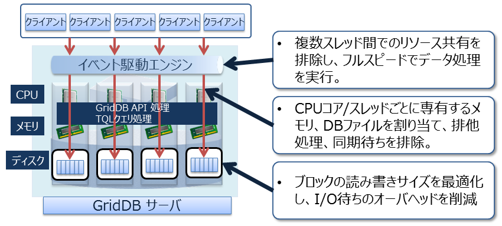
<figcaption>アーキテクチャ</figcaption>
</figure>

また、GridDBでは、クライアントライブラリ側で初回アクセス時にデータ配置をキャッシュすることで、クライアントとノード間は直接アクセス可能です。データ配置やクラスタの動作状況を管理するマスタノードを介さず、直接目的とするデータにアクセスできるので、マスタノードへのアクセス集中や、通信コストを大幅に削減できます。

<figure>

<figcaption>クライアントからのアクセス</figcaption>
</figure>

#### 並列に処理をする

GridDBでは、1つの巨大なデータを複数ノードに分散配置（パーティショニング）したノード間、およびノード内での並列処理と、少ないリソースで多くの要求を処理できるイベント駆動エンジンで、高速化を実現しています。

### 信頼性／可用性【EE限定】

クラスタ内ではデータを複製して、複数のノード上にデータ(レプリカ)を多重配置しています。レプリカの中で、マスタのデータをオーナ、複製したデータをバックアップと呼びます。クラスタを構成するいずれかのノードに障害が発生した場合でも、レプリカを使用することで処理を継続できます。ノード障害発生後のデータ再配置もシステムが自動的に行うため(自律的データ配置）、特別な運用操作は不要です。障害対象のノードに配置されていたデータはレプリカから復旧され、自動的に設定されたレプリカ数となるようにデータは再配置されます。

レプリカは、可用性の要求に応じて2重化、3重化など多重度の設定ができます。

各ノードはディスクを使用してデータ更新情報の永続化を行っています。クラスタシステムに障害が発生しても、ディスクに問題がなければ、それまで登録・更新したデータを失わずに復元することができます。

また、クライアントでもデータ配置管理情報のキャッシュを保有しているため、ノードの障害を検知すると自動的にフェイルオーバーし、レプリカを用いたデータアクセスを継続できます。

<figure>
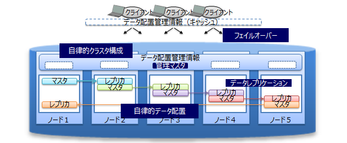
<figcaption>高可用性</figcaption>
</figure>


GridDBの製品
------------

GridDBには、以下の製品があります。

-   GridDB Community Edition (CE)
-   GridDB Enterprise Edition (EE)

上記製品は[GridDBの特徴](#griddb_features)で説明した特徴で説明した特徴に加え、
以下の2つの特徴を持ちます。

-   NewSQL インターフェース
    -   SQL92に準拠したSQLとともに、標準仕様に準拠したアプリケーションインターフェースであるODBC(C言語インターフェース)とJDBC(Javaインターフェース)を利用できます。
    -   ODBC/JDBCを利用することで、BI(Business Intelligence)ツールやETL(Extract Transfer Load)ツールからデータベースに直接アクセスすることもできます。
    -  	コンテナをテーブルとみなして操作できます。
-   テーブルパーティショニング機能
    -   巨大なテーブルを高速にアクセスするためのパーティショニング機能です。
    -   データを複数の部分に分割し、複数のノードに分散配置するため、テーブルから条件にマッチするデータを検索する処理やデータを取り出す処理の並列化を行い、データアクセスの高速化が実現できます。

<figure>

<figcaption>製品構成</figcaption>
</figure>

各インターフェースの特徴は以下のとおりです。

-   NoSQLインターフェース(NoSQL I/F)
    -   NoSQL I/FのクライアントAPI(C言語、Java)は、ビッグデータを高速に一括処理する機能に重点を置いています。
    -   データ収集やKey-Valueデータの高速なアクセス、TQLを用いた簡単な集計演算などを行う場合に利用します。
-   NewSQLインターフェース(NewSQL I/F)
    -   NewSQL I/FのODBCやJDBCは、既存アプリケーションとの連携やSQLを用いた開発生産性の向上に重点を置いています。
    -   BIツールなどを用いて収集したデータを分類し分析する場合に利用します。

GridDBでは、NoSQL I/FとNewSQL I/Fの両方を用途によって使い分けることができます。

<figure>

<figcaption>製品位置づけ</figcaption>
</figure>


同一メジャーバージョン内(マイナーバージョンアップ時)では、GridDBのデータベースおよびNoSQL/NewSQLインターフェースの互換性があります。 バージョンの表記は、以下の通りです。

-   GridDBのバージョンは「X.Y\[.Z\]」で表され、それぞれ以下を表します。
    -   メジャーバージョン(X)： 大幅な機能強化の場合に変更します。
    -   マイナーバージョン(Y)： 機能強化・追加などの場合に変更します。
    -   リビジョン(Z)： 不具合修正などの場合に変更します。

NoSQL I/FとNewSQL I/Fを併用する場合は以下の仕様をあらかじめ理解してください。

-   NoSQL I/Fで作成したコンテナは、テーブルとしてNewSQL I/Fで操作できます。 また、NewSQL I/Fで操作したテーブルは、コンテナとしてNoSQL I/Fで操作できます。
-   コンテナおよびテーブルの名称は、一意の名称である必要があります。 作成するテーブルと同じ名前のコンテナが既に存在するとエラーになります。


# 用語一覧

GridDBで利用する用語を一覧で解説します。

| 用語                           | 意味    |
|--------------------------------|------------------------------------------------------------------------|
| ノード                         | GridDBでデータ管理を行う個々のサーバプロセスを指します。                   |
| クラスタ                       | 一体となってデータ管理を行う、1つ、もしくは複数のノードの集合を指します。     |
| マスタノード                   | クラスタ管理処理を行うノードです。                                         |
| フォロワノード                 | クラスタに参加している、マスタノード以外のノードです。                       |
| 構成ノード数                   | GridDBクラスタを構成するノード数を指定します。GridDBが初回に起動する際に、クラスタが成立する閾値として用いられます。（構成ノード数のノードがクラスタに参加することでクラスタサービスが開始されます。）  |
| 有効ノード数                   | GridDBクラスタを構成するノードの内、クラスタに組み込まれた稼働中のノードの数です。 |
| ブロック                       | ブロックとは、ディスクへのデータ永続化処理（以降、チェックポイントと呼びます）のデータ単位であり、GridDBの物理的なデータ管理の最小単位です。ブロックには複数のコンテナのデータが配置されます。ブロックサイズは、GridDBの初期起動前に定義ファイル（クラスタ定義ファイル）で設定します。 |
| パーティション                 | コンテナを配置するデータ管理の単位で、データをディスクに永続化する際のファイルシステム上のデータファイルに相当します。1つのパーティションに１つのデータファイルが対応します。また、クラスタ間でのデータ配置の最小単位であり、ノード間の負荷バランスを調整するため(リバランス）や、障害発生時のデータ多重化（レプリカ）管理のためのデータ移動や複製の単位です。 |
| ロウ                           | コンテナ(テーブル)に登録される1行のデータを指します。コンテナ(テーブル)には複数のロウが登録されます。ロウは、コンテナ(テーブル)のスキーマ定義に対応したカラムの値から構成されます。   |
| コンテナ(テーブル)             | ロウの集合を管理する入れ物です。NoSQL I/Fで操作する場合はコンテナ、NewSQL I/Fで操作する場合はテーブルと呼ぶ場合があります。呼び方が異なるだけで、実体は同じオブジェクトです。コンテナには、コレクションと時系列コンテナの２種類のデータタイプが存在します。        |
| コレクション(テーブル)         | 一般の型のキーを持つロウを管理するコンテナ(テーブル)の１種です。     |
| 時系列コンテナ(時系列テーブル) | 時刻型のキーを持つロウを管理するコンテナ(テーブル)の１種です。時系列のデータを扱う専用の機能を持ちます。 |
| データベースファイル           |クラスタを構成するノードの保有するデータをディスクやSSDに書き込み、永続化したファイル群です。データベースファイルは、データファイル、チェックポイントログファイル、トランザクションログファイルの総称です。    |
| データファイル       | パーティションのデータが書き込まれたファイルです。 ノード定義ファイルのサイクル（/checkpoint/checkpointInterval）でメモリ上の更新情報が反映されます。        |
| チェックポイントログファイル       |  パーティションのブロック管理情報を格納するファイルです。ノード定義ファイルのサイクル（/checkpoint/checkpointInterval）で、ブロック管理情報の書き込みを分割で行います。 |
| トランザクションログファイル   | トランザクションの更新情報がログとして逐次保存されるファイルです。 |
| LSN（Log Sequence Number)    | パーティションごとに割り当てられる、トランザクションでの更新時の更新ログシーケンス番号です。クラスタ構成のマスタノードは、各ノードが保持している全パーティションのLSNのうちの最大数（MAXLSN)を保持しています。 |
| レプリカ                       | 複数のノードにパーティションを多重化配置することを指します。レプリカには更新されるマスタデータであるオーナと参照に利用されるバックアップがあります。       |
| オーナノード                   | パーティション内のコンテナに対して更新操作ができるノードです。複製されたコンテナのうち、マスタとなるコンテナを記録しているノードです。 |
| バックアップノード             | 複製されたコンテナのうち、バックアップのためのデータを記録しているノードです。      |
| 定義ファイル                   | クラスタを構成する際のパラメータファイル（gs_cluster.json：以降クラスタ定義ファイルと呼ぶ）とクラスタ内でのノードの動作やリソースを設定するパラメータファイル（gs_node.json：以降ノード定義ファイルと呼ぶ）の２つがあります。また、GridDBの管理ユーザのユーザ定義ファイルもあります。   |
| イベントログファイル           | GridDBサーバのイベントログが保管されるファイルです。エラーや警告などのメッセージが含まれます。                     |
| 監査ログファイル           | GridDBサーバの監査ログが保管されるファイルです。                     |
| OSユーザ（gsadm)               | GridDBの運用機能を実行できる権限を持つユーザです。GridDBインストール時にgsadmというOSのユーザが作成されます。       |
| 管理ユーザ                     | GridDBの運用操作を行うために用意されたGridDBのユーザです。         |
| 一般ユーザ                     | アプリケーションシステムで利用するユーザです。                     |
| ユーザ定義ファイル             | 管理ユーザが登録されるファイルです。初期インストールではsystem,adminの２つの管理ユーザが登録されています。               |
| クラスタデータベース           | GridDBのクラスタシステムでアクセスできるデータベース全体を総称します。                                                                            |
| データベース                   | クラスタデータベースに作成される、論理的なデータ管理の単位です。クラスタデータベース内にデフォルトではpublicというデータベースが作成されています。新規にデータベースを作成し、一般ユーザに利用権限をあたえることで、ユーザ毎のデータ分離が実現できます。                 |
| フルバックアップ               | 現在利用中のクラスタデータベースをノード定義ファイルで指定したバックアップディレクトリにオンラインでバックアップします。      |
| 差分・増分バックアップ         | 現在利用中のクラスタデータベースをノード定義ファイルで指定したバックアップディレクトリにオンラインでバックアップし、以降のバックアップでは、バックアップ後の更新ブロックの差分増分のみをバックアップします。    |
| 自動ログバックアップ           | 現在利用中のクラスタデータベースをオンラインで指定したディレクトリにバックアップするとともに、トランザクションログファイルの書き込みと同じタイミングでトランザクションログも自動で採取します。トランザクションログファイルの書き込みタイミングは、ノード定義ファイルの/dataStore/logWriteModeの値に従います。            |
| フェイルオーバ―                | 稼働中のクラスタに障害が発生した際に、バックアップノードがその機能を自動的に引き継ぎ、処理を続行する仕組みです。       |
| クライアントフェイルオーバー   | 稼働中のクラスタに障害が発生した際、クライアント側のAPIで障害時のリトライ処理としてバックアップノードに自動的に接続し直し、処理を続行する仕組みです。    |
| テーブルパーティショニング     | データ登録数が多い巨大なテーブルのデータを複数のノードに分散配置することで、複数ノードのメモリを有効に利用し、かつ複数ノードのプロセッサの並列実行を可能とし、巨大テーブルのアクセスを高速化するための機能です。             |
| データパーティション           | テーブルパーティショニングによって分割されたデータを格納する入れ物を総称します。テーブルパーティショニングされた1つのテーブルに対して、データパーティションは複数作成されます。データパーティションは、通常のコンテナと同様に各ノードに分散配置されます。データパーティションの数や格納するデータの範囲は、テーブルパーティショニングの種類(ハッシュ、インターバル、インターバル-ハッシュ)によって異なります。 |
| データアフィニティ             | 関連の強いコンテナのデータを同じブロックに配置し、データアクセスの局所化を図ることでメモリヒット率を高めるための機能です。      |
| ノードアフィニティ             | 関連の強いコンテナを同じノードに配置し、データアクセス時のネットワーク負荷を減少させるための機能です。       |


GridDBの仕組み
==============

GridDBのクラスタ動作の仕組みについて説明します。


クラスタの構成
--------------

GridDBは複数ノードで構成されるクラスタで動作します。アプリケーションシステムからデータベースにアクセスするにはノードが起動されており、かつクラスタが構成(クラスタサービスが実行)されている必要があります。

クラスタは、ユーザが指定した構成ノード数のノードがクラスタへ参加することで構成され、クラスタサービスが開始されます。構成ノード数のノードがクラスタに参加するまでクラスタサービスは開始されず、アプリケーションからはアクセスできません。

ノード1台で動作させる場合にも、クラスタを構成する必要があります。この場合構成ノード数を1台でクラスタを構成することになります。ノード1台で動作させる構成をシングル構成と呼びます。

<figure>

<figcaption>クラスタ名と構成ノード数</figcaption>
</figure>


ネットワーク上にあるGridDBの多数のノードを用いて、正しく（意図したノードを用いて）クラスタが構成できるよう、クラスタ名を使って複数のクラスタを区別します。これにより、同じネットワーク上に複数のGridDBクラスタが構成できます。
クラスタは、クラスタ名、構成ノード数、接続方式の設定が等しいノードで構成されます。クラスタ名は、クラスタを構成するノード毎に保有するクラスタ定義ファイルに設定するとともに、クラスタ構成する際のパラメータでも指定します。

マルチキャストを用いてクラスタを構成する方式をマルチキャスト方式と呼びます。クラスタ構成方式については、[クラスタ構成の検討](#cluster_configuration_methods)を参照してください。

以下にクラスタ構成の操作の流れを示します。

<figure>
  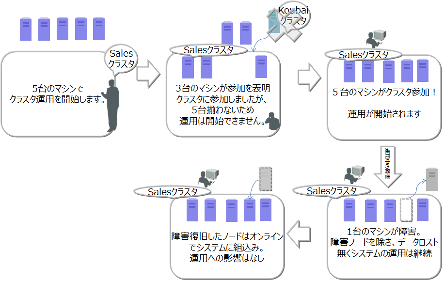
  <figcaption>クラスタ構成の動作</figcaption>
</figure>

ノードの起動、クラスタの構成には、[運用コマンド](#operating_commands)のgs_startnode/gs_joinclusterコマンドや[gs_sh](#label_gs_sh)を用います。また、OS起動と同時にノードを起動し、クラスタを構成するサービス制御機能もあります。


クラスタを構成するには、クラスタに参加させるノードの数（構成ノード数）とクラスタ名をすべての参加ノードで一致させる必要があります。

クラスタサービスは、クラスタでの運用開始後に構成するノードに障害がありクラスタからノードが切り離された場合でも、過半数のノードが参加している限りサービスは継続します。

過半数以上のノードさえ動作していればクラスタ運用は継続できるので、クラスタ運用中にメンテナンス等のために、オンラインでノード切り離したり、メンテナンス完了後にノードを組込む操作ができます。さらには、システムを増強するためにノードを追加することもオンラインでできます。

### ノードのステータス

ノードには、ノードの状態を表す複数の種類のステータスがあります。ユーザのコマンド実行やノードの内部処理によってステータスが遷移します。[クラスタのステータス](#status_of_cluster)は、クラスタに属する複数のノードのノードステータスによって決まります。

ノードステータスの種類と遷移、確認方法を説明します。

- ノードステータスの種類

  | ノードステータス  | 説明                                 |
  |-----------|----------------------------------------------|
  | STOP      | ノードでGridDBサーバが起動されていない状態です。 |
  | STARTING  | ノードでGridDBサーバが起動処理中の状態です。前回の運転状態に応じて、データベースのリカバリ処理などの起動時の処理が行われます。クライアントからアクセスできるのは、gs_statコマンドやgs_shコマンドでのシステムの状態確認のみです。アプリケーションからのアクセスはできません。 |
  | STARTED   | ノードでGridDBサーバが起動されている状態です。ただし、クラスタには参加していないため、引き続きアプリケーションからのアクセスはできません。クラスタを構成するには、gs_joinclusterやgs_shのクラスタ操作コマンドでクラスタへの参加を指示します。 |
  | WAIT      | クラスタ構成待ちの状態です。ノードはクラスタへの参加を通知しているが、構成ノード数のノードが足りておらず、ノード数が構成ノード数になるまで待ち状態となります。また、クラスタを構成するノードが過半数以下になり、クラスタのサービスが停止した際のノード状態もWAIT状態になります。 |
  | SERVICING | クラスタが構成されており、アプリケーションからのアクセスが可能な状態です。ただし、ノード停止時の障害後の再起動などでパーティションのクラスタ間での同期処理が発生した場合、アクセスが遅延することがあります。 |
  | STOPPING  | ノードを停止指示後、停止するまでの中間ステータスです。 |
  | ABNORMAL  | SERVICING状態もしくは、状態遷移の途中でノードがエラーを検出した際のステータスです。ABNORMAL状態となったノードは、自動的にクラスタから切り離されます。システムの動作情報を採取してから、ABNORMAL状態のノードを強制停止・再起動する必要があります。再起動することで、リカバリ処理が自動的に行われます。|

- ノードステータスの遷移

  <figure>
    
    <figcaption>ノードステータス</figcaption>
  </figure>

  | ステータス遷移  | 状態遷移事象 | 説明                                                                   |
  |----------------|-------------|-----------------------------------------------------------------------|
  | 　　 ①         | コマンド実行 | ノード起動(gs_startnodeコマンド、gs_sh、サービス起動などのコマンド実行)     |
  | 　　 ②         | システム     | リカバリ処理やデータベースファイルのロードが完了すると、状態は自動遷移       |
  | 　　 ③         | コマンド実行 | クラスタ参加(gs_joincluster/gs_appendclusterコマンド、gs_sh、サービス起動などのコマンド実行)   |
  | 　　 ④         | システム     | 構成ノード数のノードがクラスタに参加すると状態は自動遷移                  |
  | 　　 ⑤         | システム     | クラスタを構成する他のノードが障害等によりサービスから切り離され、構成ノード数が設定値の過半数を下回った時に、状態が自動遷移 |
  | 　　 ⑥         | コマンド実行 | ノードをクラスタから切り離す(gs_leaveclusterコマンドやgs_shなどのコマンド実行) |
  | 　　 ⑦         | コマンド実行 | ノードをクラスタから切り離す(gs_leavecluster/gs_stopclusterコマンドやgs_shなどのコマンド実行)   |
  | 　　 ⑧         | コマンド実行 | ノード停止(gs_stopnodeコマンド、gs_sh、サービス停止などのコマンド実行)      |
  | 　　 ⑨         | システム     | 終了処理が完了次第、サーバプロセスを停止                                   |
  | 　　 ⑩         | システム     | システム障害により切り離された状態。この状態では一度ノードを強制的に停止する必要がある。  |


- ノードステータスの確認方法

  ノードステータスは、ノードの稼働状況とノードの役割の2つの状態の組み合わせによって決まります。

  ノードのステータスは[gs_sh](#label_gs_sh)や[gs_admin](#integrated_operation_control)で確認できます。

  ノードの稼働状況とノードの役割は、gs_statコマンドを実行した結果のjson形式のデータから確認できます。（ノードの稼働状況：/cluster/nodeStatusの値、ノードの役割：/cluster/clusterStatusの値)

  ノードステータスと、ノードの稼働状況とノードの役割の2つの状態の組み合わせを以下に示します。

  | ノードステータス | ノードの稼働状況<br>(/cluster/nodeStatus)  | ノードの役割<br>(/cluster/clusterStatus) |
  |------------|------------------------------|------------------------|
  | STOP       | －(gs_statの接続エラー)       | －(gs_statの接続エラー)    |
  | STARTING   | INACTIVE                     | SUB_CLUSTER            |
  | STARTED    | INACTIVE                     | SUB_CLUSTER            |
  | WAIT       | ACTIVE                       | SUB_CLUSTER           |
  | SERVICING  | ACTIVE                       | MASTERまたはFOLLOWER   |
  | STOPPING   | NORMAL_SHUTDOWN              | SUB_CLUSTER           |
  | ABNORMAL   | ABNORMAL                     | SUB_CLUSTER           |

  - ノードの稼働状況

    ノードの稼働状況を表します。gs_statコマンドの/cluster/nodeStatusの値で確認できます。

    | ノードの稼働状況  |  説明                   |
    |------------------|------------------------|
    | ACTIVE           | アクティブ状態          |
    | ACTIVATING       | アクティブ状態に遷移中   |
    | INACTIVE         | 非アクティブ状態        |
    | DEACTIVATING     | 非アクティブ状態に遷移中 |
    | NORMAL_SHUTDOWN  | シャットダウン処理中     |
    | ABNORMAL         | 異常状態                |

  - ノードの役割

    ノードの役割を表します。gs_statコマンドの/cluster/clusterStatusの値で確認できます。

    ノードには「マスタ」と「フォロワ」という二つの役割があります。
    クラスタが開始する時には、クラスタを構成するノードのひとつが必ず「マスタ」になります。マスタはクラスタ全体の管理を行います。
    マスタ以外のノードはすべて「フォロワ」になります。フォロワは、マスタからの指示に基づいて同期などのクラスタ処理を行います。

    | ノードの役割                 |  説明     |
    |-----------------------------|-----------|
    | MASTER                      | マスタ     |
    | FOLLOWER                    | フォロワ   |
    | SUB_CLUSTER/SUB_MASTER      | 役割未定   |

<a id="status_of_cluster"></a>

### クラスタのステータス

クラスタの稼働ステータスは各ノードの状態で決まり、そのステータスには稼働／中断／停止の3つの種類があります。

クラスタのサービスは、システムの初回構築時においては、ユーザが指定したクラスタ構成するノード数（構成ノード数）のノードがすべてクラスタに参加した時点で開始されます。

初回のクラスタ構築時、クラスタを構成するノードがすべてクラスタに組み入れられておらず、クラスタ構成待ちの状態が【INIT_WAIT】状態です。構成ノード数のノードがクラスタに参加完了した時点で状態は自動遷移し稼働状態となります。

稼働状態には【STABLE】と【UNSTABLE】の2つの状態があります。

-   【STABLE】状態
    -   構成ノード数で指定したノードの数でクラスタが構成されており、サービスが提供できている安定した状態。
-   【UNSTABLE】状態
    -   構成ノード数に満たない状態で、かつ、構成ノード数の過半数が稼働している状態
    -   構成ノード数の過半数が稼働している限り、クラスタのサービスは継続します。

メンテナンスなどでノードをクラスタより切り離しても、構成ノード数の過半数が動作している限りクラスタは【UNSTABLE】状態で運用できます。

クラスタを構成するノードが、構成ノード数の半数以下となった場合、スプリットブレイン発生を防ぐためにクラスタは自動的にサービスを中断します。クラスタのステータスは【WAIT】状態となります。

-   スプリットブレインとは、

    複数のノードを相互接続して1台のサーバのように動作させる密結合クラスタシステムにおいて、ハードウェアやネットワークの障害によりシステムが分断されたことを契機に、同じ処理を行う複数のクラスタシステムが同時にサービスを提供してしまう動作をいいます。この状態で運用を継続した場合、複数のクラスタでレプリカとして保有するデータをマスタデータとして動作してしまい、データの一貫性が取れない状態となってしまいます。

【WAIT】状態からクラスタサービスを再開するには、エラーの回復したノードや新規のノードをノード追加操作でクラスタへ追加していきます。 再び構成ノード数のノードがクラスタに参加完了した時点で状態は【STABLE】状態となり、サービスが再開されます。

ノードの障害等でクラスタを構成するノード数が半数以下となり、クラスタのサービスが中断した場合でも、ノード追加操作でエラーの回復したノードや新規のノードをクラスタへ追加していき過半数のノードがクラスタに参加した時点で自動的にクラスタのサービスは再開されます。

<figure>
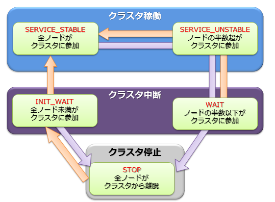
<figcaption>クラスタステータス</figcaption>
</figure>

STABLE状態はgs_statの示すjsonのパラメータである、/cluster/activeCountと/cluster/designatedCountの値が等しい状態です。（出力される内容はバージョンによって異なります。）

``` example
$ gs_stat -u admin/admin
{
    "checkpoint": {
　　　　　：
　　　　　：
    },
    "cluster": {
        "activeCount":4,　　　　　　　　　　　 ★ クラスタ内で稼働中のノード
        "clusterName": "test-cluster",
        "clusterStatus": "MASTER",
        "designatedCount": 4,                  ★ 構成ノード数
        "loadBalancer": "ACTIVE",
        "master": {
            "address": "192.168.0.1",
            "port": 10040
        },
        "nodeList": [　　　　　　　　　　　　　★　クラスタを構成するマシンリスト
            {
                "address": "192.168.0.1",
                "port": 10040
            },
            {
                "address": "192.168.0.2",
                "port": 10040
            },
            {
                "address": "192.168.0.3",
                "port": 10040
            },
            {
                "address": "192.168.0.4",
                "port": 10040
            },

        ],
        ：
        ：
```

クラスタのステータスは、[gs_sh](#label_gs_sh)や[gs_admin](#integrated_operation_control)で確認できます。以下にgs_shでのクラスタステータスの確認例を示します。

``` example
$ gs_sh
gs> setuser admin admin gsadm                  //接続ユーザの設定
gs> setnode node1 192.168.0.1 10040            //クラスタを構成するノードの定義
gs> setnode node2 192.168.0.2 10040
gs> setnode node3 192.168.0.3 10040
gs> setnode node4 192.168.0.4 10040
gs> setcluster cluster1 test150 239.0.0.5 31999 $node1 $node2 $node3 $node4 　//クラスタの定義
gs> startnode $cluster1                        //クラスタを構成する全ノードの起動
gs> startcluster $cluster1                     //クラスタ構成を指示
クラスタの開始を待っています。
クラスタが開始しました。
gs> configcluster  $cluster1                      ★クラスタのステータスを確認
Name                  : cluster1
ClusterName           : test-cluster
Designated Node Count : 4
Active Node Count     : 4
ClusterStatus         : SERVICE_STABLE　　　　　　★安定状態

Nodes:
  Name    Role Host:Port              Status
-------------------------------------------------
  node1     M  192.168.0.1:10040    SERVICING
  node2     F  192.168.0.2:10040    SERVICING
  node3     F  192.168.0.3:10040    SERVICING
  node4     F  192.168.0.4:10040    SERVICING

gs> leavecluster $node2
ノードがクラスタから離脱するのを待っています。
ノードがクラスタから離脱しました。
gs> configcluster  $cluster1
Name                  : cluster1
ClusterName           : test150
Designated Node Count : 4
Active Node Count     : 3
ClusterStatus         : SERVICE_UNSTABLE　　　　　★不安定な状態

Nodes:
  Name    Role Host:Port              Status
-------------------------------------------------
  node1     M  192.168.0.1:10040    SERVICING　　　　//マスタノード
  node2     -  192.168.0.2:10040    STARTED　　　　　
  node3     F  192.168.0.3:10040    SERVICING　　　　//フォロワノード
  node4     F  192.168.0.4:10040    SERVICING　　　　//フォロワノード
```

### パーティションのステータス

パーティションステータスは、クラスタ上のパーティション全体の状態を表します。
クラスタステータスが稼働状態の時に、パーティションにアクセスできる状態か、パーティションに偏りが無いかなどを表すステータスです。

| パーティションステータス | 説明 |
|--------------|----------------|
| NORMAL       | すべてのパーティションがデータ配置目標と同一の正常な状態 |
| NOT_BALANCE  | レプリカロスやオーナロスは発生していないが、パーティションの配置が偏っている状態 |
| REPLICA_LOSS | レプリカのデータが欠損しているパーティションが存在する状態<br>（該当パーティションの可用性が落ちている・ノード離脱できない） |
| OWNER_LOSS   | オーナのデータが欠損しているパーティションが存在する状態<br>（該当パーティションのデータにはアクセスできない）      |
| INITIAL      | クラスタ構成に参加していない初期状態 |

パーティションステータスは、マスタノードへのgs_statコマンドの実行で確認できます。（/cluster/partitionStatusの値）

```example
$ gs_stat -u admin/admin
{
　　：
　　：
"cluster": {
    ：
    "nodeStatus": "ACTIVE",
    "notificationMode": "MULTICAST",
    "partitionStatus": "NORMAL",
    ：
```

[メモ]
- マスタノード以外の/cluster/partitionStatusの値は、正しくない場合があります。必ずマスタノードの値を確認してください。

<a id="cluster_configuration_methods"></a>

クラスタ構成の検討
----------------

クラスタ構成を行う際には以下の検討が必要となります。
 - クラスタを構成するノード間および、クラスタとクライアント間の構成方式を決定します。接続方式は、マルチキャスト方式、固定リスト方式、プロバイダ方式の3つの方式から選択します。
 - クラスタとクライアント間の通信において、複数通信経路が必要かどうかを決定し、必要に応じて設定します。
 - 可用性レベルに応じてクラスタのレプリカ数を設定します。アベイラビリティゾーン単位での障害耐性が必要な場合はラックゾーンアウェアネス機能を有効にします。

### クラスタ構成方式

クラスタ構成方式とは、クラスタを構成するノード間、およびクラスタとクライアント間の通信において、それぞれのアドレスリストを認識して通信を行うための構成方式であり、以下の3つが提供されます。

-   マルチキャスト方式
    -   マルチキャストを用いてクラスタを構成するノードのディスカバリを行うことで、アドレスリストを認識する方式です。
-   固定リスト方式
    -   クラスタ定義ファイルにクラスタを構成する固定のアドレスリストを指定して起動することで、アドレスリストを認識する方式です。
-   プロバイダ方式
    -   アドレスプロバイダが提供するアドレスリストに従ってアドレスリストを認識する方式です。
    -   アドレスプロバイダはWebサービスとして構成するか、静的コンテンツとして構成することができます。

<figure>

</figure>

クラスタ構成方式の比較は以下のとおりです。

| 項目         | マルチキャスト方式             | 固定リスト方式                                 | プロバイダ方式          |
|--------------|------------------------------------|-----------------------------------------------|-----------------------|
| 設定         | ・マルチキャストアドレス、ポート      | ・全ノードのIPアドレス、ポート番号のリスト           | ・プロバイダURL        |
| 利用ケース   | ・マルチキャストが利用できる。          | ・マルチキャストが利用できない。<br>・正確にシステム規模の見積りが行える | ・マルチキャストが利用できない。<br>・システム規模が見積もれない。        |
| クラスタ動作 | ・一定時間間隔でノードの自動ディスカバリを行う。 | ・全ノードに同一のアドレスリストを設定する。<br>・ノード起動時に1度だけそのリストを読み込む。 | ・アドレスプロバイダから一定時間間隔でアドレスリストを取得する。 |
| メリット     | ・ノード追加のためのクラスタ再起動不要。      | ・リストの整合性チェックが行われるため、間違いが無い。<br> 現在のクラスタ構成ノードの把握が容易。| ・ノード追加のためのクラスタ再起動不要。    |
| デメリット   | ・クラウド環境でマルチキャスト利用不可の場合が多い。<br>セグメントを超えた通信が行えない。 | ・ノード追加にクラスタ再起動が必要。<br>・アプリ側の接続設定の更新も必要。 | ・アドレスプロバイダの可用性確保が必要。     |


### 複数通信経路

GridDBクラスタはクライアントに対する複数の通信経路を設定することができます。デフォルトのクラスタ-クライアント間の通信経路は、クラスタノード間の通信経路と共通のものとなりますが、複数通信経路設定を行うと、これとは別の通信経路を用いた接続が可能となります。この通信経路を外部通信経路と呼びます。
クライアントはどちらの通信経路を利用するかを個別に指定することが可能となります。

<figure>

</figure>

このような複数通信経路を用いたネットワーク構成は以下のような場合に用いられます。
- クラウド外にあるユーザのオンプレミス環境から、クラウド上で提供されるGridDBサービスを外部通信経路を用いて直接参照、操作を行うことにより、利便性を向上させたい。
- クラウド外にあるユーザのオンプレミス環境からの利用だけでなく、クラウド内の環境からデフォルトの通信経路を利用した高速なアプリケーション処理を実現したい。

### ラックゾーンアウェアネス

GridDBは、ラックやアベイラビリティゾーンなどの物理的な構成グループ単位の障害が発生した場合の可用性を向上させる、ラックゾーンアウェアネス機能を提供します。
あるデータのオーナとバックアップがともに同じ構成グループに配置されていると、そのグループに障害が発生した場合にはそのデータへのアクセスができなくなります。
ラックゾーンアウェアネス機能を利用すると、クラスタのノードが属するグループを事前に定義しておくことができ、GridDBは、その定義を参照し、オーナとバックアップを別グループに配置するように制御します。
これにより、あるグループに障害が発生した場合でも、別のグループにデータのバックアップがあるため、データへのアクセスが可能になります。
また、この際、オーナとバックアップが各グループ、各ノードにできるだけ均等に配置されるような割り当てが行われます。

ラックゾーンアウェネス機能は、ラックやアベイラビリティゾーンなどの構成グループを利用できる場合に、効果的に可用性を高める機能です。
一般的に可用性を向上させるにはレプリカ数を多く設定する必要がありますが、レプリカ数を増やすとトランザクション性能が劣化するトレードオフ関係が発生します。
ラックゾーンアウェアネス機能はグループ単位での障害に備えて配置を優先して計算します。
そのため、構成グループを利用できる場合には、レプリカ数を抑えつつ(トランザクション性能を維持しつつ)可用性を向上することができます。
この機能を利用するには、設定ファイルにラックゾーンに関する設定を行う必要があります。これ以外の特別な運用操作は必要ありません。

ノード数=6, グループ数＝3，パーティション数=6, レプリカ数=2でクラスタを構成した場合のデータ配置の違いを説明します。
（下図ではクラウドのアベイラビリティゾーン(AZ)を使用した例を示しています。）
下図の左側がラックゾーンアウェネス機能を利用した場合、右側がラックゾーンアウェネス機能を利用しない通常のデータ配置です。

<figure>

</figure>

右側のラックゾーンアウェアネス機能なしの場合、データのオーナとバックアップが同一AZ内に配置されることがありえます。
例えば、AZ1のGridDB2には、クラスタパーティション4のデータのオーナ(青)が配置されています。
同時に、このクラスタパーティション4のデータのバックアップ(橙)は、同じAZ1のGridDB1に配置されています。
このようなデータ配置では、AZ1に障害が発生した場合、このクラスタパーティション4のデータにアクセスできなくなります。
一方、左側のラックゾーンアウェアネス機能ありの場合は、このような配置にならないことを保証します。
例えば、クラスタパーティション4のデータのオーナ(青)はAZ1に配置されています。
同時に、このデータのバックアップ(橙)は、AZ1とは別のAZ2に配置されています。他のクラスタパーティションのデータについても同様です。

このように、ラックゾーンアウェアネス機能は、全てのクラスタパーティションデータのオーナとバックアップを別々のAZに配置することで、
どのAZに障害が発生したとしても、全てのクラスタパーティションのデータにアクセスできるようにします。
ただし、同一ラックゾーンに対する配置を抑制するため、各ノードのオーナ、バックアップの割当て個数には若干偏りが生じる場合があります。
また、障害発生からクラスタ安定状態（データ同期処理が発生する時間）になるまでの時間も若干増加する傾向がありますが、
GridDBではこれらデータ偏りや安定状態までの時間をできるだけラックゾーンアウェアネス無の場合と大きな違いがないように最適化します。

### 設定方法

#### クラスタ構成方法

　クラスタ構成方法として、マルチキャスト方式、固定リスト方式、プロバイダ方式の3つの方式があり、これらをクラスタを構成するノード間、クラスタとクライアント間の個別に設定することになりますが、以下は前者の設定のみを記載します。後者の設定は、各種クライアントのAPIリファレンスを参照してください。

##### マルチキャスト方式

　マルチキャストアドレスを与えてノードを起動することで、マルチキャストを利用したクラスタを構成します。マルチキャストはクラスタ、トランザクション、SQLの3つのサービスに対して定義しますが、クラスタサービスとしてマルチキャストを選択した場合は、トランザクション、SQLサービスも必ずマルチキャスト方式にする必要があります。

　マルチキャスト方式でクラスタを構成する場合は、クラスタ定義ファイルのパラメータを設定します。

**クラスタ定義ファイル**

| パラメータ                  | データ型 | 意味                                                                     |
|-----------------------------|----------|--------------------------------------------------------------------------|
| /cluster/notificationAddress | string   | クラスタ構成に必要なマルチキャストのIPアドレスを指定します。 |
| /cluster/notificationPort | int   | クラスタ構成に必要なマルチキャストのポート番号を指定します。 |
| /transaction/notificationAddress | string   | クライアントとのトランザクション処理に必要なマルチキャストのIPアドレスを指定します。 |
| /transaction/notificationPort | int   | クライアントとのトランザクション処理に必要なマルチキャストのポート番号を指定します。 |
| /sql/notificationAddress | string   | クライアントとのSQL処理に必要なマルチキャストのIPアドレスを指定します。 |
| /sql/notificationPort | int   | クライアントとのSQL処理に必要なマルチキャストのポート番号を指定します。 |
　

　マルチキャストが利用できない場合は固定リスト、もしくはプロバイダ方式を利用して下さい。

``` example
{
                             :
                             :
    "cluster":{
        "clusterName":"yourClusterName",
        "replicationNum":2,
        "heartbeatInterval":"5s",
        "loadbalanceCheckInterval":"180s",
        "notificationAddress":"239.0.0.1",
    		"notificationPort":20000        
    },
    "transaction":{
      "notificationAddress":"239.0.0.1",
  		"notificationPort":31999
    },
    "sql":{
      "notificationAddress":"239.0.0.1",
  		"notificationPort":41999
    }
    :
    :    
}
```

##### 固定リスト方式

固定のアドレスリストを与えてノードを起動することで、そのリストを利用してクラスタを構成します。

固定リスト方式でクラスタを構成する場合は、クラスタ定義ファイルのパラメータを設定します。

**クラスタ定義ファイル**

| パラメータ                  | データ型 | 意味                                                                     |
|-----------------------------|----------|--------------------------------------------------------------------------|
| /cluster/notificationMember | string   | クラスタ構成方式を固定リスト方式にする際に、アドレスリストを指定します。 |

/cluster/notificationMemberの要素は各サービスごとに以下を記述します。
 "サービス名":{"address"}:"IPアドレス","port":ポート番号

 /cluster/notificationMember中の要素は以下の通りとなります。
 複数接続経路を用いる場合、 transactionPublicおよびsqlPublicの項目を追加して、それぞれの外部接続用IPアドレス、ポート番号を記述します。
 これらIPアドレスはノード起動時にノード定義ファイルで設定するtransaction/sqlのpublicServiceAddressと同じにする必要があります。また、ポート番号はtransaction/sqlのservicePortと同じにする必要があります。

 | パラメータ                  | データ型 | 意味                                                                     |
 |-----------------------------|----------|--------------------------------------------------------------------------|
 | /cluster/address | string   | クラスタサービス通信用のIPアドレスを指定します。 |
 | /cluster/port | int   | 上記のポート番号を指定します。 |
 | /sync/address | string   | シンクサービス通信用のIPアドレスを指定します。 |
 | /sync/port | int   | 上記のポート番号を指定します。 |
 | /system/address | string   | システムサービス通信用のIPアドレスを指定します。 |
 | /system/port | int   | 上記のポート番号を指定します。 |
 | /transaction/address | string   | デフォルト通信経路となるトランザクションサービス通信用のIPアドレスを指定します。 |
 | /transaction/port | int   | 上記のポート番号を指定します。 |
 | /sql/address | string   | デフォルト通信経路となるSQLサービス通信用のIPアドレスを指定します。 |
 | /sql/port | int   | 上記のポート番号を指定します。 |
 | /transactionPublic/address | string   | 外部通信経路となるトランザクションサービス通信用のIPアドレスを指定します。 |
 | /transactionPublic/port | int   | 上記のポート番号を指定します。 |
 | /sqlPublic/address | string   | 外部通信経路となるSQLサービス通信用のIPアドレスを指定します。 |
 | /sqlPublic/port | int   | 上記のポート番号を指定します。 |

デフォルトの通信経路を用いる場合のクラスタ定義ファイルの設定例は以下のとおりです。

``` example
{
                             :
                             :
    "cluster":{
        "clusterName":"yourClusterName",
        "replicationNum":2,
        "heartbeatInterval":"5s",
        "loadbalanceCheckInterval":"180s",
        "notificationMember": [
            {
                "cluster": {"address":"172.17.0.44", "port":10010},
                "sync": {"address":"172.17.0.44", "port":10020},
                "system": {"address":"172.17.0.44", "port":10040},
                "transaction": {"address":"172.17.0.44", "port":10001},
                "sql": {"address":"172.17.0.44", "port":20001}
            },
            {
                "cluster": {"address":"172.17.0.45", "port":10010},
                "sync": {"address":"172.17.0.45", "port":10020},
                "system": {"address":"172.17.0.45", "port":10040},
                "transaction": {"address":"172.17.0.45", "port":10001},
                "sql": {"address":"172.17.0.45", "port":20001}
            },
            {
                "cluster": {"address":"172.17.0.46", "port":10010},
                "sync": {"address":"172.17.0.46", "port":10020},
                "system": {"address":"172.17.0.46", "port":10040},
                "transaction": {"address":"172.17.0.46", "port":10001},
                "sql": {"address":"172.17.0.46", "port":20001}
            }
        ]
    },
                             :
                             :
}
```


##### プロバイダ方式【EE限定】

アドレスプロバイダが提供するアドレスリストを取得してクラスタ構成を行います。

プロバイダ方式でクラスタを構成する場合は、クラスタ定義ファイルのパラメータを設定します。

**クラスタ定義ファイル**

| パラメータ                                   | データ型 | 意味            |
|----------------------------------------------|----------|---------------|
| /cluster/notificationProvider/url            | string   | クラスタ構成方式をプロバイダ方式にする際に、アドレスプロバイダのURLを指定します。                     |
| /cluster/notificationProvider/updateInterval | string   | アドレスプロバイダからリストを取得する間隔を指定します。1s以上、2<sup>31</sup>s未満の値を指定します。 |

プロバイダが返却するノードリストの書式は固定リストの規則と同じになります。

クラスタ定義ファイルの設定例は以下のとおりです。

``` example
{
                             :
                             :
    "cluster":{
        "clusterName":"yourClusterName",
        "replicationNum":2,
        "heartbeatInterval":"5s",
        "loadbalanceCheckInterval":"180s",
        "notificationProvider":{
            "url":"http://example.com/notification/provider",
            "updateInterval":"30s"
        }
    },
                             :
                             :
}
```

アドレスプロバイダはWebサービスとして構成するか、静的コンテンツとして構成することができます。 アドレスプロバイダは以下の仕様を満たす必要があります。

-   GETメソッドに対応。
-   URLにアクセスすると、そのURLが書かれたクラスタ定義ファイルを持つクラスタのノードのアドレスリストをレスポンスとして返す。
    -   レスポンスボディ：固定リスト方式において指定するノードリストの内容と同等のJSON
    -   レスポンスヘッダ：Content-Type:application/jsonを含む

アドレスプロバイダからのレスポンスの例は以下のとおりです。複数通信経路を設定した場合は、transactionPublicおよびsqlPublicの記載も必要となります。

``` example
$ curl http://example.com/notification/provider
[
    {
        "cluster": {"address":"172.17.0.44", "port":10010},
        "sync": {"address":"172.17.0.44", "port":10020},
        "system": {"address":"172.17.0.44", "port":10040},
        "transaction": {"address":"172.17.0.44", "port":10001},
        "sql": {"address":"172.17.0.44", "port":20001}
    },
    {
        "cluster": {"address":"172.17.0.45", "port":10010},
        "sync": {"address":"172.17.0.45", "port":10020},
        "system": {"address":"172.17.0.45", "port":10040},
        "transaction": {"address":"172.17.0.45", "port":10001},
        "sql": {"address":"172.17.0.45", "port":20001}
    },
    {
        "cluster": {"address":"172.17.0.46", "port":10010},
        "sync": {"address":"172.17.0.46", "port":10020},
        "system": {"address":"172.17.0.46", "port":10040},
        "transaction": {"address":"172.17.0.46", "port":10001},
        "sql": {"address":"172.17.0.46", "port":20001}
    }
]
```

【メモ】
-   クラスタ定義ファイルの/cluster/notificationAddress、/cluster/notificationMember、/cluster/notificationProviderは、使用するクラスタ構成方式に合わせていずれか1つを設定してください。

#### 複数通信経路

　GridDBクラスタにおいて複数通信経路を有効にするには、クラスタを構成する各ノードにおけるノード定義ファイルで外部通信経路のIPアドレスを指定してクラスタを構成します。ポート番号はservicePortに記載した値と共通のものになるため新たな記載は必要ありません。

**ノード定義ファイル**

| パラメータ                                   | データ型 | 意味            |
|----------------------------------------------|----------|---------------|
| /transaction/publicServiceAddress            | string   | トランザクションサービス外部通信経路に対応するIPアドレスを指定します。  |
| /sql/publicServiceAddress            | string   | SQLサービス外部通信経路に対応するIPアドレスを指定します。 |


ノード定義ファイルの設定例は以下のとおりです。

``` example
{
                             :
                             :

    "transaction":{
        "serviceAddress":"172.17.0.44",
        "publicServiceAddress":"10.45.1.10",        
        "servicePort":10001
    },      
    "sql":{
      "serviceAddress":"172.17.0.44",
      "publicServiceAddress":"10.45.1.10",      
      "servicePort":20001
    },
    :
    :    
```

複数通信経路を有効にする場合のノードリストのサンプルは以下になります。

``` example
{
                             :
                             :
    "cluster":{
        "clusterName":"yourClusterName",
        "replicationNum":2,
        "heartbeatInterval":"5s",
        "loadbalanceCheckInterval":"180s",
        "notificationMember": [
            {
                "cluster": {"address":"172.17.0.44", "port":10010},
                "sync": {"address":"172.17.0.44", "port":10020},
                "system": {"address":"172.17.0.44", "port":10040},
                "transaction": {"address":"172.17.0.44", "port":10001},
                "sql": {"address":"172.17.0.44", "port":20001},
                "transactionPublic": {"address":"10.45.1.10", "port":10001},
                "sqlPublic": {"address":"10.45.1.10", "port":20001}
            },
            {
                "cluster": {"address":"172.17.0.45", "port":10010},
                "sync": {"address":"172.17.0.45", "port":10020},
                "system": {"address":"172.17.0.45", "port":10040},
                "transaction": {"address":"172.17.0.45", "port":10001},
                "sql": {"address":"172.17.0.45", "port":20001},
                "transactionPublic": {"address":"10.45.1.11", "port":10001},
                "sqlPublic": {"address":"10.45.1.11", "port":20001}
            },
            {
                "cluster": {"address":"172.17.0.46", "port":10010},
                "sync": {"address":"172.17.0.46", "port":10020},
                "system": {"address":"172.17.0.46", "port":10040},
                "transaction": {"address":"172.17.0.46", "port":10001},
                "sql": {"address":"172.17.0.46", "port":20001},
                "transactionPublic": {"address":"10.45.1.12", "port":10001},
                "sqlPublic": {"address":"10.45.1.12", "port":20001}
            }
        ]
    },
                             :
                             :
}
```

#### ラックゾーンアウェアネス

**クラスタ定義ファイル**

| パラメータ                  | データ型 | 意味                                                                     |
|-----------------------------|----------|--------------------------------------------------------------------------|
| /cluster/rackZoneAwareness | bool   | ラックゾーンアウェイアウェアネス機能を利用したデータ配置戦略を行うかどうかを指定します。利用する場合はtrueとしてrackZoneIdを必ず指定してください。|
| /cluster/rackZoneId | string   | ラックゾーンアウェアネス機能で必要となる、グルーピング単位に付与する識別子です。1以上64文字以内の英数字となります。|

ノード定義ファイルの設定の例は以下の通りです。

``` example
{
                             :
                             :
    "cluster":{
        "servicePort":10010
        "rackZoneAwareness":true,
        "rackZoneId":"zone-01",
    },
                             :
                             :
}
```

<a id="data_model"></a>
# データモデル

GridDBは、Key-Valueに似た独自のKey-Container型データモデルです。以下の特徴があります。
-   Key-Valueをグループ化するコンテナというRDBのテーブルに似た概念を導入
-   コンテナに対してデータ型を定義するスキーマ設定が可能。カラムにインデックスを設定可能。
-   コンテナ内のロウ単位でトランザクション操作が可能。また、コンテナ単位でACIDを保証します。

<figure>

<figcaption>データモデル</figcaption>
</figure>

GridDBのデータは、ブロック、コンテナ、テーブル、ロウ、パーティションという単位でデータ管理されています。


-   ブロック

    ブロックとは、ディスクへのデータ永続化処理（以降、チェックポイントと呼びます）のデータ単位であり、GridDBの物理的なデータ管理の最小単位です。
    ブロックには複数のコンテナのデータが配置されます。ブロックサイズは、GridDBの初期起動前に定義ファイル（クラスタ定義ファイル）で設定します。

    GridDBは、システムの初期起動とともにデータベースファイルが作成されるため、初期起動以降ブロックサイズの変更はできません。

-   コンテナ（テーブル）

    利用者とのI/Fとなるデータ構造です。 複数のブロックで構成されます。 NoSQL I/Fで操作する場合はコンテナ、NewSQL I/Fで操作する場合はテーブルと呼びます。コンテナ（テーブル）には、コレクション（テーブル）と時系列コンテナ（時系列テーブル）の２種類のデータタイプが存在します。

    アプリケーションでデータを登録する前には、必ずコンテナ（テーブル）を作成しておく必要があります。

-   ロウ

    ロウは、コンテナやテーブルに登録される1行のデータを指します。コンテナやテーブルには複数のロウが登録されますが、データは同じブロックに配置されるわけではありません。登録・更新されるタイミングに応じて、パーティション内の適切なブロックに配置されます。

    ロウは複数のデータ型のカラムから構成されます。

-   パーティション

    パーティションは、1つ以上のコンテナやテーブルを含むデータ管理の単位です。

    パーティションはクラスタ間でのデータ配置の単位であり、ノード間の負荷バランスを調整するためのデータ移動や、障害発生に備えたデータ多重化（レプリカ）管理のための単位です。データのレプリカはパーティション単位にクラスタを構成するノードに配置されます。

    パーティション内のコンテナに対して更新操作ができるノードはオーナノードと呼ばれ、１つのパーティションに対して１つのノードが割り当てられます。オーナノード以外でレプリカを保持するノードは、バックアップノードとなります。パーティションには、レプリカの数の設定値に応じてマスタデータと複数のバックアップデータがあります。

    コンテナとパーティションの関連は恒久的なもので、コンテナ作成時に、所属するパーティションが決定した後は変わりません。パーティションとノードの関連は一時的なもので、自律的データ配置によってパーティションが別のノード上に移動する場合があります。

    また、パーティションの保持するデータがOSのディスクに保存される物理的なデータベースファイルとなります。

<figure>
  
  <figcaption>データ管理の単位</figcaption>
</figure>

　

<a id="label_container"></a>
## コンテナ

GridDBにデータを登録し、検索するには、データを格納するコンテナ(テーブル)を作成する必要があります。 NoSQL I/Fで操作する場合はコンテナ、NewSQL I/Fで操作する場合はテーブルと呼びます。

コンテナ(テーブル)もデータベースと同様の命名規則があります。
-   指定可能な文字列は、英数字およびアンダースコア\_、ハイフン-、ドット.、スラッシュ/、イコール=です。ただし、先頭文字に数字は指定できません。
-   命名時の大文字・小文字は保持されますが、大文字小文字を同一視した場合に同一名となるコンテナ(テーブル)は作成できません。


[メモ]
- 同一のデータベースの中で、[ビュー](#label_view)と同じ名前のコンテナは作成できません。


### 種別

コンテナ(テーブル)には、2つのデータタイプがあります。
時々刻々発生するデータを発生した時刻とともに管理するのに適したデータタイプである **時系列コンテナ(時系列テーブル)** とさまざまなデータを管理する **コレクション(テーブル)** です。


### データ型

コンテナ(テーブル)にはスキーマを設定できます。登録できるデータ型には、基本的なデータ型である **基本型** と **配列型** があります。

#### 基本型

登録できる基本型のデータを説明します。基本型とは、他の型の組み合わせで表現できない、基本的な型です。

| データ型    | 説明                                                                                              |
|-------------|--------------------------------------------------------------------------------------------------|
| BOOL型      | 真または偽のいずれかの値                                                                           |
| STRING型    | Unicodeコードポイントを文字とする、任意個数の文字の列より構成                                         |
| BYTE型      | -2<sup>7</sup>から2<sup>7</sup>-1 (8ビット)の整数値                                                |
| SHORT型     | -2<sup>15</sup>から2<sup>15</sup>-1 (16ビット)の整数値                                             |
| INTEGER型   | -2<sup>31</sup>から2<sup>31</sup>-1 (32ビット)の整数値                                             |
| LONG型      | -2<sup>63</sup>から2<sup>63</sup>-1 (64ビット) の整数値                                            |
| FLOAT型     | IEEE754で定められた単精度型(32ビット)浮動小数点数                                                   |
| DOUBLE型    | IEEE754で定められた倍精度型(64ビット)浮動小数点数                                                   |
| TIMESTAMP型 | 年月日ならびに時分秒からなる時刻を表す型。データベースに保持されるデータ形式はUTCで、精度はミリ秒         |
| GEOMETRY型  | 空間構造を表すためのデータ型                                                                        |
| BLOB型      | 画像や音声などのバイナリデータのためのデータ型                                                        |

STRING型､GEOMETRY型、BLOB型は管理できるデータのサイズに以下の制限があります。制限値は、GridDBの定義ファイル（gs_node.json）のデータベースの入出力単位であるブロックサイズに応じて値が異なります。

| 型         | ブロックサイズ(64KB)           | ブロックサイズ (1MB～32MB)         |
|------------|--------------------------------|---------------------------------|
| STRING型   | 最大31KB (UTF-8エンコード相当) | 最大128KB (UTF-8エンコード相当) |
| GEOMETRY型 | 最大31KB (内部格納形式相当)    | 最大128KB (内部格納形式相当)    |
| BLOB型     | 最大1GB - 1Byte                | 最大1GB - 1Byte                 |


**GEOMETRY型(空間型)**

GEOMETRY型（空間型）のデータは地図情報システムなどでよく利用されています。空間型のデータは、NoSQLインターフェースでのみ使用できます。NewSQLインターフェースでは未サポートです。

GEOMETRY型のデータは、WKT（Well-known text）を用いて記述します。WKTは、地理空間に関する情報の標準化などを推進している非営利団体OGC(Open Geospatial Consortium)にて策定されています。GridDBでは、コンテナのカラムをGEOMETRY型に設定することで、WKTで記述された空間情報をカラムに格納できます。

GEOMETRY型では以下のWKT形式をサポートします。

-   POINT
    -   2次元または3次元の座標により生成される点。
    -   記述例： POINT(0 10 10)
-   LINESTRING
    -   2つ以上の点により表現される、2次元または3次元空間上の直線の集合。
    -   記述例： LINESTRING(0 10 10, 10 10 10, 10 10 0)
-   POLYGON
    -   直線の集合により表現される、2次元または3次元空間上の閉じた領域。POLYGONの頂点は反時計回りに指定します。POLYGON内に島をつくる場合、内部の点は時計回りで指定します。
    -   記述例： POLYGON((0 0,10 0,10 10,0 10,0 0))、POLYGON ((35 10, 45 45, 15 40, 10 20, 35 10),(20 30, 35 35, 30 20, 20 30))
-   POLYHEDRALSURFACE
    -   2次元または3次元の座標により生成される点
    -   記述例： POLYHEDRALSURFACE (((0 0 0, 0 1 0, 1 1 0, 1 0 0, 0 0 0)), ((0 0 0, 0 1 0, 0 1 1, 0 0 1, 0 0 0)),((0 0 0, 1 0 0, 1 0 1, 0 0 1, 0 0 0)), ((1 1 1, 1 0 1, 0 0 1, 0 1 1, 1 1 1)),((1 1 1, 1 0 1, 1 0 0, 1 1 0, 1 1 1)),((1 1 1, 1 1 0, 0 1 0, 0 1 1, 1 1 1)) )
-   QUADRATICSURFACE
    -   定義式f(X) = &lt;AX, X&gt; + BX + cにより表現される、3次元空間上の2次曲面。

ただし、空間構造QUADRATICSURFACEはコンテナに登録することはできず、検索条件としてのみ使用できます。

GEOMETRY型を利用した演算は、APIやTQLで実行できます。

TQLでは2次元、3次元の空間を定義する空間生成関数と空間型データ間での演算の関数を提供します。TQLではコンテナ内のGEOMETRY型のカラムと指定した空間データで演算を行いその結果を以下のようにして得ることができます。

``` example
 SELECT * WHERE ST_MBRIntersects(geom, ST_GeomFromText('POLYGON((0 0,10 0,10 10,0 10,0 0))'))
```

TQLで提供する関数の詳細は『[GridDB TQL リファレンス](../md_reference_tql/md_reference_tql.md)』を参照ください。


#### 複合型

コンテナに登録できる、基本型の組み合わせで構成される型を定義します。 現バージョンでは配列型のみです。

- 配列型

  値の列を表します。基本型のデータの内、GEOMETRY型とBLOB型を除く基本型を配列型として、データを保持することができます。配列で保持できるデータ量の制限は、データベースのブロックサイズに応じて値が異なります。

  | 型     | ブロックサイズ(64KB) | ブロックサイズ (1MB～32MB) |
  |--------|---------------------|----------------------|
  | 配列数 | 4000                 | 65000                |

【メモ】

配列型カラムでは、TQLでの操作に以下の制約があります。

-   配列型カラムのi番目の値の比較はできますが、全要素に関する演算（集計演算）はできません。

  - （例）columnAが配列型で定義されたとした場合
    -   select \* where ELEMENT(0, columnA) &gt; 0 のような配列内の要素を指定した比較はできます。ただし、ELEMENTの"0"の部分に変数は指定できません。

    -   select SUM(columnA) のような集計計算はできません。


<a id="primary_key"></a>
### 主キー

コンテナ(テーブル)には、主キーを設定できます。主キーによって、コンテナ(テーブル)のロウの一意性を保証します。また主キーを設定したカラムには、NULL値を許容しません。

主キーは、コンテナではROWKEY(ロウキー)、テーブルではPRIMARY KEY(プライマリキー)と呼びます。

-   時系列コンテナ（時系列テーブル）の場合
    -   ROWKEY(PRIMARY KEY)は先頭カラムに設定できます。（GridDBではカラムを0番から数えるため、カラム番号0に設定します。）
    -   ROWKEY(PRIMARY KEY)は、TIMESTAMP型です。
    -   指定は必須です。
-   コレクション(テーブル)の場合
    -   ROWKEY(PRIMARY KEY)は先頭カラムより連続した複数のカラムに設定できます。ロウキーを複数のカラムに設定した場合は、複合ロウキーと呼びます。設定できるカラム数の上限は16個です。
        - 例) 先頭カラムより連続したカラムであるstr1, str2, str3をロウキーに設定できます。
          ```
          CREATE TABLE sample_table1
          (str1 string, str2 string, str3 string, str4 string, str5 string, int1 integer,
           PRIMARY KEY(str1, str2, str3));
          ```
        - 例) 連続していないカラムであるstr1, str3, str4をロウキーに設定することはできません。以下のSQLを実行するとエラーになります。
          ```
          CREATE TABLE sample_table2
          (str1 string, str2 string, str3 string, str4 string, str5 string, int1 integer,
           PRIMARY KEY(str1, str3, str4));
          ```
    -   ROWKEY(PRIMARY KEY)は、STRING、INTEGER、LONG、TIMESTAMPのいずれかの型のカラムです。
    -   指定は必須ではありません。

ROWKEY(PRIMARY KEY)に設定したカラムには、カラムの型に応じてあらかじめ既定された、デフォルトの索引が設定されます。

GridDBの現バージョンでは、ROWKEY(PRIMARY KEY)に指定できるSTRING、INTEGER、LONG、TIMESTAMPのすべての型のデフォルトの索引はTREE索引です。


　　

<a id="label_view"></a>
## ビュー

コンテナのデータを参照するためのビューを作成できます。

ビュー作成時に、コンテナに対する参照(SELECT文)を定義します。ビューはコンテナと似たオブジェクトですが実データを持ちません。ビューを含むクエリの実行時に、ビュー作成時に定義されたSELECT文を評価して結果を返します。

ビューは参照(SELECT)のみ可能です。ビューに対して、データの追加(INSERT)/更新(UPDATE)/削除(DELETE)を行うことはできません。


[メモ]
- 同一のデータベースの中で、コンテナと同じ名前のビューは作成できません。
- ビューの命名規則は、[コンテナの命名規則](#label_container)と同様です。

　　

# データベース機能

## リソースの管理

GridDBのクラスタを構成するリソースには、メモリ上のデータベースのほかにディスク上に永続化されるリソースがあります。 永続化リソースには、以下のものがあります。

-   データベースファイル

    クラスタを構成するノードの保有するデータをディスクやSSDに書き込み、永続化したファイル群です。データベースファイルは、定期的にメモリ上のデータベースが書き込まれるデータファイル/チェックポイントログファイルと、データ更新の都度保存されるトランザクションログファイルを総称します。

<figure>

<figcaption>データベースファイル群</figcaption>
</figure>

-   データファイル

    パーティションがディスクに永続化されたファイルです。ノード定義ファイルのサイクル（/checkpoint/checkpointInterval）でメモリ上の更新情報が反映されます。 ファイルのサイズはデータ容量に応じて拡張します。一度拡張したデータファイルのサイズは、コンテナやロウなどのデータを削除しても減少しません。なお、データ削除後の空き領域は再利用されます。データファイルは複数に分割することも可能です。

-   チェックポイントログファイル

    パーティションのブロック管理情報がディスクに永続化されたファイルです。ノード定義ファイルのサイクル（/checkpoint/checkpointInterval）でブロック管理情報の書き込みを分割で行います。 パーティションごとにファイルをデフォルトで最大10個作成します。ノード定義ファイルの分割数(/checkpoint/partialCheckpointInterval)で調整できます。

-   トランザクションログファイル

    トランザクションの更新情報がログとしてシーケンシャルに保存されるファイルです。ひとつのファイルには、前回のチェックポイント開始から次のチェックポイント開始までに実行されたトランザクションログを格納します。パーティションごとにファイルをデフォルトで最大3個(現在のログファイルと過去2世代分のログファイル)作成します。

-   定義ファイル

    クラスタを構成する際のパラメータファイル（gs_cluster.json：以降、クラスタ定義ファイルと呼ぶ）と、クラスタ内でのノードの動作やリソースを設定するパラメータファイル（gs_node.json：以降、ノード定義ファイルと呼ぶ）の２つがあります。また、GridDBの管理ユーザのユーザ定義ファイルもあります。

-   イベントログファイル

    GridDBサーバのイベントログが保存されます。イベントログにはエラーや警告などのメッセージが含まれます。

-   監査ログファイル

    GridDBサーバの監査ログが保存されます。監査ログにはアクセスログ、操作ログ、エラーログを記録したメッセージが含まれます。

-   バックアップファイル

    GridDBのデータファイルのバックアップデータが保持されます。


これらのリソースは、GridDBホーム（環境変数GS_HOMEで指定されるパス)で配置を定義します。 初期インストール状態では、/var/lib/gridstoreディレクトリがGridDBホームで、このディレクトリの下に各リソースの初期データが配置されます。

初期の配置状態は以下のとおりです。

``` example
/var/lib/gridstore/        # GridDBホームディレクトリ
     admin/                # 統合運用管理機能ホームディレクトリ
     backup/               # バックアップディレクトリ
     conf/                 # 定義ファイルディレクトリ
          gs_cluster.json  # クラスタ定義ファイル
          gs_node.json     # ノード定義ファイル
          password         # ユーザ定義ファイル
     data/                 # データファイル,チェックポイントログディレクトリ
     txnlog/               # トランザクションログディレクトリ
     expimp/               # Export/Importツールディレクトリ
     log/                  # サーバイベントログ・運用ツールログディレクトリ
     audit/                # サーバ監査ログディレクトリ(監査ログ設定時のみ)
```

GridDBホームは、OSユーザgsadmの.bash_profileファイルの設定で変更できます。GridDBホームを変更する場合は、上記ディレクトリのリソースも適宜移動してください。

.bash_profileファイルには、環境変数GS_HOMEとGSLOGの２つの環境変数の設定がされています。

``` example
vi .bash_profile

# GridStore specific environment variables
GS_LOG=/var/lib/gridstore/log
export GS_LOG
GS_HOME=/var/lib/gridstore　　　　　　　　　　★GridDBホームの変更
export GS_HOME
```

データベースディレクトリやバックアップディレクトリ、サーバイベントログディレクトリ、サーバ監査ログディレクトリは、ノード定義ファイルの設定値を変更することで変更できます。

クラスタ定義ファイルやノード定義ファイルで設定できる内容に関しましては[パラメータ](#label_parameters)を参照してください。


## データアクセス機能

GridDBのデータにアクセスするには、NoSQLインターフェースもしくはNewSQLインターフェースを用いてアプリケーションを開発する必要があります。データアクセスでは、コンテナやテーブルがクラスタデータベースのどこに配置されているかの位置情報を意識する必要はなく、GridDBのクラスタデータベースに接続するだけでアクセスができます。コンテナがクラスタを構成するどのノードに配置されているのかをアプリケーションシステムが意識する必要はありません。

GridDBのAPIでは、クラスタデータベースへの初期接続時に、ノード情報（パーティション）とともにコンテナの配置ヒント情報をクライアント側に保持（キャッシュ）します。

アプリケーションが利用するコンテナが切り替わる度に、配置されているノードを探す処理のためクラスタにアクセスする必要はなく、コンテナを保持するノードに直に接続して処理をするため、通信のオーバヘッドを最小限としています。

GridDBではリバランス処理により、コンテナ配置は動的に変わりますが、クライアントキャッシュは定期的に更新されるため、コンテナの位置は透過です。タイミングによってクライアントからのアクセスでノードがミスヒットした時でも、自動的に再配置情報を取得して処理を継続します。

<a id="tql_and_sql"></a>
### TQLとSQL

データベースのアクセス言語として、TQLとSQL-92準拠のSQLをサポートしています。

-   TQLとは

    簡易版SQLとして、コンテナを単位とした検索、集計演算などの機能をサポートします。TQLはNoSQLインターフェースから利用します。

    TQLは、小規模なコンテナに対して少量ヒットするような検索に適しています。データ量・ヒット件数が少ない場合には、SQLより低いレイテンシで検索できることが特徴です。ヒット件数を少量にする手段の一つとして、TQL構文のLIMIT節の指定があります。

    大量データを含むコンテナを検索する場合は、SQLの利用を推奨します。

    NewSQLインターフェースで作成したコンテナや、パーティショニングされたテーブルに対しても、TQLを利用することができます。パーティショニングされたテーブルに対するTQLについては、次の制限があります。

    -   構文では、WHERE節の条件式によるフィルタリングが利用できます。集計演算、時系列データ選択・補間演算、最大値・最小値のロウ集合選択演算、ORDER BYなどは利用できません。

    -   更新用ロックをかけることはできません。

    TQLの詳細は『[GridDB TQL リファレンス](../md_reference_tql/md_reference_tql.md)』を参照ください。

-   SQLとは

    ISOで言語仕様の標準化が行われており、GridDBではSQL-92に準拠したデータの操作や定義を行うためのインターフェースをサポートします。SQLはNewSQLインターフェースから利用します。

    NoSQLインターフェースで作成したコンテナに対しても、SQLを利用することができます。

    SQLの詳細は『[GridDB SQLリファレンス](../md_reference_sql/md_reference_sql.md)』を参照ください。

<a id="batch_functions"></a>
### 複数コンテナへの一括処理機能

GridDBが提供するNoSQL I/Fでは、時々刻々発生するイベント情報を高速に処理するためのインターフェースを用意しています。

大量に発生するイベントを発生の都度データベースサーバに送信していると、ネットワークへの負荷が高くなりシステムのスループットがあがりません。通信回線帯域が狭い場合特に顕著な影響がでます。NoSQL I/Fでは複数のコンテナに対する複数のロウの登録や、複数のコンテナへの複数の問い合わせ(TQL)を1リクエストで処理するためのマルチ処理が用意されています。頻繁にデータベースサーバにアクセスしないため、システム全体のスループットがあがります。

以下に例を挙げます。

- マルチプット(multiput)

  - 複数のセンサのイベント情報をデータベースに登録する処理として、センサ名毎にコンテナを用意します。センサ名とセンサの時系列イベントのロウ配列を作り、複数のセンサ分まとめたリスト(Map)を作成します。このリストデータを1回のAPI呼び出しでGridDBのデータベースに登録します。

  - マルチプットのAPIでは、複数クラスタからなるGridDBのノードに対して、１個以上のコンテナへの登録要求をまとめて行うことで通信処理を効率化します。また、マルチ登録処理では、トランザクション実行時のMVCCは行わず、高速に処理します。

  - マルチプットでは、トランザクションのコミットは、autocommitとなります。1件単位にデータが確定されます。

<figure>
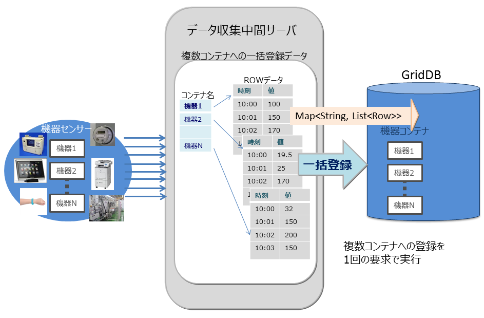
<figcaption>multiput処理</figcaption>
</figure>


- マルチクエリ(fetchAll)

  - センサのイベント情報を集計する処理などで、コンテナへのクエリ問い合わせを複数実行するのではなく、１つの問い合わせで実行することができます。たとえば、センサから取得したデータの一日の最大値、最小値、平均値などの集計結果の取得や、最大値や最小値をもつロウ集合や特定の条件に合致するロウ集合といったロウ集合のデータ取得を最適化します。

<figure>

<figcaption>fetchAll処理</figcaption>
</figure>

- マルチゲット(multiget)

  - センサのイベント情報を取得する処理などで複数機器のRowkeyを指定した一括データ取得ができます。 RowKeyPredicateオブジェクトにデータ取得の条件を設定し、複数の機器のデータを一括で取得します。

  - RowKeyPredicateオブジェクトでは以下の2形式のいずれかで取得条件を設定します。
    - 取得範囲の指定
    - 指定した個別の値

<figure>

<figcaption>multiget処理</figcaption>
</figure>

<a id="index_function"></a>
## 索引機能

コンテナ(テーブル)のカラムに対し索引を作成することで、条件付き検索が高速に処理できます。

索引タイプにはツリー索引(TREE)、空間索引(SPATIAL)の2種類があります。
設定できる索引はコンテナ(テーブル)のタイプやカラムのデータ型に応じて異なります。

-   ツリー索引（TREE）
    -   等価検索、範囲（より大きい/等しい、より小さい/等しいなど）を含む参照に利用します。
    -   時系列コンテナ(時系列コレクション)のROWKEY(PRIMARY KEY)に対応するカラムを除く、任意種別のコンテナ（テーブル）における次に示す型のカラムに対して設定できます。
        -   STRING
        -   BOOL
        -   BYTE
        -   SHORT
        -   INTEGER
        -   LONG
        -   FLOAT
        -   DOUBLE
        -   TIMESTAMP
    -   ツリー索引のみ、複数のカラムを指定した索引を作成できます。これを複合索引と呼びます。1つの複合索引に指定できるカラム数の上限は16個で、同じカラムを複数回指定することはできません。
-   空間索引（SPATIAL）
    -   コレクションにおけるGEOMETRY型カラムに対してのみ設定できます。空間検索を高速に行う場合に指定します。

コンテナに作成できる索引の数に制限はありませんが、索引の作成は慎重に設計する必要があります。索引は、設定されたコンテナのロウに対して挿入、更新、または削除の各操作が実行されると更新されます。したがって、頻繁に更新されるロウのカラムに多数の索引を作成すると、挿入、更新、または削除の各操作でパフォーマンスに影響ができます。

索引は以下のようなカラムに作成します。
-   頻繁に検索されたり、ソートされたりするカラム
-   TQLのWHERE節の条件で頻繁に使用されるカラム
-   カーディナリティの高い（重複した値があまり含まれない）カラム

【メモ】
- テーブル（時系列テーブル）のカラムには、ツリー索引のみ設定できます。

<a id="ts_data_functions"></a>
## 時系列データ特有の機能

GridDBでは、高頻度で発生するセンサなどのデータ管理のために、メモリを最大限有効利用するデータ配置アルゴリズム(TDPA：Time Series Data Placement Algorithm)に従いデータ配置処理します。時系列コンテナ(時系列テーブル)では、内部データを周期性で分類しながらメモリ配置します。アフィニティ機能でヒント情報を与えるとさらに配置効率が上がります。また、データを必要に応じてディスクに追い出しながら、ほぼゼロコストで有効期限切れのデータを解放しています。

時系列コンテナ(時系列テーブル)は、TIMESTAMP型のROWKEY(PRIMARY KEY)を持ちます。

### TQLの演算機能

#### 集計演算

採取したデータの時間間隔でデータに重みをつけて計算します。つまり、時間間隔が長い場合、長時間その値が続いたことを想定した計算となります。

集計演算には以下の関数があります。

- TIME_AVG

  - 重み付きで平均を求める演算です。
  - 検索の条件に合致した各ロウについて、前後それぞれの時刻のロウとの中間時刻間の期間を特定の単位で換算したものを、重み付け値として使用します。条件で指定した時刻のロウのみが存在しない場合は、存在しないロウの代わりに条件に指定した時刻の直前、直後のロウを用いて重みづけ計算をします。
  - 計算の詳細イメージを図示します。

<figure>
  
  <figcaption>重みづけの集計演算（TIME_AVG)</figcaption>
</figure>

#### 選択・補間演算

時刻データは、収集されるデータの内容や収集タイミングにより想定した時刻より多少の時間のずれが発生することがあります。したがって時刻データをキーにして検索する際にも、指定した時刻周辺のデータが取得できる機能が必要です。

時系列コンテナ(時系列テーブル)を検索し、指定したロウを取得するための以下のような関数があります。

-   TIME_NEXT(\*, timestamp)

    指定の時刻と同一またはその直後の時刻を持つ1つのロウを選択します。

-   TIME_NEXT_ONLY(\*, timestamp)

    指定の時刻の直後の時刻を持つ1つのロウを選択します。
-   TIME_PREV(\*, timestamp)

    指定の時刻と同一またはその直前の時刻を持つ1つのロウを選択します。
-   TIME_PREV_ONLY(\*, timestamp)

    指定の時刻の直前の時刻を持つ1つのロウを選択します。

また、実体のロウのカラムの値を補間演算で計算するための以下のような関数があります。

-   TIME_INTERPOLATED(column, timestamp)

    指定の時刻に関して、一致するロウの指定のカラムの値、または、隣接する前後のロウの指定カラムの値を線形補間して得られた値を求めます。

-   TIME_SAMPLING(\*|column, timestamp_start, timestamp_end, interval, DAY|HOUR|MINUTE|SECOND|MILLISECOND)

    開始・終了時刻を指定して、特定範囲のロウ集合をサンプリングします。

    サンプリング位置の時刻は、開始時刻に対し非負整数倍のサンプリング間隔を加えた時刻のうち、終了時刻と同じかそれ以前のもののみです。

    各サンプリング位置の時刻と一致するロウが存在する場合は該当ロウの値を使用します。存在しない場合は補間された値を使用します。

### 期限解放機能

期限解放とは、設定した保持期間を超えたロウデータを、検索や削除などの操作対象から外して参照不可とした後、DBから物理的に削除する機能です。 利用されなくなった古いデータを操作の対象から外して削除することで、DBサイズを一定に保ち、データベースサイズ肥大化によるパフォーマンス低下を防ぐことができます。

<figure>

<figcaption>期限解放</figcaption>
</figure>

保持期間はコンテナ単位に設定します。保持期間を越えたロウを「期限切れデータ」と呼びます。期限切れデータは参照不可となってAPIから操作できなくなるので、アプリケーションからはそのロウは存在しない状態になります。期限切れデータは、一定期間が経過すると、DBから物理的に削除する対象のデータになります。この削除対象となった期限切れデータを「コールドデータ」と呼びます。コールドデータは、そのまま自動的にDBから削除します。

#### 期限解放の設定

期限解放は、パーティショニングされたコンテナ(テーブル)で利用可能です。

- インターバル、インターバルハッシュでパーティショニングされた以下のテーブルに設定できます。
  - 時系列テーブル
  - パーティショニングキーがTIMESTAMP型のコレクションテーブル
- 設定項目は、保持期間、保持期間の単位です。
- 保持期間の単位として設定できるのは、日/時/分/秒/ミリ秒の単位です。年単位、月単位の指定はできません。
- ロウの保持期限は、データパーティションのロウ格納期間の最終日時に保持期間を足した日時です。同じデータパーティションに格納されているロウは、全て同じ保持期限になります。
- コールドデータになる単位は、データパーティションです。物理的データ削除はデータパーティション単位で行われます。

<figure>
  
  <figcaption>パーティション期限解放</figcaption>
</figure>

【メモ】

- 期限解放の設定は、テーブル作成時に行います。作成後に設定を変更することはできません。
- 保持期限超過の判定に使用される現在時刻は、GridDBの各ノードの実行環境に依存します。したがって、ネットワークの遅延や実行環境の時刻設定のずれなどにより、クライアントの時刻よりGridDBのノードの時刻が進んでいる場合、期限切れ前のロウにアクセスできなくなる場合があります。逆にクライアントの時刻のみ進んでいる場合は、期限切れロウにアクセスできる場合があります。意図しないロウの喪失を避けるために、最低限必要な期間よりも大きな値を設定することを推奨します。
- 期限切れのロウは、検索や更新といったロウ操作の対象から外れ、存在しないものとみなされます。期限切れのロウに対して行われた操作はエラーにはなりません。
  - 例) 保持期限が30日の設定の場合、現在から31日前の日時のロウを登録しても登録処理はエラーにはならず、かつ、テーブルにはそのロウは保存されません。
- 期限解放を設定する場合は、必ずクラスタの全ノードの時刻を同期してください。時刻がずれていると、ノード間で期限解放されるタイミングが異なるなどの問題が生じる場合があります。
- 期限切れデータからコールドデータになるまでの期間は、期限解放の保持期間の設定によって異なります。

  | 保持期間     | 期限切れからコールドデータになるまでの最大期間 |
  |--------------|------------------------------------------------|
  | ～3日        | 約1.2時間                                         |
  | 3日～12日    | 約5時間                                          |
  | 12日～48日   | 約19時間                                         |
  | 48日～192日  | 約3日                                          |
  | 192日～768日 | 約13日                                         |
  | 768日～      | 約50日                                         |

#### コールドデータの自動削除

1秒間に1回、定期的にDBファイルの管理情報をスキャンして、その時点でコールドデータになっているロウを物理的に削除します。DBファイルの管理情報をスキャンする量は1回の実行につき2000ブロック分です。スキャンする量は、ノード定義ファイル(gs_node.json)の/dataStore/batchScanNumで設定できます。登録量が多いシステムなどでは、自動削除の速度が登録に追いつかずに、DBサイズが増加し続ける可能性があります。その場合はスキャンする量を増やしてください。


<a id="table_partitioning"></a>
## テーブルパーティショニング機能

複数ノードで動作するGridDBのアプリケーションを高速化するには、処理するデータをできるだけメモリに配置することが重要です。 データ登録数が多い巨大なコンテナ（テーブル）では、テーブルのデータを分割してノードに分散配置することで、複数ノードのCPUやメモリリソースを効率的に活用した処理が可能です。分割したデータは、「データパーティション」という複数の内部コンテナに格納します。データをどのデータパーティションに格納するかは、テーブル作成時に指定された「パーティショニングキー」のカラムの値を基に決定します。

GridDBではテーブルパーティショニングの方法として、ハッシュパーティショニング、インターバルパーティショニング、インターバル-ハッシュパーティショニングの3種類があります。

テーブルの作成・削除はNewSQLインターフェースのみ、データの登録・更新・検索はNewSQL/NoSQLインターフェースで実行できます。(一部制限があります。詳細は[TQLとSQL](#tql_and_sql)を参照ください)

-   データ登録

    テーブルにデータを登録すると、パーティショニングキーの値とパーティショニングの方法に応じて、適切なデータパーティションにデータが自動的に登録されます。データパーティションを直接指定してデータ登録することはできません。

-   索引

    テーブルに索引を作成した場合、データパーティション単位でのローカル索引が作成されます。テーブル全体でのグローバル索引を作成することはできません。

-   データ操作

    パーティショニングキーに指定したカラムがプライマリキーである場合、パーティショニングキーに対するデータ更新操作は、エラーになります。データを削除してから再登録してください。

    パーティショニングキーに指定したカラムがプライマリキーでない場合、NoSQL I/Fでのみ更新操作が可能です。

-   期限解放機能

    インターバル、インターバルハッシュでパーティショニングされた以下のテーブルに期限解放を設定できます。
     - 時系列テーブル
     - パーティショニングキーがTIMESTAMP型のコレクションテーブル

-   注意点

    V4.3より、プライマリキーが存在する場合に、プライマリキー以外のカラムをパーティショニングキーに指定すると、デフォルトではエラーとなります。指定可能とするにはクラスタ定義ファイル（gs_cluster.json)の/sql/partitioningRowkeyConstraintにfalseを設定する必要があります。

    プライマリキー以外のカラムをパーティショニングキーに指定した場合、プライマリキーの制約は、データパーティションの単位では保証しますが、テーブル全体では保証しません。そのため、テーブル全体としては、プライマリキーに同じ値が重複して登録される場合があります。

<figure>

<figcaption>テーブルパーティショニング</figcaption>
</figure>

### テーブルパーティショニングの利点

テーブルパーティショニングを利用して、大規模なデータを分割することで、メモリの効率的な利用や検索の処理対象データの絞込みによる性能向上の効果があります。

-   メモリの効率的な利用

    登録や検索などの処理では、処理に必要なデータパーティションがメモリに読み込まれます。処理対象外のデータパーティションは読み込まれないため、処理対象のデータが局所的で一部のデータパーティションに集中する場合は、メモリ上に読み込むデータ量が少なくなります。メモリへのスワップイン/スワップアウトの頻度が低減して、パフォーマンスが向上します。

-   検索の処理対象データの絞込み

    検索する際に、問合わせの絞込み条件に合致するデータパーティションのみを処理対象とします。必要ではないデータパーティショニングにはアクセスしません。この機能をプルーニングと呼びます。 処理対象となるデータ量が小さくなるため、パフォーマンスが向上します。プルーニングが有効になる問合せの絞込み条件は、パーティショニング種別ごとに異なります。

上記の点について、テーブルパーティショニングを利用しない場合と利用する場合の特徴を説明します。

テーブルパーティショニングを利用せずに大規模データをひとつのテーブルに格納する場合、処理に必要なデータをすべてメモリ上に載せることができず、メモリとデータベースファイル間でのスワップイン/スワップアウトが頻繁に発生してパフォーマンスが低下します。特に大規模テーブルのデータ量よりもGridDBノードのメモリが小さい場合に低下が顕著になります。また、テーブルに対するアクセスが1ノードに集中するため、並列度が低くなります。

<figure>

<figcaption>テーブルパーティショニングを使用しない場合</figcaption>
</figure>

テーブルパーティショニングを利用した場合、大規模データを各データパーティションに分割して、複数ノードに分散配置します。

登録や検索などの処理の際には、処理に必要なデータパーティションがメモリに読み込まれます。処理対象外のデータパーティションは読み込まれないため、テーブルパーティショニングを使わない大規模テーブルと比較すると必要なデータ量は小さくなる場合が多く、メモリへのスワップイン/スワップアウトの頻度が低減します。各データパーティションにデータを偏りなく均等に分割した方が各ノードのCPUやメモリリソースを有効に活用することができます。

また、データパーティションはノードに分散配置されるため、データへの並列アクセスが可能になります。

<figure>

<figcaption>テーブルパーティショニングを使用する場合</figcaption>
</figure>

### ハッシュパーティショニング

ハッシュパーティショニングでは、ハッシュ値 (HASH) に基づいてテーブルパーティションに均等にデータを分割して格納します。

高い頻度でデータ登録を行うアプリケーションシステムでの利用においては、テーブルの末尾にアクセスが集中し、待ち時間が発生する場合があります。ハッシュ分割を使用すると複数のテーブルが用意されるため、アクセス分散できます。

<figure>
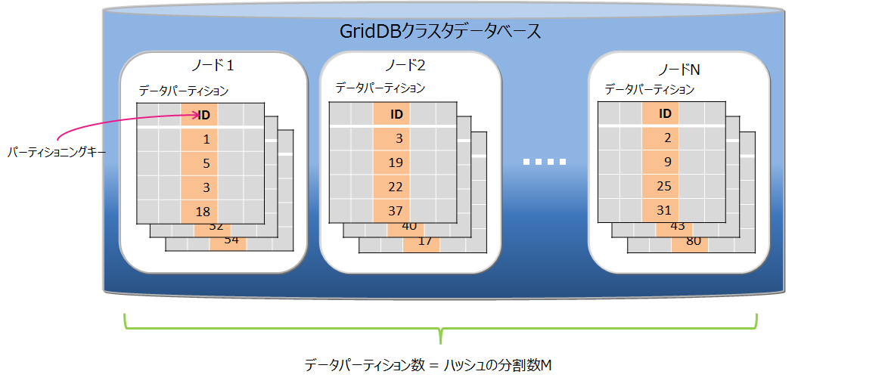
<figcaption>ハッシュパーティショニング</figcaption>
</figure>

-   データの分割

    パーティショニングキーとハッシュの分割数Mを指定されることで、パーティショニングキーの値から1～Mの整数を返すハッシュ関数を定義し、その返値に基づいてデータ分割を行います。分割数Mの最大値は1024です。

-   パーティショニングキー

    パーティショニングキーに指定できるカラムのデータ型に制限はありません。

-   データパーティションの作成

    テーブル作成時に、指定されたハッシュの分割数Mの数のデータパーティションを自動的に作成します。テーブル作成後は、データパーティションの数は変更できません。変更する場合は、テーブルの再作成が必要となります。

-   データパーティションの削除

    データパーティション単体を指定して削除することはできません。

    テーブルの削除により、そのテーブルを構成するデータパーティションをすべて削除します。

-   プルーニング

    ハッシュの場合は、パーティショニングキーの値一致検索を行う場合にプルーニングが適用され、条件に適したデータパーティションのみ処理対象とするため、処理速度の向上やメモリ使用量削減の効果があります。

### インターバルパーティショニング

インターバルパーティショニングでは、指定された一定の値間隔でデータを分割して、データパーティションに格納します。各データパーティションに格納するデータの区間(下限値から上限値)は、指定された値間隔を基に自動的に決定します。

ある一定の範囲の値を持つデータを同じデータパーティション上に格納するので、登録するデータが連続値の場合や、特定期間の範囲の検索を行う場合などに、より少ないメモリで処理できます。

<figure>

<figcaption>インターバルパーティショニング</figcaption>
</figure>

-   データの分割

    値間隔の基準値(分割幅値)に基づいてデータ分割を行います。 パーティショニングキーの型によって、指定できる分割幅値の範囲が異なります。
    -   BYTE型 : 1～2<sup>7</sup>-1
    -   SHORT型 : 1～2<sup>15</sup>-1
    -   INTEGER型 : 1～2<sup>31</sup>-1
    -   LONG型 : 1000～2<sup>63</sup>-1
    -   TIMESTAMP型 : 1以上

    パーティショニングキーがTIMESTAMP型の場合は、単位に「DAY」を指定します。

-   パーティショニングキー

    パーティショニングキーに指定できるデータ型は、BYTE型, SHORT型, INTEGER型, LONG型, TIMESTAMP型です。 パーティショニングキーはひとつのカラムで、NOT NULL制約を設定する必要があります。

-   データパーティションの作成

    テーブル作成時には、データパーティションを作成しません。データ登録時、該当するデータパーティションが存在しない場合に、データパーティションを自動的に作成します。

    データパーティション数の上限値は10000個です。データパーティション数が上限値に達すると、新規のデータパーティションが必要なデータ登録はエラーになります。エラーが発生した場合は、不要なデータパーティションを削除して、データ登録を再実行してください。

    テーブル作成時には、登録するデータの分布とデータパーティション上限数10000を考慮して、分割幅値を決定してください。分割幅値に対してデータの範囲が幅広く、データパーティションが大量に作成されるようなテーブルでは、データパーティション削除のメンテナンスが頻繁に必要になります。

-   データパーティションの削除

    データパーティション単体を削除できます。一度削除したデータパーティションは、再作成できません。
    削除したデータパーティションに対する新規データ登録はすべてエラーとなります。
    データパーティションを削除する前には、メタテーブルで削除対象のデータパーティションが管理するデータの範囲を確認してください。
    メタテーブルの詳細は『[GridDB SQLリファレンス](../md_reference_sql/md_reference_sql.md)』をご参照ください。

    テーブルを削除すると、そのテーブルを構成するデータパーティションをすべて削除します。

    テーブル全体に対する検索を行った場合、すべてのデータパーティションが処理対象になるため、不要なデータパーティションはあらかじめ削除した方が効率的な検索ができます。

-   データパーティションのメンテナンス

    データパーティション数が10000に達する場合、または、不要なデータパーティションがある場合は、データパーティションを削除してメンテナンスする必要があります。

    -   データパーティション数の確認方法

        データパーティションの情報を管理しているメタテーブルを参照して確認します。詳細は『[GridDB SQLリファレンス](../md_reference_sql/md_reference_sql.md)』を参照ください。

    -   データパーティションの削除方法

        テーブルパーティションの下限値を指定して削除を行います。詳細は『[GridDB SQLリファレンス](../md_reference_sql/md_reference_sql.md)』を参照ください。

<figure>

<figcaption>インターバルパーティションテーブル作成・削除の例</figcaption>
</figure>

-   プルーニング

    where句の条件にパーティショニングキーを指定した検索を行う場合、条件に適したデータパーティションのみ処理対象とするため、処理速度の向上やメモリ使用量削減の効果があります。

#### ユーザ指定データパーティション配置

　対象テーブルがインターバルパーティションで、パーティショニングキーがTIMESTAMP型の場合は、ユーザがデータパーティションの配置先を指定したテーブル生成を行うことができます。

　通常のテーブル生成SQLでは、データパーティションの配置先はサーバが独自の規則を用いて決定しますが、複数のインターバルパーティショニングテーブルに対して、特定の日付のデータパーティション配置先が競合する場合があります。下図はそれを示したもので、同一日時の配置先が競合により処理スレッドが競合するので、データ処理の同時実行性能が低下することがあります。

<figure>

<figcaption>同一日時に対するデータパーティションの競合の例</figcaption>
</figure>

　テーブル生成時に区間グループ番号を指定することで、データパーティションの配置に規則性を設けて、グループ番号が異なるテーブル同士は同一日時において処理スレッドが競合しないような割付が行われます。以下にその例を示します。

<figure>

<figcaption>テーブル生成時にユーザがデータパーティション配置先を指定する機能</figcaption>
</figure>

***注意点***
　本機能を効果的に利用するには幾つか条件があり、それらを運用開始時点で検討する必要があります。

 1. クラスタを構成する全ノードの並列度を揃えておく必要があります。また、テーブル生成以降は並列度を変更すると十分な効果が得られなくなるため、開始時点の並列度を維持した運用が必要となります。

 2. 競合を回避したいテーブルの個数は基本的には並列度以下となるようにテーブルの設計を行います。これ以上の指定を行った場合は性能が劣化するケースがあります。

 3. 安定した性能を維持し続けるには、テーブル生成した時点のクラスタノード構成および各ノードのオーナ、バックアップなどのクラスタパーティション配置を運用によって維持し続ける必要があります。また、ノード増設なども変動要因になるため、できる限り固定的な環境での運用が推奨となります。

### インターバル-ハッシュパーティショニング

インターバル-ハッシュパーティショニングは、インターバルパーティショニングとハッシュパーティショニングを組み合わせたものです。まずインターバルパーティショニングでデータを分割し、その分割されたデータに対して、さらにハッシュパーティショニングが行われます。 データパーティショニングの数は、インターバルパーティションニングによって分割した区間の数×ハッシュの分割数になります。

<figure>

<figcaption>インターバル-ハッシュパーティショニング</figcaption>
</figure>

インターバルパーティショニングで分割したデータパーティションを、さらにハッシュによって適切にノードに分散することができます。一方で、データパーティション数が多くなることで、検索時のオーバヘッドが発生します。ノード分散と処理のオーバヘッドを考慮してご利用ください。

インターバル-ハッシュパーティショニングは、インターバルパーティショニングとハッシュパーティショニングを組み合わせたものなので、基本的な機能はそれぞれのパーティショニングの機能と同等です。インターバル-ハッシュパーティショニングに特有の点のみ説明します。

-   データの分割

    インターバル-ハッシュパーティショニングでの分割幅値は、LONGの場合のみインターバルパーティションと値の範囲が異なります。
    -   BYTE型 : 1～2<sup>7</sup>-1
    -   SHORT型 : 1～2<sup>15</sup>-1
    -   INTEGER型 : 1～2<sup>31</sup>-1
    -   LONG型 : 1000×ハッシュの分割数～2<sup>63</sup>-1
    -   TIMESTAMP型 : 1以上

-   データパーティションの数

    ハッシュで分割された数も含めて、データパーティション数の上限値は10000個です。上限に達した場合の動作やメンテナンスが必要な点については、インターバルパーティショニングと同様です。

-   データパーティションの削除

    インターバルで分割した単位でデータパーティション群を削除できます。同じインターバル区間をハッシュ分割したデータパーティション単体の削除はできません。

### テーブルパーティショニング種別の選択基準

GridDBでは、テーブルパーティショニングの分割の種別として、ハッシュ、インターバル、インターバルハッシュをサポートします。

検索やデータアクセスの条件となるようなカラムを、テーブルを分割するためのパーティショニングキーとします。そのパーティショニングキーの値に対して、大量データを均等に分割するための範囲が決定できる場合にはインターバルパーティショニングもしくはインターバル-ハッシュパーティショニング、決定が困難な場合にはハッシュを選択します。

<figure>

<figcaption>データの範囲</figcaption>
</figure>

- インターバルパーティショニング、インターバル-ハッシュパーティショニング

  データを均等に分割するための区間（分割幅値）が事前に決定できる場合には、インターバルパーティショニングを選択します。 インターバルパーティションへの問合せでは、プルーニングによって、条件に合致するデータパーティションのみにアクセスして結果を取得するため、パフォーマンスが改善します。また、検索だけでなく、特定の範囲にデータを連続登録する場合もパフォーマンスが改善します。

  <figure>
  
  <figcaption>インターバルパーティショニング</figcaption>
  </figure>

  従って、インターバルパーティショニングを利用する場合は、アプリケーションで頻繁に登録・検索するデータ範囲を意識して分割幅値を決定することで、使用するメモリの削減が可能です。例えば、センサデータなどの時系列データで、かつ直近データに対する検索が多いシステムの場合には、検索対象の範囲をインターバルパーティショニングの分割幅値にすると、処理対象となるデータパーティションサイズのメモリで検索のパフォーマンスを保つことができます。

  <figure>
  
  <figcaption>インターバルパーティショニングの登録と検索処理の例</figcaption>
  </figure>

  さらに、インターバル-ハッシュパーティショニングを利用して、インターバルパーティショニングで分割したデータパーティションをハッシュパーティショニングで均等分割してノードに分散配置することで、特定範囲のデータに対する並列アクセスも可能になります。

  <figure>
  
  <figcaption>インターバルハッシュパーティショニング</figcaption>
  </figure>

- ハッシュパーティショニング

  格納するデータの特徴が事前にわからない場合、また、データを均等に分割可能な区間をあらかじめ決めることが困難な場合には、ハッシュパーティショニングを選択します。パーティショニングキーにユニークな値のカラムを指定することで、自動的に大量データを均等分割することができます。

  <figure>
  
  <figcaption>ハッシュパーティショニング</figcaption>
  </figure>

  ハッシュパーティショニングにより、テーブル全体への並列アクセス、および一致検索に限ってパーティションプルーニングが可能なため、システムのパフォーマンスを改善できます。ただし、高いパフォーマンスを得るためには、ノード毎に管理するテーブルパーティション全てを格納できるサイズのメモリが必要です。

  <figure>
  
  <figcaption>ハッシュパーティショニングの登録と検索処理の例</figcaption>
  </figure>

## トランザクション機能

GridDBではコンテナ単位のトランザクション処理をサポートし、トランザクションの特性として一般的に言われるACID特性をサポートしています。以下にトランザクション処理でサポートしている機能の詳細を説明していきます。

### トランザクションの開始と終了

コンテナに対して、ロウの検索・更新などの操作を行ったときに新たなトランザクションが開始され、データの更新結果を確定(コミット)または破棄(アボート)した時にトランザクションが終了します。

【メモ】
-   コミットとは、処理中のトランザクションの情報を確定し、データを永続化させる処理です。
    -   GridDBではコミット処理でトランザクションの更新したデータがトランザクションログとして保管され、保持していたロックが解放されます。
-   アボートとは、トランザクションの処理途中のデータをすべてロールバックする（処理を取り消す）処理です。
    -   GridDBでは処理途中のデータはすべて破棄され、保持していたロックも解放されます。

トランザクションの初期の動作はautocommit（自動コミット）に設定されています。

autocommitでは、アプリケーションからのコンテナに対する更新（データの追加、削除、変更）操作開始毎に新たなトランザクションが開始され、操作終了とともに自動的にコミットされます。 autocommitをオフにすることで、アプリケーションからの要求に応じたタイミングでトランザクションのコミット、アボートを指示できます。

トランザクションのライフサイクルは、トランザクションのコミットやアボートによる完了とともにタイムアウトによるエラー終了があります。トランザクションがタイムアウトによりエラー終了した場合、そのトランザクションはアボートされます。トランザクションのタイムアウトは、トランザクションが開始してからの経過時間です。 トランザクションのタイムアウト時間は、アプリケーション単位にGridDBに接続する際のパラメータとして指定することができます。また、タイムアウト時間の上限値はノード定義ファイル（gs_node.json）に設定できます。

### トランザクションの一貫性レベル

トランザクションの一貫性レベルにはimmediate consistencyとeventual consistencyの2種類があります。この指定はアプリケーションごとにGridDBに接続する際のパラメータとして指定することもできます。 デフォルトはimmediate consistencyです。

- immediate consistency

  - コンテナに対する他のクライアントからの更新結果は、該当トランザクションの完了後即座に反映されます。そのため、常に最新の内容を参照します。

- eventual consistency

  - コンテナに対する他のクライアントからの更新結果は、該当トランザクションが完了した後でも反映されていない場合があります。 そのため、古い内容を参照する能性があります。

immediate consistencyは更新操作、読み取り操作で有効です。 eventual consistencyは読み取り操作でのみ有効です。 常に最新の結果を読み取る必要のないアプリケーションではeventual consistencyを指定すると読み取り性能が向上します。

### トランザクションの隔離レベル

データベースの内容は常に整合性が保たれている必要があります。 複数のトランザクションを同時実行させたとき、一般に以下の現象が課題として挙がります。

-   ダーティリード

    トランザクションが書き込んだコミットされていないデータを、別のトランザクションで読み込んでしまう現象です。

-   反復不能読み取り

    トランザクション内で以前読み込んだデータを再読み込みできなくなる現象です。トランザクション内で以前読み込んだデータを再度読み込もうとしても、別のトランザクションがそのデータを更新、コミットしたために、以前のデータが読み込めなくなります(更新後の新しいデータを読み込むことになります)

-   ファントムリード

    トランザクション内で以前得られた問い合わせの結果が得られなくなる現象です。トランザクション内で以前実行した問い合わせを再実行しても、別のトランザクションがその問い合わせ条件を満たすデータを変更、追加し、コミットしたために、同じ条件で問い合わせを実行しても、以前の結果が得られなくなります(更新後のデータを得ることになります)。

GridDBでは、トランザクションの隔離レベルとして「READ_COMMITTED」をサポートしています。 READ_COMMITTEDでは、確定した最新データを常に読み取ります。

トランザクションを実行する場合、他のトランザクションからの影響を受けないように配慮する必要があります。隔離レベルは、実行トランザクションを他のトランザクションからどの程度隔離するか(どの程度整合性を保てるか)を示す指標であり、4つのレベルがあります。

4つの隔離レベルおよび、それに対して同時実行時の課題であげた現象が起こる可能性は以下のとおりです。

| 隔離レベル                 | ダーティリード   | 反復不能読み取り | ファントムリード |
|----------------------------|------------------|------------------|------------------|
| READ_UNCOMMITTED | 発生の可能性あり | 発生の可能性あり | 発生の可能性あり |
| READ_COMMITTED   | 安全             | 発生の可能性あり | 発生の可能性あり |
| REPEATABLE_READ  | 安全             | 安全             | 発生の可能性あり |
| SERIALIZABLE     | 安全             | 安全             | 安全             |

READ_COMMITEDでは、以前読み込んだデータを再度読み込んだ場合に、以前のデータとは異なるデータを得たり、問い合わせを再実行した場合に、同じ検索条件で問い合わせを実行しても異なる結果を得てしまうことがあります。これは前回の読み込み後に、別のトランザクションによって更新、コミットが行われ、データが更新されたためです。

GridDBでは、MVCCによって、更新中のデータを隔離しています。

### MVCC

GridDBでは、READ_COMMITTEDを実現するために「MVCC(Multi-Version Concurrency Control：多版型同時実行制御方式)」を採用しています。

MVCCとは、各トランザクションがデータベースに対して問い合わせるときに、別のトランザクションが更新中の最新のデータでなく、更新前のデータを参照して処理を行う方式です。更新前のデータを参照してトランザクションを並行実行できるため、システムのスルー プットが向上します。

実行中のトランザクションの処理がコミットすると、他のトランザクションも最新のデータを参照できます。

<figure>
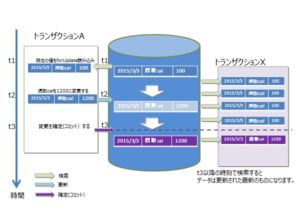
<figcaption>MVCC</figcaption>
</figure>

### ロック

コンテナに対する複数トランザクションからの更新処理要求競合時の一貫性を保つため、データのロック機構があります。

ロックの粒度は、コンテナの種別に応じて異なります。またロックの範囲は、データベースへの操作の種別に応じて異なります。

#### ロックの粒度

コンテナの種別ごとのロックの粒度は次のとおりです。

-   コレクション・・・ロウ単位でロックします。
-   時系列コンテナ・・・ロウ集合でロックされます。
    -   時系列コンテナは、ブロックをいくつかに分割したデータ処理の単位に複数のロウを配置します。 このデータ処理の単位をロウ集合とよびます。コレクションでのロックの粒度よりもデータ粒度が荒いですが、大量に発生する時系列コンテナを高速に処理するためのデータの管理の単位です。

これらは、コンテナの種別ごとのユースケースの分析に基づいています。

-   コレクションデータはRDBのテーブルと同様にデータを管理するため、既存のロウデータが更新されるケースがある
-   時系列コンテナは時々刻々発生するデータを保持するデータ構造であり、特定の時刻のデータが更新されるケースは少ない

#### データベース操作によるロック範囲

コンテナへの操作にはデータの登録、削除のみならず、データ構造の変更に伴うスキーマ変更や、アクセス高速化のための索引作成などの操作があります。ロック範囲は、コンテナ全体への操作、またはコンテナのロウ単位の操作のいずれかによって異なります。

-   コンテナ単位のロック
    -   索引操作(createIndex/dropIndex)
    -   コンテナ削除
    -   スキーマ変更
-   ロックの粒度に従ったロック
    -   put/update/remove
    -   get(forUpdate)

    ロウへのデータ操作ではロックの粒度に沿ったロックを確保します。

ロック確保で競合した場合、先行したトランザクションがコミットもしくはロールバック処理で実行が完了しロックを解放するまで、後続のトランザクションはロック確保待ちとなります。

ロック確保待ちは、トランザクションの実行完了以外では、タイムアウトでも解消されます。

### データ永続化

コンテナやテーブルに登録・更新されたデータは、ディスクやSSDに永続化され、ノード障害発生時のデータ消失から保護されます。メモリ上の更新データをブロック単位にデータファイル・チェックポイントログファイルに定期的に保存するチェックポイント処理と、データ更新に同期して更新データをシーケンシャルにトランザクションログファイルに書き込むトランザクションログ処理の２つの処理があります。

トランザクションログの書き込みには、以下のいずれかをノード定義ファイルに設定できます。

-   0: SYNC
-   1以上の整数値: DELAYED_SYNC

"SYNC"では、更新トランザクションのコミット・アボートごとに、ログ書き込みを同期的に行います。"DELAYED_SYNC"では、更新時のログ書き込みを、更新タイミングとは関係なく、指定秒数毎に遅延して行います。デフォルト値は"1(DELAYED_SYNC 1秒)"です。

"SYNC"を指定するとノード障害発生時に最新の更新内容を消失する可能性が低くなりますが更新が多いシステムでは性能に影響します。

一方、"DELAYED_SYNC"を指定すると、更新性能は向上しますが、ノード障害発生時ディスクに書き込まれていない更新内容があるとそれらが失われます。

クラスタ構成でレプリカ数が2以上の場合は、他のノードにレプリカを持つため、"DELAYED_SYNC"設定でも1ノード障害時に最新の更新内容を失う可能性は低くなります。 更新頻度が高く、性能が要求される場合には、"DELAYED_SYNC"を設定することも考慮してください。

チェックポイントでは、更新ブロックをデータベースファイルに更新します。 チェックポイント処理は、ノード単位に設定したサイクルで動作します。チェックポイントのサイクルはノード定義ファイルのパラメータで設定します。初期値は、60秒です。

チェックポイントの実行サイクルの数値を上げることで、ディスクへの永続化を夜間に実施するなど比較的時間に余裕がある時間帯に設定することができます。一方サイクルを長くした場合に、システム処理外でノードを再起動した際にロールフォワードすべきトランザクションログファイルが増え、リカバリ時間が増えるという欠点もあります。

<figure>

<figcaption>チェックポイント</figcaption>
</figure>

### タイムアウト処理

タイムアウト処理は、NoSQL I/F、NewSQL I/Fで設定できる内容が異なります。

#### NoSQL I/Fのタイムアウト処理

NoSQL I/Fでは、アプリケーション開発者に通知されるタイムアウトには2種類のタイムアウトがあります。アプリケーションの処理時間の制限に関するトランザクションタイムアウトと、障害発生時の回復処理のリトライ時間に関するフェイルオーバータイムアウトの２つです。

-   トランザクションタイムアウト（transactionTimeout）

    処理対象のコンテナにアクセスを開始してからタイマが開始され、指定した時間を超えるとタイムアウトが発生します。

    長時間更新ロックを保有するトランザクション（更新モードで検索し、ロックを保持したまま解放しないアプリケーション）や長時間大量の結果セットを保持するトランザクション（長時間、クラスタシステムのメモリを解放しないアプリケーション）などからロックやメモリを解放するために用意されたタイムアウト時間です。トランザクションタイムアウトに達したらアプリケーションはアボートされます。

    トランザクションタイムアウトは、クラスタ接続時のパラメータとしてアプリケーションで指定できます。タイムアウト時間の上限値はノード定義ファイルで指定します。 タイムアウト時間の上限値の初期値は300秒です。処理に長時間かかるトランザクションの発生を監視をするためには、システムの要件に合わせてタイムアウト時間とその上限値を設定してください。

-   フェイルオーバータイムアウト（failoverTimeout）

    クラスタを構成するノードに障害が発生したとき、ノードに接続しているクライアントが代替えノードに接続する際のエラーリトライ時のタイムアウト時間です。リトライ処理で新たな接続先が見つかった場合、クライアントアプリケーションにはエラーは通知されません。フェイルオーバータイムアウトは、初期接続時のタイムアウトにも利用されます。

    フェイルオーバータイムアウトは、クラスタ接続時のパラメータとしてアプリケーションで指定できます。システムの要件に合わせてタイムアウト時間を設定してください。

トランザクションタイムアウト、フェイルオーバータイムアウトともに、Java APIやC APIでGridStoreオブジェクトを用いてクラスタに接続する際に設定できます。
詳細は『[GridDB Java APIリファレンス](../md_reference_java_api/md_reference_java_api.html)』や『[GridDB C APIリファレンス](../md_reference_c_api/md_reference_c_api.html)』
を参照ください。

　

#### NewSQL I/Fのタイムアウト処理

NewSQL I/Fでは、ログイン(接続)タイムアウト、ネットワーク応答タイムアウト、クエリタイムアウトの3種類のタイムアウトがあります。

-   ログイン(接続)タイムアウト

    クラスタに初期接続する際のタイムアウトです。初期設定は5分に設定されていますが、APIのDriverManagerで変更可能です。

-   ネットワーク応答タイムアウト

    クライアントとクラスタ間の応答監視でのタイムアウトです。GridDBの現バージョンでは、タイムアウトは5分であり、タイムアウト時間の変更はできません。

    クライアントからの通信で15秒間サーバが無応答の場合にはリトライし、5分間応答がない場合タイムアウトとなります。長時間のクエリ処理中にタイムアウトとなることはありません。

-   クエリタイムアウト

    実行するクエリ単位にタイムアウト時間を設定できます。初期設定ではタイムアウト時間は設定されていません。（長時間のクエリ実行を許容しています。）長時間クエリの監視をするために、システムの要件に合わせてタイムアウト時間を設定してください。設定は、APIのStatementで設定できます。


## レプリケーション機能

クラスタを構成する複数のノード間では、ユーザが設定したレプリケーション数に従って、パーティション単位にデータのレプリカが作成されます。

データのレプリカを分散ノード間で保持することで、ノード障害が発生しても、ノンストップで処理を継続できます。クライアントAPIでは、ノードの障害を検出すると、自動的にレプリカを保持する別ノードにアクセスを切り替えます。

レプリケーション数のデフォルト値は2で、複数ノードのクラスタ構成で動作した場合、データが2重化されます。

コンテナに更新があると、多重化されたパーティションのうちオーナノード（レプリカのマスタを持つノード）が更新されます。

その後オーナノードから更新内容がバックアップノードに反映されますが、その方法は2つあります。

-   非同期レプリケーション

    更新処理のタイミングと同期せずにレプリケーションを行います。準同期レプリケーションに対して更新性能に優れますが、可用性では劣ります。

-   準同期レプリケーション

    更新処理のタイミングで同期的にレプリケーションを行いますが、レプリケーション完了の待ち合わせは行いません。可用性の面では優れますが、性能面では劣ります。

可用性よりも性能を重視する場合は非同期レプリケーションに、可用性を重視する場合は準同期レプリケーションに設定してください。

【メモ】
- レプリケーション数の設定は、クラスタ定義ファイル（gs_cluster.json)の/cluster/replicationNumで設定します。 レプリケーションの同期設定は、クラスタ定義ファイル（gs_cluster.json)の/transaction/replicationModeで設定します。


## アフィニティ機能

アフィニティ機能とは、関連のあるデータを結びつける機能です。GridDBではアフィニティ機能として、データアフィニティとノードアフィニティの２種類を提供します。

### データアフィニティ

データアフィニティには、複数のコンテナ(テーブル)をグループ化して別ブロックに配置する機能と、各コンテナ(テーブル)毎に別ブロックに配置する機能があります。

#### 複数のコンテナをグループ化して別ブロックに配置

同じパーティションに配置されたコンテナ（テーブル）を、ヒント情報を元にグルーピングして、それぞれ別ブロックに配置するための機能です。各ブロックに関連性の強いデータのみ格納することで、データアクセスの局所化を図り、メモリヒット率を高めることができます。

ヒント情報は、コンテナ(テーブル)作成時にプロパティとして与えます。使用できる文字列は、コンテナ(テーブル)名の命名規則と同様に制限があります。

同じヒント情報があるデータをできるだけ同じブロックに配置します。ヒント情報はデータの更新頻度や参照頻度に応じて設定します。 たとえば、分単位、日単位、月単位、年単位にデータをサンプリングや参照する監視システムに対して、以下のような利用方法でシステムのデータが登録・参照・更新される場合のデータ構造を考えます。

1.  監視機器から分単位のデータが送信され、監視機器単位に作成したコンテナにデータを保存
2.  日単位のデータレポート作成のため、一日分のデータの集計を分単位データから行い、日単位コンテナ(テーブル)に保存
3.  月単位のデータレポート作成のため、日単位コンテナ(テーブル)のデータの集計を行い、月単位コンテナ(テーブル)に保存
4.  年単位のデータレポート作成のため、月単位コンテナ(テーブル)のデータの集計を行い、年単位コンテナ(テーブル)に保存
5.  カレントの使用量（分単位、日単位）は常に表示パネルに更新表示

GridDBでは、コンテナ単位にブロックを占有するのではなく、ブロックには時刻の近いデータが配置されます。したがって、2.の日単位コンテナ(テーブル)を参照し、月単位の集計を行い集計時間をROWKEY(PRIMARY KEY)とする3.のデータと、分単位の1.のデータが同一ブロックに保存される可能性があります。

メモリが小さく監視データがすべてメモリに収まらない大容量データで4.の年単位の集計処理を行う場合、ブロックが分断して配置された3.のデータをメモリに配置するために、常時必要な1．のデータがメモリから追い出されるなど、直近でないデータの読み込みにより監視したいデータがスワップアウトされる状況が発生します。

この場合、分単位、日単位、月単位などコンテナ(テーブル)のアクセス頻度に沿ったヒントを与えることで、アクセス頻度の低いデータと高いデータをデータ配置時に別ブロックに分離します。

このように、データアフィニティによってアプリケーションの利用シーンに合わせたデータ配置ができます。

<figure>

<figcaption>複数のコンテナをグループ化して別ブロックに配置</figcaption>
</figure>

【注意】
-   データアフィニティは異なるパーティションに配置されたコンテナ（テーブル）に対して無効です。   
特定のコンテナ（テーブル）を同じパーティションに配置したい場合は、ノードアフィニティをご利用ください。

#### コンテナ単位で別ブロックに配置

各コンテナ（テーブル）毎にブロックを占有するための機能です。コンテナに対して固有のブロックを割り当てることで、コンテナ単位のスキャンや削除を高速化することができます。

ヒント情報として、特殊文字列「 **#unique** 」をコンテナ作成時にプロパティ情報へ設定してください。他のコンテナと完全に別のブロックにデータを配置します。

<figure>

<figcaption>
</figcaption>
</figure>

【注意】
- 複数コンテナアクセス時のメモリヒット率低下が発⽣する可能性があります。


### ノードアフィニティ

ノードアフィニティとは、関連の強いコンテナやテーブルを同じノードに配置し、データアクセス時のネットワーク負荷を減少させるための機能です。GridDBのSQLではテーブルのJOIN操作が記述できます。テーブルのJOIN操作時にクラスタの別ノードに配置されたテーブルのネットワークアクセスでの負荷を減少させることができます。また、複数ノードを用いた並列処理ができなくなるため、ターンアラウンド時間の短縮には効果がない反面、ネットワーク負荷の減少によりスループットが上がる可能性があります。

<figure>

<figcaption>ノードアフィニティによるコンテナ/テーブルの配置</figcaption>
</figure>


ノードアフィニティを利用するには、コンテナ(テーブル)作成時にコンテナ(テーブル)名にヒント情報を与えます。ヒント情報が同一のコンテナ(テーブル)は同一のパーティションに配置されます。 以下のように指定します。

-   コンテナ(テーブル)名@ノードアフィニティヒント情報

ノードアフィニティのヒント情報の命名もコンテナ(テーブル)名の命名規則と同様です。

【注意】
-   テーブルパーティショニングを利用している場合は、本機能は利用できません。


## コンテナ(テーブル)の定義変更


コンテナ作成後に、カラム追加などのコンテナ定義の変更を行うことができます。変更可能な操作と使用するインターフェースは以下の通りです。

| 操作                 | NoSQL API | SQL |
|----------------------|-----------|------|
| カラム追加(末尾)     | ○         | ○    |
| カラム追加(末尾以外) | ○(※1)     | ×    |
| カラム削除           | ○(※1)     | ×    |
| カラム名変更          | ×          | ○    |
-   (※1)末尾以外へのカラム追加やカラム削除の操作は、内部的にコンテナ再作成の処理を行うため、データ量が多いコンテナは処理に時間がかかります。
-   上記以外の操作（コンテナ名の変更など）はできません。

### カラム追加

コンテナに新しいカラムを追加します。

- NoSQL APIの場合
  - GridStore\#putContainerを用いてカラム追加します。
  - 既存コンテナからコンテナ情報情報ContainerInfoを取得し、コンテナ情報に新しいカラムをセットしてからputContainerを実行します。
    詳細は『[GridDB Java APIリファレンス](../md_reference_java_api/md_reference_java_api.html)』をご参照ください。

  - 【プログラム例】
    ```java
    // コンテナ情報を取得
    ContainerInfo conInfo = store.getContainerInfo("table1");
    List<ColumnInfo> newColumnList = new ArrayList<ColumnInfo>();
    for ( int i = 0; i < conInfo.getColumnCount(); i++ ){
        newColumnList.add(conInfo.getColumnInfo(i));
    }
    // 新しいカラムを末尾にセット
    newColumnList.add(new ColumnInfo("NewColumn", GSType.INTEGER));
    conInfo.setColumnInfoList(newColumnList);

    // カラム追加
    store.putCollection("table1", conInfo, true);
    ```

- SQLの場合
  - ALTER TABLE構文を用いてカラム追加します。
  - 末尾へのカラム追加の操作のみできます。詳細は『[GridDB SQLリファレンス](../md_reference_sql/md_reference_sql.md)』をご参照ください。

カラムを追加した後に既存ロウを取得した場合、追加カラムの値はカラムのデータ型ごとに定義されている「空の値」が返ります。
空の値の詳細は『[GridDB Java APIリファレンス](../md_reference_java_api/md_reference_java_api.html)』
のContainer&lt;K,R&gt;をご参照ください。
(V4.1では、制限事項「カラム追加後に既存のロウを参照した時、NOT NULL制約が付いていないカラムはNULLが返る」があります。)

<figure>
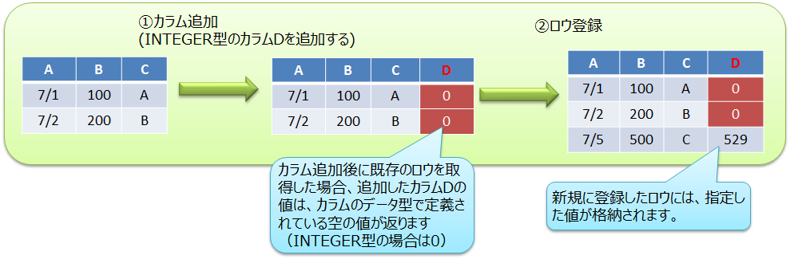
<figcaption>カラム追加の例</figcaption>
</figure>

### カラム削除

コンテナのカラムを削除します。NoSQL APIのみで操作できます。

-   NoSQL API
    -   GridStore\#putContainerを用いてカラム削除します。既存コンテナからコンテナ情報ContainerInfoを取得し、削除対象のカラム情報を除いてからputContainerを実行します。
      詳細は『[GridDB Java APIリファレンス](../md_reference_java_api/md_reference_java_api.html)』
をご参照ください。


### カラム名変更

コンテナのカラム名を変更します。SQLのみで操作できます。

-   SQL
    - ALTER TABLE構文を用いてカラム名を変更します。詳細は『[GridDB SQLリファレンス](../md_reference_sql/md_reference_sql.md)』をご参照ください。

## データベース圧縮/解放機能


<a id="block_data_compression"></a>
### データブロック圧縮

GridDBは、メモリ上のデータをデータベースファイルに書き込むことで、メモリサイズに依存しない大容量化を実現できますが、ストレージのコストは増加します。データブロック圧縮機能は、データベースファイル（データファイル）を圧縮することで、データ量に伴って増加するストレージコストの削減を支援する機能です。 特に、HDDと比べ容量単価が高いフラッシュメモリをより効率的に活用できます。

**圧縮方法**

メモリ上のデータをデータベースファイル（データファイル）に書き出す際に、GridDBの書き出し単位であるブロック毎に圧縮操作を行います。圧縮により空いた領域は、Linuxのファイルブロック割り当て解除処理を行うため、ディスク使用量を削減できます。

**サポート環境**

データブロック圧縮はLinuxの機能を利用しているため、Linuxカーネルバージョンとファイルシステムに依存します。データブロック圧縮のサポート環境は以下です。
-   OS: RHEL / CentOS 7.9以上,  Ubuntu Server 20.04
-   ファイルシステム：XFS
-   ファイルシステムのブロックサイズ：4KB

　※上記以外の環境でデータブロック圧縮を有効にした場合、GridDBノードの起動に失敗します。

**設定方法**

GridDBノードごとに圧縮機能を設定します。

-   ノード定義ファイル(gs_node.json)の/datastore/storeCompressionModeに以下の文字列を設定します。
    -   圧縮機能を無効にする場合：NO_COMPRESSION（既定値）
    -   圧縮機能を有効にする場合：COMPRESSION
-   GridDBノード起動時（再起動時）に設定を適用します。
-   GridDBノードを再起動することで、圧縮機能の動作を有効/無効に変更することができます。

【注意】
-   データブロック圧縮の対象は、データファイルのみです。チェックポイントログファイル、トランザクションログファイル、バックアップファイル、およびGridDBのメモリ上のデータは圧縮しません。
-   データブロック圧縮により、データファイルはスパースファイルになります。
-   圧縮機能を有効に変更しても、すでにデータファイルに書き込み済みのデータは圧縮できません。

### データブロック未使用領域解放

データブロック未使用領域解放機能は、データベースファイル（データファイル）の使用されていないブロック領域に対して、Linuxのファイルブロック割り当て解除処理を行い、データベースファイルのサイズ(実ディスク割当量)を縮小することができる機能です。

以下のようなケースにおいて、ディスク使用量を削減したい場合にご利用ください。

-   データを大量に削除した場合
-   今後データ更新の予定が無く、DBを長期保存するような場合
-   データ更新時にディスクフルになり、回避する暫定手段としてDBサイズ縮小が必要な場合

未使用領域を解放する処理や、本機能のサポート環境、実行方法について説明します。

**解放処理**

GridDBノード起動時に、データベースファイル（データファイル）の未使用領域を解放します。 解放された領域は、新たなデータ更新が発生しない限りディスク領域は割り当てられません。

**サポート環境**

サポート環境は、[データブロック圧縮](#block_data_compression)機能と同じです。

**実行方法**

GridDBノード起動時に、gs_startnodeコマンドでデータブロック未使用領域解放オプション(--releaseUnusedFileBlocks)を指定します。

データベースファイル（データファイル）の未使用領域サイズとディスク割当サイズは、下記の方法で確認してください。
-   gs_statコマンドで表示される項目
    -   storeTotalUse

        ノードがデータファイルで保有する全データ容量(バイト)

    -   dataFileAllocateSize

        データファイルに割り当てられたブロックの総サイズ(バイト)

データブロック未使用領域解放機能の実施目安としては、データブロック未使用領域が多い(上記の値の比較で、storeTotalUse ≪ dataFileAllocateSize) 場合です。

【注意】

-   本機能の対象は、データファイルのみです。チェックポイントログファイル、トランザクションログファイル、バックアップファイルの未使用領域は解放しません。
-   本機能を実施すると、データファイルはスパースファイルになります。
-   データファイルのディスク使用量は削減できますが、スパースファイルになることでフラグメントが発生しやすくなり、性能面ではデメリットになる可能性があります。
-   起動時に領域解放処理が行われるため、通常の起動処理より時間がかかる場合があります。


# 運用機能

## サービス制御

OSの起動と同時にGridDBをサービスとして動作させるサービス制御機能があります。

GridDBのサービスは、パッケージのインストール直後からサービスが有効となっています。サービスが有効となっているため、OS起動と同時にGridDBのサーバが起動され、OS停止時はサーバが停止されます。

OSの監視やデータベースソフトウェアの動作を含めたミドルウェアやアプリケーションの運用を統合化したインターフェースを用いる場合、サービス制御の機能を用いるのか、もしくは運用コマンドを利用するのか、サービスの起動停止の他ミドルウェアとの依存性も検討する必要があります。

GridDBのサービスは、OS起動時に自動的に実行され、GridDBノード(以下、ノード)を起動し、 GridDBクラスタ(以下、クラスタ)へ参加します。OSのシャットダウン時には、クラスタから離脱し、ノードを停止します。

サービスにより、次のことができます。
-   ノードの起動、停止、再起動
-   ノードのプロセス状態確認

　

ノード3台のクラスタに対するサービス操作の手順は以下の通りです。

- サービスを利用してクラスタを開始する場合

  ノード3台が停止している状態から、サービスを利用してクラスタを開始します。

  | ユーザの操作                    | ノードAの状態 | ノードBの状態 | ノードCの状態 |
  |--------------------------------|--------------|--------------|--------------|
  | －                             | ノード停止    | ノード停止    | ノード停止    |
  | ①ノードA/B/Cのサービス開始を実行 | ノード起動<br>クラスタに参加 | ノード起動<br>クラスタに参加 | ノード起動<br>クラスタに参加 |

  - サービス開始は、OS起動時には自動的に実行されます。
  - サービス開始によってクラスタを開始するためには、サービスの起動設定ファイルにクラスタの構成ノード数やクラスタ名を定義している必要があります。
  - 定義した構成ノード数のノードがクラスタに参加した時点で自動的にクラスタが開始されます。

　

- サービスを利用してノードを1台停止する場合

  クラスタ稼動している状態から、サービスを利用してノードを1台停止します。

  | ユーザの操作  | ノードAの状態 | ノードBの状態 | ノードCの状態 |
  |--------------|--------------|--------------|--------------|
  | －           | クラスタに参加 | クラスタに参加 | クラスタに参加 |
  | ①ノードBのサービス停止を実行 | クラスタに参加 | クラスタから離脱<br>ノード停止 | クラスタに参加 |

　

- サービスを利用してクラスタを停止する場合

  クラスタ稼動している状態から、サービスを利用してクラスタを停止します。

  | ユーザの操作                   | ノードAの状態   | ノードBの状態    | ノードCの状態    |
  |-------------------------------|----------------|-----------------|-----------------|
  | －                             | クラスタに参加  | クラスタに参加   | クラスタに参加   |
  | ①クラスタ停止を実行(※注意)      | クラスタから離脱 | クラスタから離脱 | クラスタから離脱 |
  | ②ノードA/B/Cのサービス停止を実行 | ノード停止      | ノード停止       | ノード停止      |


【注意】
- **クラスタ全体を停止する時は、必ずgs_stopclusterコマンドを実行してから、サービスのstopで各ノードを離脱・停止してください。**
  gs_stopclusterコマンドでクラスタを停止しなかった場合、ノードの離脱のたびにデータ再配置が行われる可能性があります。
  データ再配置が頻繁に発生すると、ネットワークやディスクI/Oに負荷がかかる場合があります。
  クラスタを停止してからノードを離脱した場合はデータ再配置は行われません。不要なデータ再配置を防ぐために、必ずクラスタを停止してください。
  クラスタの停止は、運用コマンドgs_stopclusterや、統合運用管理gs_admin、gs_shなどを用いて実行してください。

　

なお、サービス制御を使用しない場合、以下のようにすべてのランレベルでサービスを無効にします。

``` example
# /sbin/chkconfig gridstore off
```

## ユーザ管理機能

GridDBのユーザには、インストール時に作成されるOSユーザとGridDBの運用／開発を行うGridDBのユーザ（以降GridDBユーザと呼ぶ）の2種類があります。

### OSユーザ

OSユーザは、GridDBの運用機能を実行できる権限を持つユーザであり、GridDBインストール時にgsadmというユーザが作成されます。以降このOSユーザをgsadmと呼びます。

GridDBのリソースはすべて、gsadmの所有物となります。また、GridDBの運用操作のコマンド実行はすべてgsadmで実行します。

運用操作では、GridDBサーバに接続し運用操作を実行できる権限を持ったユーザか否かの認証を行います。この認証は、GridDBユーザで行います。

### GridDBユーザ　

-   管理ユーザと一般ユーザ

    GridDBのユーザには、管理ユーザと一般ユーザの2種類があり、利用できる機能に違いがあります。GridDBインストール直後には、デフォルトの管理ユーザとして、system、adminの2ユーザが登録されています。

    管理ユーザは、GridDBの運用操作を行うために用意されたユーザであり、一般ユーザはアプリケーションシステムで利用するユーザです。

    セキュリティの面から、管理ユーザと一般ユーザは利用用途に応じて使い分ける必要があります。

-   ユーザの作成

    管理ユーザは、gsadmが登録／削除することができ、その情報は、GridDBのリソースとして定義ファイルディレクトリのpasswordファイルに保存されます。管理ユーザは、OSのローカルファイルに保存／管理されるため、クラスタを構成する全ノードで同一の設定となるように、配置しておく必要があります。また、管理ユーザは、GridDBサーバ起動前に設定しておく必要があります。起動後に登録しても有効にはなりません。

    一般ユーザは、GridDBのクラスタ運用開始後に管理ユーザが作成します。クラスタサービス開始前に一般ユーザの登録はできません。一般ユーザはGridDBのクラスタ構成後に作成し、GridDBデータベース内の管理情報として保持するため、クラスタに対して運用コマンドを用いて登録するのみです。

    管理ユーザについては、クラスタ間での自動的な情報伝達は行われないため、定義ファイルのマスタ管理ノードを決めマスタ管理ノードからクラスタを構成する全ノードに配布管理するなどの運用管理を行い、全ノードで同じ設定とする必要があります。

<figure>
  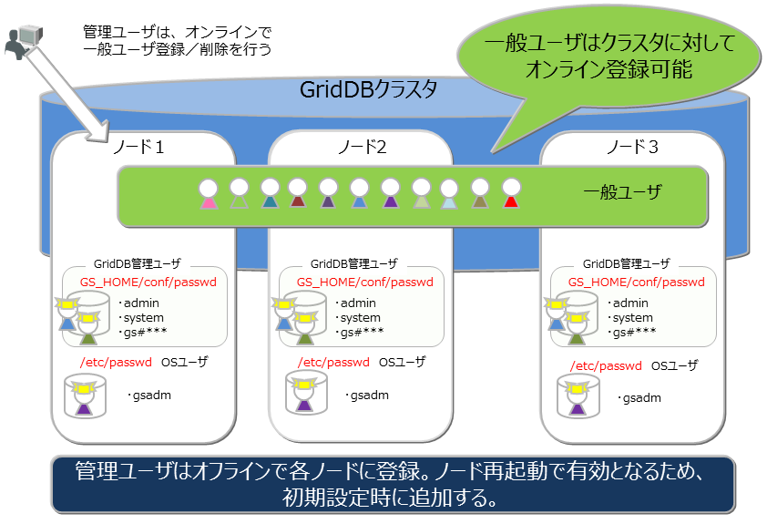
  <figcaption>GridDBのユーザ</figcaption>
</figure>


-   ユーザ作成時の規則

    ユーザ名には命名規則があります。
    -   管理ユーザ：『gs\#』で始まるユーザを指定します。『gs\#』以降は英数字およびアンダースコアのみで構成します。大文字と小文字は同一として扱うため、gs\#managerとgs\#MANAGERは同時には登録できません。

    -   一般ユーザ：英数字およびアンダースコアで指定します。ただし、先頭文字に数字は指定できません。また、大文字と小文字は同一として扱うため、userとUSERは同時には登録できません。管理ユーザのデフォルトユーザである、system,adminは作成できません。

    -   パスワード：指定できる文字に制限はありません。

    なお、ユーザ名およびパスワードに指定できる文字列は、それぞれ64文字です。

### 利用できる機能

管理ユーザができる運用操作と一般ユーザが利用できる操作を以下に示します。運用操作のうちGridDBユーザを用いずに、gsadmで実行可能なコマンドは◎印で明記します。

| 操作                   | 操作詳細                            | 利用する運用ツール                         | gsadm | 管理ユーザ | 一般ユーザ            |
|------------------------|-------------------------------------|--------------------------------------------|-------|------------|-----------------------|
| ノード操作             | ノードの起動                        | gs_startnode/gs_sh     |       | ○          | ×                     |
|                        | ノードの停止                        | gs_stopnode/gs_sh      |       | ○          | ×                     |
| クラスタ操作           | クラスタの構築                      | gs_joincluster/gs_sh   |       | ○          | ×                     |
|                        | クラスタへのノード増設              | gs_appendcluster/gs_sh【EE限定】 |       | ○          | ×                     |
|                        | クラスタからのノード離脱            | gs_leavecluster/gs_sh  |       | ○          | ×                     |
|                        | クラスタの停止                      | gs_stopcluster/gs_sh   |       | ○          | ×                     |
| ユーザ管理             | 管理ユーザ登録                      | gs_adduser                       | ◎     | ×          | ×                     |
|                        | 管理ユーザの削除                    | gs_deluser                       | ◎     | ×          | ×                     |
|                        | 管理ユーザのパスワード変更          | gs_passwd                        | ◎     | ×          | ×                     |
|                        | 一般ユーザの作成                    | gs_sh                            |       | ○          | ×                     |
|                        | 一般ユーザの削除                    | gs_sh                            |       | ○          | ×                     |
|                        | 一般ユーザのパスワード変更          | gs_sh                            |       | ○          | ○：本人のみ           |
| データベース管理       | データベースの作成・削除            | gs_sh                            |       | ○          | ×                     |
|                        | データベースへのユーザ割り当て/解除 | gs_sh                            |       | ○          | ×                     |
| データ操作             | コンテナやテーブルの作成・削除      | gs_sh                            |       | ○          | ○：本人のDB内で更新操作が可能な場合のみ     |
|                        | コンテナやテーブルへのデータ登録    | gs_sh                            |       | ○          | ○：本人のDB内で更新操作が可能な場合のみ     |
|                        | コンテナやテーブルの検索            | gs_sh                            |       | ○          | ○：本人のDB内のみ     |
|                        | コンテナやテーブルへの索引操作      | gs_sh                            |       | ○          | ○：本人のDB内で更新操作が可能な場合のみ     |
| バックアップ管理       | バックアップ作成                    | gs_backup【EE限定】                        |       | ○          | ×                     |
| バックアップ管理       | バックアップリストア                | gs_restore【EE限定】                       | ◎     | ×          | ×                     |
|                        | バックアップリスト                  | gs_backuplist【EE限定】                    |       | ○          | ×                     |
| システムステータス管理 | システム情報の取得                  | gs_stat                          |       | ○          | ×                     |
|                        | パラメータ変更                      | gs_paramconf                     |       | ○          | ×                     |
| データインポート/      | データのインポート                  | gs_import                        |       | ○          | ○：アクセスできる範囲 |
| エクスポート           | データのエクスポート                | gs_export                        |       | ○          | ○：アクセスできる範囲 |


### データベースとユーザ

GridDBのクラスタデータベース(以降クラスタデータベースと呼びます)を利用ユーザ単位にアクセスを分離することができます。分離する単位を **データベース** と呼びます。 データベースは、クラスタデータベースの初期状態では以下のデータベースがあります。

-   public
    -   管理ユーザ、一般ユーザのすべてがアクセスできるデータベースです。
    -   接続先データベースを指定せずに接続した場合はこのデータベースが利用されます。

データベースはクラスタデータベースに複数作成することができます。データベースの作成、削除、ユーザへの割り当ては管理ユーザが行います。

データベース作成時の規則は以下に示すとおりです。

-   クラスタデータベースに作成できるユーザ数、データベース数の上限は各々128個までです。
-   データベース名に指定可能な文字列は、英数字およびアンダースコア\_、ハイフン-、ドット.、スラッシュ/、イコール=です。ただし、先頭文字に数字は指定できません。
-   データベース名に指定できる文字列は、64文字です。
-   データベース名命名時の大文字・小文字は保持されますが、大文字小文字同一視した場合に同一名となるデータベースは作成できません。例えば、databaseとDATABASEは同時には登録できません。
-   デフォルトデータベースである「public」および「information_schema」は指定できません。

データベースへ一般ユーザを割り当てる際、権限を指定します。権限は以下の種類があります。
-   ALL
    -   コンテナ作成やロウ登録、検索、索引作成などコンテナに関するすべての操作が可能
-   READ
    -   検索の操作のみ可能

データベースにアクセスできるのは割り当てた一般ユーザと管理ユーザのみです。管理ユーザはすべてのデータベースにアクセスすることができます。 データベースへ一般ユーザを割り当てる際、以下規則があります。
-   1データベースに複数の一般ユーザを割り当てることができる
-   データベースに一般ユーザを割り当てる際、指定できる権限は1種類のみ
-   1データベースに複数の一般ユーザを割り当てる際、ユーザごとに異なる権限を指定することができる
-   1ユーザには複数のデータベースを割り当てることができる

<figure>

<figcaption>データベースとユーザ</figcaption>
</figure>

### 認証方式

GridDBの認証方式には、以下があります。
-   内部認証
-   LDAP認証

各方式について、説明します。

#### 内部認証

GridDBの管理/一般ユーザのユーザ名、パスワード、および権限をGridDBで管理します。認証方式を指定しない場合、内部認証がデフォルトです。

管理ユーザは、運用コマンドのgs_adduser/gs_deluser/gs_passwdで管理します。

一般ユーザは、SQLのCREATE USER/DROP USER/SET PASSWORD文で管理します。また、一般ユーザのアクセス権は、SQLのGRANT/REVOKE文で管理します。

**ユーザキャッシュ設定**

一般ユーザ情報のキャッシュの設定は、以下のノード定義ファイル(gs_node.json)を編集します。

【注意】
-   変更内容を反映するには、再起動が必要です。


| パラメータ                      | デフォルト | 設定値                 |
|---------------------------------|------------|------------------------|
| /security/userCacheSize |  1000       | キャッシュする一般ユーザ/LDAPユーザエントリ数を指定。 |
| /security/userCacheUpdateInterval |  60      | キャッシュの更新間隔（秒）を指定。|

#### LDAP認証【EE限定】

GridDBの一般ユーザをLDAPで管理します。また、LDAP内のユーザ名/グループ名と同じ名前のロールを作成し権限を操作することで、LDAPユーザの権限を管理します。また、認証処理の高速化のため、LDAPで管理するユーザ情報のキャッシュ機能を提供します。

【注意】
-   GridDBノードが稼働するサーバに、openldap2.4をインストールしてください。詳細は、openldapのマニュアルをご参照ください。
-   管理ユーザはLDAPで管理できません。常に内部認証を利用します。


**共通設定**

LDAP認証を利用する場合は、以下、クラスタ定義ファイル(gs_cluster.json)を編集します。

| パラメータ                      | デフォルト | 設定値                 |
|---------------------------------|------------|------------------------|
| /security/authentication | INTERNAL       | 認証方式として、INTERNAL(内部認証) / LDAP(LDAP認証)のいずれかを指定。 |
| /security/ldapRoleManagement | USER      | GridDBのロールとマッピングする対象として、USER(LDAPユーザ名でマッピング) / GROUP(LDAPグループ名でマッピング)のいずれかを指定。          |
| /security/ldapUrl           |       | LDAPサーバを次の形式で指定。ldap[s]://host[:port] |


【注意】
-   /security/ldapUrlに指定できるLDAPサーバは１台のみです。
-   サポートするLDAPサーバは以下です。
    -   OpenLDAP 2.4以降
    -   Active Directory スキーマバージョン87(Windows Server 2016以降)
-   変更内容を反映するには、再起動が必要です。


**ロール管理**

ロールは、SQLのCREATE ROLE / DROP ROLE文で管理します。/security/ldapRoleManagementが「USER」の場合はLDAPのユーザ名で、「GROUP」の場合はLDAPのグループ名でロールを作成します。作成したロールに対するアクセス権限は、SQLのGRANT/REVOKE文で管理します。

**LDAP認証モード設定**

次に、LDAPユーザの認証方法として、単純モード（直接ユーザアカウントでバインド）またはサーチモード（LDAP管理ユーザでバインド後に、ユーザを検索/認証）を選択します。以下、クラスタ定義ファイル(gs_cluster.json)を編集します。

【注意】
-   単純モードとサーチモードの同時指定はできません。
-   変更内容を反映するには、再起動が必要です。

■単純モード


| パラメータ                      | デフォルト | 設定値                 |
|---------------------------------|------------|------------------------|
| /security/ldapUserDNPrefix |         | ユーザのDN（識別子）を生成するために、ユーザ名の前に連結する文字列を指定。 |
| /security/ldapUserDNSuffix |        | ユーザのDN(識別子)を生成するために、ユーザ名の後に連結する文字列を指定。|


■サーチモード


| パラメータ                      | デフォルト | 設定値                 |
|---------------------------------|------------|------------------------|
| /security/ldapBindDn |         | LDAP管理ユーザのDNを指定。 |
| /security/ldapBindPassword |        | LDAP管理ユーザのパスワードを指定。|
| /security/ldapBaseDn |        | 検索を開始するルートDNを指定。|
| /security/ldapSearchAttribute |  uid     | 検索対象となる属性を指定。|
| /security/ldapMemberOfAttribute | memberof | ユーザが所属するグループDNが設定された属性を指定。(ldapRoleManagement=GROUPの場合に有効)|

**ユーザキャッシュ設定**

LDAPユーザ情報のキャッシュの設定は、以下のノード定義ファイル(gs_node.json)を編集します。

【注意】
-   変更内容を反映するには、再起動が必要です。


| パラメータ                      | デフォルト | 設定値                 |
|---------------------------------|------------|------------------------|
| /security/userCacheSize |  1000       | キャッシュする一般ユーザ/LDAPユーザエントリ数を指定。 |
| /security/userCacheUpdateInterval |  60      | キャッシュの更新間隔（秒）を指定。|

**設定例**

以下に設定例を記載します。条件は以下です

-   Active Directory(host=192.168.1.100 port=636)
-   ユーザDN (cn=TEST, ou=d1 ou=dev dc=example, dc=com)
-   ユーザは、sampleDB内を検索のみ可能
-   GridDBロールは、ユーザ名でマッピング
-   単純モードで認証

■ロールの設定例(SQL文)
``` example
 CREATE ROLE TEST
 GRANT SELECT ON sampleDB to TEST
```

■サーバの設定例（gs_cluster.jsonの一部抜粋）
``` example
            :
"security":{
    "authentication":"LDAP",
    "ldapRoleManagement":"USER",
    "ldapUrl":"ldaps://192.168.1.100:636",
    "ldapUserDnPrefix":"CN=",
    "ldapUserDnSuffix":",ou=d1,ou=dev,dc=example,dc=com",
    "ldapSearchAttribute":"",
    "ldapMemberOfAttribute": ""
},
            :
```


## セキュリティ機能【EE限定】

### 通信の暗号化

GridDBでは、GridDBクラスタとクライアント間のSSL接続をサポートします。

【注意】
-   GridDBノードが稼働するサーバに、OpenSSL 3.0.7以上をインストールしてください。


**設定**

SSL接続を行うためには、以下、クラスタ定義ファイル(gs_cluster.json)、およびノード定義ファイル(gs_node.json)を編集します。
そして、サーバ証明書および秘密鍵のファイルを適切なディレクトリに配置します。

【注意】
-   変更内容を反映するには、再起動が必要です。
-   GridDBクラスタを構成するノード間のSSL接続は未サポートです。GridDBクラスタは外部から直接アクセスできない安全なネットワーク上への配置を推奨します。
-  サーバ証明書検証の実施は指定できますが、ホスト名検証の実施は未サポートです。中間者攻撃を防止するために、独自CAによる証明書の利用を推奨します。
-  証明書失効リスト(CRL)による証明書失効確認は未サポートです。

■クラスタ定義ファイル(gs_cluster.json)

| パラメータ                      | デフォルト | 設定値                 |
|---------------------------------|------------|------------------------|
| /system/serverSslMode | DISABLED        | SSL接続設定として、DISABLED(SSL無効)、PREFERRED(SSL有効、ただし非SSL接続も許容)、REQUIRED(SSL有効、非SSL接続は不可)のいずれかを指定。 |
| /system/sslProtocolMaxVersion | TLSv1.2 | TLSプロトコルバージョンとして、TLSv1.2, TLSv1.3のいずれかを指定。 |

■ノード定義ファイル(gs_node.json)

| パラメータ                      | デフォルト | 設定値                 |
|---------------------------------|------------|------------------------|
| /system/securityPath | security        | サーバ証明書、秘密鍵の配置ディレクトリをフルパスもしくは、相対パスで指定。 |
| /system/serviceSslPort | 10045 | 運用コマンド用待ち受けSSLポート |

■サーバ証明書および秘密鍵

SSLを有効にする場合は、`/system/securityPath`に設定したディレクトリに、サーバ証明書および秘密鍵を
それぞれ次のファイル名で配置します。

- gs_node.crt: 証明書ファイル
- gs_node.key: 秘密鍵ファイル


**クライアント設定**

クライアント側で、SSL接続、サーバ証明書検証の実施を指定できます。詳細は各ツール、およびAPIリファレンスをご参照ください。

## 障害処理機能【EE限定】

GridDBでは、クラスタを構成する各ノードでデータのレプリカを保持するため、単一点故障に対してのリカバリは不要です。 GridDBでは障害発生時には以下のような動作を行います。


1.  障害発生時、障害ノードはクラスタから自動的に離脱する。
2.  離脱した障害ノードに代わり、バックアップノードへのフェイルオーバーが行われる。
3.  障害によりノード台数が減少するため、自律的にパーティションの再配置を行う（レプリカも配置する）。

障害の回復したノードはオンラインでクラスタ運用に組み込むことができます。障害によりUNSTABLEな状態となったクラスタには、gs_joinclusterコマンドを用いてノードを組み込めます。ノード組込みにより、自律的にパーティションの再配置が行われノードのデータ、負荷バランスが調整されます。

このように、単一点故障の場合にはリカバリのための事前の準備は不要ですが、シングル構成で運用する場合や、クラスタ構成においても複数の障害が重なった場合にはリカバリの操作が必要です。

クラウド環境で稼働させる場合、物理的なディスクの障害やプロセッサ障害で意図せずともクラスタを構成する複数ノードの障害、複数ノードでのデータベース障害といった多重障害となるケースがあります。

### 障害の種類と処置

発生する障害と対処方法の概要を以下の表に示します。

ノード障害とは、プロセッサ障害やGridDBのサーバプロセスのエラーによりノードが停止した状態、データベース障害とは、ディスクに配置したデータベースへのアクセスでエラーが発生した状態を指します。

| GridDBの構成 | 障害の種類           | 動作と処置                                                           |
|--------------|----------------------|----------------------------------------------------------------------|
| シングル構成 | ノード障害           | アプリケーションからアクセスはできなくなりますが、ノードの障害要因を取り除き再起動するだけで、処理が完了したトランザクションのデータはリカバリされます。ノード障害が長期化した際は、別ノードでのリカバリを検討します。                                                         |
| シングル構成 | データベース障害     | アプリケーションでエラーを検出するため、バックアップしたデータからデータベースファイルを復旧します。データはバックアップ時点に復旧されます。   |
| クラスタ構成 | 単一ノード障害       | アプリケーションにはエラーが隠ぺいされ、レプリカのあるノードで処理が継続できます。障害が発生したノードでのリカバリ操作は不要です。       |
| クラスタ構成 | 複数ノード障害       | レプリカのオーナ／バックアップの双方のパーティションが障害対象ノードに存在する場合、対象パーティションにアクセスができませんが、クラスタは正常に稼働します。ノードの障害要因を取り除き再起動するだけで、処理が完了したトランザクションのデータはリカバリされます。ノードの障害が長期化する場合は別ノードでのリカバリを検討します。                    |
| クラスタ構成 | 単一データベース障害 | 単一ノードでのデータベース障害は、クラスタを構成する他のノードでデータアクセスが継続するため、異なるディスクにデータベース配置先を変更し、ノードを再起動するだけでリカバリされます。                   |
| クラスタ構成 | 複数データベース障害 | レプリカで復旧できないパーティションは最新のバックアップデータからバックアップ採取時点にリカバリさせる必要があります。                 |


### クライアントフェイルオーバー

クラスタ構成で運用している際にノード障害が発生した場合、障害ノードに配置されているパーティション（コンテナ）にはアクセスできません。この時、クライアントAPI内で、自動的にバックアップノードに接続し直して処理を継続するクライアントフェイルオーバー機能が動作します。クライアントAPI内で自動的に障害対策を行うため、アプリケーション開発者はノードのエラー処理を意識する必要がありません。

しかし、複数のノードの同時障害やネットワーク障害などにより、アプリケーション操作対象にアクセスできずエラーになることもあります。

エラー発生後のリカバリではアクセス対象のデータに応じて以下の点を考慮する必要があります。

-   時系列コンテナやロウキーが定義されているコレクションの場合、失敗した操作またはトランザクションを再実行すればリカバリできます。

-   ロウキーが定義されていないコレクションの場合データベースの内容チェックをした上で、再実行する必要があります。

【メモ】
- アプリケーションでのエラー処理を単純化するためにコレクションを使う場合は、ロウキーの定義を推奨します。 単一のカラム値での一意化ができない場合で、複数のカラム値で一意化できる場合は、複数カラムの値を連結した値を持つカラムをロウキーにし、データを一意に識別できるようにすることを推奨します。

### 自動再起動機能

GridDBノードが異常終了した場合、またはノードプロセスが強制終了された場合、自動的にノードの再起動、およびクラスタ参加を実行します。 運用管理者が意識せずに、クラスタの状態を正常稼働に戻すことができます。

<figure>
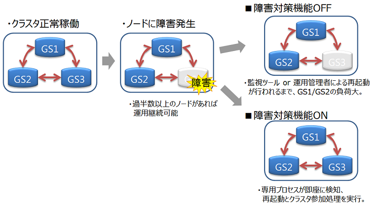
<figcaption>障害対策機能</figcaption>
</figure>

【注意】

以下の場合は自動起動処理を実施しません。
-   ユーザが明示的に設定を無効にしたとき
-   回復不可能な障害が発生したとき (ノードステータス: ABNORMAL)
-   自動起動を5回以上試行したとき
-   障害発生前のノードがクラスタに参加していなかったとき

**設定**

障害対策機能の設定は以下になります。

| パラメータ                      | デフォルト | 設定値                 |
|---------------------------------|------------|------------------------|
| SVC_ENABLE_AUTO_RESTART | true       | true(有効)/false(無効) |
| GS_USER               | admin      | 適宜                   |
| GS_PASSWORD           | admin      | 適宜                   |

パラメータを変更するには起動設定ファイル( `/etc/sysconfig/gridstore/gridstore.conf` )を編集します。

- SVC_ENABLE_AUTO_RESTART
  - GridDBノードの起動時（再起動時）に設定が有効になります。
  - 別の監視システムで、GridDBの障害復旧の制御を行いたい場合は、本障害対応機能を無効にしてください。

- GS_USER/GS_PASSWORD
  - GridDBの管理者ユーザ、およびパスワードを設定します。
  - ユーザ/パスワードは以下のケースで利用します。
    - サービスによる起動、停止、再起動する場合
    - gs_startnodeで、-uオプションが指定されていない場合

【注意】
-   指定したGS_USER/GS_PASSWORDに誤りがある、もしくはユーザ/パスワードが指定されていない場合には、 GridDBノードの起動に失敗します。


## エクスポート/インポート機能

GridDBのエクスポート/インポートでは、データベースの局所的な破壊に対して復旧を行う障害回復処理や、システム構成が変更された際のデータベースの移行(マイグレーション)処理などを実現するために、データベースやコンテナ単位での保存/復元機能を提供します。

GridDBクラスタでは、コンテナデータをクラスタ内のノードに自動的に配置します。利用者は、どのノードにデータが配置されているかを意識する必要はありません(データの位置透過）。
エクスポート／インポートでも、データの取り出し・登録で配置位置を意識する必要はありません。エクスポート／インポートの構成は以下のとおりです。

<figure>

<figcaption>エクスポート／インポートの構成</figcaption>
</figure>

【エクスポート(export)】

① GridDBクラスタのコンテナおよびロウデータを、以下のファイルに保存します。コンテナ名を指定して特定コンテナのみエクスポートすることもできます。
-   **コンテナデータファイル**
    -   GridDBのコンテナ情報とロウデータを保存します。
    -   コンテナ単位に保存する形式と複数コンテナをまとめて保存する形式の２種類があります。
-   **エクスポート実行情報ファイル**
    -   エクスポート実行時の情報を保存します。エクスポートしたデータを、そのままGridDBクラスタに復元するために必要です。

【インポート(import)】

② エクスポートデータを保存したコンテナデータファイルとエクスポート実行情報ファイルを読み込んで、コンテナおよびロウデータをGridDBに復元します。特定のコンテナデータを指定して、インポートすることもできます。

③ ユーザが作成したコンテナデータファイルを読み込んで、コンテナとロウデータを登録します。

【メモ】
-   エクスポートしたコンテナデータファイルとユーザが作成するコンテナデータファイルは同じフォーマットです。
-   エクスポート中のコンテナに対してデータの登録や更新を行うと、エクスポート結果に反映される場合があります。


## バックアップ/リストア機能【EE限定】

データベース障害やアプリケーションの誤動作によるデータ破壊に備えるために、定期的なバックアップの採取が必要です。バックアップ運用は、サービスレベルの要求やシステムのリソースに応じて対処方法を選択する必要があります。

バックアップ方式と、それぞれの方式について以下の項目を説明します。

- バックアップ運用
  - バックアップの種類とバックアップの利用方法について説明します。
- 障害からのリカバリ
 - 障害の検出と障害からのリカバリ方法を説明します。

### バックアップ方式

データベース障害やアプリケーションの誤動作によるデータ破壊に備えるために、定期的なバックアップの採取が必要です。 バックアップ運用は、障害発生時のリカバリの要件（いつの時点にリカバリするか）、クラスタとしての一貫性保持の必要性、バックアップにかかる時間、バックアップのために用意できるディスクの容量に応じて、バックアップの種別やバックアップの間隔を決定します。リカバリ保証のサービスレベルからの要求やシステムのリソースに応じて対処方法を選択する必要があります。 GridDBのバックアップ方式には、以下のものがあります。

| バックアップ方式                                                      | 復旧時点                 | 特徴                                                                                                                                                                                                                                             |     |
|-----------------------------------------------------------------------|--------------------------|--------------------------------------------------------------------------------------------------------------------------------------------------------------------------------------------------------------------------------------------------|-----|
| オフラインバックアップ                                                | クラスタ停止時点         | バックアップのコピー完了までクラスタ停止が必要です。 ノード間で復旧時点が異なることはありません。                                                                                                                                                |     |
| オンラインバックアップ（フル+差分・増分）                             | バックアップ採取完了時点 | GridDBバックアップコマンドを利用します。バックアップの取得完了のタイミングにより、ノード間で復旧時点が異なることがあります。                                                                                                                     |     |
| オンラインバックアップ（自動ログ）                                    | 障害直前の時点           | GridDBバックアップコマンドを利用します。トランザクションログから最新状態にリカバリするため、起動時間が長くなることがあります。                                                                                                                   |     |
| ファイルシステムレベルのオンラインバックアップ（クラスタスナップショット）  | スナップショット取得時点 | クラスタスナップショット機能を用い、OSやストレージのスナップショットと連携してバックアップを取得します。 |     |


オフラインバックアップを行うには、まずgs_stopclusterコマンドでクラスタを停止してから、クラスタを構成する全ノードを停止してください。 次に、各ノードのデータベースファイルの配置ディレクトリ（gs_node.jsonの/dataStore/dbPath、/dataStore/transactionLogPathで示すディレクトリ）下のデータをバックアップしてください。

GridDBのオンラインバックアップの機能については、[ノード単位のオンラインバックアップとリカバリ操作](#online_backup_and_recovery_operations)を参照ください。

GridDBのオンラインバックアップ機能を使用せず、ファイルシステムレベルのオンラインバックアップを行う場合は、[ファイルシステムレベルのオンラインバックアップとリカバリ操作（クラスタスナップショット機能の利用）](#file_system_level_backup_and_recovery_operations)を参照ください。


【注意】
-   オンラインバックアップを実行する前に、複数コンテナにまたがった更新処理は停止してください。GridDBクラスタとして論理的に不整合な状態のバックアップ作成を防止できます。
-   クラスタスナップショットまたはオンラインバックアップ中にノード障害が発生した場合、オンラインバックアップを中断し、1台目から再実行してください。ノード障害後のパーティションの再配置（リバランス）により、必要なデータがバックアップされないことを防止できます。
-   ファイルシステムレベルのオンラインバックアップ（クラスタスナップショット）は、クラスタの一貫性を保持するため、クラスタスナップショット取得時点で全パーティションの状態がSTABLEであるときに実行することを推奨します。復元処理後クラスタ再構成しても同期処理が発生しません。


**定義ファイルのバックアップ**

バックアップでは、データベースファイルの定期的なバックアップに加え、定義ファイルのバックアップも必要です。

$GS_HOME/confディレクトリ（デフォルトでは、/var/lib/gridstore/conf）にあるノード定義ファイル（gs_node.json)、クラスタ定義ファイル（gs_cluster.json)、ユーザ定義ファイル（password）のバックアップをOSのコマンドを用いて採取しておいてください。

定義ファイルのバックアップは、設定変更やユーザ登録・変更した場合には、必ず実施してください。


<a id="online_backup_and_recovery_operations"></a>
### ノード単位のオンラインバックアップとリカバリ操作

#### バックアップ運用

GridDBの障害に備えたバックアップ運用について説明します。

##### バックアップの種類

GridDBでは、ノード単位のオンラインバックアップが可能です。これをGridDBクラスタを構成する全ノードに対して順次行うことで、サービスを継続しながら、クラスタ全体としてオンラインバックアップが行えます。ただし、この方法でクラスタ全体としてのバックアップを取得した場合は、クラスタとしての一貫性保持はなされないため、バックアップから復元してクラスタを再構築したあとで同期処理が実行される可能性が高いです。クラスタとしての一貫性保持を優先する場合は「クラスタスナップショットによるオンラインバックアップ」の使用を検討してください。

 GridDBの提供するオンラインバックアップの種類には以下のものがあります。

| バックアップ種別       | バックアップの動作                | 復旧時点                       |     |
|------------------------|--------------------------------|--------------------------------|-----|
| フルバックアップ       | 現在利用中のクラスタデータベースをノード定義ファイルで指定したバックアップディレクトリにノード単位にオンラインでバックアップする。 | フルバックアップ採取時点 |
| 差分・増分バックアップ | 現在利用中のクラスタデータベースをノード定義ファイルで指定したバックアップディレクトリにノード単位にオンラインでバックアップし、以降のバックアップでは、バックアップ後の更新ブロックの差分増分のみをバックアップする。 | 差分増分バックアップ採取時点 |
| 自動ログバックアップ   | 現在利用中のクラスタデータベースをノード定義ファイルで指定したバックアップディレクトリにノード単位にオンラインでバックアップするとともに、トランザクションログファイルの書き込みと同じタイミングでトランザクションログも自動で採取します。トランザクションログファイルの書き込みタイミングは、ノード定義ファイルの/dataStore/logWriteModeの値に従います。 | 最新トランザクションの更新時点 |

利用するバックアップの種類に応じて復旧できる時点が異なります。

GridDBの提供する各バックアップの動作と、利用を推奨するシステムについて以下に示します

-   フルバックアップ

    参照系のシステムでは、データ更新が行われる夜間バッチなどの後にフルバックアップを採取します。フルバックアップはすべてのデータベースファイルのデータをコピーするため、時間がかかります。また、バックアップ採取先のデータ容量としてデータベースファイルと同じ容量が必要です。

    また、バックアップを何世代保持するのかに応じて、実データベースサイズの掛け算でバックアップディスク容量が必要です。

<figure>

<figcaption>フルバックアップ</figcaption>
</figure>


-   差分・増分バックアップ

    フルバックアップで全データベースのバックアップを採取後、更新されたデータの差分のみをバックアップできます。 バックアップを短時間に行いたいシステムで、夜間のバッチ運用でバックアップを自動的に、月1回のフルバックアップ(ベースライン作成）、1週間に1回の差分（since）バックアップ、毎日増分バックアップ（incremental)などのように計画的な運用を行うシステムに向いています。

    増分バックアップは、更新データのみを用いたバックアップのため、フルバックアップや差分バックアップと比較して高速にバックアップが行えます。しかし障害発生時のリカバリではフルバックアップのデータに対して更新ブロックをロールフォワードする必要があるため、リカバリに時間がかかります。定期的なBaselineやSince指定での差分バックアップが必要です。

<figure>
  
  <figcaption>差分・増分バックアップ</figcaption>
</figure>


-   自動ログバックアップ

    自動ログバックアップ指定でのフルバックアップ(ベースライン作成）採取以降、更新ログがバックアップディレクトリに収集されます。自動的にトランザクションログが採取されるため、バックアップ操作は不要です。運用を省力化する場合やバックアップでシステムに負荷を与えたくない場合に指定します。ただし、定期的にBaselineを更新しない場合、障害発生時のリカバリで利用するトランザクションログファイルが増え、リカバリに時間がかかることになります。差分・増分バックアップでは、同じブロックのデータが更新された場合に1つのデータとしてバックアップされますが、自動ログバックアップでは更新の都度のログが採取されるため、障害回復時のリカバリには、差分・増分よりも時間がかかります。

<figure>
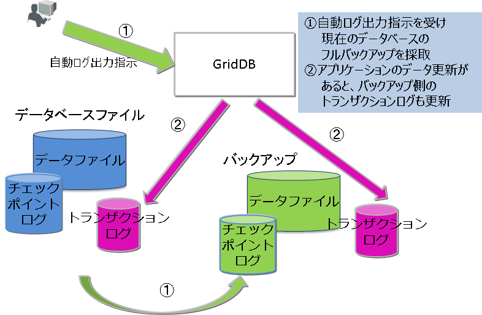
<figcaption>自動ログバックアップ</figcaption>
</figure>

【注意】
-   差分・増分バックアップ、自動ログバックアップでも障害発生時のリカバリ時間を短縮するにはベースラインとなるフルバックアップを定期的に採取する必要があります。

バックアップの種別は、コマンドのオプションで指定します。

##### バックアップ関連パラメータの確認

バックアップ先は、ノード定義ファイルの　/dataStore/backupPathで指定します。ディスクの物理障害を考慮して、バックアップ先とデータベースファイル（/dataStore/dbPath、/dataStore/transactionLogPath）は必ず異なる物理ディスクに配置するように設定してください。

トランザクションのログ永続化には２つのモードがあります。デフォルト値はNORMALです。
-   NORMAL：チェックポイントにより、不要になったトランザクションログファイルは削除されます。
-   KEEP_ALL_LOG：全てのトランザクションログファイルを残します。

KEEP_ALL_LOGは、他社のバックアップソフトウェアとの連携等でログファイルの削除を指示する運用を行うなど特別な用途の場合のみ指定しますが、通常は利用しません。

ノード定義ファイルの指定例を以下に示します。

``` example
$ cat /var/lib/gridstore/conf/gs_node.json         # 設定の確認例
{
    "dataStore":{
        "dbPath":"/var/lib/gridstore/data",
        "transactionLogPath":"/var/lib/gridstore/txnlog",
        "backupPath":"/mnt/gridstore/backup",      # バックアップディレクトリ
        "storeMemoryLimit":"1024",
        "concurrency":2,
        "logWriteMode":1,
        "persistencyMode":"NORMAL"                 #永続化モード
　　　　　　：
　　　　　　：
}
```

##### バックアップの実行

フルバックアップ、差分・増分バックアップ、自動ログバックアップの各々の利用方法を説明します。

どのバックアップでも、バックアップ名（BACKUPNAME)を指定してバックアップを実行します。バックアップで作成されるデータは、ノード定義ファイルのbackupPathで指定したディレクトリ下にバックアップ名（BACKUPNAME）と同じ名前のディレクトリが作成され、配置されます。

BACKUPNAMEは、12文字以内の英数字で指定できます。

##### フルバックアップ

障害発生時、フルバックアップの採取完了時点までリカバリできます。 フルバックアップをクラスタを構成するすべてのノードに対して実施します。バックアップデータはコマンドのBACKUPNAMEで示すディレクトリに配置されます。採取したバックアップデータをわかりやすく管理するためにBACKUPNAMEに日付を指定する運用をお勧めします。

以下のコマンドをクラスタ内の全ノードに対して実行します。

``` example
$ gs_backup -u admin/admin 20141025
```

この例では、
1.  バックアップ名（BACKUPNAME)を「20141025」とすると、バックアップディレクトリ下に「20141025」というディレクトリが作成されます。
2.  「20141025」ディレクトリに、バックアップ情報ファイル(gs_backup_info.json,gs_backup_info_digest.json)とLSN情報ファイル(gs_lsn_info.json)が作成されます。また、「data」ディレクトリにデータファイルとチェックポイントログファイル、「txnlog」ディレクトリにトランザクションログファイルが作成されます。

``` example
/var/lib/gridstore/backup/
        20141025/                           # バックアップディレクトリ                
                gs_backup_info.json         # バックアップ情報ファイル
                gs_backup_info_digest.json  # バックアップ情報ファイル
                gs_lsn_info.json            # LSN情報ファイル
                data/
                    0/                      # パーティション番号0
                        0_part_0.dat        # データファイルバックアップ
                        0_117.cplog         # チェックポイントログバックアップ
                        0_118.cplog         
                        ...
                    1/                      
                    2/                                           
                    ...
                txnlog/
                    0/                      # パーティション番号0
                        0_120.xlog          # トランザクションログバックアップ
                        0_121.xlog         
                    1/
                    2/                     
                    ...
```

バックアップコマンドは、バックアップの指示をサーバに通知するだけで、処理の完了は待ち合わせません。

バックアップ処理の完了は、gs_statコマンドのステータスで確認してください。

``` example

$ gs_backup -u admin/admin 20141025
$ gs_stat -u admin/admin --type backup
BackupStatus: Processing
```

-   バックアップ状態(BackupStatus)は、以下のいずれかになります。
    -   Processing : 実行中
    -   \- : 完了もしくは未稼働

バックアップが正しく採取できたか否かは、gs_backuplistコマンドのステータスで確認できます。

``` example
$ gs_backuplist -u admin/admin

BackupName   Status   StartTime                EndTime
------------------------------------------------------------------------
 20141025NO2     P   2014-10-25T06:37:10+0900 -
 20141025        NG  2014-10-25T02:13:34+0900 -
 20140925        OK  2014-09-25T05:30:02+0900 2014-09-25T05:59:03+0900
 20140825        OK  2014-08-25T04:35:02+0900 2014-08-25T04:55:03+0900
```

バックアップリストのStatusの記号を以下に示します。
-   P ：バックアップ実行中
-   NG : バックアップ実行中にエラーが発生し、バックアップデータが異常
-   OK : 正常にバックアップが採取されている

##### 差分・増分ブロックバックアップ

障害発生時、ベースライン（基準点）となるフルバックアップとベースライン以降の差分・増分バックアップを用いて、最後の差分・増分バックアップ採取時点まで復旧できます。 差分・増分バックアップのベースラインとしてフルバックアップを取得し、以降差分・増分バックアップを指定します。

データの更新容量とリカバリにかかる時間のサービス目標に応じてバックアップの採取間隔は検討する必要がありますが、以下を目安として運用してください。

-   ベースラインのフルバックアップ（baseline)　：　一か月毎に実行
-   ベースライン以降の更新ブロックの差分バックアップ（since)　：　一週間毎に実行
-   ベースラインや差分バックアップ以降の更新ブロックの増分バックアップ（incremental)　：　毎日実行

フルバックアップのベースライン作成は、以下のように指定します。この例ではBACKUPNAMEは「201504」です。

``` example
$ gs_backup  -u admin/admin --mode baseline 201504
$ gs_stat -u admin/admin --type backup
BackupStatus: Processing(Baseline)
```

バックアップのベースラインとして、データディレクトリにあるデータベースファイルが、バックアップディレクトリ下にコピーされます。

ベースライン作成後の定期的な差分・増分ブロックのバックアップ（ベースラインのフルバックアップ以降に更新されたデータブロックのバックアップ）は、バックアップコマンド（gs_backup）のモードとしてincrementalやsinceを指定します。BACKUPNAMEには、ベースライン作成時のBACKUPNAMEと同じ値を指定します。この例ではBACKUPNAMEは『201504』です。

``` example
*****　増分バックアップの場合
$ gs_backup  -u admin/admin --mode incremental 201504
$ gs_stat  -u admin/admin --type backup
BackupStatus: Processing(Incremental)

*****　差分バックアップの場合
$ gs_backup  -u admin/admin --mode since 201504
$ gs_stat  -u admin/admin --type backup
BackupStatus: Processing(Since)
```

バックアップが正しく採取できたか否かはgs_backuplistコマンドで確認できます。差分・増分バックアップは、複数のバックアップで1つのリカバリ単位となるため、BACKUPNAMEの一覧では1つとして扱われます。したがってステータスの詳細を見るには、バックアップ名を指定して詳細を確認します。

差分・増分バックアップであるというこことはBACKUPNAMEの先頭に"\*"：アスタリスクがついていることで確認できます。差分・増分のバックアップのステータスは常に"--"です。

差分・増分バックアップのステータスは、gs_backuplistコマンドの引数にBACKUPNAMEを指定することで確認できます。

``` example
*****　BACKUPNAMEの一覧を表示します
$ gs_backuplist -u admin/admin

BackupName   Status   StartTime                EndTime
------------------------------------------------------------------------
*201504          --  2015-04-01T05:20:00+0900 2015-04-24T06:10:55+0900
*201503          --  2015-03-01T05:20:00+0900 2015-04-24T06:05:32+0900
  :
 20141025NO2     OK   2014-10-25T06:37:10+0900 2014-10-25T06:37:10+0900

*****　個別のBACKUPNAMEを指定し、詳細情報を表示します
$ gs_backuplist -u admin/admin 201504

BackupName : 201504

BackupData            Status   StartTime                EndTime
--------------------------------------------------------------------------------
201504_lv0                OK  2015-04-01T05:20:00+0900 2015-04-01T06:10:55+0900
201504_lv1_000_001        OK  2015-04-02T05:20:00+0900 2015-04-01T05:20:52+0900
201504_lv1_000_002        OK  2015-04-03T05:20:00+0900 2015-04-01T05:20:25+0900
201504_lv1_000_003        OK  2015-04-04T05:20:00+0900 2015-04-01T05:20:33+0900
201504_lv1_000_004        OK  2015-04-05T05:20:00+0900 2015-04-01T05:21:15+0900
201504_lv1_000_005        OK  2015-04-06T05:20:00+0900 2015-04-01T05:21:05+0900
201504_lv1_001_000        OK  2015-04-07T05:20:00+0900 2015-04-01T05:22:11+0900
201504_lv1_001_001        OK  2015-04-07T05:20:00+0900 2015-04-01T05:20:55+0900
```

差分・増分のバックアップデータは、バックアップディレクトリに以下の規則でディレクトリが作成され、データが配置されます。

-   BACKUPNAME_lv0 : 差分・増分バックアップのベースラインのバックアップデータが配置されます。lv0固定です。
-   BACKUPNAME_lv1_NNN_MMM : 差分・増分バックアップの差分（Since）と増分（Incremental)のバックアップデータが配置されます。
    -   NNNは、差分バックアップ時に数字がカウントアップされます。
    -   MMMは、差分バックアップ時に000にクリアされ、増分バックアップ時に数字がカウントアップされます。

バックアップリストのStatusの記号を以下に示します。
-   P ：バックアップ実行中
-   NG : バックアップ実行中にエラーが発生し、バックアップデータが異常
-   OK : 正常にバックアップが採取されている

差分・増分バックアップでは、BackupDataディレクトリ/dataディレクトリ/<パーティション番号>ディレクトリの下に、<パーティション番号>_n_incremental.cplogという名前で更新ブロックのログが出力されます。(※nは数値)

差分・増分バックアップはフルバックアップと比較してバックアップ時間を削減できます。しかし障害発生時のリカバリにはフルバックアップのデータに更新ブロックをロールフォワードするため、リカバリには時間がかかります。 定期的なベースライン取得やSince指定によるベースラインからの差分バックアップを実施してください。

【注意】
-   クラスタ構成変更やシステムの負荷に応じてパーティションは自動配置されます（リバランス）。パーティションの配置が変更となった後に差分ログバックアップを指定すると、『パーティション状態変更によりログバックアップできない』というエラーが通知されます。この場合、必ずクラスタを構成する全ノードのバックアップ(baseline)を採取してください。パーティションの再配置（リバランス）は以下のようなクラスタ構成変更でも発生します。
    -   ノード追加によるクラスタ構成台数の増加
    -   障害発生等で発生するノードの切り離しによるクラスタ構成台数の縮小

##### 自動ログバックアップ

GridDBが自動的にトランザクションログをバックアップディレクトリに出力します。従って、常に最新の状態にリカバリすることができます。 自動的なバックアップ操作のため、『システムの利用時間の低い時間にあらかじめスケジューリングしてバックアップ処理をしたい』といったシステムの運用形態に応じた計画的なバックアップはできません。また、自動ログバックアップにより、通常運用中にも多少のシステム負荷が発生します。従って、システムのリソースに余裕がある場合にのみ本指定を用いることをお勧めします。

自動ログバックアップを利用するには次のように指定します。この例ではBACKUPNAMEは「201411252100」です。

``` example
$ gs_backup -u admin/admin --mode auto 201411252100
$ gs_stat -u admin/admin --type backup
```

コマンドを実行するとBACKUPNAMEで示すディレクトリにバックアップを取得します。
-   自動ログバックアップでは、バックアップ中のエラーに対する動作設定が、オプションmodeで指定できます。
    -   auto :バックアップエラー時、ノードはABNORMAL状態となり停止する。
    -   auto_nostop ：バックアップエラーでバックアップは不完全な状態となるが、ノードは運用を継続する。

この例では、
1.  バックアップディレクトリ下に「201411252100」というディレクトリが作成されます。
2.  「201411252100」ディレクトリに、バックアップ情報ファイル(gs_backup_info.json,gs_backup_info_digest.json)とLSN情報ファイル(gs_lsn_info.json)が作成されます。また、「data」ディレクトリにデータファイルとチェックポイントログファイル、「txnlog」ディレクトリにトランザクションログファイルが作成されます。
3.  「201411252100/txnlog」ディレクトリの下にトランザクションの実行完了とともにトランザクションログファイルが作成されます。

自動ログバックアップで運用した場合、障害発生時のリカバリは、2)のフルバックアップデータに対して、3)のトランザクションログファイルをロールフォワードします。従ってリカバリに利用するログファイルが多数になるとリカバリ時間が増大しますので、定期的に、--mode autoを指定してフルバックアップを採取してください。

##### バックアップ動作の確認

現在実行しているバックアップのモードや実行状態の詳細はgs_statコマンドで取得できる情報でも確認できます。

``` example
$ gs_stat -u admin/admin

    "checkpoint": {
        "backupOperation": 3,
        "duplicateLog": 0,
        "endTime": 0,
        "mode": "INCREMENTAL_BACKUP_LEVEL_0",
        "normalCheckpointOperation": 139,
        "pendingPartition": 1,
        "requestedCheckpointOperation": 0,
        "startTime": 1429756253260
    },
        ：
        ：
```

gs_statで出力されるバックアップ関連の各パラメータの意味は以下のとおりです。
-   backupOperation ：システム起動後のバックアップ実行回数です。
-   duplicateLog : 自動ログバックアップが行われ、ログの2重出力が行われているか否かを示します。
    -   0:自動ログバックアップoff
    -   1:自動ログバックアップon
-   endtime :バックアップやチェックポイント実行中は、"0"です。処理が完了すると時刻が設定されます。
-   mode :バックアップやチェックポイントの処理名が表示されます。実行中もしくは最後に実行されたバックアップの処理名が表示されます。
    -   BACKUP : フルバックアップや自動ログバックアップでのフルバックアップの実行
    -   INCREMENTAL_BACKUP_LEVEL_0: 差分・増分バックアップのベースライン作成
    -   INCREMENTAL_BACKUP_LEVEL_1_CUMULATIVE : ベースラインからの差分バックアップ
    -   INCREMENTAL_BACKUP_LEVEL_1_DIFFERENTIAL : 前回のバックアップからの増分バックアップ

##### コンテナ情報の採取

データベース障害発生時には、どのコンテナがリカバリ対象なのかを把握してコンテナの使用者に連絡するなどの手立てが必要です。リカバリ対象のコンテナを検出するには、定期的に以下の情報を採取している必要があります。
-   パーティションに配置されているコンテナ一覧
    -   コンテナはアプリケーションシステムの仕様に応じて、動的に作成されパーティションに配置されるため、gs_shコマンドで定期的にコンテナ一覧とパーティション配置の一覧を出力しておく必要があります。

コンテナ一覧を出力するgs_shのコマンドスクリプトを作成しておくことで運用の省力化が図れます。

以下の例では、gs_shのサブコマンドをlistContainer.gshというファイル名で作成します。

``` example
setnode node1 198.2.2.1  10040
setnode node2 198.2.2.2  10040
setnode node3 198.2.2.3  10040
setcluster cl1 clusterSeller 239.0.0.20 31999 $node1 $node2 $node3
setuser admin admin gstore
connect $cl1
showcontainer
connect $cl1 db0
showcontainer
 :   dbの数だけ繰り返す
quit
```

クラスタを構成するノードを示すnode1,node2,node3といったノード変数や、cl1というクラスタ変数、ユーザ設定やデータベース情報は適宜環境に合わせて変更してください。

gs_shのスクリプトファイルを以下のように実行することで、コンテナとパーティションの一覧が採取できます。

``` example
$ gs_sh listContainer.gsh>`date +%Y%m%d`Container.txt
```

20141001Container.txtには以下の形式で情報が保存されます。

``` example
Database : public
Name                  Type         PartitionId
------------------------------------------------
container_7           TIME_SERIES            0
container_9           TIME_SERIES            7
container_2           TIME_SERIES           15
container_8           TIME_SERIES           17
container_6           TIME_SERIES           22
container_3           TIME_SERIES           25
container_0           TIME_SERIES           35
container_5           TIME_SERIES           44
container_1           TIME_SERIES           53
：
 Total Count: 20

Database : db0
Name                  Type         PartitionId
---------------------------------------------
CO_ALL1              COLLECTION           32
COL1                 COLLECTION          125
 Total Count: 2
```


#### リカバリ操作

障害発生時のリカバリ操作の概要は以下のとおりです。
1.  障害の認識とリカバリ範囲の確認
2.  リカバリ操作とノード起動
3.  ノードのクラスタへの組込み
4.  復旧結果の確認と操作

##### 障害の認識とリカバリ範囲の確認

GridDB内で障害が発生すると、エラーが発生したノードのイベントログファイルに障害の原因が出力されるとともに、ノードの動作が継続不能と判断した際は、ノードがABNORMAL状態となり、クラスタサービスから切り離されます。

クラスタ構成では、通常複数レプリカが存在する運用を実施しているため、ノードがABNORMAL状態となってもクラスタサービスが停止することはありません。パーティションがレプリカも含めてすべて障害となった場合、データのリカバリが必要です。

データのリカバリが必要か否かは、マスタノードのステータスをgs_statで確認し、/cluster/partitionStatusの値が"OWNER_LOSS"の場合はリカバリが必要です。

``` example
$ gs_stat -u admin/admin -p 10041
{
    "checkpoint": {
        ：
    },
    "cluster": {
        "activeCount": 2,
        "clusterName": "clusterSeller",
        "clusterStatus": "MASTER",
        "designatedCount": 3,
        "loadBalancer": "ACTIVE",
        "master": {
            "address": "192.168.0.1",
            "port": 10011
        },
        "nodeList": [
            {
                "address": "192.168.0.2",
                "port": 10011
            },
            {
                "address": "192.168.0.3",
                "port": 10010
            }
        ],
        "nodeStatus": "ACTIVE",
        "partitionStatus": "OWNER_LOSS",     ★
        "startupTime": "2014-10-07T15:22:59+0900",
        "syncCount": 4
          :
```

リカバリしなければならないデータは、gs_partitionコマンドで確認します。--lossオプションを指定してコマンドを実行することで問題のあるパーティションが確認できます。

以下の例では192.168.0.3のノードの問題によりパーティション68がエラーになっています。


``` example
$ gs_partition -u admin/admin -p 10041 --loss

[
 {
        "all": [
            {
                "address": "192.168.0.1",
                "lsn": 0,
                "port": 10011,
                "status": "ACTIVE"
            },
            ：
            ：
            ,
            {
                "address": "192.168.0.3",
                "lsn": 2004,
                "port": 10012,
                "status": "INACTIVE"   <---　このノードのステータスがACTIVEでない
            }
        ],
        "backup": [],
        "catchup": [],
        "maxLsn": 2004,
        "owner": null,           //クラスタ内でパーティションのオーナが不在の状態
        "pId": "68",             //リカバリが必要なパーティションID     
        "status": "OFF"
   },
   {
     :

   }
  ]
```

##### リカバリ操作とノード起動

###### バックアップデータからのリカバリ

ディスク障害などで、利用しているシステムの問題でデータベースに問題が発生した場合、バックアップデータからリカバリします。リカバリ時は以下のことに注意する必要があります。

【注意】
-   クラスタ定義ファイルの、パーティション数と処理並列度のパラメータ値には注意してください。 バックアップしたノードの設定値とリストアするノードの設定値は同一にしてください。同一でないと正しくノードが起動できません。
-   データファイル分割を行う設定となっている場合はノード定義ファイルの分割数のパラメータ値に注意してください。バックアップしたノードの分割数とリストアするノードの分割数は同一にしてください。同一でないとリストアに失敗します。
-   特定の時点にクラスタデータベースをリカバリしたい場合、バックアップ、リストアの作業をクラスタ全体で行う必要があります。
-   クラスタ運用で一部のノードをリストアした場合には、他のノードで保持するレプリカの方が有効となり（LSN情報が新しい場合に発生）、リストアしたバックアップデータベースの状態に戻すことができない場合があります。
-   特に、バックアップを作成した時点からクラスタの構成が変化している場合には、リストアの効果がありません。そのノードをクラスタに参加させると自律的にデータを再配置するので、リストアしても高い確率でデータが無効になります。
-   バックアップ情報ファイルの情報が欠けている場合、または内容を改変した場合は、GridDBノードはサービスを開始できません。

GridDBノードにバックアップデータをリストアします。

バックアップしたデータからリストアする場合、以下の手順で操作を行います。

1.  ノードが起動していないことを確認します。
    -   クラスタ定義ファイルが、参加させるクラスタの他のノードと同一であることを確認します。

2.  リカバリに利用するバックアップ名を確認します。この操作はノード上で実行します。
    -   バックアップのステータスを確認し、正しくバックアップされているものを選択します。

3.  ノードのデータベースファイルディレクトリ(デフォルトでは、/var/lib/gridstore/data, /var/lib/gridstore/txnlog)に過去のデータファイル、チェックポイントログファイル、トランザクションログファイルが残っていないことを確認します。
    -   不要であれば削除、必要であれば別のディレクトリに移動してください。

4.  ノードを起動するマシン上で、リストアコマンドを実行します。
5.  ノードを起動します。

バックアップしたデータの確認には、以下のコマンドを用います。

-   gs_backuplist -u ユーザ名/パスワード

以下は、バックアップ名の一覧を表示する具体例です。 バックアップ名の一覧は、ノードの起動状態に関わらず表示できます。ノードが起動状態で、バックアップ処理中の場合はStatusは"P"（Processingの略）と表示されます。

バックアップのリスト表示では、最新のものから順に表示されます。以下の例の場合、201912のBACKUPNAMEが最新です。

``` example
$ gs_backuplist -u admin/admin
 BackupName   Status  StartTime                 EndTime
-------------------------------------------------------------------------
*201912           --  2019-12-01T05:20:00+09:00 2019-12-01T06:10:55+09:00
*201911           --  2019-11-01T05:20:00+09:00 2019-11-01T06:10:55+09:00
  :
 20191025NO2      OK  2019-10-25T06:37:10+09:00 2019-10-25T06:38:20+09:00
 20191025         NG  2019-10-25T02:13:34+09:00 -
 20191018         OK  2019-10-18T02:10:00+09:00 2019-10-18T02:12:15+09:00

$ gs_backuplist -u admin/admin 201912

BackupName : 201912

BackupData            Status StartTime                 EndTime
--------------------------------------------------------------------------------
201912_lv0                OK 2019-12-01T05:20:00+09:00 2019-12-01T06:10:55+09:00
201912_lv1_000_001        OK 2019-12-02T05:20:00+09:00 2019-12-02T05:20:52+09:00
201912_lv1_000_002        OK 2019-12-03T05:20:00+09:00 2019-12-03T05:20:25+09:00
201912_lv1_000_003        OK 2019-12-04T05:20:00+09:00 2019-12-04T05:20:33+09:00
201912_lv1_000_004        OK 2019-12-05T05:20:00+09:00 2019-12-05T05:21:25+09:00
201912_lv1_000_005        OK 2019-12-06T05:20:00+09:00 2019-12-06T05:21:05+09:00
201912_lv1_001_000        OK 2019-12-07T05:20:00+09:00 2019-12-07T05:22:11+09:00
201912_lv1_001_001        OK 2019-12-08T05:20:00+09:00 2019-12-08T05:20:55+09:00

```

【注意】
-   StatusがNGと表示される場合、そのバックアップファイルはファイルが破損している可能性があるため、リストアすることはできません。

この201912のバックアップデータのうちでリカバリに利用されるデータを確認します。gs_restoreの--testオプションではリカバリに利用する、差分・増分バックアップのデータが確認できます。--testオプションでは、リカバリに利用する情報の表示のみでデータのリストアは行いません。事前確認する際に利用してください。

上記例で出力された201912のBACKUPNAMEのリカバリでは、ベースラインの201912_lv0ディレクトリのデータ、および差分(Since)の201912_lv1_001_000ディレクトリ、増分(Incremental)の201912_lv1_001_001ディレクトリのデータがリカバリに利用されることを示しています。

``` example

-bash-4.2$ gs_restore --test 201912

BackupName : 201912
BackupFolder : /var/lib/gridstore/backup

RestoreData           Status StartTime                 EndTime
--------------------------------------------------------------------------------
201912_lv0                OK 2019-09-06T11:39:28+09:00 2019-09-06T11:39:28+09:00
201912_lv1_001_000        OK 2019-09-06T20:01:00+09:00 2019-09-06T20:01:00+09:00
201912_lv1_001_001        OK 2019-09-06T20:04:42+09:00 2019-09-06T20:04:43+09:00

```

なお、特定のパーティションの障害の場合、そのパーティションの最新データがどこに保持されているのかを確認する必要があります。

クラスタを構成するすべてのノード上で、gs_backuplistコマンドを用い、--partitionIdオプションに確認したいパーティションIDを指定して実行します。最も数値の大きいLSNを含むノードのバックアップを利用してリカバリします。

``` example
****　クラスタを構成する各ノードで実行します。

$ gs_backuplist -u admin/admin --partitionId=68
 BackupName    ID   LSN
----------------------------------------------------------
 20191018      68   1534
*201911        68   2349
*201912        68   11512
```

"\*"は、差分・増分バックアップのBACKUPNAMEの場合に付与されます。

以下は、バックアップデータをリストアする実行例です。リストアはノードを停止した状態で実行します。

``` example
$ mv ${GS_HOME}/data/* ${GS_HOME}/temp/data         # データファイル、チェックポイントログファイルの移動
$ mv ${GS_HOME}/txnlog/* ${GS_HOME}/temp/txnlog     # トランザクションログファイルの移動
$ gs_restore 201912                                 # リストア
```

gs_restoreコマンドの実行により、以下のような処理が実行されます。

-   バックアップディレクトリ(ノード定義ファイルの　/dataStore/backupPath)の下にある、201912_lv0および201912_lv1_001_001ディレクトリから、バックアップファイル群をデータベースディレクトリ(ノード定義ファイルの　/dataStore/dbPath, /dataStore/transactionLogPath)にコピーする。

リストア後はノードを起動します。起動後の処理は、*ノード起動後の操作*を参照してください。

``` example
$ gs_startnode -u admin/admin -w
```

###### ノード障害からのリカバリ

ノード障害でノードの状態がABNORMAL状態になったり、ノードが異常終了した際は、イベントログファイルでエラー原因を特定する必要があります。

データベースファイルに障害がない場合、ノードの障害原因を除去し、ノードを起動するだけでデータベースファイルのデータはリカバリできます。

ノードの状態がABNORMAL状態になったときは、一旦ノードを強制終了させ、エラー原因を調査後再起動します。

強制的にノードを停止します。

``` example
$ gs_stopnode -f -u admin/admin -w
```

エラー原因を特定し、データベースの障害ではないと判断した場合、ノードを起動します。ノードを起動することで、トランザクションログのロールフォワードが行われ、最新の状態にデータがリカバリされます。

``` example
$ gs_startnode -u admin/admin -w
```

起動後の処理は、*ノード起動後の操作*を参照してください。


<a id="operations_after_node_startup"></a>
##### ノード起動後の操作

ノード起動後には以下の操作を行います。

1.  ノードをクラスタに組み込む
2.  データ一貫性の確認とフェイルオーバー操作

###### ノードをクラスタに組み込む

ノードを起動後、回復したノードをクラスタに組み込むには、gs_joinclusterコマンドを **待合せオプション(-w)を指定して** 実行します。

``` example
$ gs_joincluster -u admin/admin -c clusterSeller -n 5 -w
```


###### データ一貫性の確認とフェイルオーバー操作

ノードをクラスタに組み込んだ後、パーティションのリカバリ状態を確認します。オンラインで動作しているクラスタに対して、データベースファイルのリカバリをバックアップから実施した場合、オンラインで保持しているパーティションのLSNに一致しない場合があります。 以下のコマンドでパーティションの詳細情報を調べ、*コンテナ情報の採取*で採取した情報と照らし合わせることで、ロスト対象に含まれるコンテナがわかります。

gs_partitionコマンドを用いてパーティションの欠損情報を取得します。パーティションの欠損が発生している場合は、欠損が発生しているパーティションのみが表示されます。表示されなければ、データの一貫性に問題はありません。

``` example
$ gs_partition  -u admin/admin --loss
 [
      {
        "all": [
            {
                "address": "192.168.0.1",
                "lsn": 0,
                "port": 10040,
                "status": "ACTIVE"
            },
            {
                "address": "192.168.0.2",
                "lsn": 1207,
                "port": 10040,
                "status": "ACTIVE"
            },
            {
                "address": "192.168.0.3",
                "lsn": 0,
                "port": 10040,
                "status": "ACTIVE"
            },
        ],
        "backup": [],
        "catchup": [],
        "maxLsn": 1408,
        "owner": null,
        "pId": "1",
        "status": "OFF"
    },
：
]
```

LSNがマスタノードが保持するMAXLSNと異なる場合パーティション欠損と判断されます。 クラスタを構成するノードのstatusはACTIVEですが、パーティションのstatusはOFF状態です。 このままシステムに組み込むにはgs_failoverclusterコマンドを実行します。

``` example
$ gs_failovercluster -u admin/admin --repair
```

フェイルオーバーの完了は、マスタノードに対するgs_statコマンドの実行で/cluster/partitionStatusがNORMALになっていること、 gs_partitionコマンドでパーティションの欠損が発生していないことで確認します。

##### リカバリ完了後の操作

リカバリ完了後は、クラスタを構成する全ノードでフルバックアップを採取してください。


<a id="file_system_level_backup_and_recovery_operations"></a>
### ファイルシステムレベルのオンラインバックアップとリカバリ操作（クラスタスナップショット機能の利用）

クラスタの一貫性を保ってバックアップを行いたい場合、クラスタスナップショット機能を使用してファイルシステムレベルのオンラインバックアップを取得します。この方法では、LVMやストレージのスナップショット機能を利用したり、ファイルを直接コピーすることで、データディレクトリのバックアップを取得します。

また、GridDBの自動ログバックアップ機能と組み合わせることで、この方法で取得したバックアップをベースラインとして、最新データまでリカバリすることも可能です。ただし、この場合クラスタ全体の一貫性保持はなされないため、ノード単位で復元してクラスタを再構築した後で同期処理が発生する可能性があります。自動ログバックアップ機能については、[オンラインバックアップ](#online_backup_and_recovery_operations)を参照ください。


#### クラスタスナップショットによるオンラインバックアップ

クラスタスナップショット機能は、クラスタ全体で静止点を作成し、一貫性のある状態を保持したバックアップを可能にする機能です。
この機能を利用することにより、LVMスナップショットやストレージのスナップショット機能を用いてオンラインバックアップを実行できます。バックアップに要する時間を大幅に短縮できるほか、クラスタの各ノードの復旧時点を揃えることができ、復元後すぐに安定運用が可能になります。

以下の手順で操作を行います。

1.  クラスタのノードリバランス処理を一時停止します。
2.  クラスタの全ノードに対して定期チェックポイント処理を一時停止します。
3.  クラスタの全ノードに対して手動チェックポイント処理を実行し、完了を待ち合わせます。
4.  クラスタスナップショット復元情報ファイル作成コマンドを任意のノードから実行します。
    -   ※この時点が復元ポイントとなります
5.  クラスタの全ノードに対して、データベースファイルディレクトリを含むスナップショットを取得します。
    -   ※このスナップショット取得の手順は、各ノードで個別に実行します。同時刻に開始する必要はありません。
	-   ※スナップショットを取得できない環境の場合、ここでOSのコピーコマンドによりデータをコピーします。はじめにトランザクションログファイルをコピーし、その後、データファイルとチェックポイントログファイルをコピーする順序で行います。(この場合、以下8.の手順は不要です。)
6.  クラスタの全ノードに対して定期チェックポイント処理を再開します。
7.  クラスタのノードリバランス処理を再開します。
8.  クラスタの全ノードに対して、取得したスナップショットからデータベースファイルディレクトリをコピーします。
    -   ※必要に応じて、不要となったスナップショットを削除してください。

取得したバックアップのおおよその復旧時点は、クラスタスナップショット復元情報ファイル作成コマンド実行時点となります。

【注意】
-   スナップショット作成中のCopy on write処理のため、DB性能低下を招く可能性があります。性能については、十分に事前検証を行ってください。


以下では、手順の具体例を説明します。

クラスタのデータのリバランス処理(ノード間のデータの再配置)を一時停止します。以下のコマンドを実行すると、クラスタ全体で新たなリバランス処理を停止します。バックアップ作成中にデータの配置が変更されないようにするためです。
``` example
$ gs_loadbalance -u admin/admin --cluster --off
```

次に、チェックポイント制御コマンドを実行し、定期チェックポイント処理を一時停止します。これにより、データベースファイルへの新たな書き込みを停止し、静止状態にします。
``` example
$ gs_checkpoint -u admin/admin --off
```

その後、手動チェックポイント処理を待合せオプション(-w)を指定して実行します。これにより、GridDBのストアメモリ中のデータをデータベースファイルに書き込み、永続化します。

``` example
$ gs_checkpoint -u admin/admin --manual -w
```

手動チェックポイント処理完了後（上記コマンドの応答後）、クラスタスナップショット復元情報ファイル作成コマンドを任意のノードから実行します。この際、ファイルを作成するディレクトリを指定します(以下例では/mnt/backup/202208010300/snapshotinfo)(※1)。１度の実行でクラスタの全てのノードについてのファイルが作成されます。
クラスタスナップショット復元情報ファイルは、スナップショット作成した時点を記録しています。クラスタスナップショット機能を用いたバックアップから、データベースを復元する際に使用します。
``` example
$ gs_clustersnapshotinfo -u admin/admin -d /mnt/backup/202208010300/snapshotinfo
```

この状態で、スナップショット取得を実行しバックアップを作成します。具体的な手順は環境に依存するため、個別に確認する必要があります。

上記の手順が完了したら、通常のデータベースの更新処理に戻すため、定期チェックポイント処理を再開します。
``` example
$ gs_checkpoint -u admin/admin --on
```

最後に、停止していたクラスタのリバランス処理を再開します。以下のコマンドを実行するとクラスタ全体でリバランス処理を再開します。
``` example
$ gs_loadbalance -u admin/admin --cluster --on
```

この時点で、通常のGridDBクラスタの状態に戻ります。

通常の状態に戻った後、クラスタの全ノードに対して、取得したスナップショットからデータベースファイルディレクトリをコピーします。
必要に応じて、不要となったスナップショットを削除してください。これらの具体的な手順は環境に依存するため、個別に確認する必要があります。


【注意】
-   クラスタスナップショット取得時点で、いずれか１つでもパーティションの状態が"STABLE"以外だった場合、クラスタスナップショットから復元してクラスタを再構築した後で同期処理が実行される場合があります。


#### リカバリ操作とノードの起動

スナップショットやファイルコピーによってバックアップしたデータからリストアする場合、以下の手順で操作を行います。

1.  ノードが起動していないことを確認します。
    -   クラスタ定義ファイルが、参加させるクラスタの他のノードと同一であることを確認します。

2.  ノードのデータベースファイルディレクトリ(デフォルトでは、/var/lib/gridstore/data, /var/lib/gridstore/txnlog)に過去のデータファイル、チェックポイントログファイル、トランザクションログファイルが残っていないことを確認します。
    -   不要であれば削除、必要であれば別のディレクトリに移動してください。

3.  ノードごとに、リストアするバックアップデータ(※2)とクラスタスナップショット復元情報ファイル(※1)をデータベースファイルディレクトリにコピーします。
    -   ログバックアップを併用して最新のデータへリカバリする場合は、続けてリストアコマンドでログ更新オプションを指定し、対応するログバックアップデータをリストアします。


4.  ノードを起動します。

以下では、3の手順の具体例を説明します。

はじめに、リストアするバックアップデータをデータベースファイルディレクトリにコピーします。
以下の例では、/mnt/backup/202208010300/data/および/mnt/backup/202208010300/txnlogにバックアップ(※２)があるものとしています。

``` example
$ cp -p /mnt/backup/202208010300/data/* ${GS_HOME}/data
$ cp -p /mnt/backup/202208010300/txnlog/* ${GS_HOME}/txnlog
```

さらに、該当するクラスタスナップショット復元情報ファイルをノードごとにデータベースファイルディレクトリにコピーします。

``` example
$ cp -p gs_cluster_snapshot_info.json ${GS_HOME}/data
```

クラスタスナップショット復元情報ファイルは、出力先ディレクトリパス(※1)に以下のような構成でファイル出力されています。各ノードごとに、該当するディレクトリのファイル(gs_cluster_snapshot_info.json)をコピーしてください。

``` example
/mnt/backup/202208010300/snapshotinfo
  +- yyyymmddhhmmss
       +- cluster_snapshot_info_<ノードIPアドレス>_<システムサービスポート番号>
            gs_cluster_snapshot_info.json
       +- cluster_snapshot_info_<ノードIPアドレス>_<システムサービスポート番号>
            gs_cluster_snapshot_info.json
       +- cluster_snapshot_info_<ノードIPアドレス>_<システムサービスポート番号>
            gs_cluster_snapshot_info.json
（yyyymmddhhmmss はコマンド実行時の年月日時分秒になります。）
```

上記のとおり各ノードごとにそれぞれファイルを配置した後、ノードを起動すると、リストアが行われます。起動後の処理は、[ノード起動後の操作](#operations_after_node_startup)を参照してください。


### バックアップファイル

#### ファイル構成

ノード定義ファイルの　/dataStore/backupPathが指すディレクトリ下に、バックアップコマンドのBACKUPNAMEで指定した名前でディレクトリが作成され、以下のファイルが配置されます。なお、差分・増分バックアップの場合は、バックアップディレクトリ下にBACKUPNAME_lv0 (ベースライン） BACKUPNAME_lv1_NNN_MMM(差分・増分バックアップ）ディレクトリが作成され、同様に以下のファイルが配置されます。

1.  バックアップ情報ファイル(gs_backup_info.json,gs_backup_info_digest.json)
    -   バックアップ時の情報として、バックアップの採取開始時間、完了時間やバックアップファイルのサイズなどの情報がgs_backup_info.jsonに保持され、gs_backup_info_digest.jsonにダイジェスト情報が保持されています。本ファイルを元にgs_backuplistで情報が出力されます。

2.  シーケンス番号(gs_lsn_info.json)
    -   パーティション更新のシーケンス番号を示すLSN(Log Sequence Number)が出力されます。バックアップ採取時点でパーティションが保持しているLSNが出力されます。

3.  データファイル(<パーティション番号>_part_n.dat) ※nは数値
    -   dataディレクトリ/<パーティション番号>ディレクトリの下に出力されます。
    -   データファイル分割を行う設定となっている場合、分割数(/dataStore/dbFileSplitCount)の数だけファイルが作成されます。

4.  チェックポイントログファイル(<パーティション番号>_n.cplog) ※nは数値
    -   dataディレクトリ/<パーティション番号>ディレクトリの下に出力されます。

5.  トランザクションログファイル(<パーティション番号>_n.xlog) ※nは数値
    -   txnlogディレクトリ/<パーティション番号>ディレクトリの下に出力されます。
    -   フルバックアップ時もしくは、自動ログバックアップの動作に応じて新しいしいトランザクションログファイルが追加されます。

6.  差分・増分ブロックログファイル(<パーティション番号>_n_incremental.cplog) ※nは数値
    -   差分・増分バックアップで、更新ブロックのチェックポイントログファイルを保持します。
    -   dataディレクトリ/<パーティション番号>ディレクトリの下に出力されます。


#### 不要となったバックアップファイルの削除

不要となったバックアップデータの削除は、BACKUPNAME単位に不要となったディレクトリを削除するのみです。バックアップデータの管理情報はすべて各々のBACKUPNAMEのディレクトリ下にあるため、他のレジストリ情報などを削除するといった操作は不要です。 なお、差分・増分バックアップの際は、BACKUPNAME_lv0, BACKUPNAME_lv1_NNN_MMMのディレクトリ群をすべて削除してください。


## ローリングアップグレード機能【EE限定】

ローリングアップグレード機能では、クラスタ構成を稼動したままノードのアップグレードを行うことができます。 ノード1台ずつ順番に、クラスタからノードを離脱してGridDB製品をアップグレードし、再びクラスタ構成へノードを参加させることで、最終的にクラスタを構成するすべてのノードを新しいバージョンのGridDB製品に置き換えることができます。

以下の手順で、ローリングアップグレード機能を用いたアップグレードを行います。

1. ローリングアップグレードの運用計画を立てる
    - ローリングアップグレードの作業時間を見積もります。ノード1台分の作業は下記の項目となります。 これらにかかる時間を見積り、クラスタの全ノードでの作業時間を計算します。 ノード起動(リカバリ)以外の項目は、約5分程度が目安の時間です。
      -   クラスタ離脱
      -   ノード停止
      -   GridDBインストール
      -   ノード起動(リカバリ)
      -   クラスタ参加
    - クラスタ離脱前にデータ更新が多い場合(チェックポイントされていない更新が多い場合)、また、ローリングアップグレード中にデータ更新が多い場合は、リカバリに時間がかかる場合があります。


2. クラスタのデータ配置目標の自動設定を無効にする
    - ローリングアップグレードでは、繰り返しクラスタ構成を変更するため、データ配置目標の自動設定を無効にした状態で全ノードのアップグレードを実施します。これにより、無駄なデータ再配置が行われず、処理やネットワーク通信の負荷を軽減できます。
    - gs_goalconfコマンドで--clusterオプションを付けて実行すると、クラスタを構成する全ノードに対してデータ配置目標の自動設定の無効化が行われます。
    - 例)
      ``` example
      $ gs_goalconf -u admin/admin --off --cluster
      ```

3. クラスタ構成を確認する
    - ローリングアップグレードの手順では、すべてのフォロワノードをアップグレードした後で、最後にマスタノードをアップグレードします。 そのため、事前にクラスタ構成を確認し、ノードをアップグレードする順序を決めます。
    - gs_configコマンドでマスタノードを確認します。確認したマスタノード以外はフォロワノードです。
    - 例)
      ``` example
      $ gs_config -u admin/admin
      ```

4. すべてのフォロワノードを1台ずつアップグレードする
    - 下記の作業を各フォロワノードに対して行います。ノードにログインして実施してください。 この作業の開始以降、5の作業が完了するまでSQL処理は継続できない場合があります。詳しくは【注意】を参照ください。
      - a. 現在のデータ配置目標をマスタノードから取得する (gs_goalconf)
        - 例)
          ``` example
          $ gs_goalconf -u admin/admin -s MASTER_IP --manual > last_goal.json
          ```
      - b. 対象のノードを離脱対象とするための配置目標を全ノードに設定する (gs_goalconf)
        - ノードを安全に離脱させるため、離脱させるノードがレプリカのオーナを持たないデータ配置にする必要があります。この操作は、(パーティション数 * ノード数 / 10)秒程度かかります。
        - このとき、一部パーティションのオーナとバックアップが切り替わるため、クライアントフェイルオーバが発生することがあります。またクライアントフェイルオーバ非対応の処理はエラーとなります。
        - 例)
          ``` example
          $ gs_goalconf -u admin/admin --manual --leaveNode NODE_IP --cluster
          ```
      - c. マスタノードのパーティション状態がNORMALになるまで待つ (gs_stat)
        - 例)
          ``` example
          $ gs_stat -u admin/admin -s MASTER_IP | grep partitionStatus
          ```
      - d. 全ノードの自律的データ配置機能を無効にする (gs_loadbalance)
        - 例)
          ``` example
          $ gs_loadbalance -u admin/admin --off --cluster
          ```
      - e. ノードをクラスタから離脱する (gs_leavecluster)
        - 例)
          ``` example
          $ gs_leavecluster -u admin/admin --force -w
          ```
      - f. ノードを通常停止する (gs_stopnode)
        - 例)
          ``` example
          $ gs_stopnode -u admin/admin -w
          ```
      - g. GridDBをアップグレードする
      - h. ノードを起動する (gs_startnode)
        - 例)
          ``` example
          $ gs_startnode -u admin/admin -w
          ```
      - i. 自律的データ配置機能を無効にする (gs_loadbalance)
        - ノード1台に対して行う操作なので、--clusterオプションは不要です。
        - 例)
          ``` example
          $ gs_loadbalance -u admin/admin --off
          ```
      - j. データ配置目標の自動設定を無効にする (gs_goalconf)
        - ノード1台に対して行う操作なので、--clusterオプションは不要です。
        - 例)
          ``` example
          $ gs_goalconf -u admin/admin --off
          ```
      - k. ノードをクラスタに参加させる (gs_joincluster)
        - 例) クラスタ名:mycluster、クラスタ構成ノード数:5の場合
          ``` example
          $ gs_joincluster -u admin/admin -c mycluster -n 5 -w
          ```
      - l. マスタノードのパーティション状態がREPLICA_LOSSになるまで待つ (gs_stat)
        - 例)
          ``` example
          $ gs_stat -u admin/admin -s MASTER_IP | grep partitionStatus
          ```
      - m. データ配置目標を離脱前の状態に戻す (gs_goalconf)
        - この操作は、(パーティション数 * ノード数 / 10)秒程度かかります。
        - 例)
          ``` example
          $ gs_goalconf -u admin/admin --manual --set last_goal.json --cluster
          ```
      - n. 全ノードの自律的データ配置機能に有効にする (gs_loadbalance)
        - このとき、一部パーティションのオーナとバックアップが切り替わるため、クライアントフェイルオーバが発生することがあります。またクライアントフェイルオーバ非対応の処理はエラーとなります。
        - 例)
          ``` example
          $ gs_loadbalance -u admin/admin --on --cluster
          ```
      - o. マスタノードのパーティション状態がNORMALになるまで待つ (gs_stat)
        - 例)
          ``` example
          $ gs_stat -u admin/admin -s MASTER_IP | grep partitionStatus
          ```
5. マスタノードをアップグレードする
   - 手順3で確認したマスタノードを最後にアップグレードします。手順は4と同様です。

6. クラスタ内のすべてのノードが新しいバージョンになっていることを確認する (gs_stat)

7. クラスタのデータ配置目標の自動設定を有効にする
   - 例)
     ``` example
     $ gs_goalconf -u admin/admin --on --cluster
     ```


 上記の操作手順を支援する運用ツールとして、gs_rollingupgradeが提供されています。ローリングアップグレード支援コマンドを用いることにより、ローリングアップグレードを行う一連の手順の大半の自動化を行うことができます。
 
<figure>

<figcaption>ローリングアップグレード支援コマンド</figcaption>
</figure>
 
【メモ】
-   ローリングアップグレード機能は、V4.0以降のバージョンにおいて使用することができます。
-   現在のクラスタ構成のGridDBバージョンと、ローリングアップグレードによって入れ替える新しいGridDBバージョンのメジャーバージョンが異なる場合は、ローリングアップグレード機能を使用することはできません。

    例) 現在のバージョンがV4.0で、入れ替えたいバージョンがV5.0の場合、メジャーバージョンが異なるのでローリングアップグレードは使用できません。

-   ローリングアップグレードによって入れ替えるGridDBバージョンは、現在のクラスタを構成するGridDBノードのバージョンよりも新しいバージョンでなければなりません。
-   全ノードのローリングアップグレードが完了するまで、新しいバージョンの追加機能は使用できません。


【注意】
-   運用中のクラスタをローリングアップグレードする前に、テスト環境でローリングアップグレードを試行し、手順に問題が無いことを十分に確認してください。
-   パッケージのアップデートインストールに十分なディスク容量を確保してから手順を実施してください。
-   ローリングアップグレード中のSQL処理の継続は保証されません。
    -   SQLの検索はクライアントフェイルオーバにより継続できる可能性がありますが、ノード間負荷が高いとエラーが返る場合があります。
-   マスタノードのアップグレードの際、一時的に(約1分程度)クラスタが停止します。
    -   クライアントでフェイルオーバされる処理(NoSQLインターフェース)は、フェイルオーバタイムアウト時間までにクラスタが再開すれば、クライアント側でエラーにはなりません。
-   ローリングアップグレード中に大量にデータ更新が行われると、ローリングアップグレード完了後のデータ同期処理に時間がかかります。 また、ノードのアップグレード中は残りのノードで要求を処理することになるため、一時的にリソース不足に陥る可能性があります。 そのため、ローリングアップグレードは、クライアントアクセスがなるべく少ない時間帯に実施することを推奨します。
-   レプリケーションの同期設定が非同期である場合、ローリングアップグレード中に登録・更新操作を継続していると、ノードを一時的に離脱させた際に一部のパーティションにアクセスできない状態になる可能性があります。このとき、クライアントフェイルオーバに失敗する可能性があるため、必要に応じてリトライ処理を行ってください。
-   クラスタに複数バージョンのノードが混在する状態のまま運用を継続しないでください。

<a id="label_event_log"></a>
## イベントログ機能

イベントログは、GridDBノード内部で発生した例外などのイベント情報に関するメッセージやシステム稼働情報を記録するログです。

イベントログは、環境変数GS_LOGで示すディレクトリにgridstore-%Y%m%d-n.logというファイル名で作成されます(例: gridstore-20150328-5.log)。ファイルは以下のタイミングで切り替わります。

-   日付が変わって一番最初にログが書かれるとき
-   ノードを再起動したとき
-   1ファイルのサイズが1MBを超えたとき

イベントログファイルの上限数の初期値は30です。30ファイルを超えると古いファイルから削除されます。ファイル数の上限値はノード定義ファイルで変更できます。

イベントログの出力形式は以下の内容です。

-   (日付時刻) (ホスト名) (スレッド番号) (ログレベル) (カテゴリ) \[(エラー・トレース番号):(エラー・トレース番号名)\](メッセージ) &lt;(base64詳細情報: サポートサービスにて問題点分析用の詳細情報)&gt;

    エラー・トレース番号名で発生した事象の概要が判ります。

``` example

2014-11-12T10:35:29.746+0900 TSOL1234 8456 ERROR TRANSACTION_SERVICE [10008:TXN_CLUSTER_NOT_SERVICING] (nd={clientId=2, address=127.0.0.1:52719}, pId=0, eventType=CONNECT, stmtId=1) <Z3JpZF9zdG9yZS9zZXJ2ZXIvdHJhbnNhY3Rpb25fc2VydmljZS5jcHAgQ29ubmVjdEhhbmRsZXI6OmhhbmRsZUVycm9yIGxpbmU9MTg2MSA6IGJ5IERlbnlFeGNlcHRpb24gZ3JpZF9zdG9yZS9zZXJ2ZXIvdHJhbnNhY3Rpb25fc2VydmljZS5jcHAgU3RhdGVtZW50SGFuZGxlcjo6Y2hlY2tFeGVjdXRhYmxlIGxpbmU9NjExIGNvZGU9MTAwMDg=>

```

イベントログの出力レベルはgs_logconfコマンドを用いてオンラインで変更できます。障害情報の詳細を分析する際には、オンラインで変更します。ただし、オンラインでの変更は一時的なメモリ上での変更のため、ノードの再起動でも設定を有効とするような恒久的設定にするには、クラスタを構成する各ノードのノード定義ファイルのtrace項目を設定する必要があります。

設定状況はgs_logconfコマンドで確認できます。出力される内容はバージョンによって異なります。

``` example
 $ gs_logconf -u admin/admin
{
    "levels": {
        "CHECKPOINT_FILE": "ERROR",
        "CHECKPOINT_SERVICE": "INFO",
        "CHUNK_MANAGER": "ERROR",
        "CHUNK_MANAGER_IODETAIL": "ERROR",
        "CLUSTER_OPERATION": "INFO",
        "CLUSTER_SERVICE": "ERROR",
        "COLLECTION": "ERROR",
        "DATA_STORE": "ERROR",
        "DEFAULT": "ERROR",
        "EVENT_ENGINE": "WARNING",
        "IO_MONITOR": "WARNING",
        "LOG_MANAGER": "WARNING",
        "MAIN": "WARNING",
        "MESSAGE_LOG_TEST": "ERROR",
        "OBJECT_MANAGER": "ERROR",
        "RECOVERY_MANAGER": "INFO",
        "REPLICATION_TIMEOUT": "WARNING",
        "SESSION_TIMEOUT": "WARNING",
        "SYNC_SERVICE": "ERROR",
        "SYSTEM": "UNKNOWN",
        "SYSTEM_SERVICE": "INFO",
        "TIME_SERIES": "ERROR",
        "TRANSACTION_MANAGER": "ERROR",
        "TRANSACTION_SERVICE": "ERROR",
        "TRANSACTION_TIMEOUT": "WARNING"
    }
}
```
<a id="label_event_log"></a>
## 監査ログ機能【EE限定】

### 監査ログの目的

データベース監査を実施するには、従来のイベントログでは以下の理由により不十分となります。

 - イベントログは操作対象となった接続先のIPアドレスや、操作対象のデータベース/テーブルが何かなどが表示されません。
 - フォーマットが統一されておらず、可読性が低いことから、機械的な分析を行うことも困難となります。

 - 監査ログファイルの生成個数に上限があるため、大量のイベントログが記録される場合、監査漏れが発生する可能性があります。

GridDBは「監査ログ機能」を有効とすることで上記問題に対応可能となり、主に以下の観点からデータベース監査を実施することができます。

- 不正な接続検知および対策
   - 特定不明な接続要求や、一定期間に連続で発生した接続要求があった場合、監査ログを分析して、接続要求先のIPアドレスなどの情報を特定します。この情報を用いて速やかにアクセス制限など適切な処置を行うことができます。
 
 - 不正な操作検知および対策
	- 監査対象のデータに対して不正な操作が実施された場合に、監査ログを分析して該当操作を行ったユーザおよびその接続情報や操作内容を	特定し、影響範囲などを確認します。不正操作により異常が発生した場合は、そのエラーログも併せて特定します。	
	
- データ改竄検知および対策
	- 監査対象のデータに対して不正なアクセスおよびデータ改ざんなど不正な操作が行われていないことを、監査ログを用いて証明します。

<figure>
  
  <figcaption>監査ログを用いたデータベース監査</figcaption>
</figure>

### 機能概要

監査ログは、データベースに対するアクセス、操作、エラーに対する履歴を記録するログです。具体的には以下の3つのイベントが監査ログとして記録されます。

 - アクセスログ
    - 接続、切断、ログイン認証の履歴を記録したもの
 - 操作ログ
    - クライアント要求に対する操作履歴を記録したもの
 - エラーログ
    - クライアント要求に対する操作で発生したエラー履歴を記録したもの

監査ログはノード定義ファイルで監査ログ機能を有効(auditLogs=true)とした場合に有効となります。この際、監査ログファイルの出力先となるディレクトリパス(auditLogsPath)を指定することが可能で、以下のファイル名で監査ログファイルが生成されます。

```
gs_audit-%Y%m%d-n.log (nは同一日時における生成順序)
```

監査ログはイベントログと異なり、ノード定義ファイルで監査ログを有効にしない限り、監査ログファイルおよびディレクトリは生成されません。

監査ログファイルは以下のタイミングで切り替わります。ファイルサイズの閾値はノード定義ファイル(auditMessageLimitSize)で変更可能となります。

-   日付が変わって一番最初にログが書かれるとき
-   ノードを再起動したとき
-   1ファイルサイズが既定値(デフォルト10MB)を超えたとき

監査ログの出力形式は以下のように、各監査項目が空白を区切り文字としたCSV形式となります。

```
(日付時刻) (ホスト名) (スレッド番号) (出力レベル) (カテゴリ) [(エラー・トレース番号):(エラー・トレース番号名)] (ユーザ名) (管理者権限) (データベース名) (アプリケーション名) (接続元IPアドレス:接続元ポート番号) (接続先IPアドレス:接続先ポート番号) (操作クラス) (要求種別) (操作内容) (操作対象) (操作識別子) (操作情報詳細)
```

以下に監査ログの出力サンプルを示します。なお、以降のサンプルは表示を見やすくするため途中に適宜改行が含まれています。

``` example

2023-03-24T17:26:26.359+09:00 TDSL1234 14268 ERROR AUDIT_DDL
[280003:SQL_DDL_TABLE_ALREADY_EXISTS]　user1 admin db1 (null)
192.0.2.1:63482 203.0.113.1:20001　SQL CREATE_TABLE
"create table table1(a integer);"
e71c8b74-8752-4726-987d-ebd0e8da8d4:1 
"'tableName'=['table1']
Execute SQL failed (reason=CREATE TABLE failed
(reason=Specified create table 'table1' already exists)
on executing statement..."
```

監査ログ機能を用いる場合は、一般的に監査ログの出力数に比例して性能的なオーバヘッド(ファイル書き込みコスト)が発生します。よって、運用ごとに監査対象となる操作を選定することを検討してください。

監査対象となる操作は、操作内容に基づいて以下の「操作カテゴリ」にカテゴライズされます。出力レベルの設定はイベントログと同様になりますが、監査ログの場合は以下のような意味合いとなります。

- INFO : 操作ログ、エラーログを監査ログとして記録します。(※1)
- ERROR : エラーログを監査ログとして記録します。
- CRITICAL: エラーログも含め、監査ログは記録されません。（※2）

  (※1 AUDIT_CONNECTの場合のみアクセスログとなる)
  (※2 監査ログとしてCRITICALレベルで出力される項目はありません。)

| 操作カテゴリ | パラメータの意味と制限値 | デフォルト出力レベル |
|-------------|------------------------|--------------------|
| AUDIT_CONNECT | 接続(接続、切断、認証)に関する監査ログの出力レベル | INFO |
| AUDIT_SQL_READ | SQL(SELECT)に関する監査ログの出力レベル | CRITICAL |
| AUDIT_SQL_WRITE | SQL(DML)に関する監査ログの出力レベル | CRITICAL |
| AUDIT_DDL | SQL(DDL)に関する監査ログの出力レベル | CRITICAL |
| AUDIT_DCL | SQL(DCL)に関する監査ログの出力レベル | CRITICAL |
| AUDIT_NOSQL_READ | NoSQL(参照系)に関する監査ログの出力レベル | CRITICAL |
| AUDIT_NOSQL_WRITE | NoSQL(更新系)に関する監査ログの出力レベル | CRITICAL |
| AUDIT_SYSTEM | 運用コマンド(STAT以外)に関する監査ログの出力レベル | CRITICAL |
| AUDIT_STAT | 運用コマンド(STAT)に関する監査ログの出力レベル | CRITICAL |

デフォルトの出力レベルはアクセスログ(AUDIT_CONNECT)のみINFOでそれ以外はCRITICAL(監査対象外)となっています。よって、起動ファイルで監査ログを有効とした場合は、アクセスログのみ記録されます。運用開始前に監査目的に応じて適切に監査対象とする操作カテゴリを設定する必要があります。

データベース管理者は、監査対象となる操作カテゴリをノード定義ファイルもしくはオンラインで設定することもできます。設定状況はイベントログと同様にgs_logconfコマンドで確認できますがこの場合は永続化されませんので、再起動時に元の操作カテゴリに戻ります。よって、できる限り運用開始前に監査カテゴリを決定しておくことが推奨されます。

ノード起動ファイルで設定する監査ログ関連の設定項目は以下となります。

| 監査カテゴリ| 初期値 | &nbsp;パラメータの意味と制限値&nbsp; | 変更 |
|------------|-------|------------------------|------|
| /trace/auditLogs | false | 監査ログを設定する場合はtrueを設定します。 | 起動 |
| /trace/auditLogsPath | "" | 監査ログファイルの配置先ディレクトリ(ディレクトリ名=audit)です。<br>起動時に該当パスにディレクトリ(audit)が存在なければ設定に基づき監査用ディレクトリおよび監査ログファイルが生成されます。<br>auditLogs=true、かつ、この項目未設定の場合はGridDBホームディレクトリに生成されます。| 起動 |
| /trace/auditFileLimit | 10MB | 同一日時における1つの監査ログファイルのサイズ上限値です。<br>指定されたサイズを超えると自動的に新たな監査ログファイルが生成され切り替わります。<br>その際にファイル名の連番部分が+1ととなります。 | 起動 |
| /trace/auditMessageLimit | 1024 | 1つの監査ログレコードの文字列サイズ上限値です。<br>指定されたサイズを超えた場合、指定サイズ以降をカットした情報を監査ログとして記録されます。 | 起動 |

### 監査ログの実施手順

データベース監査を実施する事前準備として、監査対象となる操作カテゴリおよび出力レベルを決定します。出力レベルの指定は監査ログと同様の指定になりますが、監査ログ対象指定から外す場合はCRITICAL指定となる点にご注意ください。

- アクセスログの取得：AUDIT_CONNECT=INFO
- 操作ログの取得：該当操作カテゴリ=INFO
- エラーログの取得：該当操作カテゴリ=ERROR
- エラーログも取得しない：該当操作カテゴリ=CRITICAL

監査対象カテゴリの典型的な設定方針を幾つか示します。このうち、「アクセスログ」は監査上重要項目になりますので、監査ログ機能を有効とした場合、デフォルトでアクセスログが監査対象となります。操作ログ、エラーログに関しては監査案件ごとに必要となる場合にその記述をノード定義ファイルに加えます。

- アクセスログを記録したい。
    - 監査ログ(auditLogs=true)を有効にするとデフォルトでアクセスログが出力されます。

- データベースに対するアクセスログのみを記録し、それ以外はエラーログのみ記録したい。
    - AUDIT_CONNECTをINFOに設定し、それ以外をERRORに設定します。

- SQL関連の操作ログを記録し、それ以外はエラーログのみ記録したい。
    - AUDIT_SQL_READ, AUDIT_SQL_WRITE, AUDIT_DDL, AUDIT_DCLをINFOに設定し、それ以外をERRORに設定します。

- 更新系の操作ログを記録して、参照系の操作ログは記録しない。ただし、エラーログは全て記録したい。
    - AUDIT_SQL_WRITE, AUDIT_NOSQL_WRITEをINFOに設定し、それ以外をERRORに設定します。
    - ERRORに設定したカテゴリは操作ログは記録されず、エラーログのみ記録されます。

- NoSQL系操作は監査対象から外したい
    - AUDIT_NOSQL_READ, AUDIT_NOSQL_WRITEをCRITICALに設定します。この場合、操作ログだけでなくエラーが発生しても監査ログに出力は残りません。

- 全ての操作を監査対象として記録したい。
    - AUDIT_CONNECT, AUDIT_SQL_READ, AUDIT_SQL_WRITE, AUDIT_DDL,AUDIT_DCL,AUDIT_NOSQL_READ, AUDIT_NOSQL_WRITE,AUDIT_STAT,AUDIT_SYSTEMを全てINFOに設定します。

　監査ログを用いた場合のシステム構成を以下に示します。

<figure>
  
  <figcaption>監査ログを用いたシステム構成</figcaption>
</figure>


監査ログはクライアントと直接接続があったノードに対して出力されます。つまり、監査ログはノード単位で記録されるので、以下の対応が必要となります。

- 事前に全ノードの監査ログに関する設定項目は全て揃えておきます。
- 監査対象の操作カテゴリをオンライン変更する場合は全てのノードに適用します。また、オンライン変更する場合は永続化されませんので、次に再起動するタイミングでノード起動ファイルを更新します。
- 監査ログ分析を行う場合は、各ノードの監査ログ情報を収集し、横断して分析します。

### 監査ログを用いた分析

監査ログの出力項目は、アクセスログ、操作ログ、イベントログともに出力フォーマットが共通となります。監査ログ出力項目の詳細は以下になります。必須項目以外で、対応する項目が無い場合は(null)の文字列が出力されます。

| 監査項目|&nbsp;内容&nbsp;|サンプル|データ型|必須項目|
|----------------|---------------------------------|----------------------------------|-----|----|
| 日時 | 形式は:yyyy-mm-ddThh:mm:ss.ms+tz |2023-03-24T17:26:26.359+09:00| 時刻型 | 〇 |
| ホスト名 | 呼出し元ホスト名| tdsl1234 | 文字列型 | 〇 |
| スレッド番号 | システムから取得したスレッドID。 | 2345 | 数値型 | 〇|
| 出力レベル | INFO/ERROR/CRITICALのいずれか。 | INFO | 文字列型 | 〇 |
| 操作カテゴリ | 監査対象となる操作カテゴリ。 | AUDIT_CONNECT | 文字列型 | 〇 | 
| エラー/トレース情報 | [エラー/トレースコード番号:エラー/トレースコード名] | [280003:SQL_DDL_TABLE_ALREADY_EXISTS] | 文字列型 | 〇 |
| ユーザ名 | ログインユーザ名。 | user1 | 文字列型 | × |
| 管理者権限 | ADMIN/USERのいずれか。| ADMIN | 文字列型 | × |
| データベース名 | 指定なしだとPUBLIC、指定した場合はそのデータベース名。 | db1 | 文字列型 | × |
| アプリケーション名 | クライアントで設定した場合のみ。 | app1 | 文字列型 | × |
| 接続元IPアドレス | 接続元(クライアント側)のIPアドレスとポート番号。<br>IPアドレスはIPv4形式の文字列型、ポート番号は数値型で、":"で分割 | 192.0.2.1:63482 | 文字列型 | × |
| 接続先IPアドレス | 接続先(サーバ側)のIPアドレスとポート番号。<br>IPアドレスはIPv4形式の文字列型、ポート番号は数値型で、":"で分割 | 203.0.113.1:20001 | 文字列型 | × |
| 操作クラス | カテゴリ "AUDIT_XXX" から、"AUDIT_" を除いた文字列と同じ | CONNECT | 文字列型 | × |
| 要求種別 | SQL/NOSQL/SYSTEMのいずれか | SQL | 文字列型 | × |
| 操作内容 | 要求種別がSQLの場合はSELECT/DML/DDL/DCLのいずれか、NoSQLの場合はAPIに対応するコマンド名、管理コマンドの場合はコマンド名 | SELECT | 文字列型 | × |
| 操作対象 | 要求種別がSQLの場合はSQL名、NoSQLの場合は対象コンテナもしくは索引名、管理コマンドの場合はコマンド名　| SELECT * from table1 | 文字列型 | × |
| 操作識別子 | ステートメント識別子(内部情報)。<br>32文字から構成されるUUIDを8/4/4/4/12文字単位"-"で分割し、末尾に":"と任意の識別数字を加えたもの | 6a4ccd7a-818a-45e8-88c7-1ebda78d1959:1 | 文字列型 | × | 
| 操作情報詳細 |監査ログの詳細情報。<br>エラー時にはメッセージ。<br>必要に応じて以下のキーバリュー形式で情報が付与される。<br>'キー名' = ['バリュー値1', 'バリュー値2',...] | "'tableName'=['table1'] Execute SQL failed (reason=CREATE TABLE failed ..." | × |

SQLに対する操作対象のテーブル名は解析内容によっては対象が複数個数になることがあります。これらは、操作情報詳細'tableName'=['テーブル名1', 'テーブル名2'...]の項目が追加されます。

以下に幾つかサンプルを示します。

a) アクセスログの取得

AUDIT_CONNECT=INFOとして、JDBCを用いて以下のような接続を行います。

```
Connection con = DriverManager.getConnection(url, user, password);
```

この場合以下の監査ログが出力されます。ユーザ名(user1)、IPアドレス(192.0.2.1:63482)、対象のデータベース(db1)などの情報が記録されていることが分かります。

```
023-03-27T17:16:13.507+09:00 TDSL1234 1848 INFO AUDIT_CONNECT
[10917:TXN_AUDIT_CALLED]
user1 user db1 app1
192.0.2.1:63482 203.0.113.1:50001
SQL CONNECT 
"" 0000-00-00-00-000000:0 ""
```

コネクションをクローズ、もしくは切断すると、以下の監査ログが出力されます。

```
2023-03-24T17:46:15.723+09:00 TDSL1234 1848 INFO AUDIT_CONNECT
[10917:TXN_AUDIT_CALLED]
user1 user db1 app1
192.0.2.1:63482 203.0.113.1:50001 
SQL DISCONNECT 
"" 0000-00-00-00-000000:0 ""
```

b) 操作ログの取得

AUDIT_SQL_READ=INFOとして、JDBCを用いて以下のSQLを実行します。

``` example
SELECT * FROM table1 A, table2 B WHERE A.col1 = B.col2
```

この場合、以下の監査ログが記録されます。アクセスログと同様の接続情報に加え、実行したSQLのSQL文字列(SELECT * FROM table1 A, ...)、SQL種別(SELECT), 操作識別子(282d7b10-...)およびアクセス対象となるテーブル名のリスト(table1, table2)が監査ログとして記録されますので、それら操作ログを分析します。

```
2023-03-24T17:06:53.848+09:00 TDSL1234 16812 INFO AUDIT_SQL_READ [200909:SQL_EXECUTION_INFO]
user1 user db1 app1
192.0.2.1:63482 203.0.113.1:50001 
SQL SELECT "SELECT * FROM table1 A, table2 B WHERE A.col1 = B.col2"
282d7b10-f7f0-4dd8-bef-25eb30e5c2f4:5
"'tableName'=['table1','table2']"
```

c) エラーログの解析

AUDIT_SQL_READ=INFOもしくはERRORとして、JDBCを用いて以下のSQLを実行します。table1にnotFoundColumnカラムがないためエラーとなるクエリです。

```
SELECT notFoundColumn FROM table1
```

この場合、以下のエラーログが出力されます。
```
2023-03-24T17:24:23.278+09:00 TDSL1234 25464 ERROR AUDIT_SQL_READ
[240008:SQL_COMPILE_COLUMN_NOT_FOUND]
user1 user db1 app1
192.0.2.1:63482 203.0.113.1:50001 SQL
SELECT "SELECT notFoundColumn FROM table1"
282d7b10-f7f0-4dd8-bef-25eb30e5c2f4:6 
"'tableName'=['table1']
Column not found (name=notFoundColumn) on executing statement..."
```

d) 対象カテゴリ以外の解析

AUDIT_SQL_READ=CRITICALとして同様に以下を実施します。

```
SELECT notFoundColumn FROM table1
```

この場合、c)と違ってエラー発生時も監査ログに出力は記録されません。

```
```

## 稼働状況の確認機能

### 性能・統計情報

GridDBの性能・統計情報は、運用コマンドのgs_statを利用して確認できます。gs_statはクラスタで共通の情報とノード独自の性能情報・統計情報を表示します。

gs_statコマンドでの出力のうち、performance構造が、性能・統計情報に関連する項目です。

出力例を以下に示します。出力される内容はバージョンによって異なります。

``` example
-bash-4.1$ gs_stat -u admin/admin -s 192.168.0.1:10040
{
    ：
    "performance": {
        "batchFree": 0,
        "dataFileSize": 65536,
        "dataFileUsageRate": 0,
        "checkpointWriteSize": 0,
        "checkpointWriteTime": 0,
        "currentTime": 1428024628904,
        "numConnection": 0,
        "numTxn": 0,
        "peakProcessMemory": 42270720,
        "processMemory": 42270720,
        "recoveryReadSize": 65536,
        "recoveryReadTime": 0,
        "sqlStoreSwapRead": 0,
        "sqlStoreSwapReadSize": 0,
        "sqlStoreSwapReadTime": 0,
        "sqlStoreSwapWrite": 0,
        "sqlStoreSwapWriteSize": 0,
        "sqlStoreSwapWriteTime": 0,
        "storeDetail": {
            "batchFreeMapData": {
                "storeMemory": 0,
                "storeUse": 0,
                "swapRead": 0,
                "swapWrite": 0
            },
            "batchFreeRowData": {
                "storeMemory": 0,
                "storeUse": 0,
                "swapRead": 0,
                "swapWrite": 0
            },
            "mapData": {
                "storeMemory": 0,
                "storeUse": 0,
                "swapRead": 0,
                "swapWrite": 0
            },
            "metaData": {
                "storeMemory": 0,
                "storeUse": 0,
                "swapRead": 0,
                "swapWrite": 0
            },
            "rowData": {
                "storeMemory": 0,
                "storeUse": 0,
                "swapRead": 0,
                "swapWrite": 0
            }
        },
        "storeMemory": 0,
        "storeMemoryLimit": 1073741824,
        "storeTotalUse": 0,
        "swapRead": 0,
        "swapReadSize": 0,
        "swapReadTime": 0,
        "swapWrite": 0,
        "swapWriteSize": 0,
        "swapWriteTime": 0,
        "syncReadSize": 0,
        "syncReadTime": 0,
        "totalLockConflictCount": 0,
        "totalReadOperation": 0,
        "totalRowRead": 0,
        "totalRowWrite": 0,
        "totalWriteOperation": 0
    },
    ：
}
```

性能・統計情報に関連する情報を説明します。storeDetail構造は、内部のデバッグ情報のため説明は省きます。
-   種別は以下を示します
    -   CC:クラスタ全体の現在の値
    -   c:指定ノードの現在の値
    -   CS：クラスタ全体のサービス開始後の累積値
    -   s:ノード全体のサービス開始後の累積値
    -   CP:クラスタ全体のサービス開始後のピーク値
    -   p:ノード全体のサービス開始後のピーク値
-   監視すべき事象、数値を確認し、運用を継続するにあたり検討すべき項目を示します。

| 出力パラメータ              | 種別  | 説明                                                | 監視すべき事象 |
|----------------------------|------|-----------------------------------------------------|-----|
| dataFileSize               | c    | データファイルサイズ(バイト) |     |
| dataFileUsageRate          | c    | データファイル利用率   |     |
| checkpointWrite            | s    | チェックポイント処理のデータファイルへの書き込み回数 |     |
| checkpointWriteSize        | s    | チェックポイント処理のデータファイルへの書き込みサイズ(バイト) |     |
| checkpointWriteTime        | s    | チェックポイント処理のデータファイルへの書き込み時間(ミリ秒) |     |
| checkpointWriteCompressTime| s    | チェックポイント処理のデータファイルへの書き込みデータ圧縮時間(ミリ秒) |     |
| dataFileAllocateSize       | c    | データファイルに割り当てられたブロックの総サイズ(バイト)    |     |
| currentTime                | c    | 現在時刻  |     |
| numConnection              | c    | 現在のコネクション数。トランザクション処理で使用している接続数であり、クラスタ処理で使用している接続数は含まれない。クライアントの数+保有するパーティション＊レプリカ数の値となる。 | ログの監視でコネクション不足が発生している場合はノード構成のconnectionLimitの値を見直します。|
| numSession                 | c    | 現在のセッション数  |     |
| numTxn                     | c    | 現在のトランザクション数 |     |
| peakProcessMemory          | p    | プロセス最大使用メモリ量(バイト) storememoryの値を含め、GridDBサーバの利用したメモリのピーク値  | peakProcessMemory、processMemoryがノードの実装メモリより大きくOSのスワップが発生している場合、メモリの追加や一時的にstorememoryLimitの値を下げるなどの検討が必要 |
| processMemory              | c    | プロセス使用メモリ量(バイト)  |     |
| recoveryReadSize           | s    | リカバリ処理でデータファイルを読み込んだサイズ(バイト) |     |
| recoveryReadTime           | s    | リカバリ処理でデータファイルを読み込んだ時間(ミリ秒)  |     |
| sqlStoreSwapRead           | s    | SQLストアスワップ処理のファイルからの読み込み回数     |     |
| sqlStoreSwapReadSize       | s    | SQLストアスワップ処理のファイルからの読み込みサイズ(バイト) |     |
| sqlStoreSwapReadTime       | s    | SQLストアスワップ処理のファイルからの読み込み時間(ミリ秒)   |     |
| sqlStoreSwapWrite          | s    | SQLストアスワップ処理のファイルへの書き込み回数      |     |
| sqlStoreSwapWriteSize      | s    | SQLストアスワップ処理のファイルへの書き込みサイズ(バイト)  |     |
| sqlStoreSwapWriteTime      | s    | SQLストアスワップ処理のファイルへの書き込み時間(ミリ秒)     |     |
| storeMemory                | c    | インメモリデータベースでの使用メモリ量(バイト)  |     |
| storeMemoryLimit           | c    | インメモリデータベースでの使用メモリ量制限(バイト)  |     |
| storeTotalUse              | c    | データベースファイル内のデータ容量を含めたノードが保有する全データ容量(バイト)  |     |
| swapRead                   | s    | スワップ処理のファイルからの読み込み回数  |     |
| swapReadSize               | s    | スワップ処理のファイルからの読み込みサイズ(バイト)  |     |
| swapReadTime               | s    | スワップ処理のファイルからの読み込み時間(ミリ秒)  |     |
| swapWrite                  | s    | スワップ処理のファイルへの書き込み回数  |     |
| swapWriteSize              | s    | スワップ処理のファイルへの書き込みサイズ(バイト)  |     |
| swapWriteTime              | s    | スワップ処理のファイルへの書き込み時間(ミリ秒)  |     |
| swapWriteCompressTime      | s    | スワップ処理のファイルへの書き込みデータ圧縮時間(ミリ秒)  |     |
| syncReadSize               | s    | 同期処理データファイルからの読み込みサイズ(バイト)   |     |
| syncReadTime               | s    | 同期処理データファイルからの読み込み時間(ミリ秒)   |     |
| totalLockConflictCount     | s    | ロウロック競合発生回数                                                     |     |
| totalReadOperation         | s    | 検索処理回数                                                              |     |
| totalRowRead               | s    | ロウ読み出し回数                                                           |     |
| totalRowWrite              | s    | ロウ書き込み回数                                                         |     |
| totalWriteOperation        | s    | 登録更新処理回数                                                          |     |

【メモ】
-   集計単位はノード単位になります。データベース単位で集計を行いたい場合は、メタテーブル"#database_stats"に対してSQLを実行します。

### コンテナ(テーブル)の配置情報確認

GridDBクラスタ上のコンテナ(テーブル)は、各ノードに自動的に分散して配置されます。 運用機能やSQLを用いることで、コンテナ(テーブル)がどのノードに配置されているかを確認することができます。

この機能は次の場合に役立ちます。
-   ノードごとのデータベースサイズに偏りがあるときに、ノードに配置されているコンテナを調べたい。
-   特定のコンテナを含むノードのバックアップを取得したい。

【メモ】
-   コンテナやパーティションなどデータ管理に関する説明は、[データモデル](#data_model)をご参照ください。
-   ノードの停止や障害などによって自律的データ配置が行われると、コンテナの配置が動的に変化する場合があります。コンテナ配置は恒久的なものではありません。

次の方法で、コンテナ(テーブル)が属するパーティションのオーナが配置されているノードを確認できます。

#### ノード上のコンテナ(テーブル)一覧確認【EE限定】

1つのノード上に配置されているコンテナ(テーブル)一覧を確認するには、統合運用管理GUI(gs_admin)のコンテナ一覧画面を使用します。

1.  gs_adminにログインします。

2.  左画面のツリービューで「ClusterTree」タブを選択してノードを選択した後、右画面で「Container」タブをクリックします。

3.  ノードに配置されているコンテナ一覧が表示されます。

【メモ】
-   パーティショニングされたコンテナ(テーブル)は、管理テーブルのみ表示されます。データパーティションは表示されません。

#### コンテナ(テーブル)配置ノードの確認

特定のコンテナ(テーブル)が配置されているノードを確認するには、gs_shとパーティション情報取得コマンド(gs_partition)を使用します。

1.  gs_shのshowcontainerサブコマンドでコンテナが格納されているパーティションのIDを確認します。 パーティションIDが"Partition ID"に表示されます。

2.  gs_shのconfigclusterサブコマンドでマスタノードを確認します。 "Role"に"M"と表示されるノードがマスタノードです。

3.  マスタノードに対して、1で確認したパーティションIDを引数に指定してgs_partitionを実行します。 表示されたJSONの/owner/addressのノードが、コンテナが配置されているノードです。

【実行例】
-   特定のパーティションの配置ノードを確認します。

``` example
$ gs_partition -u admin/admin -n 5
[
    {
        "backup": [],
        "catchup": [],
        "maxLsn": 300008,
        "owner": {
            "address": "192.168.11.10",    -> IPアドレス:192.168.11.10のノードに格納されている
            "lsn": 300008,
            "port": 10010
        },
        "pId": "5",
        "status": "ON"
    }
]
```

【注意】
-   マスタノード以外にgs_partitionを実行した場合は、パーティション情報が正しくない場合があります。

【メモ】
-   パーティショニングされたコンテナ(テーブル)を指定した場合、管理テーブルの配置情報が表示されます。 データパーティションの配置情報は表示されません。

#### データパーティション配置ノードの確認

パーティショニングされたコンテナ(テーブル)は、複数の内部コンテナ(データパーティション)にデータを分割して格納します。 これらのデータパーティションがどのノードに配置されているかを確認することで、パーティショニングされたコンテナ(テーブル)のデータ配置を知ることができます。

配置確認の流れとしては、該当コンテナ(テーブル)のデータパーティションが格納されているパーティションのIDを調べて、そのIDを基にして配置されているノードを調べます。以下に手順を説明します。

1.  該当コンテナ(テーブル)のデータパーティションが格納されているパーティションのIDを確認する

-   データパーティションが格納されているパーティションのIDは、メタテーブル"\#table_partitions"を使って確認します。メタテーブル"\#table_partitions"には、全データパーティションのコンテナ名やパーティションIDなどの情報が格納されています。
-   統合運用管理GUI(gs_admin)のSQL画面またはgs_shのsqlサブコマンドを使用し、メタテーブル"\#table_partitions"に検索を実行します。調べたいコンテナの名前を、where句で「TABLE_NAME」カラムの条件として指定します。
-   指定したコンテナの複数のデータパーティション情報が表示されますので、「CLUSTER_PARTITION_INDEX」カラムでパーティションIDを確認します。

2.  パーティションIDから、配置されているノードを確認する

-   パーティションIDから、配置されているノードを確認するためには、マスタノードに対してgs_partitionコマンドを実行する必要があります。
-   gs_shのconfigclusterサブコマンドでマスタノードを確認します。"Role"に"M"と表示されるノードがマスタノードです。
-   マスタノードに対して、1で確認したパーティションIDを引数-nに指定してgs_partitionを実行します。 表示されたJSONの/owner/addressのノードが、コンテナが配置されているノードです。
-   -nには、ひとつのパーティションIDしか指定できません。-nを指定しない場合、全パーティションの情報が表示されます。

【例】
-   1 パーティショニングテーブル'hashTable1'のデータパーティションが格納されているパーティションIDを確認します。

``` example
select DATABASE_NAME, TABLE_NAME, CLUSTER_PARTITION_INDEX from "#table_partitions" where TABLE_NAME='hashTable1';

DATABASE_NAME,TABLE_NAME,CLUSTER_PARTITION_INDEX
public,hashTable1,1
public,hashTable1,93
public,hashTable1,51
public,hashTable1,18
public,hashTable1,32  →'hashTable1'のデータパーティションは5個で、格納されているパーティションのIDは1, 93, 51, 18, 32。
```

-   2 パーティションID 1の配置ノードを確認します。(パーティションID 93, 51, 18, 32の情報も同様に確認します）

``` example
$ gs_partition -u admin/admin -n 1
[
    {
        "backup": [],
        "catchup": [],
        "maxLsn": 200328,
        "owner": {
            "address": "192.168.11.15",    -> IPアドレス:192.168.11.15のノードに格納されている
            "lsn": 200328,
            "port": 10010
        },
        "pId": "1",
        "status": "ON"
    }
]
```

【注意】
-   メタテーブル"\#table_partitions"のスキーマは、今後のバージョンで変更される可能性があります。

【メモ】
-   メタテーブルの詳細は『[GridDB SQLリファレンス](../md_reference_sql/md_reference_sql.md)』を参照ください。


## 運用ツール

GridDBでは、クラスタ操作やノード操作、コンテナ作成などのデータ操作、エクスポート/インポートなどを行うための以下のツールを提供しています。

<figure>

<figcaption>運用ツール一覧</figcaption>
</figure>

| 名称                                     | 内容 |
|------------------------------------------|--------------------------------------------------------------------|
| サービス                                  | Linuxのサービス管理で、GridDBノードの起動/停止などを行います。          |
| 統合運用管理GUI(gs_admin)                  | GridDBクラスタの運用機能を統合したWebベースの統合運用管理GUIツールです。|
| クラスタ運用管理コマンド・インタプリタ(gs_sh) | GridDBクラスタの運用管理機能、およびデータ操作を行うCUIツールです。|
| 運用コマンド                               | GridDBクラスタの運用機能を行うコマンド群です。機能ごとに様々なコマンドがあります。 |
| エクスポートツール/インポートツール          | データをエクスポート/インポートします。 |


<a id="operating_commands"></a>

### 運用コマンド

GridDBの運用動作を指示するコマンドには以下があります。GridDBの運用コマンドはすべてgs_で始まります。

| 種類                 | コマンド            | 機能                |
|----------------------|--------------------|---------------------|
| ノード操作            | gs_startnode       | ノードの起動         |
|                      | gs_stopnode        | ノードの停止         |
| クラスタ操作          | gs_joincluster     | 指定ノードをクラスタ構成へ参加させる。クラスタを構成する際に使用 |
|                      | gs_leavecluster    | クラスタから特定ノードを切り離す。メンテナンス等で特定ノードを切り離す際に利用する。切り離したノードに配置されているパーティションは再配置(リバランス）される |
|                      | gs_stopcluster     | クラスタを構成する全ノードをクラスタから切り離す。全ノードを停止する際に利用する。ノード切り離しに伴うパーティションのリバランスは発生しない |
|                      | gs_config          | クラスタを構成するノードの情報を取得      |
|                      | gs_stat            | ノードやクラスタの稼働情報や性能情報を情報取得         |
|                      | gs_appendcluster【EE限定】   | STABLE状態のクラスタに対してノードを増設する      |
|                      | gs_failovercluster【EE限定】 | クラスタのフェイルオーバーを手動で通知する。データロストを許容してサービスを開始する際にも利用     |
|                      | gs_partition       | パーティションのクラスタ内での配置（マスタ／バックアップ）情報や更新情報を取得        |
|                      | gs_loadbalance【EE限定】     | クラスタの自律的データ配置機能の有効無効の設定、設定情報の取得        |
| 管理ユーザ操作        | gs_adduser         | 管理ユーザの登録         |
|                      | gs_deluser         | 管理ユーザの削除        |
|                      | gs_passwd          | 管理ユーザのパスワードの変更         |
| ログ情報              | gs_logs            | ノードのメモリに保持する最新のログ情報の表示     |
|                      | gs_logconf         | イベントログおよび監査ログの操作カテゴリと出力レベルの表示と変更           |
| バックアップ／リストア | gs_backup【EE限定】          | バックアップの取得指示        |
|                      | gs_backuplist【EE限定】      | バックアップデータの確認          |
|                      | gs_restore【EE限定】         | バックアップデータのリストア           |
| インポート／エクスポート | gs_import        | ディスクに保持しているコンテナやデータベースのexportデータを指定してインポート       |
|                      | gs_export          | コンテナやデータベースを指定して、ディスク上にデータをCSV形式またはzip形式でエクスポート     |
| 保守                 | gs_paramconf       | 稼働パラメータの表示と稼働パラメータのオンライン変更    |
|                 | gs_authcache【EE限定】       | 一般ユーザの認証やLDAP認証の高速化のためのユーザ情報キャッシュの一覧表示と削除   |
|                 | gs_rollingupgrade【EE限定】       | ローリングアップグレードを行う一連の処理手順の支援   |

<a id="integrated_operation_control"></a>
### 統合運用管理機能【EE限定】

統合運用管理機能(gs_admin)はGridDBのクラスタ運用機能を統合したWebアプリケーションです。gs_adminは直観的なインターフェースで、クラスタの稼働情報を1画面で把握できます（ダッシュボード画面）。また、クラスタを構成する個々のノードへの起動停止操作や性能情報の確認などができます。

<figure>

<figcaption>gs_admin　ダッシュボード画面</figcaption>
</figure>

gs_adminは、上記運用操作とともに、開発を支援する以下の機能もサポートしており、システムの開発段階でも有効に利用できます。
-   データベースの作成・削除、ユーザの割り当て
-   コンテナの作成・削除・検索
-   索引の作成・削除
-   コンテナ内データのTQLでの検索
-   SQLの実行


<a id="label_gs_sh"></a>
### クラスタ運用管理コマンド・インタプリタ（gs_sh）

GridDBのクラスタ操作やデータ操作のためのコマンドラインインターフェースです。運用コマンドが個別のノードに対して操作するのに対して、クラスタを構成するノードに一括した処理を行うインターフェースを提供しています。また、ユーザ管理操作に加え、データベース、コンテナやテーブルの作成、TQLやSQLによる検索などのデータ操作も提供します。

gs_shは、対話形式でサブコマンドを指定して処理を実行する方法と、一連の操作をサブコマンドで記載したスクリプトファイルをバッチで実行する方法の２つの起動方法があります。バッチスクリプトを利用することで、システム構築の省力化や開発時の動作検証の自動化などができます。

``` example
//対話形式
$ gs_sh
//サブコマンド「version」の実行
gs> version

//バッチ形式 コマンドの引数にサブコマンドを記載したファイルを指定する
$gs_sh test.gsh
```

gs_shでは、ノード起動やクラスタ開始などのクラスタ操作や、コンテナ作成などのデータ操作が実行できます。

- クラスタ操作
  - ノードの起動・停止、クラスタの開始・停止、ノードやクラスタなどのステータス表示など

- データ操作
  - コンテナ作成、索引作成、TQL・SQLの実行など


<a id="label_parameters"></a>
# パラメータ

GridDBの動作を制御するパラメータについて説明します。GridDBのパラメータにはノードの設定情報や利用できるリソースなどの設定を行うノード定義ファイルと、クラスタの動作設定を行うクラスタ定義ファイルがあります。 定義ファイルの項目名と初期状態での設定値とパラメータの意味を説明します。

設定値の単位は以下のように指定します。

-   バイトサイズ: TB、GB、MB、KB、B、T、G、M、K、またはこれらの小文字表記で指定可能。特に記載のない限り、単位の省略はできません。

-   時間: h、min、s、msで指定可能。特に記載のない限り、単位の省略はできません。

　

## クラスタ定義ファイル（gs_cluster.json)


クラスタ定義ファイルは、クラスタを構成する全ノードで同一の設定にしておく必要があります。partitionNum,storeBlockSizeパラメータはデータベースの構造を決める重要なパラメータのため、GridDBの初期起動後は値の変更ができません。

クラスタ定義ファイルの各設定項目の意味を以下に説明します。

初期状態で含まれていない項目も項目名を追加することでシステムに認識させることができます。 変更の欄ではパラメータの値の変更可否と変更タイミングを示します。
-   変更不可　：ノードを一度起動したのちは変更はできません。変更したい場合データベースを初期化する必要があります。
-   起動　　　：クラスタを構成する全ノードを再起動することで、変更できます。
-   オンライン：オンライン稼働中にパラメータを変更できます。ただし、変更内容は永続化されないため、定義ファイルの内容を手動で変更する必要があります。

　

| GridDBの構成                                 | 初期値    | パラメータの意味と制限値                          | <span style="white-space: nowrap;">変更</span>     |
|----------------------------------------------|-----------|--------------------------------------------------|----------|
| /notificationAddress                         | 239.0.0.1 | マルチキャストアドレスの標準設定です。cluster,transactionの同じ名前のパラメータが省略された場合、本設定が有効になります。異なる値が設定されている場合、個別設定のアドレスが有効です。 | 起動     |
| /dataStore/partitionNum                      | 128       | パーティション数を構成するクラスタ台数で分割配置できる公倍数で指定します。 整数: 1以上、10000以下で指定します。  | 変更不可 |
| /dataStore/storeBlockSize                    | 64KB      | ディスクI/Oのサイズ(64KB,1MB,4MB,8MB,16MB,32MB)を指定します。ブロックサイズを大きくすると１ブロックに格納できるレコードが増えるため、大規模テーブルのフルスキャンに向きますが、競合が発生する可能性が高くなります。システムにあったサイズを十分に検討して設定してください。サーバ起動後は変更できません。                                           | 変更不可 |
| /cluster/clusterName                         | なし      | クラスタを識別するための名称を指定します。必須入力のパラメータです。             | 起動     |
| /cluster/replicationNum                      | 2         | レプリカ数を指定します。レプリカ数が2の場合、パーティションが2重化されます。            | 起動     |
| /cluster/notificationAddress                 | 239.0.0.1 | クラスタ構成用マルチキャストアドレスを指定します。                     | 起動     |
| /cluster/notificationPort                    | 20000     | クラスタ構成用マルチキャストポート番号を指定します。 ポート番号として指定可能な範囲の値を指定します。 | 起動     |
| /cluster/notificationInterval                | 5秒       | クラスタ構成用マルチキャスト周期です。 1s以上、2<sup>31</sup>s未満の値を指定します。    | 起動     |
| /cluster/heartbeatInterval                   | 5秒       | クラスタ間でのノードの生存確認チェック周期（ハートビート周期）です。 1s以上、2<sup>31</sup>s未満の値を指定します。 | 起動     |
| /cluster/loadbalanceCheckInterval            | 180秒     | クラスタを構成するノード間の負荷バランス調整のため、バランス処理を実施するか否かのデータ採取周期を指定します。 1s以上、2<sup>31</sup>s未満の値を指定します。                                        | 起動     |
| /cluster/notificationMember                  | なし      | クラスタ構成方式を固定リスト方式にする際に、アドレスリストを指定します。           | 起動     |
| /cluster/notificationProvider/url            | なし      | クラスタ構成方式をプロバイダ方式にする際に、アドレスプロバイダのURLを指定します。  | 起動     |
| /cluster/notificationProvider/updateInterval | 5秒       | アドレスプロバイダからリストを取得する間隔を指定します。1s以上、2<sup>31</sup>s未満の値を指定します。  | 起動     |
| /sync/timeoutInterval                        | 30秒      | クラスタ間のデータ同期時のタイムアウト時間を指定します。　タイムアウトが発生した場合、システムの負荷が高い、障害発生などの可能性があります。 1s以上、2<sup>31</sup>s未満の値を指定します。     | 起動     |
| /cluster/rackZoneAwareness | なし       |ラックゾーンアウェアネス機能を利用するかどうかを指定します。 | 起動     |
| /transaction/notificationAddress             | 239.0.0.1 | クライアントが初期に接続するマルチキャストアドレスです。クライアントにはマスタノードが通知されます。     | 起動     |
| /transaction/notificationPort                | 31999     | クライアントが初期に接続するマルチキャストポートです。ポート番号として指定可能な範囲の値を指定します。   | 起動     |
| /transaction/notificationInterval            | 5秒       | クライアントへのマスタ通知用マルチキャスト周期。1s以上、2<sup>31</sup>s未満の値を指定します。          | 起動     |
| /transaction/replicationMode                 | 0         | トランザクションでデータ更新をする時のデータの同期（レプリケーション）方法を指定します。文字列または整数で、 "ASYNC"または0(非同期)、"SEMISYNC"または1(準同期)を指定します。            | 起動     |
| /transaction/replicationTimeoutInterval      | 10秒      | トランザクションが準同期レプリケーションでデータを同期する際のノード間通信のタイムアウト時間を指定します。1s以上、2<sup>31</sup>s未満の値を指定します。                             | 起動     |
| /transaction/authenticationTimeoutInterval   | 5秒       | 認証タイムアウト時間を指定します。                            | 起動       |
| /transaction/useMultitenantMode   | false       | データベース統計情報(#database_stats)におけるデータ管理情報に関する項目を表示させる場合に指定します。指定しない場合は該当項目は未設定値として表示されます。                            | 起動       |
| /sql/notificationAddress                     | 239.0.0.1 | JDBC/ODBCクライアントが初期に接続するマルチキャストアドレスです。クライアントにはマスタノードが通知されます。 | 起動     |
| /sql/notificationPort                        | 41999     | JDBC/ODBCクライアントが初期に接続するマルチキャストポートです。ポート番号として指定可能な範囲の値を指定します。| 起動     |
| /sql/notificationInterval                    | 5秒       |JDBC/ODBCクライアントへのマスタ通知用マルチキャスト周期です。1s以上、2<sup>31</sup>s未満の値を指定します。     | 起動     |
| /sql/costBasedJoin                          | true       | SQLプラン生成の際、ジョイン順序の決定にコストベースによる方法を用いるかどうかを指定します。用いない(false)場合は、ルールベースによる方法でジョイン順を決定します。     | 起動     |
| /security/authentication | INTERNAL       | 認証方式として、INTERNAL(内部認証) / LDAP(LDAP認証)のいずれかを指定。| 起動     |
| /security/ldapRoleManagement | USER      | GridDBのロールとマッピングする対象として、USER(LDAPユーザ名でマッピング) / GROUP(LDAPグループ名でマッピング)のいずれかを指定。| 起動     |
| /security/ldapUrl           |       | LDAPサーバを次の形式で指定。ldaps://host[:port] | 起動     |
| /security/ldapUserDNPrefix |         | ユーザのDN（識別子）を生成するために、ユーザ名の前に連結する文字列を指定。| 起動     |
| /security/ldapUserDNSuffix |        | ユーザのDN(識別子)を生成するために、ユーザ名の後に連結する文字列を指定。| 起動     |
| /security/ldapBindDn |         | LDAP管理ユーザのDNを指定。| 起動     |
| /security/ldapBindPassword |        | LDAP管理ユーザのパスワードを指定。| 起動     |
| /security/ldapBaseDn |        | 検索を開始するルートDNを指定。| 起動     |
| /security/ldapSearchAttribute |  uid     | 検索対象となる属性を指定。| 起動     |
| /security/ldapMemberOfAttribute | memberof | ユーザが所属するグループDNが設定された属性を指定。(ldapRoleManagement=GROUPの場合に有効)| 起動     |
| /system/serverSslMode | DISABLED        | SSL接続設定として、DISABLED(SSL無効)、PREFERRED(SSL有効、ただし非SSL接続も許容)、REQUIRED(SSL有効、非SSL接続は不可)のいずれかを指定。| 起動     |
| /system/sslProtocolMaxVersion | TLSv1.2 | TLSプロトコルバージョンとして、TLSv1.2, TLSv1.3のいずれかを指定。| 起動     |　


## ノード定義ファイル(gs_node.json)

ノード定義ファイルでは、クラスタを構成するノードのリソースを初期設定します。オンライン運用では、配置されているリソース、アクセス頻度などから、オンラインで値を変更できるパラメータもあります。

ノード定義ファイルの各設定項目の意味を以下に説明します。

初期状態で含まれていない項目も項目名を追加することでシステムに認識させることができます。 変更の欄ではパラメータの値の変更可否と変更タイミングを示します。
-   変更不可　：ノードを一度起動したのちは変更はできません。変更したい場合データベースを初期化する必要があります。
-   起動　　　：対象ノードを再起動することで、変更できます。
-   オンライン：オンライン稼働中にパラメータを変更できます。ただし、変更内容は永続化されないため、定義ファイルの内容を手動で変更する必要があります。

ディレクトリの指定は、フルパスもしくは、GS_HOME環境変数からの相対パスで指定します。相対パスは、GS_HOMEの初期ディレクトリが基点となります。GS_HOMEの初期設定ディレクトリは、/var/lib/gridstoreです。

| GridDBの構成                         | 初期値                     | パラメータの意味と制限値     | <span style="white-space: nowrap;">変更</span>       |
|--------------------------------------|----------------------------|---------------------------------|-----|
| /serviceAddress                      | なし                       | cluster,transaction,syncの各サービスアドレスの初期値を設定。3項目のアドレスを設定せずに本アドレスの設定のみで各サービスアドレスの初期値を設定できる。  | 起動       |
| /dataStore/dbPath                    | data                       | データファイル、チェックポイントログファイルの配置ディレクトリをフルパスもしくは、相対パスで指定する。   | 起動       |
| /dataStore/transactionLogPath        | txnlog                     | トランザクションログファイルの配置ディレクトリをフルパスもしくは、相対パスで指定する。   | 起動       |
| /dataStore/dbFileSplitCount          | 0 (分割無し)               | データファイルの分割数。   | 不可       |
| /dataStore/backupPath                | backup                     | バックアップファイルの配置ディレクトリのパスを指定。                                  | 起動       |
| /dataStore/syncTempPath              | sync                       | データ同期用一時ファイルの配置ディレクトリのパスを指定。                                  | 起動       |
| /dataStore/storeMemoryLimit          | 1024MB                     | データ管理用メモリの上限。                                                       | オンライン |
| /dataStore/concurrency               | 4                          | 処理の並列度を指定。                                                                        | 起動       |
| /dataStore/logWriteMode              | 1                          | ログ書き出しモード・周期を指定。 -1または0の場合トランザクション終了時にログ書き込み、1以上2<sup>31</sup>未満の場合、秒単位の周期でログ書き込み  | 起動       |
| /dataStore/persistencyMode           | 1(NORMAL)                  | 永続化モードでは、データ更新時の更新ログファイルの保持期間を指定する。1(NORMAL)、2(KEEP_ALL_LOG)　のいずれかを指定。"NORMAL" は、チェックポイントにより、不要になったトランザクションログファイルは削除されます。"KEEP_ALL_LOG"は、全てのトランザクションログファイルを残します。 | 起動       |
| /dataStore/affinityGroupSize         | 4                          | アフィニティグループ数                                                        | 起動       |
| /dataStore/storeCompressionMode      | NO_COMPRESSION   | データブロック圧縮モード                                                                | 起動       |
| /checkpoint/checkpointInterval       | 60秒                       | メモリ上のデータ更新ブロックを永続化するチェックポイント処理の実行周期         | 起動       |
| /checkpoint/partialCheckpointInterval  | 10                       | チェックポイント実行時に、チェックポイントログファイルへブロック管理情報を書き込む処理の分割数          | 起動       |
| /cluster/serviceAddress              | 上位のserviceAddressに従う | クラスタ構成用待ち受けアドレス                                            | 起動       |
| /cluster/servicePort                 | 10010                      | クラスタ構成用待ち受けポート                                             | 起動       |
| /cluster/notificationInterfaceAddress  | ""                       | マルチキャストパケットを送信するインターフェースのアドレスを指定 | 起動       |
| /cluster/rackZoneId  | ""                       | 同一の可用性レベルを持つノードとしてグルーピングするための識別子 | 起動       |
| /sync/serviceAddress                 | 上位のserviceAddressに従う | クラスタ間でデータ同期のための受信アドレス                                 | 起動       |
| /sync/servicePort                    | 10020                      | データ同期用待ち受けポート                                              | 起動       |
| /system/serviceAddress               | 上位のserviceAddressに従う | 運用コマンド用待ち受けアドレス                                           | 起動       |
| /system/servicePort                  | 10040                      | 運用コマンド用待ち受けポート                                            | 起動       |
| /system/eventLogPath                 | log                        | イベントログファイルの配置ディレクトリのパス                            | 起動       |
| /system/securityPath | security        | サーバ証明書、秘密鍵の配置ディレクトリをフルパスもしくは、相対パスで指定。 | 起動     |
| /system/serviceSslPort | 10045 | 運用コマンド用待ち受けSSLポート | 起動     |
| /transaction/serviceAddress          | 上位のserviceAddressに従う | デフォルトトランザクション処理用待ち受けアドレス | 起動       |
| /transaction/publicServiceAddress     | 上位のserviceAddressに従う | クライアント専用トランザクション処理用待ち受けアドレス  | 起動       |
| /transaction/servicePort             | 10001                      | トランザクション処理用待ち受けポート                                    | 起動       |
| /transaction/connectionLimit         | 5000                       | トランザクション処理接続数の上限                                       | 起動       |
| /transaction/totalMemoryLimit        | 1024MB | トランザクション処理用メモリエリアのサイズ上限値 | 起動 |
| /transaction/transactionTimeoutLimit | 300秒                      | トランザクションタイムアウト時間の上限値                             | 起動       |
| /transaction/reauthenticationInterval  | 0s(無効)                 | 再認証間隔。(指定時間を超えると再認証が行われ、既に接続中の一般ユーザに対する権限等の変更が反映される。) デフォルト(0s)の場合、再認証は無効。| オンライン       |
| /transaction/workMemoryLimit         | 128MB                      | トランザクション処理でのデータ参照(get、TQL)時のメモリの上限サイズ(並列度ごと)       | オンライン       |
| /transaction/notificationInterfaceAddress | ""                    | マルチキャストパケットを送信するインターフェースのアドレスを指定                | 起動       |
| /sql/serviceAddress                  | 上位のserviceAddressに従う | デフォルトNewSQL I/Fアクセスの処理用待ち受けアドレス  | 起動       |
| /sql/publicServiceAddress             | 上位のserviceAddressに従う |　クライアント専用NewSQL I/Fアクセスの処理用待ち受けアドレス   | 起動       |
| /sql/servicePort                     | 20001                      | NewSQL I/Fアクセスの処理用待ち受けポート                             | 起動       |
| /sql/storeSwapFilePath               | swap                       | SQL中間ストアのスワップファイルの配置ディレクトリのパス                 | 起動       |
| /sql/storeSwapSyncSize               | 1024MB                     | SQL中間ストアのスワップファイルのsyncおよび物理メモリキャッシュ消去を行うサイズ  | 起動       |
| /sql/storeMemoryLimit                | 1024MB                     | SQL処理でメモリ上に保持する中間データの最大値                                 | 起動       |
| /sql/workMemoryLimit                 | 32MB                       | SQL処理でオペレータが使用するメモリの最大値                                   | 起動       |
| /sql/workCacheMemory                 | 128MB                      | SQL処理でオペレータが使用するメモリのうち、使用後に解放せずにキャッシュするメモリサイズ  | 起動       |
| /sql/connectionLimit                 | 5000                       | NewSQL I/Fアクセスの処理接続数の上限                                      | 起動       |
| /sql/concurrency                     | 4                          | 同時実行スレッド数                                                         | 起動       |
| /sql/traceLimitExecutionTime         | 300秒                      | スロークエリをイベントログに残す実行時間の下限値                           | オンライン |
| /sql/traceLimitQuerySize             | 1000                       | スロークエリに残るクエリ文字列のサイズ上限(バイト)                         | オンライン |
| /sql/notificationInterfaceAddress    | ""                         | マルチキャストパケットを送信するインターフェースのアドレスを指定                       | 起動       |
| /sql/addBatchMaxCount             | 1000                       |   バッチ更新件数上限値                       | オンライン |
| /trace/fileCount                     | 30                         | イベントログファイルの上限数                                                 | 起動       |
| /security/userCacheSize |  1000       | キャッシュする一般ユーザ/LDAPユーザエントリ数を指定。 | 起動     |
| /security/userCacheUpdateInterval |  60      | キャッシュの更新間隔（秒）を指定。| 起動     |

<a id="audit_configuration"></a>
監査ログに関する設定

| GridDBの構成                         | 初期値                     | パラメータの意味と制限値     | <span style="white-space: nowrap;">変更</span>       |
|--------------------------------------|----------------------------|---------------------------------|-----|
| /trace/auditLogs |  false      | 監査ログ機能の有効化 | 起動     |
| /trace/auditLogsPath |  ""      | 監査ログファイルの出力先パス | 起動     |
| /trace/auditFileLimit |  ""      | 監査ログファイルの1ファイルのサイズ上限値 | 起動     |
| /trace/auditMessageLimit |  ""      | 監査ログファイルの1監査イベントのメッセージサイズ上限値 | 起動     |
| /trace/auditConnect |  INFO      | 接続(接続、切断、認証)に関する監査ログの出力レベル | オンライン     |
| /trace/auditSqlRead |  CRITICAL      | SQL(SELECT)に関する監査ログの出力レベル | オンライン     |
| /trace/auditSqlWrite |  CRITICAL      | SQL(DML)に関する監査ログの出力レベル | オンライン     |
| /trace/auditDdl |  CRITICAL      | SQL(DDL)に関する監査ログの出力レベル | オンライン     |
| /trace/auditDcl |  CRITICAL      | SQL(DCL)に関する監査ログの出力レベル | オンライン     |
| /trace/auditNosqlRead |  CRITICAL      | NoSQL(参照系)に関する監査ログの出力レベル | オンライン     |
| /trace/auditSqlWrite |  CRITICAL      | NoSQL(更新系)に関する監査ログの出力レベル | オンライン     |
| /trace/auditSystem |  CRITICAL      | 運用コマンド(STAT以外)に関する監査ログの出力レベル | オンライン     |
| /trace/auditStat |  CRITICAL      | 運用コマンド(STAT)に関する監査ログの出力レベル | オンライン     |

システムの制限値
================

数値に関する制限
----------------

| ブロックサイズ                             | 64KB        | 1MB～32MB          |
|--------------------------------------------|-------------|-------------------|
| 文字列型/空間型のデータサイズ              | 31KB        | 128KB             |
| BLOB型のデータサイズ                       | 1GB - 1Byte | 1GB - 1Byte       |
| 配列長                                     | 4000        | 65000             |
| カラム数                                   | 1024個      | 約7K～32000個(※1) |
| 索引数(コンテナ1個あたり)                  | 1024個      | 16000個           |
| ユーザ数                                   | 128         | 128               |
| データベース数                             | 128個       | 128個             |
| アフィニティグループ数                     | 10000       | 10000             |
| 解放期限付き時系列コンテナの分割数         | 160         | 160               |
| GridDBノードが管理する通信バッファのサイズ | 約2GB       | 約2GB             |

| ブロックサイズ             | 64KB        | 1MB         | 4MB         | 8MB         | 16MB        | 32MB        |
|----------------------------|-------------|-------------|-------------|-------------|-------------|-------------|
| パーティションサイズ       | 約4TB       | 約64TB      | 約256TB     | 約512TB     | 約1PB       | 約2PB       |

- 文字列型
  - 制限値はUTF-8エンコード相当
- 空間型
  - 制限値は内部格納形式相当
- (※1) カラム数
  - カラム数の上限には、固定長カラム(ブール型、整数型、浮動小数点数型、時刻型)の合計サイズが59KBまでという制約があります。この制約に当てはまらない場合は、カラム数の上限は32000個になります。
    - 例) LONG型カラムのみのコンテナの場合：カラム上限数は7552 ( 固定長カラムの合計サイズ 8B \* 7552 = 59KB )
    - 例) BYTE型カラムのみのコンテナの場合：カラム上限数は32000 ( 固定長カラムの合計サイズ 1B \* 32000 = 約30KB → 固定長カラムのサイズ制約には当てはまらないので、上限の32000個のカラムを作成できる)
    - 例) STRING型カラムのみのコンテナの場合：カラム上限数は32000 ( 固定長カラムのサイズ制約には当てはまらないので、上限の32000個のカラムを作成できる)

ネーミングに関する制限
----------------------

| 名前                   | 使用可能な文字                                     | 長さの上限                    |
|------------------------|----------------------------------------------------|-------------------------------|
| 管理ユーザ             | 先頭が"gs\#"で始まる。それ以外の文字は英数字、'\_' | 64文字                        |
| 一般ユーザ             | 英数字、'\_'、'-'、'.'、'/'、'='                   | 64文字                        |
| ロール            | 英数字、'\_'、'-'、'.'、'/'、'='                   | 64文字                        |
| パスワード             | Unicodeコードポイントを文字とする<br>任意個数の文字の列(NULL文字(U+0000)は不可) | 64バイト(UTF-8エンコード換算) |
| クラスタ名             | 英数字、'\_'、'-'、'.'、'/'、'='                   | 64文字                        |
| データベース名         | 英数字、'\_'、'-'、'.'、'/'、'='                   | 64文字                        |
| コンテナ名<br>テーブル名<br>ビュー名 | 英数字、'\_'、'-'、'.'、'/'、'='<br>(ノードアフィニティを指定する場合のみ'@') | 16384文字(ブロックサイズ64KB)<br>131072文字(ブロックサイズ1MB～32MB) |
| カラム名               | 英数字、'\_'、'-'、'.'、'/'、'='                   | 256文字                       |
| 索引名                 | 英数字、'\_'、'-'、'.'、'/'、'='                   | 16384文字(ブロックサイズ64KB)<br>131072文字(ブロックサイズ1MB～32MB) |
| バックアップ名         | 英数字、'\_'                                       | 12文字                        |
| データアフィニティ     | 英数字、'\_'、'-'、'.'、'/'、'='                   | 8文字                         |

- 大文字小文字の区別
  - クラスタ名・バックアップ名、パスワードは、大文字小文字の区別があります。したがって、例に示すような大文字小文字のみ異なる表記は、異なるものとして扱います。

    ``` example
    例) mycluster, MYCLUSTER
    ```

- それ以外の名前は、大文字小文字の区別がありません。大文字小文字表記は同一視します。
- 作成時に指定された大文字小文字の表記は、データとして保持します。
- TQL/SQL構文で名前を引用符"で囲う場合は、大文字小文字の表記を区別した検索を行います。

  ``` example
  例) コンテナ名 SensorData の Column1 を検索する場合
      select "Column1" from "SensorData"   検索可能
      select "COLUMN1" from "SENSORDATA"  "SENSORDATA"というコンテナは存在しないので検索不可
  ```

- TQL/SQL構文での名前指定
  - 引用符"で囲わない場合は、英数字、'\_'(数字は先頭不可)の名前しか記述できません。それ以外の名前を記述する場合には引用符で囲んでください。
    ``` example
    例) select "012column", data_15 from "container.2017-09"
    ```

付録
====


ディレクトリ構成(EE)
----------------

GridDBのサーバやクライアントをインストールした時のディレクトリ構成を以下に示します。X.x.xはGridDBのバージョンを表します。

``` example
(サーバ／クライアントをインストールしたマシン)
/usr/griddb-ee-X.X.X/                                    GridDBインストールディレクトリ
                     Readme.txt
                     bin/
                         gs_xxx                          各種コマンド
                         gsserver                        サーバモジュール
                         gssvc                           サーバモジュール
                     conf/
                     etc/
                     lib/
                         gridstore-tools-X.X.X.jar
                         XXX.jar                         フリーソフトウェア
                     license/
                     misc/
                     prop/
                     sample/

/usr/share/java/gridstore-tools.jar -> /usr/griddb-ee-X.X.X/lib/gridstore-tools-X.X.X.jar

/usr/griddb-ee-webui-X.X.X/                              統合運用管理GUIディレクトリ
                           conf/
                           etc/
                           griddb-webui-ee-X.X.X.jar

/usr/griddb-ee-webui/griddb-webui.jar -> /usr/griddb-ee-webui-X.X.X/griddb-webui-ee-X.X.X.jar

/var/lib/gridstore/                                      GridDBホームディレクトリ(作業ディレクトリ)
                   admin/                                統合運用管理GUIホームディレクトリ(adminHome)
                   backup/                               バックアップファイル格納ディレクトリ
                   conf/                                 定義ファイルの格納ディレクトリ
                        gs_cluster.json                  クラスタ定義ファイル
                        gs_node.json                     ノード定義ファイル
                        password                         ユーザ定義ファイル
                   data/                                 データベースファイル格納ディレクトリ
                   txnlog/                               トランザクションログ格納ディレクトリ
                   expimp/                               Export/Importツールディレクトリ
                   log/                                  イベントログ格納ディレクトリ
                   webapi/                               Web APIディレクトリ

/usr/bin/
         gs_xxx -> /usr/griddb-ee-X.X.X/bin/gs_xxx                       各種コマンドへのリンク
         gsserver -> /usr/griddb-ee-X.X.X/bin/gsserver                   サーバモジュールへのリンク
         gssvc -> /usr/griddb-ee-X.X.X/bin/gssvc                         サーバモジュールへのリンク

/usr/lib/systemd/system
            gridstore.service                            systemd ユニットファイル

/usr/griddb-ee-X.X.X/bin
            gridstore                                    サービススクリプト

(ライブラリをインストールしたマシン)
/usr/griddb-ee-X.X.X/                                    インストールディレクトリ
                     lib/
                         gridstore-X.X.X.jar
                         gridstore-advanced-X.X.X.jar
                         gridstore-call-logging-X.X.X.jar
                         gridstore-conf-X.X.X.jar
                         gridstore-jdbc-X.X.X.jar
                         gridstore-jdbc-call-logging-X.X.X.jar
                         gridstore.h
                         libgridstore.so.0.0.0
                         libgridstore_advanced.so.0.0.0
                         python/                         Pythonライブラリディレクトリ
                         nodejs/                         Node.jsライブラリディレクトリ
                             sample/
                             griddb_client.node
                             griddb_node.js
                         go/                             Goライブラリディレクトリ
                             sample/
                             pkg/linux_amd64/griddb/go_client.a
                             src/griddb/go_client/       Goライブラリのソースディレクトリ
                         conf/                           
                         javadoc/                           

/usr/griddb-ee-webapi-X.X.X/                             Web APIディレクトリ
                     conf/
                     etc/
                     griddb-webapi-ee-X.X.X.jar

/usr/girddb-webapi/griddb-webapi.jar -> /usr/griddb-ee-webapi-X.X.X/griddb-webapi-ee-X.X.X.jar

/usr/share/java/gridstore.jar -> /usr/griddb-ee-X.X.X/lib/gridstore-X.X.X.jar
/usr/share/java/gridstore-advanced.jar -> /usr/griddb-ee-X.X.X/lib/gridstore-advanced-X.X.X.jar
/usr/share/java/gridstore-call-logging.jar -> /usr/griddb-ee-X.X.X/lib/gridstore-call-logging-X.X.X.jar
/usr/share/java/gridstore-conf.jar -> /usr/griddb-ee-X.X.X/lib/gridstore-conf-X.X.X.jar
/usr/share/java/gridstore-jdbc.jar -> /usr/griddb-ee-X.X.X/lib/gridstore-jdbc-X.X.X.jar
/usr/share/java/gridstore-jdbc-call-logging.jar -> /usr/griddb-ee-X.X.X/lib/gridstore-jdbc-call-logging-X.X.X.jar


/usr/include/gridstore.h -> /usr/griddb-ee-X.X.X/lib/gridstore.h

/usr/lib64/                                             ※CentOSの場合は/usr/lib64、Ubuntu Serverの場合は/usr/lib/x86_64-linux-gnu
           libgridstore.so -> libgridstore.so.0
           libgridstore.so.0 -> libgridstore.so.0.0.0
           libgridstore.so.0.0.0 -> /usr/griddb-ee-X.X.X/lib/libgridstore.so.0.0.0
           libgridstore_advanced.so -> libgridstore_advanced.so.0
           libgridstore_advanced.so.0 -> libgridstore_advanced.so.0.0.0
           libgridstore_advanced.so.0.0.0 -> /usr/griddb-ee-X.X.X/lib/libgridstore_advanced.so.0.0.0
```
