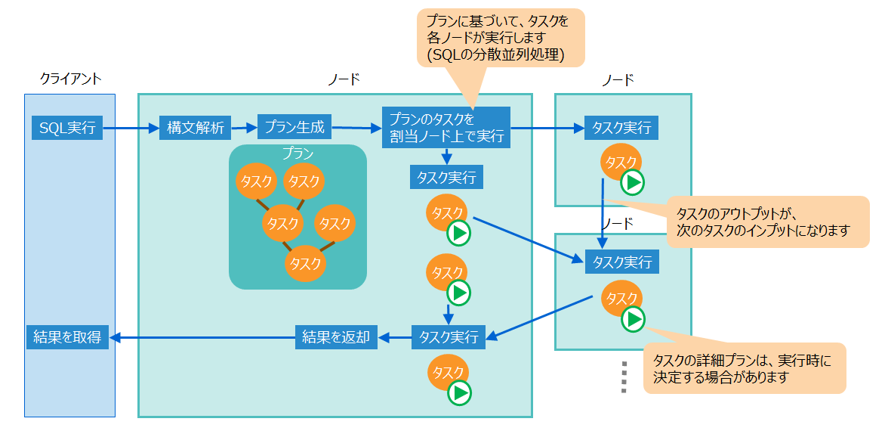
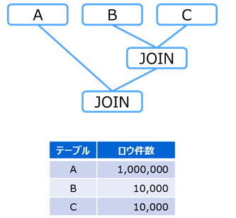
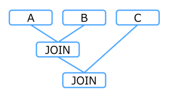
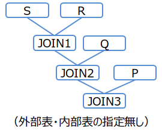
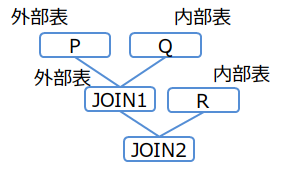
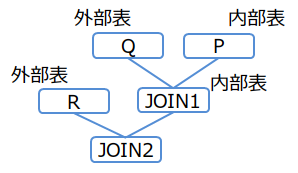
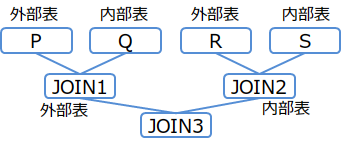

# はじめに

## 本書の目的と構成

**本書では、GridDBのSQLのチューニングについて説明します。**

本書は、GridDBでSQLを用いたシステム開発を行う開発者の方を対象としています。

本書は、以下のような構成となっています。

- チューニングのステップ
  - SQLのチューニングのステップを説明します。

- SQLの最適化
  - SQLのスキャンやジョイン処理における最適化のルールを説明します。

- SQLのプラン(実行計画)
  - SQL最適化の結果であるプランについて説明します。


最適化のルールやチューニングなどについては、GridDBに特化した特徴的な点を主に説明します。

　　　

# チューニングのステップ

SQLのチューニングは、一般的なデータベースシステムと同様に以下のような手順で行います。

- STEP1 遅いクエリの確認

  - システムにおいてSQLのパフォーマンスに問題がある場合、実行しているクエリの中で、時間がかかる遅いクエリを特定します。


- STEP2 プランの取得

  - 遅いクエリのプランを取得します。


- STEP3 クエリのチューニング

  - プランを分析して、意図した通りに動作しているかやクエリのどの部分に時間がかかっているかなどを確認します。
  - 問題点に応じてクエリの書き換えや索引作成によって、クエリのチューニングを行います。


- STEP4 クエリの再実行

  - チューニングしたクエリを実行して性能を確認します。問題が解決していない場合は、再度STEP2から実施します。

　

STEP1からSTEP3について詳細を説明します。

　

## 遅いクエリの確認

システムで実行しているクエリの中で、時間がかかっている遅いクエリを特定します。

実行時間がかかった遅いクエリは、そのクエリと実行時間などの情報をイベントログに出力することができます。
これにより、アプリケーションから実行された複数のクエリの中から、ボトルネックとなっているクエリを特定することができます。

遅いクエリの確認の手順は以下の通りです。

1. スロークエリの出力設定を行う

  - GridDBノードに、スロークエリの実行時間の閾値とイベントログに出力するクエリ文字列のサイズ上限のパラメータがあります。

    | パラメータ                    | 意味                                            | デフォルト値 |
    |------------------------------|-------------------------------------------------------|------|
    | /sql/traceLimitExecutionTime | スロークエリをイベントログに残す実行時間の下限値(単位：秒) | 300s |
    | /sql/traceLimitQuerySize     | スロークエリに残るクエリ文字列のサイズ上限(単位：バイト)   | 1000 |

  - デフォルト値から変更する場合は、次の2つの方法のいずれかで設定します。
    - ノードを停止して、ノード定義ファイル(gs_node.json)にパラメータを設定する
    - 運用コマンドgs_paramconfを用いてオンラインで設定変更する (ただし、オンラインの設定変更はノード再起動によりリセットされます。設定変更を永続化するためには、オンラインで設定後、ノード定義ファイル(gs_node.json)にも設定してください。)

    [メモ]
    - SQLはクラスタ構成のいずれかのノードで実行されるため、スロークエリの出力設定は必ず全ノードに対して行ってください。

　

2. クエリを実行する

  - クエリを実行します。1で設定した実行時間を超えるクエリがイベントログに出力されます。

　

3. 遅いクエリを確認する

  - スロークエリのログを確認します。確認方法は次の2つがあります。いずれかの方法でスロークエリを特定してください。

    | 確認方法 | 内容 |
    |-------------|----------|
    | オンラインで最新の情報を確認する   | 運用ツールgs_logsのオプション--slowlogsを実行すると、スローログの情報を表示します。<br><br>・表示は、最新のイベントログファイルの情報のみです。<br>・イベントログファイルは、ファイルサイズが閾値を超えた場合、または日にちが変わった場合に切り替わります。切り替わると、gs_logsでは古いイベントログファイルの内容は表示されません。|
    | イベントログファイルを直接確認する | ノードのイベントログファイルを直接確認します。<br>スロークエリのログは「SQL_LONG_QUERY」をキーワードにしてファイルから抽出してください。 |

    [メモ]
    - SQLはクラスタ構成のいずれかのノードで実行されるため、必ず全ノードのスロークエリのログを確認してください。
　　
　

## プランの取得

STEP1で特定したスロークエリを実行して、クエリのプラン(グローバルプラン)を取得します。

プランの取得には運用ツールgs_shを用います。EXPLAIN ANALYZE構文でクエリを実行し、サブコマンドgetplantxtでプランを取得します。

　

(1) クエリを「EXPLAIN ANALYZE」構文で実行する

```
gs[public]> sql EXPLAIN ANALYZE select * from table1, table2 where table1.value=1 and table1.id=table2.id ;
検索を実行しました。 (19 ms)
```

(2) プランを取得する

```
gs[public]> getplantxt
Id Type       Input Rows Lead time Actual time Node                 And more..
--------------------------------------------------------------------------------------------------------------------
 0 SCAN       -     -           30          30 192.168.15.161:10001 table: {table1}
 1   SCAN     0     3000        21          21 192.168.15.161:10001 table: {table1, table2} INDEX SCAN JOIN_EQ_HASH
 2     RESULT 1     14           0           0 192.168.15.161:20001
```

　

GridDBでは、SQLに対して以下のように処理を行います。
ノードはクエリを構文解析しプランを生成します。プランは実行単位であるタスクごとのプランから構成されており、各ノードは割り当てられたタスクを実行します。

<figure>
  
  <figcaption>SQLのプランと処理の流れ</figcaption>
</figure>

プラン表示のサブコマンドgetplantxtでは、このタスク単位のプランが1行ずつ表示されます。タスクの出力が次のタスクの入力になります。

「(2) プランを取得する」の実行例で、具体的にプランの表示を説明します。

- プランID1の「Input」は「0」なので、プランID0の結果を入力とします。
- プランID1の「Rows」は「3000」なので、プランID0から入力のロウ数は3000です。
- プランID1の「Node」は「192.168.15.161:10001」なので、このタスクはノード「192.168.15.161」で実行されました。


　

## クエリのチューニング

WHERE句の絞り込み条件のスキャン処理や、テーブルのジョインのためのスキャン処理では、索引の利用有無によって大きく性能が変わる場合があります。
また、テーブルのジョインの場合は、結合順序などによっても大きく性能が変わります。
よって、これらをポイントにクエリのチューニングを行ってください。


(1) プランの分析

プランを分析して、索引の利用有無や意図したとおりに動作しているかを確認します。
プランの詳細は[SQLのプラン](#label_plan)をご参照ください。

- 索引の利用有無の確認方法

  - WHERE句の絞り込み条件のスキャン処理や、テーブルのジョインのためのスキャン処理では、索引の利用有無によって大きく性能が変わる場合があります。
  - 遅いタスクの「Type」が「SCAN」の場合は、そのスキャン処理で索引を利用しているかどうかを確認します。
  - 索引を利用している場合は、「And mode..」に「INDEX SCAN」と表示されます。表示されない場合は、索引を使用していません。


(2) チューニング

プランの分析による問題点に応じて、次のような方法でチューニングを行います。

- 索引作成
  - 索引が必要なカラムに索引がついていなかった場合は、索引を作成します。
  - ただし、次のようなケースでは索引の効果が低いため、索引は作成しないことを推奨します。
    - カラムのカーディナリティが低い(カラムの値の種類がロウ数に比べて少ない)など、クエリ実行で索引を使用してもほとんど値を絞り込むことができない場合

- クエリの書き換え
  - [SQLの最適化](#label_sql_optimization)に基づき、WHERE句の絞り込み条件やジョインの結合順序などの記述を書き換えます
  - ヒント句を使用します。例えば、索引が付いているのに利用していない、またはクエリによっては索引を利用しない方がいい場合などは、ヒント句によってプランを変更します。

　

例)
テーブルのジョインを行うクエリで、チューニングの例を説明します。

table1とtable2をカラムvalueの値で結合するクエリについて、プランを取得します。

```
gs[public]> EXPLAIN ANALYZE select * from table1, table2 where table1.value=0 and table1.value=table2.value;
検索を実行しました。 (13 ms)
gs[public]> getplantxt
Id Type       Input Rows  Lead time Actual time Node                 And more..
-------------------------------------------------------------------------------------
 0 SCAN       -     -            20          20 192.168.15.161:10001 table: {table1}
 1 SCAN       -     -             9           9 192.168.15.161:10001 table: {table2}
 2   JOIN     0,1   10000,3000  891         891 192.168.15.161:20001 JOIN_EQ_HASH
 3     RESULT 2     32            2           2 192.168.15.161:20001
```

このプランでは、table1とtable2をそれぞれスキャンして、索引を使わずにジョインの処理を行っています。

テーブルの索引情報を確認すると、カラムvalueに索引が付いていなかったため、索引を作成します。

同じクエリを実行してプランを取得します。

```
gs[public]> EXPLAIN ANALYZE select * from table1, table2 where table1.value=0 and table1.value=table2.value;
検索を実行しました。 (7 ms)
gs[public]> getplantxt
Id Type       Input Rows Lead time Actual time Node                 And more..
--------------------------------------------------------------------------------------------------------------------
 0 SCAN       -     -           20          20 192.168.15.161:10001 table: {table1}
 1   SCAN     0     10000       80          80 192.168.15.161:10001 table: {table1, table2} INDEX SCAN JOIN_EQ_HASH
 2     RESULT 1     32           3           3 192.168.15.161:20001
```

プランID2で「INDEX SCAN」と表示されており、索引を使用したジョイン処理にプランが変わっています。


　


<a id="label_sql_optimization"></a>
# SQLの最適化


## 索引を利用したスキャン

WHERE句の絞り込み条件に一致するデータを探すスキャン処理では、テーブルの全ロウにアクセスする「フルスキャン」よりも、
テーブルの索引を用いてアクセスする「索引スキャン」の方が、多くの場合に高速になります。

特に、WHERE句の絞り込み条件がテーブルのロウ数に対してヒット率が小さくなるような、データをより絞り込める条件ほど索引スキャンの効果が高くなります。

　

<a id="scan_index_selection_rule"></a>
### 索引の選択ルール

GridDBのSQL最適化において、スキャン処理で使用する索引の選択ルールを説明します。

絞り込み条件に指定された演算子や式によって、ルールが異なります。

　

**AND**

基本的に、絞込み条件のカラムに索引が設定されている場合は先頭の索引を使用します。

例)
```
a>1 AND b=2    (aとbに索引あり)
```
  - aの索引を使用します。
　
　

ただし、例外的に先頭の索引を使用しない場合もあります。例を以下に示します。

- 定数falseのOR条件"OR false"を付けると、索引を使用しません。

  スキャンで索引を使用したくない場合は、この構文を指定してください。

  例) 「a>1 AND b=2」で、aの索引を使用したくない場合
  ```
  (a>1 OR false) AND b=2    (aとbに索引あり)
  ```
    - aの索引は使用しません。bの索引を使用します。

  例) 「a>1 AND b=2」で、aとbの索引を使用したくない場合
  ```
  (a>1 AND b=2) OR false    (aとbに索引あり)
  a>1 AND b=2 OR false      (aとbに索引あり)
  ```
    - aとbの索引は使用しません。


- AND条件内にORやINが含まれている場合は、索引利用可能な先頭の式(最も左側の式)でのみ索引を使用します。

  例)
  ```
  (a=1 OR a=3) AND b=2   (aとbに索引あり)
  a IN (1,3) AND b=2     (aとbに索引あり)
  ```
    - aの索引を使用します。bの索引は使用しません。

  例)
  ```
  (a=1 OR a=3 OR false) AND b=2   (aとbに索引あり)
  (a IN (1,3) OR false) AND b=2   (aとbに索引あり)
  ```
    - ANDの左辺の式は、定数falseのOR条件が付いていて索引利用できないので、索引利用可能な右辺のbの索引を使用します。
　

なお、同一カラムに対する条件が重複する場合は、条件をマージして索引を使用します。

例)
```
a>1 AND a<=4 AND a<=3    (aに索引あり)
```
  - 条件"1<a<=3"にマージして、aの索引を使用します。

　

**OR**

ORの場合は、絞込み条件に指定したカラムに、すべて索引が設定されている場合にのみ索引を使用します。

例）
```
a>1 OR b=2    (aとbに索引あり)
```
  - aとbの索引を使用します。

例）
```
a>1 OR b=2    (bに索引あり)
```
  - aに索引が設定されていないので、aとbの両方とも索引を使用しません。

　

**比較演算子の式**

比較演算子の値にカラム単独の式と定数式を用いる場合のみ、索引を使用します。

例）
```
a>10*1000-1    (aに索引あり)
```
  - aの索引を使用します。

例）
```
a+1>10*1000-1    (aに索引あり)
```
  - aの索引は使用しません。

例）
```
a>b    (aとbに索引あり)
```
  - aとbの索引は使用しません。

　

**IN、BETWEEN**

INとBETWEENは、ANDとORと比較演算子を組合せた式とみなしたうえで、上記のルールを適用します。

例）
```
a IN (1,2)        → a=1 OR a=2      (aに索引あり)
a BETWEEN 1 AND 2 → a>=1 AND a<=2   (aに索引あり)
```
  - aの索引を使用します。

　

[メモ]
- 索引スキャンで使用する索引は、NoSQLまたはNewSQLインタフェースで作成したTREE索引、または、主キーに自動的に設定されるTREE索引のみです。
  NoSQLインタフェースで作成したHASH索引や空間索引は使用しません。

- SQL構文のヒント「NoIndexScan」を用いると、索引を使用しないスキャンが指定できます。ヒントの詳細は「[ヒント句](#label_hint)」をご参照ください。

### 複合索引の選択ルール

GridDBのSQL最適化において、スキャン処理で使用する複合索引の選択ルールを説明します。

絞り込み条件に指定されたカラムや演算子によって、索引を使用する範囲が異なります。
複合索引を構成するカラムの先頭よりAND条件で連続して存在するカラムの条件までを複合索引として使用します。

[メモ]
- OR条件が入ると、それ以降の条件は複合索引として使用しません。
- SQLのカラム記述順は複合索引利用有無に影響しません。
- カラム値を関数で処理した値を条件比較する場合、索引は利用されません。

例）
```
where col1 = 1 and col2 = 1 and col3 = 2      (col1,col2,col3の複合索引あり)
```
  - col1,col2,col3の条件で複合索引を使用します。
```
where col1 = 1 and col2 > 1 and col3 < 2      (col1,col2,col3の複合索引あり)
```
  - col1,col2,col3の条件で複合索引を使用します。
```
where col1 = 1 and col2 = 1                   (col1,col2,col3の複合索引あり)
```
  - col1,col2の条件まで複合索引を使用します。
```
where col1 = 1 and col3 = 2                   (col1,col2,col3の複合索引あり)
```
  - col1の条件まで複合索引を使用します。（第二カラムcol2の指定がないため）
```
where col2 = 1                                (col1,col2,col3の複合索引あり)
```
  - 複合索引を使用しません。（第一カラムcol1の指定がないため）
```
where col1 = 1 and (col3 >= 0 and col3 < 10) and col2 = 1       (col1,col2,col3の複合索引あり)
```
  - col1,col2,col3の条件で複合索引を使用します。
```
where col1 = 1 and (col3 = 0 or col3 = 1) and col2 = 1          (col1,col2,col3の複合索引あり)
```
  - col1,col2の条件まで複合索引を使用します。
```
where (col1 = 0 or col1 = 1) and col2 = 1     (col1,col2,col3の複合索引あり)
```
  - col1の条件まで複合索引を使用します。
```
where col1 = 1 and (col3 >= 0 and col3 < 10)  (col1,col2,col3の複合索引あり)
```
  - col1の条件まで複合索引を使用します。　
```
where col1 = 1 and (col3 >= 0 and col3 < 10) and ABS(col2) = 1  (col1,col2,col3の複合索引あり)
```
  - col1の条件まで複合索引を使用します。


## ジョイン

GridDBのSQL最適化において、複数テーブルのジョイン演算の実行の仕方を決定する方法について説明します。

- [ジョイン順序の決定方法](#join_order_selection_approach)
  - 複数テーブルのジョインする順序を決定します。
  - 順序の決め方にはコストベースによる方法とルールベースによる方法の２通りの方法があります。

- [索引適用の決定方法](#join_index_adaption_rule)
  - ジョインの処理に索引を利用するかどうかをルールにより決定します。

- [索引選択の決定方法](#join_index_selection_rule)
  - 索引適用ルールで索引を利用することが決まった場合に、どの索引を選択するかをルールにより決定します。

- [ジョイン演算方法の決定方法](#join_calculation_method_selection_rule)
  - ジョイン処理の演算方法をルールにより決定します。

索引を使用しないジョイン処理においては、ジョイン順序やジョイン演算方法の違いが性能に大きく影響します。

<a id="join_order_selection_approach"></a>
### ジョイン順序の決定方法

SQL実行時、3つ以上のテーブルの結合がある場合、どのテーブルをどの順番でジョインするか順序を決める必要があります。順序の決め方には、コストベースによる方法とルールベースによる方法の２種類あります。いずれを用いるかは設定により選択できます。

<a id="join_order_selection_approach_config"></a>
#### 順序決定方法の設定

コストベースによる方法とルールベースによる方法のいずれを用いるかは切り替え可能で、以下のようにして設定できます。

- サーバのクラスタ設定(gs_cluster.json)にいずれの方法を用いるか設定できます。全てのSQLについて同じ決定方法になります。具体的な設定方法は『[GridDB 機能リファレンス](../md_reference_feature/md_reference_feature.md)』を参照してください。
- ヒントを記述することでいずれの方法を用いるかを指定できます。ヒントを記述したSQL毎に決定方法を指定できます。具体的な記述方法は[ヒント句](#label_hint)を参照してください。

【メモ】
- ジョイン順序の決定方法のデフォルトは、コストベースによる方法です。

<a id="cost_based_join_order_selection_approach"></a>
#### コストベースによる方法

コストベースによるジョイン順序の決定方法は、ジョイン演算を実行するコストが最も低いと推定される順序を決定する方法です。
ここで用いるコストは、ジョインするテーブルやジョイン結果(中間結果)のロウ件数を推定で概算したものです。
複数テーブルのジョインを行う場合、どのテーブルとどのテーブルを選んでジョインするか、どの順序でジョインするかなど、多くのジョイン演算の候補が考えられます。
このジョイン演算の候補それぞれについて、入出力となるロウ件数を推定で概算し、SQL実行時にジョイン演算されるロウ件数が最も小さくなると推定したものを選んでいきます。
演算するロウ件数が少ない方が高速に演算できるため、最終的に選ばれたものが最適なジョイン順序になります。

ジョイン出力のロウ件数概算値は、GridDBが以下の絞り込み度合いの強さの観点の各基準に従い評価することで、求められます。

- ジョイン演算自体の絞込み度合いの観点
- ジョイン結果の絞込み度合いの観点

絞込み度合いの判断には以下の評価基準が用いられます。

- 比較条件の種別に関する基準。以下の順番で絞込み度合いが強いと評価されます。
  - 等値比較(=,IN)
  - 大小比較(<,<=,>,>=,BETWEEN)
- 条件の論理積・和の構造に関する基準。以下の順番で絞込み度合いが強いと評価されます。
  - 論理積(AND)結合の数(より多いほうが強い)
  - 論理和(OR)結合の数(より多いほうが弱い)

[メモ]

- もし絞込み度合いが同じジョイン演算の候補が複数あった場合、コスト(ロウ件数概算値)による順序決定ができないので、以下の優先度従いジョインを先に実行する順序にします。

  - ジョイン(部分木)に含まれるノードのロウ件数概算値の最大値が小さいほう
  - ジョイン(部分木)に含まれるノード数が少ないほう
  - SQLにより前に記述されたほう

コストベースによる方法とルールベースによる方法とでは、順序決定の判断基準が異なるため、ジョイン順序が異なることがあります。(ルールベースの詳細については[ルールベースによる方法]("#rule_based_join_order_selection_approach")を参照してください。)

以下の3つのテーブル(A,B,C)の単純なジョインの例で違いを説明します。

  例)
  ```
  SELECT * FROM A,B,C
  WHERE A.x = B.x AND B.y = C.y
  ```

コストべースによる方法の場合、与えられたSQLと各テーブルのロウ件数概算値を参照、解析します。この例では、テーブルAのロウ件数概算値がほかテーブルと比較して桁違いに大きい状態です。この場合、テーブルAのジョイン演算はコストが大きいと判断されます。その結果、テーブルBとテーブルCのジョイン演算を先に実行し、最後にテーブルAに関するジョイン演算を行う、下図のようなジョイン順序のプランを生成します。
<figure>

<figcaption>ジョイン順序(コストベースによる方法の場合)</figcaption>
</figure>

ルールベースによる方法の場合、与えられたSQLのみを解析してプランを生成します。例のSQLの場合、記述された順に従い、下図のようなジョイン順序のプランを生成します。ロウ件数が多いテーブルAのジョイン演算の出力は件数が多い可能性が高いですが、SQL文の記述に従い、その演算結果とテーブルCとのジョインを行うプランを生成します。
<figure>

<figcaption>ジョイン順序(ルールベースによる方法の場合)</figcaption>
</figure>

[メモ]
 - コストベースによる方法の判断基準となるコストはあくまで推定値のため、コストベースによる方法で生成したプランがルールベースによる方法で生成したものより高速にならない場合があります。SQLを評価して、必要に応じて[ヒント句](#label_hint)などによりチューニングすることを推奨します。


<a id="rule_based_join_order_selection_approach"></a>
#### ルールベースによる方法

ルールベースによるジョイン順序の決定方法は、記述したSQLの結合や絞込み度合いの強さによって順序を決める方法です。

- 結合度合いの強いテーブルは、連続してジョインするような順番になります。

  例)
  ```
  FROM A, B, C
  ```
    - 何も指定が無い場合は、記述した順番になります。（AとBでジョイン、その結果とCでジョイン）

  例)
  ```
  FROM A, B, C WHERE A.x=C.z AND C.z=B.y
  ```
    - AとC間の結合度合いが高いため、A・C・Bの順番になります。（AとCでジョイン、その結果とBでジョイン）

  例)
  ```
  FROM A, B, C WHERE A.x>=C.z AND C.z>=B.y AND B.y=A.x
  ```
    - AとB間の結合度合いが高いため、A・B・Cの順番になります。（AとBでジョイン、その結果とCでジョイン）


- 絞込み度合いの強いテーブル（該当データ数が少ないと推定されるもの）ほど、ジョインの順番が先になります。

  例)
  ```
  FROM A, B, C WHERE A.x=C.z AND C.z=B.y AND B.x=1
  ```
  - Bの方が絞り込み度合いが強いため、B・C・Aの順番になります。

  例)
  ```
  FROM A, B, C WHERE A.x=C.z AND C.z=B.y AND A.x IN (1, 2) AND B.x IN (1, 2, 3)
  ```
  - Aの方が絞り込み度合いが強いため、A・C・Bの順番になります。


[メモ]
- SQL構文のヒント「Leading」を用いると、ジョインの順序を入れ替えることができます。ヒントの詳細は[ヒント句](#label_hint)をご参照ください。


#### 駆動表の選択

結合処理において、最初にアクセスするテーブルを駆動表、次にアクセスして結合するテーブルを内部表といいます。

ジョインの順序(駆動表と内部表)は次のルールで決まります。

2つのテーブルの結合の場合、定数の等価絞込み条件があるテーブルが駆動表になります。

例)
```
t1.a=t2.x AND t2.y=1
```
  - 定数1との絞込み条件があるt2が駆動表、t1が内部表になります。

<a id="join_index_adaption_rule"></a>
### 索引適用の決定方法

ジョイン処理で索引を使用するかどうかのルールを説明します。

次の5つのすべてを満たす場合に索引を使用します。

- 駆動表側に等価絞込み条件がある

  例)
  ```
  t1.a=t2.x AND t2.y=1   (aに索引あり、駆動表はt2、内部表はt1)
  ```
    - 駆動表の絞込みが等価条件(t2.y=1)なので、ジョイン処理に索引を適用します。

  例)
  ```
  t1.a=t2.x AND t2.y>1   (aに索引あり、駆動表はt2、内部表はt1)
  ```
    - 駆動表の絞込みが等価条件ではない(t2.y>1)ので、ジョイン処理に索引を適用しません。
    　


- 第一結合条件が等価結合条件である

  例)
  ```
  t1.a>t2.x AND t1.b=t2.y AND t2.z=1 (aに索引あり、駆動表はt2、内部表はt1)
  ```
    - 第一結合条件が等価結合条件ではない(t1.a>t2.x)ので、ジョイン処理に索引を適用しません。
    　

- 第一結合条件の内部表側の等価結合条件カラムに索引が設定されている

  例)
  ```
  t1.a=t2.x AND t2.y=1 (aに索引なし、駆動表はt2、内部表はt1)
  ```
    - 第一結合条件の内部表側の等価結合条件カラムt1.aに索引が設定されていないので、ジョイン処理に索引を適用しません。
    　

- INNER JOINである

- NoIndexJoinヒントで無効化されていない


[メモ]
- ジョインの駆動表と内部表の選択は、Leadingヒントを用いて指定することができます。ヒントの詳細は[ヒント句](#label_hint)をご参照ください。
- ジョインでの索引の適用有無は、IndexJoinヒント/NoIndexJoinヒントを用いて指定することもできます。ヒントの詳細は[ヒント句](#label_hint)をご参照ください。


<a id="join_index_selection_rule"></a>
### 索引選択の決定方法

ジョインの構文が[索引適用の決定方法](#join_index_adaption_rule)に当てはまる場合、索引を使用してジョインを行います。
ジョインで使用する索引を選択するルールを説明します。

基本的に、スキャンの[索引の選択ルール](#scan_index_selection_rule)と同様です。
カラムに設定されている索引はすべて記述順に使用します。

すべての索引を使用しない場合もあります。例を以下に示します。

絞込み条件のカラムに索引が設定されている場合は先頭の索引を使用します。

  例)
  ```
  t1.a=t2.x AND t1.b>t2.y AND t2.z=1  (aとbに索引あり、駆動表はt2、内部表はt1)
  ```
  - aの索引のみを使用します。

　

OR条件(A OR B)において、Bがfalse定数の場合、Aの索引は使用しません。

  例)
  ```
  t1.a=t2.x AND (t1.b=t2.y OR false) AND t2.z=1  (aとbに索引あり、駆動表はt2、内部表はt1)
  ```
  - bの索引は使用しません。aの索引を使用します。

　

<a id="join_calculation_method_selection_rule"></a>
### ジョイン演算方法の決定方法

ジョインの演算方法には次の3つの種類があります。

| ジョインの演算方法      | 説明 |
|------------------------|------|
| ハッシュジョイン        | 駆動表の結合キーをハッシュ関数にかけてメモリ上に一時的なテーブルを作り、内部表のハッシュ値と一致するか比較して結合する方法です。 |
| ソートマージジョイン     | 結合する2つのテーブルを結合キーでソートして、それらを順に比較して結合する方法です。 |
| ネステッドループジョイン | 駆動表の結合キーの値を元に、結合条件に合致する内部表のデータを探して結合する方法です。   |

速度が速いのは、ハッシュ、ソートマージ、ネステッドループの順です。

　

ジョインの第一結合条件の種類によって、これらの演算方法を選択します。

| 第一条件 | 選択する演算方法                  |
|---------|----------------------------------|
| 等価条件 | ハッシュまたはソートマージジョイン<br>(ハッシュが選択されていても、メモリリソースの制限により、部分的にソートマージに切り替わることがあります。) |
| 大小条件 | ソートマージジョイン              |
| なし     | ネステッドループジョイン          |

　

ジョインの第一結合条件は、次の優先順で選択します。

- 単純カラム式を優先して第一結合条件とします。

  例)
  ```
  t1.a=abs(t2.x)+10 AND t1.b=t2.y
  ```
    - 単純カラム式なので、t1.b=t2.yを第一条件とします。第一条件が等価条件なので、ハッシュまたはソートマージジョインを使用します。


- 単純カラム式が複数ある場合は、先に記述されている式を第一結合条件とします。

  例)
  ```
  t1.a>t2.x AND t1.b=t2.y
  ```
  - "t1.a>t2.x"と"t1.b=t2.y"は両方とも単純カラム式なので、記述順で"t1.a>t2.x"を第一条件とします。第一条件が大小条件なので、ソートマージジョインを使用します。

　
<a id="label_hint"></a>
## ヒント句
　
実行計画を示すヒントをクエリに指定することで、SQL文を変えることなく実行計画を制御できます。

【注意事項】
-   本機能は将来のバージョンで変更される可能性があります。

### 用語

ヒント機能で用いる用語は次のとおりです。

| 用語     | 説明                                                         |
|----------|--------------------------------------------------------------|
| ヒント句 | 実行計画を制御するための情報                                 |
| ヒント   | ヒント句を列挙したもの。実行計画を制御するクエリに指定する。 |

### ヒントの指定方法

実行計画を制御するクエリのブロックコメントの中にヒントを記述します。ヒント用のブロックコメントは、 SQL文中の先頭のSELECT(INSERT/UPDATE/DELETE)句の直前または直後のみ記述できます。通常のコメントと区別するため、 ヒント用のブロックコメントは「/\*+」で始めます。

ヒントの対象は、ヒント句の括弧内にオブジェクト名または別名で指定します。複数のオブジェクト名を指定する場合、 スペース、タブ、改行のいずれかで区切って指定します。

以下の例では、Leadingヒント句により、テーブル結合順序を指定しています。

``` example
/*+
Leading(t3 t2 t1)
 */
SELECT *
  FROM t1, t2, t3
    ON t1.x = t2.y and t2.y = t3.z
  ORDER BY t1.x
  LIMIT 10;
```

【メモ】
-   クエリ中に同一名称のテーブルが複数回現れる場合、それぞれのテーブルに別名をつけて区別してください。

### ヒント句一覧

指定できるヒント句の一覧を次に示します。

| 分類             | 命令                                           | 説明                                          |
|------------------|------------------------------------------------|-----------------------------------------------|
| 並列化           | MaxDegreeOfTaskInput(上限数)                   | 1タスクへの入力の上限                         |
|                  | MaxDegreeOfExpansion(上限数)                   | プランノードの展開数の上限                    |
| スキャン方式     | IndexScan(テーブル)                            | 可能な場合はインデックススキャンを選択する    |
|                  | NoIndexScan(テーブル)                          | インデックススキャンを選択しない              |
| ジョイン順序      | CostBasedJoin()                               | コストベースによるジョイン順序決定を行う    |
|                 |  NoCostBasedJoin()                             | コストベースによるジョイン順序決定を行わない(ルールベースによるジョイン順序決定を行う)    |
|                 |  TableRowCount(テーブル ロウ件数)              | コストベースによるジョイン順序決定のためのロウ件数概算値を与える(コストベースによるジョイン順決定を行う場合にのみ有効)    |
| 結合方式         | IndexJoin(テーブル テーブル)                   | 可能な場合はインデックスジョインを選択する    |
|                  | NoIndexJoin(テーブル テーブル)                 | インデックスジョインを選択しない              |
| 結合順序         | Leading(テーブル テーブル\[ テーブル ...\])    | 指定したテーブルを指定した順序で結合する      |
|                  | Leading(( **テーブル集合** **テーブル集合** )) | 1つ目に指定したテーブル集合を外部表、<br>2つ目に指定したテーブル集合を内部表として結合する     |
| 中間ロウ生成数   | MaxGeneratedRows(上限数)   　　　　　　　　　  | GROUP BY RANGE句を用いた補間演算タスクで生成されるロウ数の上限    |


**テーブル集合** = { テーブル or ( **テーブル集合** **テーブル集合** ) }

### ヒント句詳細

ヒント句の分類ごとに詳細を説明します。

#### 並列化

並列化処理の制御を行います。

-   MaxDegreeOfTaskInput(上限数)
    -   1タスクへの入力の上限数を指定します。以下の処理に適用されます。
        -   テーブルパーティショニングの設定されたテーブルをスキャンした場合のUNION ALL処理
-   MaxDegreeOfExpansion(上限数)
    -   プランノードの展開数の上限を指定します。以下の処理に適用されます。
        -   プッシュダウンジョイン最適化処理

#### スキャン方式

テーブルのスキャン方式を指定します。

-   IndexScan(テーブル)
    -   可能な場合はインデックススキャンを選択します。元々インデックススキャンが不可能な場合は何もしません。
-   NoIndexScan(テーブル)
    -   インデックススキャンを選択しません。


#### ジョイン順序

３つ以上のテーブルが与えられた場合のジョイン順序の決定方法を指定します。

-   CostBasedJoin()
    - コストベースによる方法でジョイン順序を決定します。
-   NoCostBasedJoin()
    - コストベースによる方法を用いないで、ルールベースによる方法でジョイン順序を決定します。
-   TableRowCount(テーブル ロウ件数)
    - コストベースによるジョイン順序決定のためのコスト計算に用いるロウ件数の概算値を与えます。(ただし、コストベースによるジョイン順決定を行う場合にのみ有効です) 

#### 結合方式

結合方式を指定します。

-   IndexJoin(テーブル テーブル)
    -   可能な場合はインデックスジョインを選択します。 元々インデックスジョインが不可能な場合は何もしません。
-   NoIndexJoin(テーブル テーブル)
    -   インデックスジョインを選択しません。

#### 結合順序

テーブルのジョイン処理でどのような順番で結合するかを指定します。

**(1) 結合順序のみ指定: Leading(テーブル テーブル\[ テーブル ...\])**

先に結合するテーブルから順にテーブル名または別名を指定します。この指定方式の場合、常にLeft-deep joinで結合されます。

(例1)

``` example
/*+ Leading(S R Q P) */
SELECT * FROM P,Q,R,S WHERE P.x = Q.x AND ...
```

<figure>

<figcaption>結合順序(例1)</figcaption>
</figure>


**(2) 結合方向を含めた指定: Leading((テーブル集合 テーブル集合))**

テーブル集合 = { テーブル or (テーブル集合 テーブル集合) }

(1)のように結合順序のみを指定した場合、結合方向(外部表/内部表の別)が期待と異なる場合があります。 結合方向を固定したい場合は以下の書式を使います。

``` example
/*+ Leading((t1 (t2 t3))) */
SELECT ...
```

この書式では、括弧をネストして記述できます。括弧内の1つ目に指定したテーブル集合を外部表、 2つ目に指定したテーブル集合を内部表として結合されます。

(例2-1)

``` example
/*+ Leading(((P Q) R)) */
SELECT * FROM P,Q,R WHERE P.x = Q.x AND ...
```

<figure>

<figcaption>結合順序(例2-1)</figcaption>
</figure>


(例2-2)

``` example
/*+ Leading((R (Q P))) */
SELECT * FROM P,Q,R WHERE P.x = Q.x AND ...
```

<figure>

<figcaption>結合順序(例2-2)</figcaption>
</figure>


(例2-3)

``` example
/*+ Leading(((P Q) (R S))) */
SELECT * FROM P,Q,R,S WHERE P.x = Q.x AND ...
```

<figure>

<figcaption>結合順序(例2-3)</figcaption>
</figure>


【メモ】
-   3つ以上のテーブルの結合で、テーブル間の結合条件が1つもない場合は、ヒントによる順序指定はできません。

#### 中間ロウ生成数

1タスクが中間生成するロウ数の上限を設定します。GROUP BY RANGE句を用いた補間演算タスクに適用されます。

-  MaxGeneratedRows(上限数)
    - 上限数は、1タスクが生成する中間結果のロウ数に対する設定値です。
      以下の処理に適用されます。    
      - GROUP BY RANGE句を用いた補間演算を行うタスク
    - SQL実行の結果、最終的に得られるロウ数は複数タスクの合計となるため、この設定値より大きくなることがあります。

### エラーの扱い

以下の場合は構文エラーとなります。
-   ヒント用のブロックコメントを複数記述した場合
-   ヒントを記述できない位置にヒントを記述した場合
-   ヒント句の記述に構文上の誤りがあった場合
-   同じテーブルに対して同じ分類のヒント句を重複して指定した場合

以下の場合はテーブル指定エラーとなります。
-   ヒント句対象のテーブル指定に誤りがあった場合

【メモ】
-   テーブル指定エラーが起こった場合、対象のヒント句を無視し、それ以外のヒント句を使ってクエリを実行します。
-   構文エラーとテーブル指定エラーが同時に起こった場合は構文エラーとなります。


　
<a id="label_plan"></a>
# SQLのプラン(実行計画)

SQL最適化によってどのような演算や索引が選択されたかは、SQLのEXPLAIN ANALYZE文で確認することができます。

SQLの処理では、SQL構文を解析して最適化し、ジョインやソート・スキャンなどの複数の「タスク」という処理単位に分解してプラン(実行計画)を生成します。

タスクは、クラスタを構成するノードのいずれかひとつで実行され、タスク間でデータのやり取りをしながら並列実行します。

[メモ]
- SQL最適化によるプランが適さない場合は、ヒントを用いてプランを変更することができます。詳細は[ヒント句](#label_hint)をご参照ください。

　

EXPLAIN ANALYZE文を実行すると、タスクのプランや実行時間などの情報を、タスク単位で1行ごとにJSON形式で出力します。

出力する主な項目は以下の通りです。

| 項目 | 説明  |
|------|------|
| id   | プランID |
| type | 処理の種類 |
| inputList | 入力値となるプランのプランIDの列 |
| profile/plan | (コストベースによるジョイン順決定を行った場合)プラン生成時に推定したコスト情報 |
| profile/leadtime | 処理時間 |
| profile/rows | 入力件数 |
| profile/address | 処理を実行したノードのアドレスとポート番号 |

[メモ]
- 入力件数はタスク間の制御情報の伝搬タイミングなどに応じて変動する可能性があります。

処理の種類は以下の通りです。

| typeの値 | 説明 |
|----------|-----|
| GROUP  | グルーピング演算 |
| JOIN   | ジョイン演算  |
| LIMIT  | 行単位件数フィルタ演算 |
| SCAN   | テーブルスキャン演算 |
| SELECT | 選択演算(条件フィルタ・プロジェクション) |
| SORT   | ソート演算 |
| UNION  | 連結・集合演算  |
| INSERT、UPDATE、DELETE | 各種コンテナ変更操作 |
| DDL    | DDL・DCL文相当 |
| RESULT | 結果の保持 |

　

プランは、運用ツールgs_shで取得することができます。
　

例) クエリ「select * from table1, table2 where table1.value=0 and table1.id=table2.id」のプラン取得

```
gs[public]> EXPLAIN ANALYZE select * from table1, table2 where table1.value=0 and table1.id=table2.id;
検索を実行しました。 (11 ms)
gs[public]> getplantxt
Id Type       Input Rows Lead time Actual time Node                 And more..
--------------------------------------------------------------------------------------------------------------------
 0 SCAN       -     -            0           0 192.168.15.161:10001 table: {table1} INDEX SCAN
 1   SCAN     0     0            2           2 192.168.15.161:10001 table: {table1, table2} INDEX SCAN JOIN_EQ_HASH
 2     RESULT 1     0            0           0 192.168.15.161:20001
```

gs_shでサブコマンドgetplanjsonを実行すると、プランをJSON形式で出力することもできます。

[注意]

- プランのJSON形式は、今後のバージョンでデータ構造が変わる可能性があります。

例) プランのJSON形式の例
```
{
  "nodeList" : [ {
    "cmdOptionFlag" : 65,
    "id" : 0,
    "indexInfoList" : [ 3, 3 ],
    "inputList" : [ ],
    "outputList" : [ {
      "columnId" : 0,
      "columnType" : "INTEGER",
          :
          :
}
```
